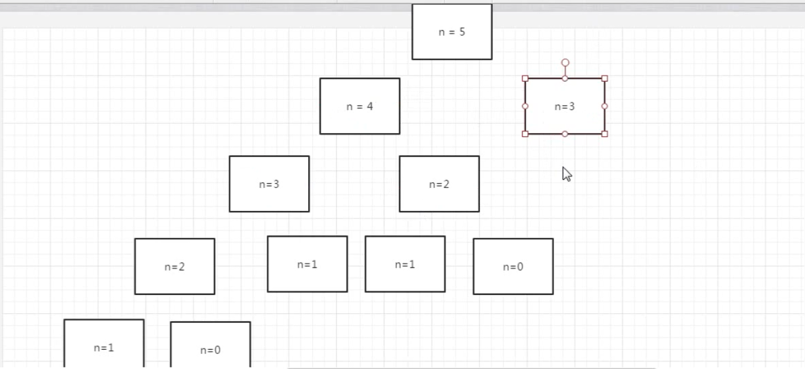

# 斐波那契数列

## 题目

大家都知道斐波那契数列，现在要求输入一个整数n，请你输出斐波那契数列的第n项（从0开始，第0项为0）。

n<=39

## 菲波那切数列是什么

```
0 1 1 2 3 5 8 13

n = 0, num = 0
n = 1, num = 1
n = 2, num = 1
.....

当 n = k(n>1),f(k) = f(k-1) + f(k-2)
当 n = 1, f(1) = 1
当 n = 0, f(0) = 0
```


## 递归方法实现

```
# 大家都知道斐波那契数列，现在要求输入一个整数n，请你输出斐波那契数列的第n项（从0开始，第0项为0）  n<=39
class Solution:
    def Fibonacci(self, n):
        if n == 0:
            return 0;
        if n == 1:
            return 1;
        if n > 0:
            return self.Fibonacci(n - 1) + self.Fibonacci(n -2);
        else:
            return None

if __name__ == '__main__':
    print(Solution().Fibonacci(10))
```

### 存在问题

但是这样存在问题，随着n提升，时间复杂度不断增加



我们发现对于某个值，我们重复计算了很多遍


## 非递归实现

我们继续查看刚刚的规律

```
当 n = 2的时候， h = f(1) + f(0) = 1 + 0 = 1
当 n = 3的时候， h = f(2) + f(1) = 1 + 1 = 2
当 n = 4的时候， h = f(3) + f(2) = 3 + 1 = 4
```

我们可以从n = 2，一直循环，直到我们计算出我们输入的值为n的时候

我们只需要从最小的开始计算，每次保留中间结果，最后得出我们的第n个的结果。

```
# 大家都知道斐波那契数列，现在要求输入一个整数n，请你输出斐波那契数列的第n项（从0开始，第0项为0）  n<=39
class Solution:

    # 非递归实现
    # 当 n = 2的时候， h = f(1) + f(0) = 1 + 0 = 1
    # 当 n = 3的时候， h = f(2) + f(1) = 1 + 1 = 2
    # 当 n = 4的时候， h = f(3) + f(2) = 3 + 1 = 4
    def Fibonacci2(self, n):
        if n == 0:
            return 0;
        if n == 1:
            return 1;

        ret = 0
        a = 1
        b = 0
        for i in range(0, n-1):
            ret = a + b
            b = a
            a = ret
        return ret

if __name__ == '__main__':
    print(Solution().Fibonacci2(10))
```

