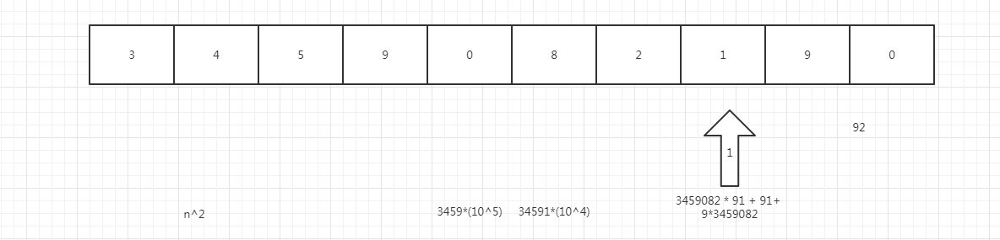

# 整数中1出现的个数

[题目传送门](https://www.nowcoder.com/practice/bd7f978302044eee894445e244c7eee6?tpId=13&tqId=11184&tPage=1&rp=1&ru=/ta/coding-interviews&qru=/ta/coding-interviews/question-ranking)

## 题目描述

求出1~13的整数中1出现的次数,并算出100~1300的整数中1出现的次数？为此他特别数了一下1~13中包含1的数字有1、10、11、12、13因此共出现6次,但是对于后面问题他就没辙了。ACMer希望你们帮帮他,并把问题更加普遍化,可以很快的求出任意非负整数区间中1出现的次数（从1 到 n 中1出现的次数）

## 思路



如上图所示，如果那个数 是我们 的 1-n 中 n 这个数，那么这个数就是一个特别大的数，不能遍历计算每个数字的1 的个数， 那就只能去寻找1在数字中出现的规律来。

那么我们可以把 这个数字中 ，分段来 看 1 在这个数字片段中可能出现的情况都有多少。

**若 以上 栗子 中的 十万位上的 0  那一位  为 数字1 的话，有多少种 可能？ **

​	首先  直接 为1 的话，这个数就会大于 我们的n 这个数，所以 它需要 向前一位借 一位，来计算 可能出现的 情况 有多少种，那么就是 一共 有

`0-3458` 个数 那么就一共是 3459 中可能性。

​	**那么十万位 后面 出现1 的情况有多少种 可能性 ？**

​	0 后面一共有5 位，每 一 位 的数字 可能的情况 是 0-9 共 十 个数字，也就是说  后面 为的可能性是 `10^5`. 

那么就是说对于 十万位数字是0 来说，一共有3459*（10^5 )种 可能。

​	**接下来我们在考虑一个 数字 那就是 万 位 上的数字，8，如果8 这一位为1 的话，有多少种可能性？**

如果8 为1 的话，那么就是我们前面的数字 有 1-34590，共`34591`种情况，后面 是一共 4 位，那么就有		`10^4 `种情况。

那么就是说对于 万位数字是0 来说，一共有34591*(10^4) 种 可能。

​	**我们再考虑另一个特殊的，那就是我们的百位上的 1 那一位，除了现在的n 的百位上是1，那么其他 这个一位为1 的情况，一共有多少种可能？**

如果说1 这个数字不变的话，那么1前面 的位数 可能为1 的可能性就是 0-3459082，后面的两位的 可能性为 0-90，不能大于90，如果大于的话，需要 跟 百位来借 一位了，我们先考虑这种不借位的可能性，那就是

3459083*91，如果借位的话，那么前面就是 0-3459081，后面就10^2-91 为9 种 情况，那么最后 一共有

3459083 x 91+3459082 x 9，最后推导为 3459082 x 91 + 91 + 3459082 x 9，最后为 3459082 *10^2 +91种 可能性。

分析了三种特殊的情况，那么我们可以用递归的方式来找，只不过因为递归的话 时间复杂度比较高，那么我们可以写一个 与递归等价的 while 循环来实现，递归和 while 循环是可以互相转换的。

## 代码

```
class Solution:
    def NumberOf1Between1AndN_Solution(self, n):        
        #循环的出口是 highValue = 0
        
        #我们从最低位开始一个位一个位的来寻找 1 的可能出现的 情况次数。
        
        # 一开始 精准度为1.高位低位中位 先赋值为1.
        preceise = 1
        # 高位数
        highValue = 1
        # 低位数
        lowValue = 1
        # 中位数
        midValue =1
        
        #计数 后面的位数。
        count = 0
        #计数 1 的次数和
        sumNum = 0
        #循环的 出口是我们找不到最高位了，那么这个时候就说明，我们遍历到了 这个数字的最高位。
        while highValue != 0:
            #高位 先将这个数 除以10 得到高位
            highValue = n // (preceise * 10)
            #中位 先将这个数  与 10 取余。
            midValue = (n // preceise)%10
            #低位 先将这个数 除以 1 那么低位就是个位后面的，没有就是0.
            lowValue = n % preceise
            #每遍历一次 向右移一位，那么就是说 精准度要乘以10.
            preceise *= 10
			#如果这个数是0 的话，
            
            if midValue == 0:
                #那么它就是高位的值，乘以 10^后面的位数 次方，但是这个时候 对于中位 来说 它是个位，后面没有位，所以是0，
                num = (highValue)* pow(10,count)
            #如果这个数 大于1 的话，
            elif midValue > 1:
                #那么它 就是 最高位加1 乘以 10^后面的位数 次方，
                num = (highValue+1)*pow(10,count)
            else:
                #否则的话 它就是等于1 的情况了，对于等于1 的1情况，又是比较特殊的情况，它需要 最高位 * 它10 的后面位数个数的次方，然后要加上我们低位 的数值再加 1， 原因在上面的分析中已经给出。
                num = highValue*pow(10,count)+(lowValue+1)
            #最后 我们1 出现的 次数 就是这 三个 num 的和，。
            sumNum += num
            #没循环一次，这个三个就往左移一次吗，那么这个时候它们 后面的位数也就会 多一位。
            count += 1
		#最后返回这个  次数和。
        return sumNum
```