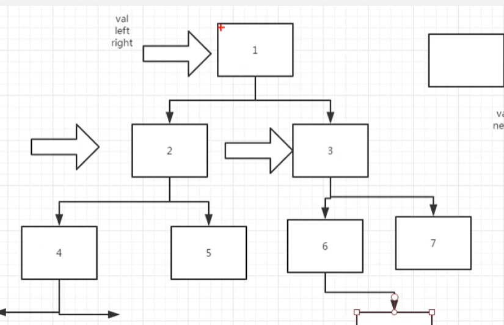

# 树的遍历

## 什么叫做树？

**树状图**是一种[数据结构](https://baike.baidu.com/item/%E6%95%B0%E6%8D%AE%E7%BB%93%E6%9E%84/1450)，它是由n（n>=0）个有限结点组成一个具有层次关系的[集合](https://baike.baidu.com/item/%E9%9B%86%E5%90%88)。把它叫做“树”是因为它看起来像一棵倒挂的树，也就是说它是根朝上，而叶朝下的。它具有以下的特点：

每个结点有零个或多个子结点；没有父结点的结点称为根结点；每一个非根结点有且只有一个父结点；除了根结点外，每个子结点可以分为多个不相交的子树；

叶节点没有子节点，根节点没有父节点。

## 什么是二叉树？

每个节点最多含有两个子树的树称为二叉树。下图就是一个二叉树。

在计算机科学中，二叉树是每个结点最多有两个子树的树结构。通常子树被称作“左子树”（left subtree）和“右子树”（right subtree）。二叉树常被用于实现二叉查找树和二叉堆。

一棵深度为k，且有2^k-1个节点的二叉树，称为满二叉树。这种树的特点是每一层上的节点数都是最大节点数。而在一棵二叉树中，除最后一层外，若其余层都是满的，并且最后一层或者是满的，或者是在右边缺少连续若干节点，则此二叉树为完全二叉树。具有n个节点的完全二叉树的深度为floor(log2n)+1。深度为k的完全二叉树，至少有2k-1个节点，至多有2k-1个节点

## 构建一个二叉树

如图所示，我们如果要构建下面的二叉树，应该是怎么定义的



代码如下

```
class TreeNode(object):
    def __init__(self, x):
        self.val = x
        self.left = None
        self.right = None

if __name__ == '__main__':
    t1 = TreeNode(1)
    t2 = TreeNode(2)
    t3 = TreeNode(3)
    t4 = TreeNode(4)
    t5 = TreeNode(5)
    t6 = TreeNode(6)
    t7 = TreeNode(7)
    t8 = TreeNode(8)
    t1.left = t2
    t1.right = t3
    t2.left = t4
    t2.right = t5
    t3.left = t6
    t3.right = t7
    t6.right = t8
```

## 二叉树的遍历：

遍历是对树的一种最基本的运算，所谓遍历二叉树，就是按一定的规则和顺序走遍二叉树的所有结点，使每一个结点都被访问一次，而且只被访问一次。由于二叉树是非线性结构，因此，[树的遍历](https://baike.baidu.com/item/%E6%A0%91%E7%9A%84%E9%81%8D%E5%8E%86)实质上是将二叉树的各个结点转换成为一个线性序列来表示。

设L、D、R分别表示遍历左子树、访问根结点和遍历右子树， 则对一棵二叉树的遍历有三种情况：DLR（称为先根次序遍历），LDR（称为中根次序遍历），LRD （称为后根次序遍历）。

> 针对上图，我们看看先序、中序、后序遍历
>
> 先序遍历：1 2 4 5 3 6 8 7
>
> 中序遍历：4 2 5 1 6 8 3 7
>
> 后序遍历：4 5 2 8 6 7 3 1 

## 递归遍历

```python
class TreeNode(object):
    def __init__(self, x):
        self.val = x
        self.left = None
        self.right = None

# 递归先序遍历
def preOrderRecusive(root):
    if root == None:
        return None
    print(root.val, end=" ")
    preOrderRecusive(root.left)
    preOrderRecusive(root.right)

# 递归中序遍历
def midOrderRecusive(root):
    if root == None:
        return None
    midOrderRecusive(root.left)
    print(root.val, end=" ")
    midOrderRecusive(root.right)

# 递归后序遍历
def latOrderRecusive(root):
    if root == None:
        return None
    latOrderRecusive(root.left)
    latOrderRecusive(root.right)
    print(root.val, end=" ")

if __name__ == '__main__':
    t1 = TreeNode(1)
    t2 = TreeNode(2)
    t3 = TreeNode(3)
    t4 = TreeNode(4)
    t5 = TreeNode(5)
    t6 = TreeNode(6)
    t7 = TreeNode(7)
    t8 = TreeNode(8)
    t1.left = t2
    t1.right = t3
    t2.left = t4
    t2.right = t5
    t3.left = t6
    t3.right = t7
    t6.right = t8

    preOrderRecusive(t1)
    print()
    midOrderRecusive(t1)
    print()
    latOrderRecusive(t1)
```


运行结果

```
1 2 4 5 3 6 8 7 
4 2 5 1 8 6 3 7 
4 5 2 8 6 7 3 1 
```

## 非递归遍历

递归和循环是可以互相转换的，下面是非递归先序遍历，使用一个stack用于存储经过的节点，并且输出，但没有指针指向为空的时候，我们需要将stack中保存的节点，进行pop出栈，并把它的右节点，重新赋值给tempNode指针，直到所有节点都遍历完成为止。

```
# 非递归先序遍历
def preOrder(root):
    if root == None:
        return None
    stack = []
    tempNode = root
    while tempNode != None or stack:
        print(tempNode.val, end=" ")
        stack.append(tempNode)
        tempNode = tempNode.left
        while tempNode == None and stack != None:
            tempNode = stack.pop()
            tempNode = tempNode.right
```

```
# 非递归中序遍历
def midOrder(root):
    if root == None:
        return None
    stack = []
    tempNode = root
    while tempNode != None or stack:
        stack.append(tempNode)
        tempNode = tempNode.left
        while tempNode == None and stack != []:
            tempNode = stack.pop()
            print(tempNode.val, end=" ")
            tempNode = tempNode.right
```

```
# 非递归后序遍历
def latOrder(root):
    if root == None:
        return None
    stack = []
    tempNode = root
    while tempNode != None or stack:
        stack.append(tempNode)
        tempNode = tempNode.left
        while tempNode == None and stack != []:
            # 后序遍历，pop的方式有变化，不能在右子树不为空的时候pop
            node = stack[-1] # 因此这里不出列
            tempNode = node.right
            # 当右节点没有的时候，才能够pop
            if node.right == None:
                print(node.val, end=" ")
                node = stack.pop()
                # 判断pop的节点，是否是上一个节点
                while stack and node == stack[-1].right:
                    node = stack.pop()
                    print(node.val, end=" ")
```

