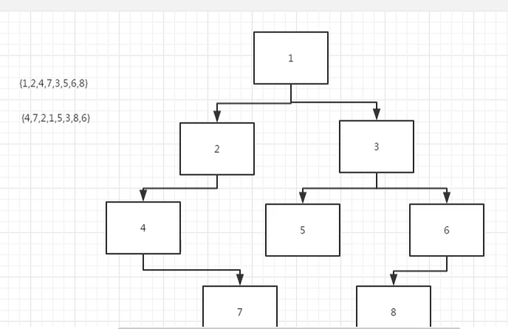

# 重建二叉树

## 来源

https://www.nowcoder.com/practice/8a19cbe657394eeaac2f6ea9b0f6fcf6

## 题目

输入某二叉树的前序遍历和中序遍历的结果，请重建出该二叉树。假设输入的前序遍历和中序遍历的结果中都不含重复的数字。例如输入前序遍历序列{1,2,4,7,3,5,6,8}和中序遍历序列{4,7,2,1,5,3,8,6}，则重建二叉树并返回。

## 重建过程

先找到根节点，也就是先序遍历的第一个节点，即1为根节点

然后从中序遍历中寻找，在1左边的属于左子树（4,7,2），右边的属于右子树：（5,3,8,6）

然后在从先序遍历的第二个节点中寻找出2，作为根节点的左孩子，我们在寻找2节点的左孩子和右孩子，发现只有（4,7）为左节点，没有右节点，然后我们再从先序遍历中寻找出下一个节点，即为4，然后找出4节点的右孩子，即为7。到这里位置，左子树已经构建成功。

构建右子树时，我们需要从先序遍历中，再次输出一个节点3，作为根节点的右子树，然后在从刚刚分类好的中序遍历中，寻找到子树3的左孩子和右孩子，左孩子为（5），右孩子为（8,6），我们继续出列先序遍历，得到5，即3节点的左孩子，然后在出列得到6，也就是3的右孩子，然后在中序遍历中寻找到6的左孩子和右孩子，最后发现只剩下8在，6的左边，因此右孩子为8



## 代码

```
class TreeNode:
    def __init__(self, x):
        self.val = x
        self.left = None
        self.right = None
class Solution:
    # 返回构造的TreeNode根节点
    def reConstructBinaryTree(self, pre, tin):
        # 取出pre的值
        if not pre or not tin:
            return None
        if len(pre) != len(tin):
            return None
        root = pre[0]
        # 新建立节点
        rootNode = TreeNode(root)
        # 找出这个节点，在中序遍历对应的角标
        pos = tin.index(root)
        # 取出中序遍历 左子树
        tinLeft = tin[:pos]
        # 取出中序遍历 右子树
        tinRight = tin[pos+1:]
        # 取出先序遍历的 左子树
        preLeft = pre[1:pos+1]
        # 取出先序遍历的 右子树
        preRight = pre[pos+1:]

        leftNode = self.reConstructBinaryTree(preLeft, tinLeft)
        rightNode = self.reConstructBinaryTree(preRight, tinRight)

        if leftNode:
            rootNode.left = leftNode
        if rightNode:
            rootNode.right = rightNode
        return rootNode
```

代码的实现，使用了递归的方式，也就是采用了分治法，将要解决的问题一分为二，这里指的是先序遍历和中序遍历。