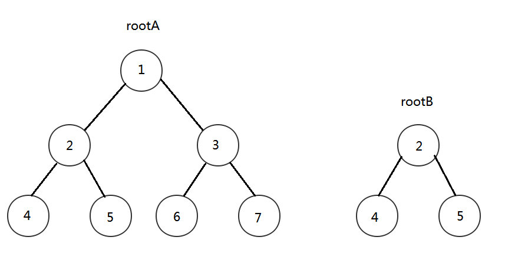

# 树的子结构

## 来源

https://www.nowcoder.com/practice/6e196c44c7004d15b1610b9afca8bd88

## 题目

输入两棵二叉树A，B，判断B是不是A的子结构。（ps：我们约定空树不是任意一个树的子结构）

## 思路

首先我们需要考虑的是，什么才是子结构，如下图所示，rootB就是rootA的子结构



遍历过程如下，首先先遍历rootB的根节点，然后rootA的根节点比较，如果一样，就继续遍历rootB的左右子树，不一样，我们就换个其他节点进行遍历，但我们遍历到rootA的2节点时候，发现和rootB的根节点一样，那么这个时候，就在遍历RootB的左子树，发现也和rootA的一样，在遍历右子树，也相等，这个时候，在rootB全部遍历完成后，我们就能够确定，rootB为rootA的子结构了。

## 代码

```
class TreeNode:
    def __init__(self, x):
        self.val = x
        self.left = None
        self.right = None
class Solution:
    def HasSubtree(self, pRoot1, pRoot2):
        if pRoot1 == None or pRoot2 == None:
            return None

        def hasEqual(pRoot1, pRoot2):
            if pRoot2 == None:
                return True
            if pRoot1 == None:
                return None
            if pRoot1.val == pRoot2.val:
                if pRoot2.left == None:
                    leftEqual = True
                else:
                    leftEqual = hasEqual(pRoot1.left, pRoot2.left)
                if pRoot2.right == None:
                    rightEqual = True
                else:
                    rightEqual = hasEqual(pRoot1.right, pRoot2.right)
                # 左边相等和右边相等的时候，才返回
                return leftEqual and rightEqual
            return False

        ret = hasEqual(pRoot1, pRoot2)
        if ret:
            return True

        ret = self.HasSubtree(pRoot1.left, pRoot2)
        if ret:
            return True
        ret = self.HasSubtree(pRoot1.right, pRoot2)
        return  ret
```

