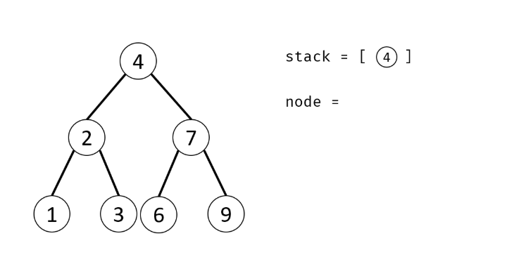

# 二叉树的镜像

## 来源

https://www.nowcoder.com/practice/564f4c26aa584921bc75623e48ca3011

## 题目

操作给定的二叉树，将其变换为源二叉树的镜像。

## 输入描述:

```
二叉树的镜像定义：源二叉树 
    	    8
    	   /  \
    	  6   10
    	 / \  / \
    	5  7 9 11
    	镜像二叉树
    	    8
    	   /  \
    	  10   6
    	 / \  / \
    	11 9 7  5
```

## 代码1

我们就对每个节点的左右子树进行交换即可，也就是需要使用一个temp变量来存储交换的节点。然后在重复它的左子树和右子树

```
class TreeNode:
    def __init__(self, x):
        self.val = x
        self.left = None
        self.right = None
class Solution:
    # 返回镜像树的根节点
    def Mirror(self, root):
        if root == None:
            return None
        # 处理左子树
        temp = root.left
        root.left = root.right
        root.right = temp
        self.Mirror(root.left)
        self.Mirror(root.right)
```

## 代码2 

利用栈（或队列）遍历树的所有节点 node ，并交换每个node  的左 / 右子节点。

算法流程：

- 特例处理： 当 root为空时，直接返回 null；
- 初始化： 栈（或队列），本文用栈，并加入根节点 root
- 循环交换： 当栈 stack为空时跳出；
  - 出栈： 记为 node  ；
  - 添加子节点： 将 node 左和右子节点入栈；
  - 交换： 交换 node 的左 / 右子节点。
- 返回值： 返回根节点 root。

图示：



代码：

```python
class Solution:
    def Mirror(self, root):
        if root == None:
            return None
        stack = [root]
        while stack:
            node = stack.pop()
            if node.left:
                stack.append(node.left)
            if node.right:
                stack.append(node.right)
            node.right,node.left = node.left, node.right
        return root
```

