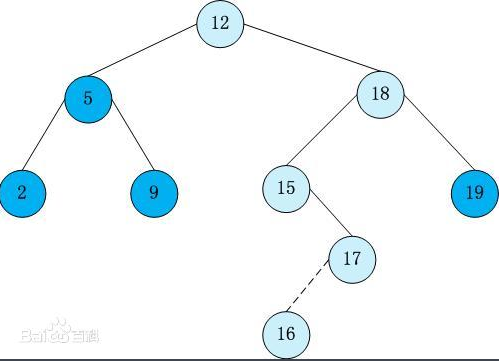
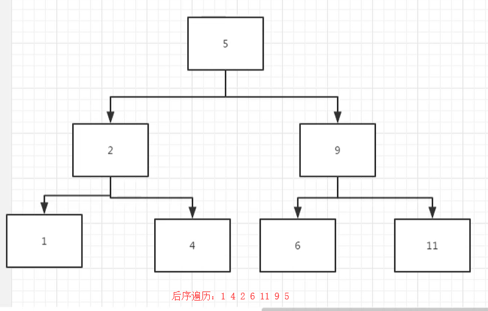

# 二叉搜索树的后序遍历序列

https://www.nowcoder.com/practice/a861533d45854474ac791d90e447bafd

## 题目

输入一个整数数组，判断该数组是不是某二叉搜索树的后序遍历的结果。如果是则输出Yes,否则输出No。假设输入的数组的任意两个数字都互不相同。

## 什么是二叉搜索树

二叉查找树（Binary Search Tree），（又：二叉搜索树，二叉排序树）它或者是一棵空树，或者是具有下列性质的[二叉树](https://baike.baidu.com/item/二叉树/1602879)： 若它的左子树不空，则左子树上所有结点的值均小于它的根结点的值； 若它的右子树不空，则右子树上所有结点的值均大于它的根结点的值； 它的左、右子树也分别为[二叉排序树](https://baike.baidu.com/item/二叉排序树/10905079)。二叉搜索树作为一种经典的数据结构，它既有链表的快速插入与删除操作的特点，又有数组快速查找的优势；所以应用十分广泛，例如在文件系统和数据库系统一般会采用这种数据结构进行高效率的排序与检索操作



## 思路

给定一个二叉树，后序遍历的结果如下所示



代码如下

```
class Solution:
    def VerifySquenceOfBST(self, sequence):
        if sequence == []:
            return False

        # 找ROOT节点，也就是最后一个
        root = sequence[-1]
        # 删除队列中的末尾节点
        del sequence[-1]
        # 寻找出划分的节点
        index = None
        for i in range(len(sequence)):
            # 只寻找一次，就不进入了
            if index == None and sequence[i] > root:
                index = i
            # 当我们找到一个大的数，然后往后又找到一个更小的数，那么就无法组成二叉搜索树
            if index != None and sequence[i] < root:
                return False

        if sequence[:index] == []:
            left = True
        else:
            # 寻找左子树和右子树
            left = self.VerifySquenceOfBST(sequence[:index])
        if sequence[index:] == []:
            right = True
        else:
            right = self.VerifySquenceOfBST(sequence[index:])
        # 返回结果
        return left and right
```

