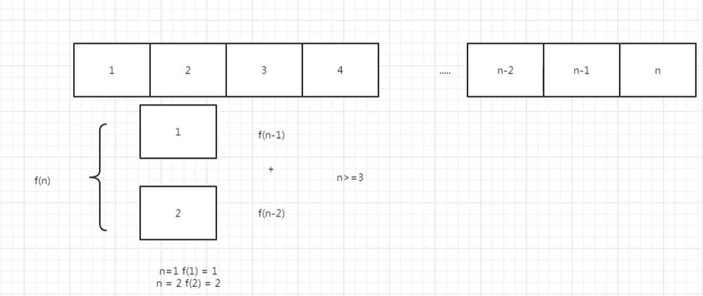

# 青蛙跳台阶

## 题目

一只青蛙一次可以跳上1级台阶，也可以跳上2级。求该青蛙跳上一个n级的台阶总共有多少种跳法（先后次序不同算不同的结果）

## 找规律

```


```



代码实现

```
class Solution:
    def JumpFloor(self, n):
        if n == 0:
            return 0;
        if n == 1:
            return 1;
        if n == 2:
            return 2;

        ret = 0
        a = 1
        b = 2
        for i in range(3, n + 1):
            ret = a + b
            a = b
            b = ret
        return ret

if __name__ == '__main__':
    print(Solution().JumpFloor(10))
```


# 变态跳台阶

## 题目

一只青蛙一次可以跳上1级台阶，也可以跳上2级……它也可以跳上n级。求该青蛙跳上一个n级的台阶总共有多少种跳法。

## 找规律

```
当 n = 1   1
当 n = 2   2
当 n = 3   4
当 n = 4   8
当 n = n   2^(n-1)
```

通过找规律的方法解题：

```
class Solution:
    def jumpFloorII(self, number):
        return pow(2, number -1)
```

找出通项

```
f(n) = f(n-1) + f(n-2) + ..... + f(1)
f(n-1) = f(n-2) + ..... + f(1)
# 我们结合上面的式子，移项可得
f(n) = 2f(n-1)，n > 1
f(1) = 1
```

解法

```
class Solution:
    def JumpFloorII(self, n):
        if n == 1:
            return 1;
        ret = 0
        a = 1
        for i in range(2, n + 1):
            ret = 2 * a
            a = ret
        return ret

if __name__ == '__main__':
    print(Solution().JumpFloorII(10))
```

