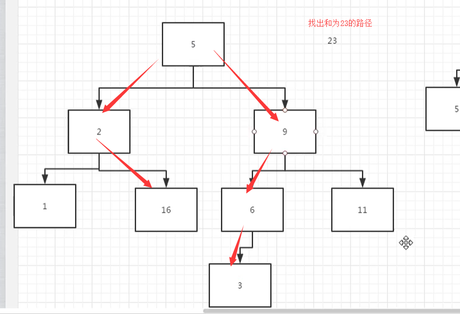

# 二叉树中和为某一值的路径

https://www.nowcoder.com/practice/b736e784e3e34731af99065031301bca

## 描述

输入一颗二叉树的根节点和一个整数，打印出二叉树中结点值的和为输入整数的所有路径。路径定义为从树的根结点开始往下一直到叶结点所经过的结点形成一条路径。

## 思考

假设现在我们需要找出和为23的路径，那么就需要采用广度优先搜索进行遍历，层层进行叠加，最后找到叶子节点



## 代码

```
class TreeNode:
    def __init__(self, x):
        self.val = x
        self.left = None
        self.right = None

import copy
class Solution:
    # 返回二维列表，内部每个列表表示找到的路径
    def FindPath(self, root, expectNumber):
        if root == None:
            return None
        ret = []
        # 用于存放路径
        supportArrayList = [[root.val]]
        # 存放中间节点，把root节点放入
        support = [root]
        # 广度优先遍历
        while support:
            temp = support[0]
            tempArrayList = supportArrayList[0]
            # 判断是否是叶子节点
            if temp.left == None and temp.right == None:
                # 判断路径中的值，是否等于expectNum，往该条数组中插入
                if sum(tempArrayList) == expectNumber:
                    ret.insert(0, tempArrayList)

            if temp.left:
                support.append(temp.left)
                newTempArrayList = copy.copy(tempArrayList)
                newTempArrayList.append(temp.left.val)
                supportArrayList.append(newTempArrayList)
            if temp.right:
                support.append(temp.right)
                newTempArrayList = copy.copy(tempArrayList)
                newTempArrayList.append(temp.right.val)
                supportArrayList.append(newTempArrayList)

            del support[0]
            del tempArrayList[0]
        return ret
```