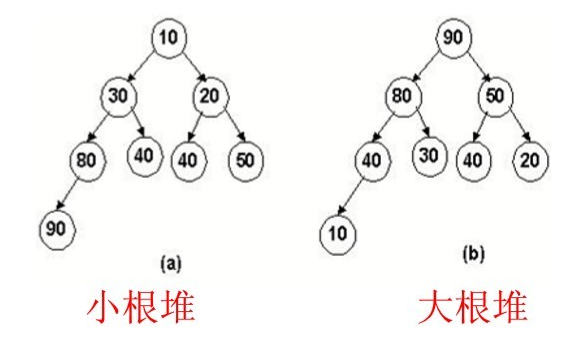

# 最小的K个数

https://www.nowcoder.com/practice/6a296eb82cf844ca8539b57c23e6e9bf

## 描述

输入n个整数，找出其中最小的K个数。例如输入4,5,1,6,2,7,3,8这8个数字，则最小的4个数字是1,2,3,4,。

## 思考

最大堆和最小堆是二叉堆的两种形式。

最大堆：根结点的键值是所有堆结点键值中最大者，且每个结点的值都比其孩子的值大。

最小堆：根结点的键值是所有堆结点键值中最小者，且每个结点的值都比其孩子的值小



## 代码

我们首先需要用一个长度为K的数组，来记录最小值，并且这个数组是排序的，首先需要初始化K数组的值，我们设置为最大，然后遍历每次查找的时候，需要从里面的数组进行比较，然后如果大小超过了K，那么把最大的数给剔除。

```
class Solution:
    def GetLeastNumbers_Solution(self, tinput, k):
        array = []
        if k > len(tinput):
            return array
        for i in range(k):
            array.append(1000000)
        for key in tinput:
            for index in range(len(array)):
                if key < array[index]:
                    array.insert(index, key)
                    break
            if len(array) > k:
                del array[-1]
        return array
```

