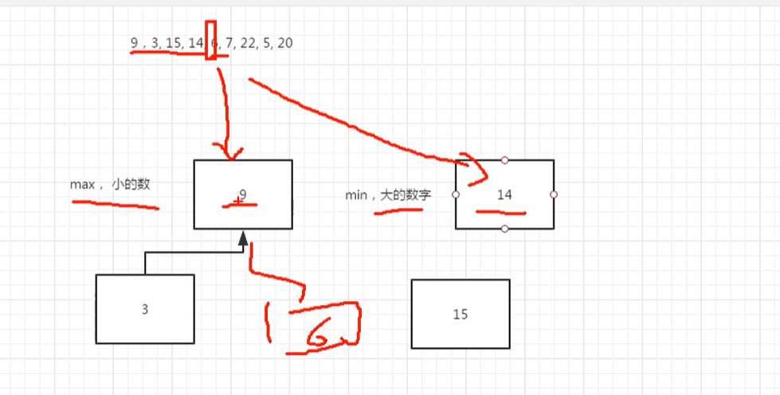

# 数据流中的中位数

https://www.nowcoder.com/practice/9be0172896bd43948f8a32fb954e1be1

## 题目

如何得到一个数据流中的中位数？如果从数据流中读出奇数个数值，那么中位数就是所有数值排序之后位于中间的数值。如果从数据流中读出偶数个数值，那么中位数就是所有数值排序之后中间两个数的平均值。我们使用Insert()方法读取数据流，使用GetMedian()方法获取当前读取数据的中位数。

## 思路

我们需要维护一个最大堆和最小堆



## 代码

```python
# 未封装版本
class Solution:
    def __init__(self):
        self.littleValueMaxHeap = []
        self.bigValueMinHeap = []
        self.maxHeapCount = 0
        self.minHeapCount = 0

    def createMaxHeap(self, num):
        self.littleValueMaxHeap.append(num)
        tmpIndex = len(self.littleValueMaxHeap) - 1
        while tmpIndex != 0:
            parentIndex = (tmpIndex - 1) >> 1
            if self.littleValueMaxHeap[parentIndex] < self.littleValueMaxHeap[tmpIndex]:
                self.littleValueMaxHeap[parentIndex], self.littleValueMaxHeap[tmpIndex] = self.littleValueMaxHeap[tmpIndex], self.littleValueMaxHeap[parentIndex]
                tmpIndex = parentIndex
            else:
                break

    def adjustMaxHeap(self, num):
        if num < self.littleValueMaxHeap[0]:
            self.littleValueMaxHeap[0] = num
        maxHeapLen = len(self.littleValueMaxHeap)
        tmpIndex = 0
        while tmpIndex < maxHeapLen:
            leftIndex = tmpIndex * 2 + 1
            rightIndex = tmpIndex *2 + 2
            if rightIndex < maxHeapLen:
                largerIndex = rightIndex if self.littleValueMaxHeap[leftIndex] < self.littleValueMaxHeap[rightIndex] else leftIndex
            elif leftIndex < maxHeapLen:
                largerIndex = leftIndex
            else:
                break
            if self.littleValueMaxHeap[tmpIndex] < self.littleValueMaxHeap[largerIndex]:
                self.littleValueMaxHeap[tmpIndex], self.littleValueMaxHeap[largerIndex] = self.littleValueMaxHeap[largerIndex], self.littleValueMaxHeap[tmpIndex]
                tmpIndex = largerIndex
            else:
                break

    def createMinHeap(self, num):
        self.bigValueMinHeap.append(num)
        tmpIndex = len(self.bigValueMinHeap) - 1
        while tmpIndex != 0:
            parentIndex = (tmpIndex - 1) >> 1
            if self.bigValueMinHeap[tmpIndex] < self.bigValueMinHeap[parentIndex]:
                self.bigValueMinHeap[parentIndex], self.bigValueMinHeap[tmpIndex] = self.bigValueMinHeap[tmpIndex], self.bigValueMinHeap[parentIndex]
                tmpIndex = parentIndex
            else:
                break

    def adjustMinHeap(self, num):
        if num < self.bigValueMinHeap[0]:
            self.littleValueMaxHeap[0] = num
        minHeapLen = len(self.bigValueMinHeap)
        tmpIndex = 0
        while tmpIndex < minHeapLen:
            leftIndex = tmpIndex * 2 + 1
            rightIndex = tmpIndex *2 + 2
            if rightIndex < minHeapLen:
                smallerIndex = rightIndex if self.bigValueMinHeap[rightIndex] < self.bigValueMinHeap[leftIndex] else leftIndex
            elif leftIndex < minHeapLen:
                smallerIndex = leftIndex
            else:
                break
            if self.bigValueMinHeap[smallerIndex] < self.bigValueMinHeap[tmpIndex]:
                self.bigValueMinHeap[tmpIndex], self.bigValueMinHeap[smallerIndex] = self.bigValueMinHeap[smallerIndex], self.bigValueMinHeap[tmpIndex]
                tmpIndex = smallerIndex
            else:
                break

    def Insert(self, num):
        if self.minHeapCount < self.maxHeapCount:
            self.minHeapCount += 1
            if num < self.littleValueMaxHeap[0]:
                tmpNum = self.littleValueMaxHeap[0]
                self.adjustMaxHeap(num)
                self.createMinHeap(tmpNum)
            else:
                self.createMinHeap(num)
        else:
            self.maxHeapCount += 1
            if self.littleValueMaxHeap == []:
                self.createMaxHeap(num)
            else:
                if self.bigValueMinHeap[0] < num:
                    tmpNum = self.bigValueMinHeap[0]
                    self.adjustMinHeap(num)
                    self.createMaxHeap(tmpNum)
                else:
                    self.createMaxHeap(num)


    def GetMedian(self):
        if self.minHeapCount < self.maxHeapCount:
            return self.littleValueMaxHeap[0]
        else:
            return (self.bigValueMinHeap[0] + self.littleValueMaxHeap[0]) / 2

# 封装版本
class Solution:
    def __init__(self):
        self.littleValueMaxHeap = []
        self.bigValueMinHeap = []
        self.maxHeapCount = 0
        self.minHeapCount = 0

    def createHeap(self, num, heap, cmpFunc):
        heap.append(num)
        tmpIndex = len(heap) - 1
        while tmpIndex != 0:
            parentIndex = (tmpIndex - 1) >> 1
            if cmpFunc(heap[tmpIndex], heap[parentIndex]):
                heap[parentIndex], heap[tmpIndex] = heap[tmpIndex], heap[parentIndex]
                tmpIndex = parentIndex
            else:
                break

    def adjustHeap(self, num, heap, cmpFunc):
        if num < heap[0]:
            heap[0] = num
        heapLen = len(heap)
        tmpIndex = 0
        while tmpIndex < heapLen:
            leftIndex = tmpIndex * 2 + 1
            rightIndex = tmpIndex *2 + 2
            if rightIndex < heapLen:
                largerIndex = rightIndex if cmpFunc(heap[rightIndex], heap[leftIndex]) else leftIndex
            elif leftIndex < heapLen:
                largerIndex = leftIndex
            else:
                break
            if cmpFunc(heap[largerIndex], heap[tmpIndex]):
                heap[tmpIndex], heap[largerIndex] = heap[largerIndex], heap[tmpIndex]
                tmpIndex = largerIndex
            else:
                break

    def Insert(self, num):
        def cmpMaxHeap(a, b):
            return b < a

        def cmpMinHeap(a, b):
            return a < b

        if self.minHeapCount < self.maxHeapCount:
            self.minHeapCount += 1
            if num < self.littleValueMaxHeap[0]:
                tmpNum = self.littleValueMaxHeap[0]
                self.adjustHeap(num, self.littleValueMaxHeap, cmpMaxHeap)
                self.createHeap(tmpNum, self.bigValueMinHeap, cmpMinHeap)
            else:
                self.createHeap(num, self.bigValueMinHeap, cmpMinHeap)
        else:
            self.maxHeapCount += 1
            if self.littleValueMaxHeap == []:
                self.createHeap(num, self.littleValueMaxHeap, cmpMaxHeap)
            else:
                if self.bigValueMinHeap[0] < num:
                    tmpNum = self.bigValueMinHeap[0]
                    self.adjustHeap(num, self.bigValueMinHeap, cmpMinHeap)
                    self.createHeap(tmpNum, self.littleValueMaxHeap, cmpMaxHeap)
                else:
                    self.createHeap(num, self.littleValueMaxHeap, cmpMaxHeap)

    def GetMedian(self):
        if self.minHeapCount < self.maxHeapCount:
            return self.littleValueMaxHeap[0]
        else:
            return (self.bigValueMinHeap[0] + self.littleValueMaxHeap[0]) / 2
        
        
if __name__ == '__main__':
    s = Solution()
    for i in [5,2,3,4,1,6,7,0,8]:
        s.Insert(i)
        print(s.GetMedian())
```

