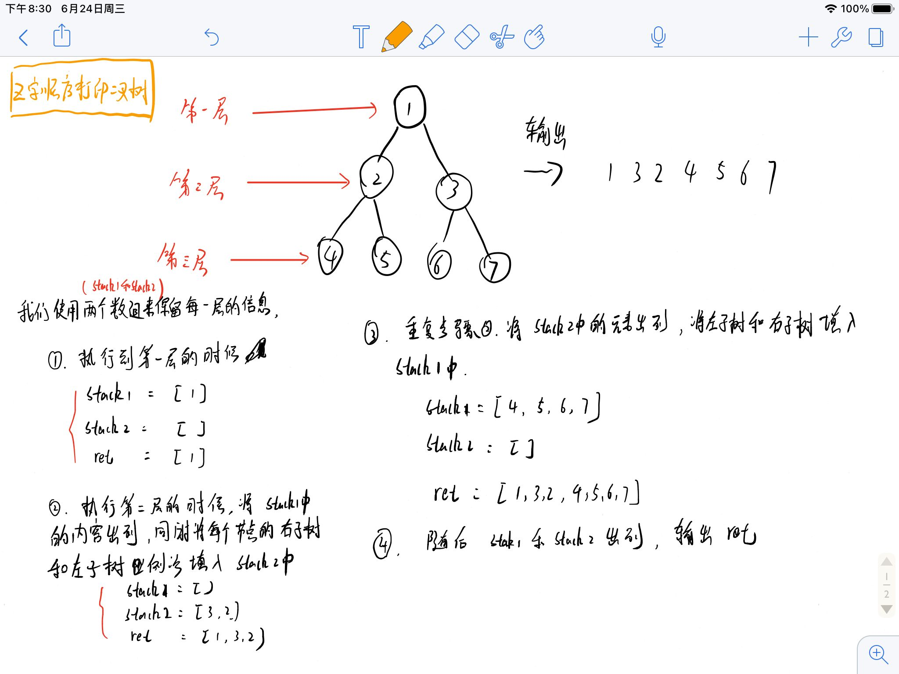

# 按之字形顺序打印二叉树

## 来源

https://www.nowcoder.com/practice/91b69814117f4e8097390d107d2efbe0

## 描述

请实现一个函数按照之字形打印二叉树，即第一行按照从左到右的顺序打印，第二层按照从右至左的顺序打印，第三行按照从左到右的顺序打印，其他行以此类推。

## 思路

我们使用到了两个数组，用于保留每一行的结果，同时两个数组交替进行存储，最后通过ret数组来记录输出值



## 代码

```
#  按之字形顺序打印二叉树
class TreeNode:
    def __init__(self, x):
        self.val = x
        self.left = None
        self.right = None
class Solution:
    def Print(self, pRoot):
        if pRoot == None:
            return []
        # write code here
        stack1 = [pRoot]
        stack2 = []
        # 存储打印
        ret = []
        # 当1和2中有空时
        while stack1 or stack2:
            if stack1:
                tmpRet = []
                while stack1:
                    # 取出stack1中的一个节点
                    tmpNode = stack1.pop()
                    tmpRet.append(tmpNode.val)
                    # 把左右子树放到stack2中
                    if tmpNode.left:
                        stack2.append(tmpNode.left)
                    if tmpNode.right:
                        stack2.append(tmpNode.right)
                ret.append(tmpRet)

            if stack2:
                tmpRet = []
                while stack2:
                    # 取出stack1中的一个节点
                    tmpNode = stack2.pop()
                    tmpRet.append(tmpNode.val)
                    # 把左右子树放到stack2中
                    if tmpNode.right:
                        stack1.append(tmpNode.right)
                    if tmpNode.left:
                        stack1.append(tmpNode.left)
                ret.append(tmpRet)
        return ret
```

