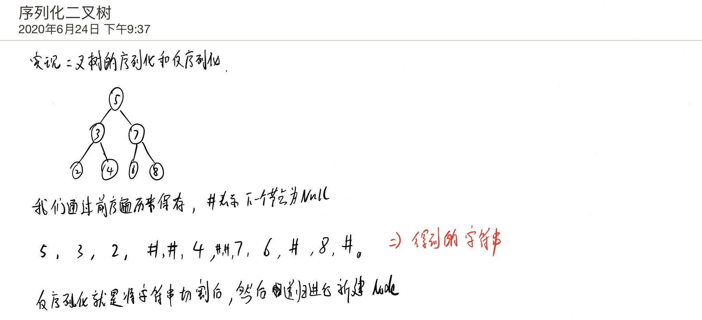

# 序列化二叉树

## 题目

https://www.nowcoder.com/practice/cf7e25aa97c04cc1a68c8f040e71fb84

## 描述

请实现两个函数，分别用来序列化和反序列化二叉树

二叉树的序列化是指：把一棵二叉树按照某种遍历方式的结果以某种格式保存为字符串，从而使得内存中建立起来的二叉树可以持久保存。序列化可以基于先序、中序、后序、层序的二叉树遍历方式来进行修改，序列化的结果是一个字符串，序列化时通过 某种符号表示空节点（#），以 ！ 表示一个结点值的结束（value!）。

二叉树的反序列化是指：根据某种遍历顺序得到的序列化字符串结果str，重构二叉树。

例如，我们可以把一个只有根节点为1的二叉树序列化为"1,"，然后通过自己的函数来解析回这个二叉树

## 思考



## 代码

```
class Solution:
    # 序列化
    def Serialize(self, root):
        retList = []
        def preOrder(root):
            if root == None:
                # 找到为空的节点，插入 #
                retList.append("#")
                return

            # 否者插入该节点
            retList.append(str(root.val))
            preOrder(root.left)
            preOrder(root.right)
        preOrder(root)
        return ' '.join(retList)

    # 反序列化
    def Deserialize(self, s):
        retList = s.split(" ")
        def dePreOrder():
            if retList == None:
                return None
            rootVal = retList.pop(0)
            if rootVal == "#":
                return None
            node = TreeNode(int(rootVal))
            leftNode = dePreOrder()
            rightNode = dePreOrder()
            node.left = leftNode
            node.right = rightNode
            return node
        return dePreOrder()
```

