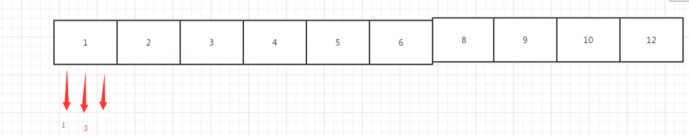

# 找出丑数

## 题目

把只包含质因子2、3和5的数称作丑数（Ugly Number）。例如6、8都是丑数，但14不是，因为它包含质因子7。 习惯上我们把1当做是第一个丑数。求按从小到大的顺序的第N个丑数。

把只包含质因子2、3和5的数称作丑数（Ugly Number）。例如6、8都是丑数，但14不是，因为它包含质因子7。 习惯上我们把1当做是第一个丑数。求按从小到大的顺序的第N个丑数。

## 思路1

死循环，找丑数判断一个数是不是丑数，先循环除以2，直到不能整除，循环除以3 直到不能整除，循环除以5 直到不能整除。这时如果剩余的值是1  我们就说它是丑数，其他情况就都不是丑数

```python
class Solution:
    def GetUglyNumber_Solution(self, index):
        # write code here
        if index < 1:
            return None
        #死循环，找丑数
        #判断一个数是不是丑数，先循环除以2，直到不能整除，
        #循环除以3 直到不能整除，循环除以5 直到不能整除
        #这时如果剩余的值是1  我们就说它是丑数
        #其他情况就都不是丑数
        def isUglyNumber(num):
            while num % 2 == 0:
                num = num //2
            while num % 3 == 0:
                num = num //3
            while num % 5 == 0:
                num = num //5
            if num == 1:
                return True
            else:
                return False
        count = 0
        num = 1
        while True:
            if isUglyNumber(num):
                count += 1
            if count == index:
                return num
            num += 1
```

## 思路2

我们可以保存已经找到的丑数，然后 用空间环时间 来 找出丑数。

如何用空间换时间？

我们找一种，只需要计算丑数的办法,根据上面丑数的定义，我们可以知道，丑数应该是另一个丑数 乘以 2,3，或者5 的结果（1除外）。因此我们 可以创建一个 列表，里面的数字是排好序的 丑数，每个丑数都是前面的丑数乘以2,3，或者5得到的。

那么我们就可以在一个列表中，给它第一个 丑数的值，然后根据 它 得到剩下的 丑数的值，第一个丑数为1，那么我们在这个列表的起始位置 设置三个指针，这三个指针代表的值  分别为2,3,5.又由于这个列表中的所有的丑数 是有序的，从小到大排列的，那么我们在每次 给一个丑数 乘以 2,3,5 以后要与前面的丑数比较大小，然后在根据大小值 来放入列表中。由于一开始第一个丑数是1，那么 1 * 2 得到的是2,1*3 得到的是3，1 乘以5 得到的是5，那么三个数中比较大小，最小的是 1 乘以2，那么 肯定第一个先放置的是2，然后是 2 乘以2 和 1乘3,1乘5 比较大小，最小的是3 那么就放置 3，下一个 是 2 乘以3 是6,6 与 5  和4 比较大小 最小的是4，以此类推，那么现在的到的丑数的顺序就是1,2,3,4.。。。。。



代码如下

```
class Solution(object):
    def nthUglyNumber(self, index):
        #首先判断  要找的 丑数 是不是第0个 或者是负数，如果是的话，那么就返回0
        if index <= 0:
            return 0
        #然后判断要找的丑数 是不是第一个，如果是第一个，那么就返回1.
        if index == 1:
            return 1
        #在丑数 这个列表中 给出第一个丑数是1
        numbers = [1]
        #在列表的 一开始  设置三个 指针，也就是 三个指针的 索引位置是0，
        two, three, five = 0, 0, 0
        #丑数的个数 起始为 1
        count = 1
        #循环 当丑数的个数不等于我们要找到 那第 index 个 丑数时，就循环，等于的时候就跳出循环。
        while count != index :
            #给列表中的 2,3,5 这三个指针所在位置的 丑数 分别 乘以2,3,5
            n2, n3, n5 = numbers[two] * 2, numbers[three] * 3, numbers[five] * 5
            #比较这三个丑数的大小
            minValue = min(n2, n3, n5)
            #在丑数列表中，把三个中最小的那个 放进去。
            numbers.append(minValue)
            #每放进去一个，丑数的数量就加1
            count += 1
            #这个是指针移位的，如果说我们比较出来的 三个数中最小的丑数是 2 指针的话，那么2 指针就往前移动一位
            if minValue == n2:
                two += 1
            #如果是 3 那个指针的话，那么3 这个指针就移一位。
            if minValue == n3:
                three += 1
            #如果是 5 那个指针的话，那么5这个指针就移一位。
            if minValue == n5:
                five += 1
        #最后输出这个丑数列表中的 最后一位，那么就是我们的计数的丑数的个数 -1，就是最后一个丑数的索引值。
        return numbers[count-1]
```