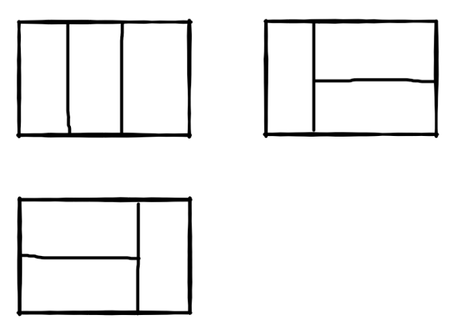

# 矩形覆盖

## 来源

https://www.nowcoder.com/practice/72a5a919508a4251859fb2cfb987a0e6

## 描述

我们可以用2 X 1 的小矩形横着或者竖着去覆盖更大的矩形。请问用n个2*1的小矩形无重叠地覆盖一个2*n的大矩形，总共有多少种方法？

比如n=3时，2*3的矩形块有3种覆盖方法：



## 思考

相当于转变成了斐波那契数列，得到通式

```
f(n) = f(n-1) + f(n-2)

n = 1： 1
n = 2： 3
```


## 代码

```
class Solution:
    def rectCover(self, number):
        # write code here
        if number == 0:
            return 0
        if number == 1:
            return 1
        if number == 2:
            return 2
        
        a = 1
        b = 2
        for i in range(3, number + 1):
            b = a + b
            a = b - a
        return b
```

