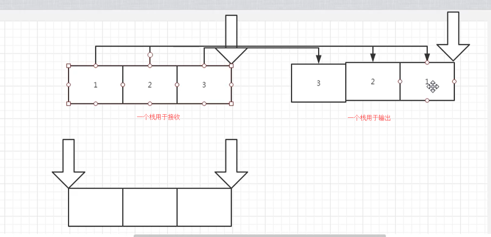

# 两个栈实现一个队列

## 题目描述

用两个栈来实现一个队列，完成队列的Push和Pop操作。 队列中的元素为int类型。


## 思考

栈：先进后出

队列：先进先出.



我们需要使用一个栈用于接收数据，并且一个栈用于输出数据


## 代码

```
class Solution:
    def __init__(self):
        # 接收栈
        self.acceptStack = []
        # 输出栈
        self.outputStack = []

    def push(self, node):
        # 把节点放到栈中
        self.acceptStack.append(node)

    def pop(self):
        # 从接收栈中获取元素，把它放入到 输出栈中
        if self.outputStack == []:
            while self.acceptStack:
                self.outputStack.append(self.acceptStack.pop())

        # 判断输出栈中是否有元素，有，则输出最后一个
        if self.outputStack != []:
            return self.outputStack.pop()
        else:
            return None
```

