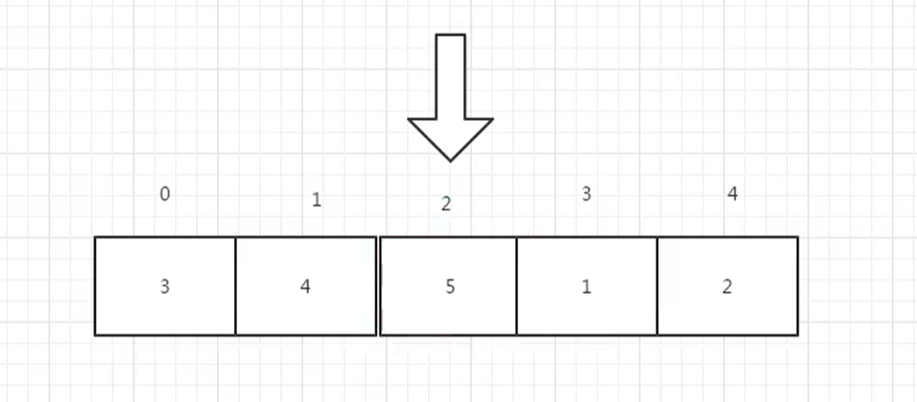
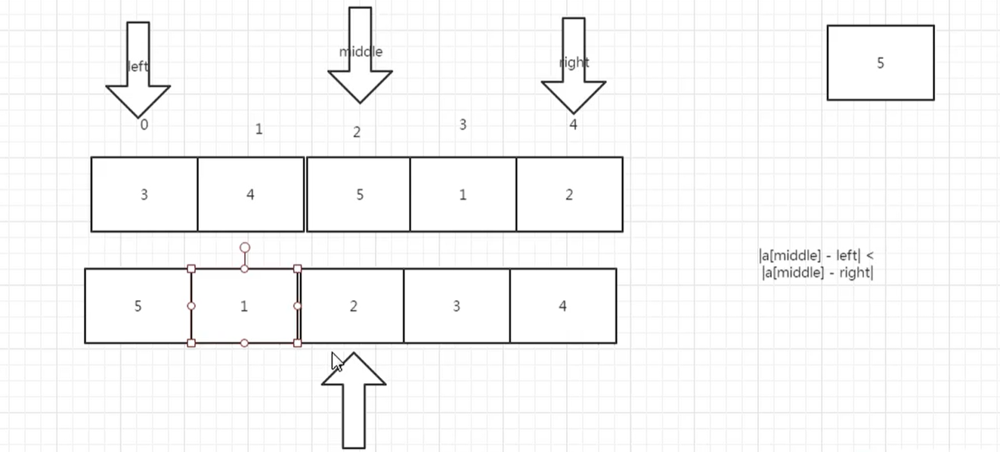

# 旋转数组的最小数字

## 题目描述

来源：https://www.nowcoder.com/practice/9f3231a991af4f55b95579b44b7a01ba

把一个数组最开始的若干个元素搬到数组的末尾，我们称之为数组的旋转。输入一个非递减排序的数组的一个旋转，输出旋转数组的最小元素。例如数组{3,4,5,1,2}为{1,2,3,4,5}的一个旋转，该数组的最小值为1。NOTE：给出的所有元素都大于0，若数组大小为0，请返回0。

## 暴力破解

第一种方法就是遍历全部的元素，然后找出最小的，时间复杂度为：`O(n)`

```
class Solution:
    def minNumberInRotateArray(self, rotateArray):
        minNum = 0
        # 第一种方法，就是遍历所以的元素，找出最小的
        for i in range(0, len(rotateArray)):
            minNum = minNum if minNum < rotateArray[i] and minNum != 0 else rotateArray[i]
        return minNum
```


## 方式2

上面的暴力破解方法，没有用到题目的特性，就是非递减排序的数组，这个时候我们就可以使用二分查找法，来找出最小的元素。



首先这个数组局部有序的，假设我们查询一个数，如找出最小是1

```
第一次比较的数为： 5，通过  3 < 5, 2 < 5，  |5 - 3| < |5 - 2| ，所以从右边找
第二次比较：  5 > 1,  2 > 1，这个时候，它两边的数都比它小，说明它就是最小值。
```



这个时候，我们就需要将原来的 二分查找法变换一下

```
|a[middle] - left| < |a[middle] - right|
如果成立，就往右边查找
如果不成立，那就左边查找

如果 middle < left，middle < right时，那么就说明这个数是最小值
即比两边的数都更小
```

给定一个二分查找法的代码

```
class Solution:

    # 二分查找法
    # 有序的数组中使用
    def bSearch(self, array, target):
        left = 0
        right = len(array) - 1
        while left < right:
            # 右移1位，相当于除以2
            mid = (left + right) >> 1
            if target == mid:
                return mid
            if target > mid:
                left = mid + 1
            else:
                right = mid - 1
        return None

if __name__ == '__main__':
    print(Solution().bSearch([1,2,3,4,5,6,7,8,9,10], 8))
```

下面我们需要改进一下代码，让其能够找出我们的最小值。

```
# -*- coding:utf-8 -*-
class Solution:
    # 二分查找法
    # 有序的数组中使用
    def minNumberInRotateArray(self, rotateArray):
        if not rotateArray:
            return None
        left = 0
        right = len(rotateArray) - 1
        while left <= right:
            middle = (left + right) >> 1
            # middle 比两边的都小，说明是最小值
            if rotateArray[middle] < rotateArray[middle - 1]:
                return rotateArray[middle]
            elif rotateArray[middle] < rotateArray[right]:
                right = middle - 1                
            else:
                left = middle + 1
        return 0
```


