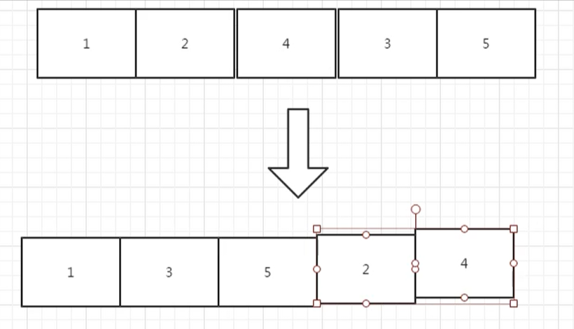

# 调整数组顺序使奇数位于偶数前面

## 题目描述

来源：https://www.nowcoder.com/practice/beb5aa231adc45b2a5dcc5b62c93f593

输入一个整数数组，实现一个函数来调整该数组中数字的顺序，使得所有的奇数位于数组的前半部分，所有的偶数位于数组的后半部分，并保证奇数和奇数，偶数和偶数之间的相对位置不变。

## 思考

我们要做的就是下面的这种效果，把奇数提取出来，放在一个数组中，然后在把偶数放在另外一个数组中，最后将两个数组合并



## 代码

```
# 调整数组顺序使奇数位于偶数前面
# 输入一个整数数组，实现一个函数来调整该数组中数字的顺序，使得所有的奇数位于数组的前半部分，
# 所有的偶数位于数组的后半部分，并保证奇数和奇数，偶数和偶数之间的相对位置不变
class Solution:
    def reOrderArray(self, array):
        ret = []
        ret2 = []
        for i in range(0, len(array)):
            # 判断是否偶数
            if array[i] % 2 == 0:
                ret2.append(array[i])
            else:
                ret.append(array[i])
        return ret + ret2
if __name__ == '__main__':
    print(Solution().reOrderArray([3,4,5,2,3,6,7,8]))
```

假设不用辅助数组来排序