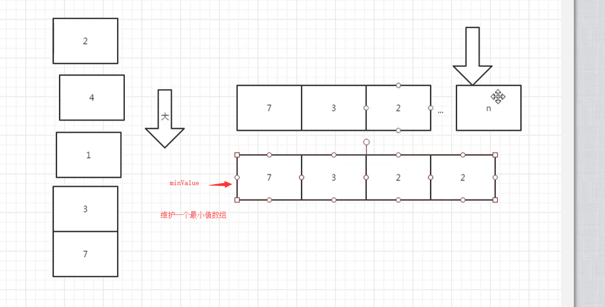

# 包含min函数的栈

## 题目描述

定义栈的数据结构，请在该类型中实现一个能够得到栈中所含最小元素的min函数（时间复杂度应为O（1））。

注意：保证测试中不会当栈为空的时候，对栈调用pop()或者min()或者top()方法。

## 思路

我们需要维护一个最小值的数组，这个数组存储每次push元素时候的最小值

```
    # 压栈
    def push(self, node):
        self.stack.append(node)

        # 维护当前最小的数组
        if self.minValue:
            if self.minValue[-1] > node:
                self.minValue.append(node)
            else:
                self.minValue.append(self.minValue[-1])
        else:
            self.minValue.append(node)
```

从上面的代码能看出，我们只需要比较  当前 最小值数组的，最小值和当前插入值比较，如果比最小值比当前的小，那么就还是插入本身，否则插入的是我们新的节点。




## 代码

```
# 包含min函数的栈
# 定义栈的数据结构，请在该类型中实现一个能够得到栈中所含最小元素的min函数（时间复杂度应为O（1））。
# 注意：保证测试中不会当栈为空的时候，对栈调用pop()或者min()或者top()方法。
class Solution:

    # 初始化
    def __init__(self):
        self.stack = []
        # 存储最小元素
        self.minValue = []

    # 压栈
    def push(self, node):
        self.stack.append(node)

        # 维护当前最小的数组
        if self.minValue:
            if self.minValue[-1] > node:
                self.minValue.append(node)
            else:
                self.minValue.append(self.minValue[-1])
        else:
            self.minValue.append(node)

    # 出栈
    def pop(self):
        if self.stack == []:
            return None
        self.minValue.pop()
        return self.stack.pop()

    # 获取栈顶
    def top(self):
        if self.stack == []:
            return None
        return self.stack[-1]

    def min(self):
        if self.minValue == []:
            return None
        return self.minValue[-1]
```

