#### 队列

**队列是一种特殊的线性表，特殊之处在于它只允许在表的前端（front）进行删除操作，而在表的后端（rear）进行插入操作，和栈一样，队列是一种操作受限制的线性表。进行插入操作的端称为队尾，进行删除操作的端称为队头。**

对列的添加       insert  			append 

队列的取值      列表[-1]			列表[0]

队列的删除 	  pop()			pop(0)

___


#### 栈

**栈（stack）又名堆栈，它是一种运算受限的线性表。其限制是仅允许在表的一端进行插入和删除运算。这一端被称为栈顶，相对地，把另一端称为栈底。向一个栈插入新元素又称作进栈、入栈或压栈，它是把新元素放到栈顶元素的上面，使之成为新的栈顶元素；从一个栈删除元素又称作出栈或退栈，它是把栈顶元素删除掉，使其相邻的元素成为新的栈顶元素。**

只允许在栈的栈顶来操作。

添加元素用append(push)，称作是进栈，入栈或者压栈

取值列表[-1]，因为它只能从栈顶来取值，相当于取列表的最后一个值，所以用索引-1.

删除元素pop()从后端开始删除。称作是出栈或者退栈。

___


## 1. 两个栈实现一个队列：[^本题考点 队列 栈]

**用两个栈来实现一个队列，完成队列的Push和Pop操作。 队列中的元素为int类型。**

……解析：

定义一个类，首先这个类要具备两个属性，一个是压栈，一个是出栈。

因为要两个栈来实现一个队列：进行插入操作的端称为队尾，进行删除操作的端称为队头。

那么如何用：两个栈实现一个队列？

栈： 先进后出

队列：先进先出

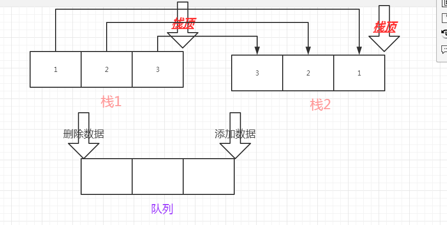

#### 如图所示：

队列从一头添加数据，从一头删除数据。

所以我们需要让两个栈

一个栈实现添加数据 

​	即：`self.acceptStack=[] `它拥有一个` push `的方法，用来作为队列的一端的添加数据 功能 用append来实现

​		`self.acceptStack.append(node)`

另一个栈实现删除数据：

​	即：`self.outputStack = [] `它拥有pop 的方法，用来作为队列的另一端的删除数据的功能 用pop 来实现

​	但是我们要实现的是队列的先进先出，也就意味着 如果说我们添加数据的栈中添加了一个数据，那么我们另一个删除数据的栈中，也要相应的删除这个数据，所以说这两个栈中的数据的顺序是相反的。

以上的需求我们通过，删除`acceptStack`栈中的数据，在`outputStack`中添加这个数据，那么先在`acceptStack`中删除的数据，就会进入到`outputStack`的栈底，后在`acceptStack`中删除的数据，会后进入`outputStack`，那么它就会先出来。

那么两个栈，这样来合作，就会实现队列的先进先出，如图：1 是先进的（栈1） 那么1 就会先出来（栈2）。

进而实现了 题目的需求。

在pop 的方法中，如果说 `self.outputStack `是空 没有数据，那么 就给它 while 循环我们的 作为添加数据的栈 

`acceptStack`，删除这个栈中的内容，它会弹出，然后把它添加到 `栈2 outputStack`  中，它就会有数据，有数据的话就返回 （如果 调用了 删除 数据的这个方法的话）。如果说 做了循环，我们的`栈2 outputStack` 中还没有数据，就明 `acceptStack `中，没有数据压入，也就说明这个 队列 没有添加数据，也就不会有删除的数据，所以返回一个None。

___


```python
class Solution:
    def init(self):
        #添加数据栈
        self.acceptStack=[]
        #删除数据栈
        self.outputStack = []
    def push(self, node):
        #向添加数据的栈中添加数据
        self.acceptStack.append(node)
    def pop(self):
        #判断删除数据的栈中是否有数据，没有的话，就添加数据，添加数据时，要添加栈1 中删除的数据
        if not self.outputStack:
            while self.acceptStack:
            self.outputStack.append(self.acceptStack.pop())
        #如果有数据的话，就返回
        if self.outputStack:
            return self.outputStack.pop()
        #如果没有数据，说明没有数据添加进去，也就不需要删除数据，所以返回none
        else:
            return None
```

### 二分查找法

##### **分析查找：首先快速的查找方法 有二分查找法，那么什么是二分查找法？**

```
二分查找法什么情况下用。有序的数组中。首先 肯定是在有序的 数组中的！！！！！
```

算法：二分法查找适用于数据量较大时，但是数据需要先排好顺序。主要思想是：（设查找的数组区间为array[low, high]）

（1）确定该区间的中间位置K（2）将查找的值T与array[k]比较。若相等，查找成功返回此位置；否则确定新的查找区域，继续二分查找。区域确定如下：a.array[k]>T 由数组的有序性可知array[k,k+1,……,high]>T;故新的区间为array[low,……，K-1]b.array[k]<T 类似上面查找区间为array[k+1,……，high]。每一次查找与中间值比较，可以确定是否查找成功，不成功当前查找区间将缩小一半，递归查找即可。

时间复杂度为:`O(log2n)`。

##### 时间复杂度

1.最坏情况查找最后一个元素（或者第一个元素）Master定理T(n)=T(n/2)+O(1)所以T(n)=O(log2n)

2.最好情况查找中间元素O(1)查找的元素即为中间元素（奇数长度数列的正中间，偶数长度数列的中间靠左的元素）

##### 空间复杂度

1. S(n)=n

##### 二分法代码实现：

```python
def BinarySearch(array,target):
    left= 0
    right= len(array)-1
    while left <= right :
        #除法没有移位的快
        # mid = (left + right)//2
        # 101 = 5 => 10 = 2
        #1100 = 12 => 110 = 6
        #一下用了 向右 移一位， 那么上面是解释，它就相当于 除以2 。
        mid = (left + right) >> 1
        #如果中间的数等于我们要找的数，那么就返回。
        if  array[mid] == target:
            return mid
        #如果说中间的数 < 目标的数，那么就说明，我们要找的数在右侧，所以左侧取值的索引需要改变为中间的索引+1；
        elif array[mid]< target:
            left = mid + 1
        #如果说中间的数 > 目标的数，那么就说明，我们要找的数在左侧，所以左侧取值的索引需要改变为中间的索引-1； 因为越往左索引值越小
        else:
            right = mid-1

    return None
```

把数组内的数据一分为二，然后计算出中间数据的 索引值。

数组中 最左侧的  索引为 0  ；最右侧的索引为 len(array)-1，数组的长度 减 1 就是 最后一个数的索引。

先判断中间索引的所对应的数组中的数值，是否与我们要查找的数字 target 相等，如果相等那么就返回，如果不相等，那么就继续判断。如果说我们找到的 array[mid] 小于  target 这个数; 那么 就说明 我们要查找的数在右侧的一半数据中，那么这个时候我们就需要改变我们左边的索引值，不在从0 开始，而是从我们中间 mid 的下一个开始，left = mid + 1，继续查找。如果说我们找到的 array[mid]  大于 target 这个数 ，那么就说明我们要查找的数据在左侧，这个时候就需要改变右侧的索引，为 right = mid-1，越往左侧走，索引值越小。直到找的的数 与target 相等为止。

以上为二分法的原理。

___


## 2. 旋转数组的最小数字 [^本题考点 查找]

**把一个数组最开始的若干个元素搬到数组的末尾，我们称之为数组的旋转。 输入一个非减排序的数组的一个旋转，输出旋转数组的最小元素。 例如数组{3,4,5,1,2}为{1,2,3,4,5}的一个旋转，该数组的最小值为1。 NOTE：给出的所有元素都大于0，若数组大小为0，请返回0。**

```python
class Solution:
    def minNumberInRotateArray(self, rotateArray):
        #最小值 一定比前面的要小
        # 二分法查找数据  找左右的方法是：
        #右边的值大于中值，就说明最小值在左边
        if not rotateArray:
            return 0
        left = 0
        right = len(rotateArray) - 1
        while left <= right:
            mid = (left + right) >> 1
            #如果说中间的数的上一个数 > 中间数，那么就说明，我们要找的数就是这个中间的数，返回这个数。
            if rotateArray[mid - 1] > rotateArray[mid]:
                return rotateArray[mid]
            #如果说中间的数 < 中间数的上一个数，那么就说明，我们要找的数在二分法的左侧，所以右侧取值的索引需要改变为中间的索引-1；因为越往左索引值越小
            elif rotateArray[mid] < rotateArray[right]:
                right = mid - 1
            #否则就说明，我们要找的数在二分法的右侧，所以左侧取值的索引需要改变为中间的索引+1；因为越往右索引值越小
            else:
                left = mid + 1
        return 0
```

___


##### 什么叫做数组？

*所谓数组，是有序的元素序列。 [1]  若将有限个类型相同的变量的集合命名，那么这个名称为数组名。组成数组的各个变量称为数组的分量，也称为数组的元素，有时也称为下标变量。用于区分数组的各个元素的数字编号称为下标。数组是在程序设计中，为了处理方便， 把具有相同类型的若干元素按无序的形式组织起来的一种形式。 [1]  这些无序排列的同类数据元素的集合称为数组。*

例如：

int (32 位)      int     	int     	这三个就会组成一个数组，类型相同的变量。
a(0)             a(1)      	a(2)

数组与python中的 列表比较相似， 用索引去查找。
数组的长度是固定的，在初始化时就指定长度。列表是可以动态增加的。
数组还和元组比较像，元组是初始化后，长度指定了就不可以变。
但是元组在初始化时给的值，确定了以后就不可以变了。
所以可以理解为数组与list 列表很相似。

___


## 3.在二维数组中的查找[^本题考点 *查找*]

**在一个二维数组中（每个一维数组的长度相同），每一行都按照从左到右递增的顺序排序，每一列都按照从上到下递增的顺序排序。请完成一个函数，输入这样的一个二维数组和一个整数，判断数组中是否含有该整数。**

```python
class Solution:
    # array 二维列表
    def Find(self, target, array):
        # write code here
        # 1 2 3 4
        # 3 4 5 6
        # 4 6 8 10
        # 9 11 13 15
        #时间复杂度 o(n**n)

        # for i in range(len(array)):
        #     for j in range(len(array[i])):
        #         if target == array[i][j]:
        #             return True
        # return False

        #时间复杂度
        #O（n)
        #这个二维数组的长度是多少，也就是说这个数组有几行；
        row_count = len(array)
        i = 0
        #这个数组列数的索引值，就是我们数组取第一个数的个数，也就是有几列
        column_count = len(array[0])
        #给j 一个值，就是数组列数的值-1，即为j 的最大值。
        j = len(array[0])-1
        #循环，当i 小于我们行数的时候，并且j 也没有取到 0 那么就进入循环，去查找数据。
        #我们要取到每行的最后一个数，即对应的那一列的第一个数，来与我们的目标数来对比，这个数是这一行的最大数，是这一列的最小数。
        while i < row_count and j >= 0:
            #根据两个索引下标可以取到 对应的在数组中的值
            value = array[i][j]
            #如果说取到的值，刚好等于目标值，那么就说明我们找到了它，直接返回就好。
            if value == target:
                return True
            #如果说取到的值 > 我们的目标值。那就说明它不在它所在的那一列里，因为这个数是那一列的最小值，这个时候就需要改变我们列的索引值，给它减-1，找前一列的数做比较
            elif target < value:
                j -= 1
            #如果说取到的值 < 我们的目标值。那就说明它不在它所在的那一行里，因为这个数是那一行的最大值，这个时候就需要改变我们行的索引值，给它加+1，找下一行的数做比较
            else:
                i += 1
        return False
```

___


## 4.包含min 函数的栈[^本题考点 *栈*]

**定义栈的数据结构，请在该类型中实现一个能够得到栈中所含最小元素的min函数（时间复杂度应为O（1））。**

原理：用空间换时间，用时间换空间；增加空间来减少时间的消耗

```python
#第一种方法：考虑两个栈的长度相同，添加一个，另一个栈也会删除一个

class Solution:
    #给这个类一个初始的属性，有一个栈，另外有一个最小值的列表栈
    def __init__(self):
        self.stack = []
        self.minValue = []
    #给栈中推进去数值，推进去元素node，添加函数
    def push(self, node):
        self.stack.append(node)
        #如果最小值列表里有值
        if self.minValue:
            #如果最小值列表里的最后一个值 大于 node 这个值，说明node这个值小，
            # 那么就放进最小值列表中；
            if self.minValue[-1] > node:
                self.minValue.append(node)
             #如果列表里面的最后一个值，小于node值，那么就说明node这个值大；那么就添加上次添加进来的那个小的值，与栈中的数据长度保持一致；
            else:
                self.minValue.append(self.minValue[-1])
        #如果最小值列表里面没有值，就在最小值列表里添加node
        else:
            self.minValue.append(node)
    #给栈中做删除操作
    def pop(self):
        #如果说栈中是空值得话那么就返回none，说明没有在栈中压值进来，没有最小值
        if self.stack == []:
            return None
        #栈的长度与最小值的栈的长度要相同，所以最小值列表也需要删除一个
        self.minValue.pop()
        #有值得话，就需要删除一个，删除做pop 操作；返回我们删除的那个数
        return self.stack.pop()
    #栈顶 
    def top(self):
        #如果栈里没有数值的话，就返回一个空
        if not self.stack:
            return None
        #否则栈里有数，那么就返回栈顶的那个数
        return self.stack[-1]
   	#取出最小值，那么就是我们minvalue 中的最后一个值为最小值
    def min(self):
        #如果为空的话，就说明没有值，返回none
        if self.minValue == []:
            return None
        return self.minValue[-1]
    
    
    #第二种方法：不考虑两个栈的长度必须要保持一致，那么在栈删除值的时候，判断一下删除的值，是不是与装最小值的栈里的最后一个最小值相同，如果相同就删掉，如果不同，就不删除。
    
    
class Solution:
    def __init__(self):
        self.stack = []
        self.minValue = []
    def push(self, node):
        # write code here
        self.stack.append(node)
        if self.minValue:
            #如果最小值列表里的最后一个值 大于 node 这个值，说明node这个值小，
            # 那么就放进最小值列表中；
            if self.minValue[-1] > node:
                self.minValue.append(node)
             #最后一个值不大于node这个值得话；不做操作，不需要把它两个做的长度一致
        else:
            self.minValue.append(node)
    def pop(self):
        if self.stack == []:
            return None
        # write code here
        #删除的时候，做个判断，它是不是与栈里面的最后一个值，与我们最小值栈里的最后一个值相等，那么就删除双方的这个值
        if self.stack[-1] == self.minValue[-1]:
            self.minValue.pop()
            return self.stack.pop()
        #如果不等的话，就只要删除栈 里最后一个值就可以
        else:
            return self.stack.pop()
    def top(self):
        if self.stack == []:
            return None
        return self.stack[-1]
        # write code here
    def min(self):
        if self.minValue == []:
            return None
        return self.minValue[-1]
```

## 5.替换空格[^本题考点 *字符串*]

**请实现一个函数，将一个字符串中的每个空格替换成`“%20”`。例如，当字符串为`We Are Happy`.则经过替换之后的字符串为`We%20Are%20Happy`。**

```python
# -*- coding:utf-8 -*-
class Solution:
    # s 源字符串
    def replaceSpace(self, s):
    	#第一种：python中自带的一个替换的函数
        # return s.replace(' ','%20')
        #第二种遍历来替换字符串中的空格
        strlen = len(s)
        #借助第三方的列表来实现时间的节省。
        aaa = []
        for i in range(strlen):
            #如果是空格的话那就替换为%20.
            if s[i] == " ":
            #if s[i] isspace:
                aaa.append("%")
                aaa.append("2")
                aaa.append("0")
            else:
                aaa.append(s[i])
        return "".join(aaa)
```

___

## 6.斐波那契数列

**大家都知道斐波那契数列，现在要求输入一个整数n，请你输出斐波那契数列的第n项（从0开始，第0项为0）。n<=39**

```python
#第一种方法：下面是使用了for循环，

class Solution:
    def Fibonacci(self, n):
        
        # 如果是按照递归来写的话， 时间复杂度就是随着n的变化 增长率是 2^n
        
        ''' 递归实现
        # n = 0 f(0) = 0
        if n == 0:
            return 0
        # n = 1 f(1) = 1
        if n == 1:
            return 1
        # if n > 1  f(n) = f(n-1) + f(n-2)
        if n > 1:
            num = self.Fibonacci(n-1) + self.Fibonacci(n-2)
            return num

        return None
        '''
        
        # n = 0 f(0) = 0
        if n == 0:
            return 0
        # n = 1 f(1) = 1
        if n == 1:
            return 1

        a = 1
        b = 0
        # if n > 1  f(n) = f(n-1) + f(n-2)
        # h = a + b
        # 当 n = 2 h = 0 + 1
        ret = 0
        #三个变量，互相转换 来实现
        for i in range(0, n - 1):
            ret = a + b
            b = a
            a = ret
        return ret
#第二种方法：相对来说比较简便，简单来讲，就是取出这个列表的最后两项求和，就是列表的第三项，时间复杂度比较小，空间复杂度为 n

 class Solution:
     def Fibonacci(self, n):
        #初始列表值 为 0 1 第三项为 0+1 = 1；
         res = [0, 1, 1]
         #临界条件为：第 n 项，所以就是 这个 列表的长度要小于等于 n；大于 n 就应该跳出这个循环。
         while len(res) <= n:
                #取出列表的最后两项，然后求和，并添加到列表中。
             res.append(res[-1] + res[-2])
         return res[n]


```

___

## 7.青蛙跳台阶

**一只青蛙一次可以跳上1级台阶，也可以跳上2级。求该青蛙跳上一个n级的台阶总共有多少种跳法（先后次序不同算不同的结果）。**

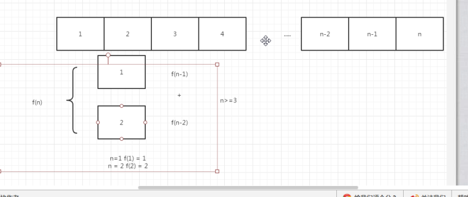

```python 
"""
1 (1)
2 (11,2)
3 (12,21,111)
4 (1111,22,112,121,211)
5 (11111,221,212,122,1121,2111,1112,1211)
6 (111111,222,2211,1122,2112,1221,2121,1212,21111,12111,11211,11121,11112,)
"""

class Solution:
    def jumpFloor(self, number):
        # write code here
        
        #第一种方法：
         res = [1, 1, 2]
         while len(res) <= number:
             res.append(res[-1] + res[-2])
         return res[number]
        
        
         a = 1
         b = 1
         for i in range(0,number):
             a,b = b,a+b
         return a
        
        
        if number < 1:
            return 0
        if number ==1:
            return 1
        if number == 2:
            return 2
        ret = 0
        a = 1
        b = 2
        for i in range(3,number+1):
            ret = a+b
            a = b
            b = ret
        return ret
```
---

## 8.变态跳台阶

**一只青蛙一次可以跳上1级台阶，也可以跳上2级……它也可以跳上n级。求该青蛙跳上一个n级的台阶总共有多少种跳法。**

```python
"""
1 (1)
2 (11,2)
3 (111,21,3,12)
4 (1111,22,13,31,211,112,121,4)

n  2^(n-1)
f(n)  = f(n-1) + f(n-2) + .... + f(1)
f(n-1) = f(n-2) + .... + f(1)
f(n) = 2f(n-1)  n > 1

f(1) = 1 n = 1

"""

# -*- coding:utf-8 -*-
class Solution:
    def jumpFloorII(self, number):
        # write code here
        #第一种方法：
        # return pow(2,number-1)
        
        #第二种方法：
        # return 2 ** (number - 1)
        
        #第三种方法：
        if number == 0:
            return 0
        if number ==1 :
            return 1
        a = 1
        ret = 1
        for i in range(2,number+1):
            a,ret = ret,2*ret
        return ret
```

___

## 9. 调整数组顺序使奇数位于偶数前面       [^本题知识点 *数组*]

**输入一个整数数组，实现一个函数来调整该数组中数字的顺序，使得所有的奇数位于数组的前半部分，所有的偶数位于数组的后半部分，并保证奇数和奇数，偶数和偶数之间的相对位置不变。**

```python
class Solution:
    def reOrderArray(self, array):
        # write code here
        #时间复杂度是o(n)
        #空间复杂度o(n)
        # ret = []
        # for i in array:
        #     if i % 2 == 1:
        #         ret.append(i)
        # for i in array:
        #     if i % 2 == 0:
        #         ret.append(i)
        # return ret
		#用了冒泡排序的原理，判断奇偶数，如果一个是偶数而且下一个是奇数，那么两个就互换位置。
        for i in range(len(array)):
            for j in range(len(array) - i - 1):
                if array[j] % 2 == 0 and array[j + 1] % 2 == 1:
                    array[j], array[j + 1] = array[j + 1], array[j]
        return array
```

___


### 知识点：冒泡排序法

```python
def bubbleSort(array):

    #一共 需要 n 次 的循环，每一个都要找到没排好序的最大值。
    for i in range(len(array)):
        #将没有排好序的数组 找最大值，并一直将最大值换到最顶端。
        for j in range(len(array)-i-1):
            #判断如果说一个数大于它下面的一个数，那么就两个数的位置互换。
            if array[j] > array[j+1]:
                array[j],array[j+1] = array[j+1],array[j]
    return array
```

___

## 10.栈的压入，弹出序列  [^本题考点 *栈*]

**输入两个整数序列，第一个序列表示栈的压入顺序，请判断第二个序列是否可能为该栈的弹出顺序。假设压入栈的所有数字均不相等。例如序列1,2,3,4,5是某栈的压入顺序，序列4,5,3,2,1是该压栈序列对应的一个弹出序列，但4,3,5,1,2就不可能是该压栈序列的弹出序列。（注意：这两个序列的长度是相等的）**

```python
class Solution:
    def IsPopOrder(self, pushV, popV):
        # write code here
        #首先要先有一个栈，列表
        #按照 pushV 的方式去压入栈，
        # 弹出的时候是需要循环判断是否需要弹出
        #判断是否需要弹出的时机，刚刚压入过后就判断
        #判断需要弹出的情况的条件，压入栈的顶部和弹出栈的顶部数据相等
        
        #先判断pushV 这个栈里是否为空，如果是空的话返回none，或者说这两个序列的长度不相同。那也返回none。

        if pushV == [] or len(pushV ) != len(popV):
            return None
		#首先有个栈
        stack = []
        #定义一个变量，它作为弹出序列的索引存在。
        index = 0
        #遍历 pushV 的这个列表里的元素，并把它每个都添加进stack 这个列表中
        for item in pushV:
            stack.append(item)
            #做判断 1，stack 里有元素 并且 stack里的最后一个元素 等于 popV 这个序列里 第一个元素，那么就进去这个循环，然后把stack里的这个元素删掉，这样下次还会添加新的元素，然后再和 popV 里的下一个元素 做判断，所以这个时候 index  这个索引值就要发生变化了，这个时候比较的是 它的下一个值。往右移动一位。
            while stack and stack[-1] == popV[index]:
                stack.pop()
                index += 1
        """
        if stack == []:
            return True
        else:
            return False
            
        """
        #最后 直到 把 pushV 里的元素都遍历完，然后stack内的元素都比较完，并都删除完，就返回True，如果说 它不为空：说明 pushV 里有的元素 是popV 中所没有的，这个时候就说明他们不相等，那么这个情况，就需要返回 False。
        #以下代码与以上代码 共同实现的相同的功能，但是下面的代码相对来说等 “装B” 一点。节省代码空间。
        return True if stack == [] else False
```

___

#### `知识点`链表：

链表是一种物理[存储单元](https://baike.baidu.com/item/%E5%AD%98%E5%82%A8%E5%8D%95%E5%85%83/8727749)上非连续、非顺序的[存储结构](https://baike.baidu.com/item/%E5%AD%98%E5%82%A8%E7%BB%93%E6%9E%84/350782)，[数据元素](https://baike.baidu.com/item/%E6%95%B0%E6%8D%AE%E5%85%83%E7%B4%A0/715313)的逻辑顺序是通过链表中的[指针](https://baike.baidu.com/item/%E6%8C%87%E9%92%88/2878304)链接次序实现的。链表由一系列结点（链表中每一个元素称为结点）组成，结点可以在运行时动态生成。每个结点包括两个部分：一个是存储[数据元素](https://baike.baidu.com/item/%E6%95%B0%E6%8D%AE%E5%85%83%E7%B4%A0)的数据域，另一个是存储下一个结点地址的[指针](https://baike.baidu.com/item/%E6%8C%87%E9%92%88/2878304)域。 相比于[线性表](https://baike.baidu.com/item/%E7%BA%BF%E6%80%A7%E8%A1%A8/3228081)[顺序结构](https://baike.baidu.com/item/%E9%A1%BA%E5%BA%8F%E7%BB%93%E6%9E%84/9845234)，操作复杂。由于不必须按顺序存储，链表在插入的时候可以达到O(1)的复杂度，比另一种线性表顺序表快得多，但是查找一个节点或者访问特定编号的节点则需要O(n)的时间，而线性表和顺序表相应的时间复杂度分别是O(logn)和O(1)。

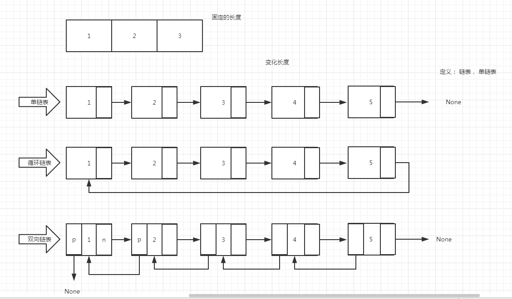


数组 就是连续的 同一个类型的 元素，而且必须是固定的长度。

如果我们想要非固定的长度来存储数据。这个时候就出现了链表。


___


## 11. 从栈尾到栈头打印链表 [^本题知识点 *链表*]

**输入一个链表，按链表值从尾到头的顺序返回一个`ArrayList`。**

```python
# -*- coding:utf-8 -*-
# class ListNode:
#     def __init__(self, x):
#         self.val = x
#         self.next = None

class Solution:
    # 返回从尾部到头部的列表值序列，例如[1,2,3]
    def printListFromTailToHead(self, listNode):
        # write code here
        # pointer 指针 temporary临时数据;node 结点
        #给一个 arraylist 空列表，然后向这个里面压入数据，来输出 这个链表值 的一个从尾到头 的顺序值。
        ret = []
        #把 listNode 这个链表 传给一个 变量
        pTemp = listNode
        #当这个变量 存在时 有值时：
        while pTemp:
            #使用 insert 的原因是：insert 可以在指定位置之前插入元素，列表.insert(索引，值)
            #在空列表中起始位置，插入 pTemp的第一个值，然后 给pTemp 赋值 为 pTemp.next （下一个值） 
            ret.insert(0, pTemp.val)
            #更改 指针，使指针指向下一个 元素
            pTemp = pTemp.next
		#最后返回我们 这个 插入值的 列表 
        return ret 
```

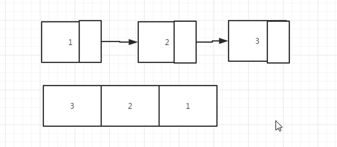

如图所示：打印出 3 2 1 即为我们的目标。

___

## 12.链表中的倒数第k个结点[^本题考点 *链表*]

**输入一个链表，输出该链表中倒数第k个结点。**

```python
# -*- coding:utf-8 -*-
# class ListNode:
#     def __init__(self, x):
#         self.val = x
#         self.next = None

class Solution:
    def FindKthToTail(self, head, k):
        
        # write code here
        # k 如果 比我们的链表的长度还要大的话，我们直接返回None
        # k 如果小于链表的长度，我们可以定义两个变量，这两个变量中间间隔k
        #用两个指针做一个尺子，然后让尺子在跳跳，然后就会找到 第k 个结点
        
        
        #起始位置 第一个和第二个指针 都是从头开始的。
        firstPoint = head
        secondPoint = head
        
        #首先让一个指针先开始移动，那么就是遍历我们的k 值，让我们的 第一个指针移动 k 步。
        for i in range(k):
            #如果第一个指针为空的话，那么说明我们的k值为空，那么我们的这个链表就为空。
            if firstPoint == None:
                return None
            #第一个指针 移动一步 
            firstPoint = firstPoint.next
		#当 第一个指针不为空的时候，
        while firstPoint != None:
            #移动尺子，移动距离为  k 的长度， 直到 第一个指针点 为空的时候 ，就到了 这个链表的结尾，此时就返回 第二个指针 那么就为 倒数第 k 个结点。
            firstPoint = firstPoint.next
            secondPoint = secondPoint.next

        return secondPoint
```

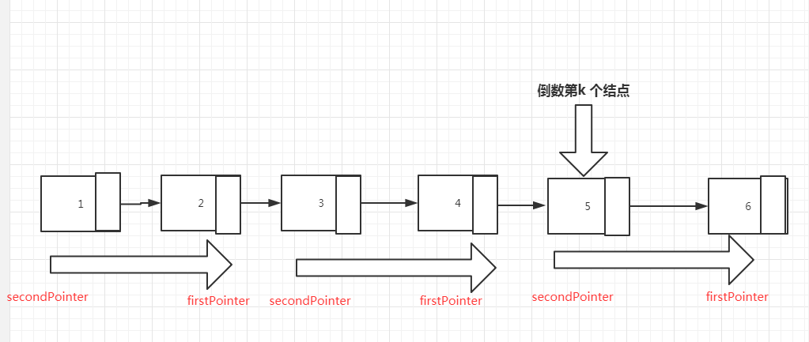

___


如上图所示：分析过程，可以为两个结点的指针长度，也可以为三个结点的指针长度，也可以为k个结点的指针长度。

## 13.反转链表[^本题考点 *链表*]

**输入一个链表，反转链表后，输出新链表的表头。**

```python
#第一种方法：
"""
 pHead始终指向要反转的结点
last 指向反转后的首结点
每反转一个结点，
把pHead结点的下一个结点指向last,
last指向pHead成为反转后首结点,
再把pHead向前移动一个结点直至None结束

"""


# -*- coding:utf-8 -*-
# class ListNode:
#     def __init__(self, x):
#         self.val = x
#         self.next = None
class Solution:
    # 返回ListNode
    def ReverseList(self, pHead):
        #首先判断这个链表里是否只有一个结点，只有一个结点那么它就不需要发生变化，它第一个结点指向的指针就为 none
        # 这个时候就直接返回这个 pHead
        if not pHead or not pHead.next:
            return pHead
        #首先要明白 反转过后，第一个数值的指针的结点指向的是none 也就是一个指向反转后的首结点 为none
        last = None

        #当 要反转的结点 pHead 存在的时候
        while pHead:
            #先找到第一个元素的结点指向的元素，赋值给一个临时变量
            temp = pHead.next
            """
            本来一个元素的结点 是要指向它的下一个 元素的 .
            反转后 就是  这个元素 要指向它的 上一个 元素 .
            
            """
            #然后第一次循环 把这第一个元素的结点 改为 none last 第一个值 是 none (此时还没有发生改变的last)
            # 之后循环 就是 每 反转一个结点 把pHead结点的下一个结点指向last,
            pHead.next = last
            #下一步 是把 pHead 这个 元素的 赋值给last
            # last指向pHead成为反转后首结点,
            last = pHead
            # 再把pHead向前移动一个结点直至None结束
            pHead = temp

        return last


"""
反转需要两步 ，第一步找到它的 结点，第二步改变结点就可以了；
之后需要 把结点 赋值为 这个元素的 本身 ；

循环：
 找到 元素结点指向的元素，
目标是 让元素结点指向的元素 改为 自己本身。

"""

#第二种方法：

"""
1 将现有的头换成尾，尾部的next为空
2 将从第二个node开始，循环将next指向前一个
3 需要一直有一个指针指向还没有反转的链表的头部

"""
class Solution2:
    # 返回ListNode
    def ReverseList(self, pHead):
        #判断是否为空值，没有元素
        if pHead == None:
            return None
        #判断是否只有一个元素
        if pHead.next == None:
            return pHead
		#左边指针为 头 第一个 指针
        leftPointer = pHead
        #中间 的指针 为 第二个指针
        midPointer = pHead.next
        #右边的指针  为 指向 中间 指针后的 所有的元素 
        rightPointer = midPointer.next
        #左边的指针为 起始 的 元素， 反转后 它的next 为 None；
        leftPointer.next = None
		#循环，当我的右边的结点指向的 元素 一直存在的时候，那么就会一直循环，一直来反转结点。
        while rightPointer:
            #中间指针指向的为上一个 元素 即 leftPointer
            midPointer.next = leftPointer
            #三个指针开始往右移。每次移一个。
            #左边指针 往右移一个 就是中间指针的位置
            leftPointer = midPointer
            #中间指针 往 右 移 一个，就时 右边指针的位置
            midPointer = rightPointer
            #右边指针往右移 一个 ，就时 右边指针的下一个。
            rightPointer = rightPointer.next
		#当右指针 指向的为 空的时候 就会跳出循环，那么此时的最后一次循环的 中间的指针的 指向的 是此时的左 指针。
        midPointer.next = leftPointer
        #最后返回中间的 这个指针，就是 最后一个 反转的指针的第一个，表头。
        return midPointer
```


如图所示：

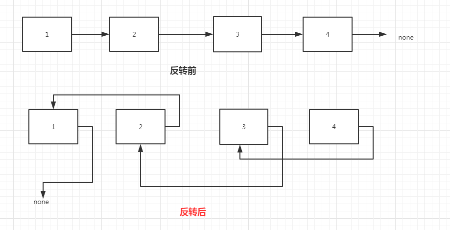

___

## 14.复杂链表的复制

**输入一个复杂链表（每个节点中有节点值，以及两个指针，一个指向下一个节点，另一个特殊指针指向任意一个节点），返回结果为复制后复杂链表的head。（注意，输出结果中请不要返回参数中的节点引用，否则判题程序会直接返回空）**

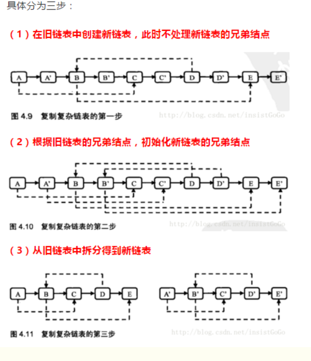

___

```python
#第一种方法：

# -*- coding:utf-8 -*-
# class RandomListNode:
#     def __init__(self, x):
#         self.label = x
#         self.next = None
#         self.random = None
class Solution:
    # 返回 RandomListNode
      def Clone(self, pHead):
        # write code here
        
        #判断当pHead 为空值的时候 返回的是none
        
        if pHead == None:
            return None
        # 复制一个一样的node， 并且添加到之前的链表的每一个node后面
        pTmp = pHead
        while pTmp:
            #把第一个 A 的值 赋给 node 为A‘
            node = RandomListNode(pTmp.label)
            #此时 node A' 的结点指向的是 原来A 的结点指向的 值
            node.next = pTmp.next
            #将原来A 的结点指向的值 改为 A’
            pTmp.next = node
            #将 我们要操作的指针 向后移动 操作下一个 需要复制的元素，即为 A‘ 结点 指向的元素
            pTmp = node.next
        # 实现新建的node的random的指向
        pTmp = pHead
        while pTmp:
            #如果现在操作的这个指针的元素，存在一个 random 的结点
            if pTmp.random:
                #那么 这个A 的结点指向的（A’）的random结点指向的 值 为 A 的random的结点指向的值，指向的结点(也就是它的下一个值)上图更清楚明白。
                pTmp.next.random = pTmp.random.next
            #建好 这个元素的 random 的值，然后移动 指针 到下一个元素，来 建立 下一个 复制的元素的random 结点的指向。
            #当前元素 下一个的下一个 是复制的元素 是需要添加random 指向的元素。
            pTmp = pTmp.next.next
        # 断开原来的node 和 新的node 之间的链接
        #最后 为断开 链接 的操作
        pTmp = pHead
        #复制的新链表的表头A’ 为 旧链表 A 的结点指向的 下一个值A‘
        newHead = pHead.next
        #复制的新链表的第一个值A’ 为 旧链表 A 的结点指向的 下一个值A‘
        pNewTmp = pHead.next
        
        while pTmp:
            #print(pTmp.label)
            #将旧链表 A 的指向结点 改为  A‘ 的指向的下一个 的B。
            pTmp.next = pTmp.next.next
            #如果新的 链表 的元素有指向的下一个的指针
            if pNewTmp.next:
                #那么就把 这个元素的A’ 的结点指向 改为 A‘ 下一个 B 的下一个 的B’
                pNewTmp.next = pNewTmp.next.next
                #然后再 将 新链表的指针移 位，来断开下一个 链接，也就是 指针改为了 B‘ 
                pNewTmp = pNewTmp.next
            #上面新链表的元素指针改好了，再更改 下一个旧链表的 元素 也就是 上三行代码 之前改好的 A 的结点指向的B 
            pTmp = pTmp.next
            #如此循环下去，改变所有的 新链表，旧链表的指向。
        #最后返回这个复制好的新链表。
        return newHead
    
    
    #第二种方法：
    	 import copy
         chead=copy.deepcopy(pHead)
         return chead
```

___

## 15.两个链表之间的第一个公共结点

**输入两个链表，找出它们的第一个公共结点**

如图：

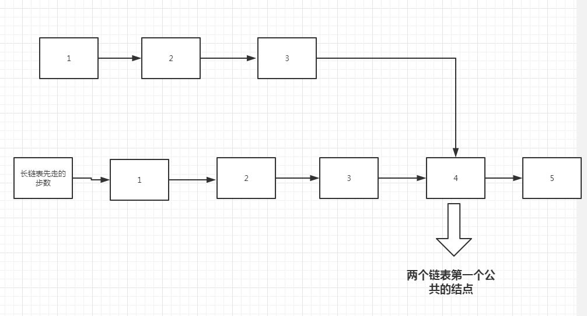

___


```python
# -*- coding:utf-8 -*-
# class ListNode:
#     def __init__(self, x):
#         self.val = x
#         self.next = None
class Solution:
    def FindFirstCommonNode(self, pHead1, pHead2):
        # write code here
        pTmp1 = pHead1
        pTmp2 = pHead2
        #当链表1 和链表2 同时存在的时候
        while pTmp1 and pTmp2:
            #当两个链表移动到值相同的时候，这个位置就是结点，直接返回pTmp1或pTmp2
            if pTmp1 == pTmp2:
                return pTmp1
            #移动指针的位置，两个同时移动，
            pTmp1 = pTmp1.next
            pTmp2 = pTmp2.next
            
        #第一个参数给比较短的那个链表的值
        #第二个参数给比较长的链表的值
        #第三个参数是比较短的那个链表头
        #第四个参数是比较长的那个链表头

        def findEqual(longPointer, shorPointer, longHead, shortHead):
            k = 0
            # 寻找出链表长度之间的差值，让长的链表继续走，直到链表走完为止，走了多少步，就说明，两个链表之间的差值是多少。
            while longPointer:
                longPointer = longPointer.next
                k += 1
            #然后：
            # 先让长的那个去走k步
            longPointer = longHead
            shortPointer = shortHead
            for i in range(k):
                longPointer = longPointer.next
			#长的走k步之后，再让两个链表一起移动，直到两个链表移动的位置的值相等为止，那么这个点就是 两个链表的第一个公共结点。
            while longPointer != shortPointer:
                longPointer = longPointer.next
                shortPointer = shortPointer.next
            return shortPointer
		#如果两个链表不一样的长度，那么假设是 第一个链表长度长，第二个链表已经走完了，结束了，那么第一个链表还没有走完，那么就调用我们封装好的函数，或者是看下面注释的代码。
        if pTmp1:
            return findEqual(pTmp1,pTmp2,pHead1,pHead2)
            # k = 0
            # #寻找出链表长度之间的差值
            # while pTmp1:
            #     pTmp1 = pTmp1.next
            #     k += 1
            # #先让长的那个去走k步
            # pTmp2 = pHead2
            # pTmp1 = pHead1
            # for  i in range(k):
            #     pTmp1=pTmp1.next
            #长的走k步之后，再让两个链表一起移动，直到两个链表移动的位置的值相等为止，那么这个点就是 两个链表的第一个公共结点。
            # while pTmp1 != pTmp2:
            #     pTmp1 = pTmp1.next
            #     pTmp2 = pTmp2.next
            # return pTmp1

        if pTmp2:
            return findEqual(pTmp1, pTmp2, pHead1, pHead2)
            # k = 0
            # # 寻找出链表长度之间的差值
            # while pTmp2:
            #     pTmp2 = pTmp2.next
            #     k += 1
            # # 先让长的那个去走k步
            # pTmp2 = pHead2
            # pTmp1 = pHead1
            # for i in range(k):
            #     pTmp2 = pTmp2.next
            #长的走k步之后，再让两个链表一起移动，直到两个链表移动的位置的值相等为止，那么这个点就是 两个链表的第一个公共结点。
            # while pTmp1 != pTmp2:
            #     pTmp1 = pTmp1.next
            #     pTmp2 = pTmp2.next
            # return pTmp2
            
        
```

___

## 16.合并两个排序的链表 [^本题考点  链表]

**输入两个单调递增的链表，输出两个链表合成后的链表，当然我们需要合成后的链表满足单调不减规则。**

如图：为两个递增的链表

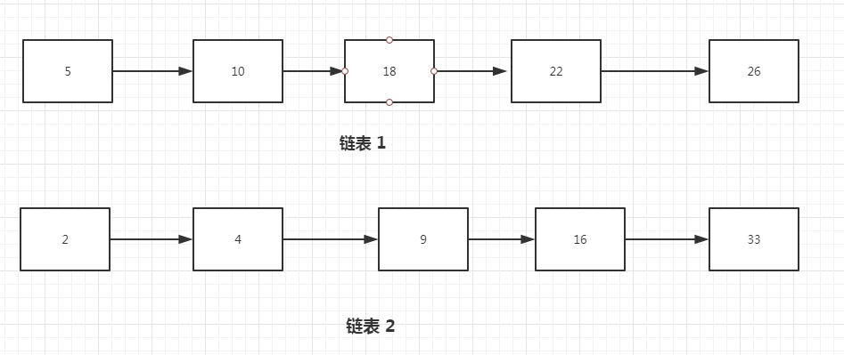

如下图，合并成一个单调不减链表

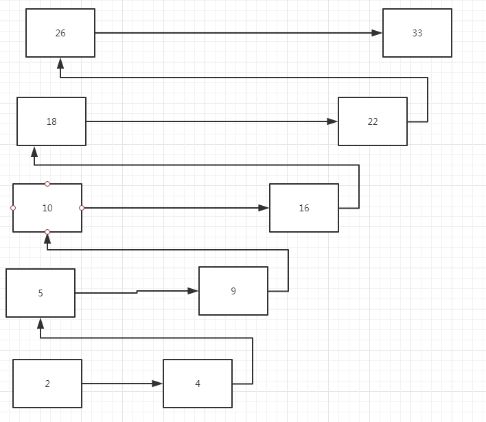

___

```python
#第一种方法：

"""

比较两个链表的首结点，哪个小的的结点则合并到第三个链表尾结点，并向前移动一个结点。
步骤一结果会有一个链表先遍历结束，或者没有
第三个链表尾结点指向剩余未遍历结束的链表
返回第三个链表首结点

"""
# -*- coding:utf-8 -*-
# class ListNode:
#     def __init__(self, x):
#         self.val = x
#         self.next = None

class Solution:
    # 返回合并后列表
    def Merge(self, pHead1, pHead2):
        # write code here
        head = ListNode(0)
        tmp = head
        while pHead1 is not None and pHead2 is not None:
            if pHead1.val <= pHead2.val:
                tmp.next = pHead1
                pHead1 = pHead1.next
            else:
                tmp.next = pHead2
                pHead2 = pHead2.next
            tmp = tmp.next
        if pHead1 is None:
            tmp.next = pHead2
        elif pHead2 is None:
            tmp.next = pHead1
        return head.next
        
#第二种方法：
class Solution:
    # 返回合并后列表
    def Merge(self, pHead1, pHead2):
        # write code here
        #首先判断两个链表是不是为空。
        if pHead1 == None:
            return pHead2
        if pHead2 == None:
            return pHead1
		#比较两个链表当前指针的元素值的大小。小的那一方为新的一个表头。
        newHead = pHead1 if pHead1.val < pHead2.val else pHead2
		
        pTmp1 = pHead1
        pTmp2 = pHead2
        #判断 如果新表头 是 表1 的头的话 那么 新表头
        if newHead == pTmp1:
            pTmp1 = pTmp1.next
        else:
            pTmp2 = pTmp2.next
        #
        previousPointer = newHead
		
        while pTmp1 and pTmp2:
            if pTmp1.val < pTmp2.val:
                previousPointer.next = pTmp1
                previousPointer = pTmp1
                pTmp1 = pTmp1.next
            else:
                previousPointer.next = pTmp2
                previousPointer = pTmp2
                pTmp2 = pTmp2.next

        if pTmp1 == None:
        
            previousPointer.next = pTmp2
        else:
            previousPointer.next = pTmp1
            
        return newHead
```

___


## 17.圆圈中最后剩下的数 [^本题考点 *模拟*]

**每年六一儿童节,牛客都会准备一些小礼物去看望孤儿院的小朋友,今年亦是如此。HF作为牛客的资深元老,自然也准备了一些小游戏。其中,有个游戏是这样的:首先,让小朋友们围成一个大圈。然后,他随机指定一个数m,让编号为0的小朋友开始报数。每次喊到m-1的那个小朋友要出列唱首歌,然后可以在礼品箱中任意的挑选礼物,并且不再回到圈中,从他的下一个小朋友开始,继续0...m-1报数....这样下去....直到剩下最后一个小朋友,可以不用表演,并且拿到牛客名贵的“名侦探柯南”典藏版(名额有限哦!!^_^)。请你试着想下,哪个小朋友会得到这份礼品呢？(注：小朋友的编号是从0到n-1)**


___

思路分析：

这个题一开始小朋友们每个人自己的编号是确定的，就相当于我们列表里面的索引是确定的一样，然后让编号为0。

链表1：也就是 列表里面的第一个数开始报数，上图第一个链表蓝色的0,开始报数。报到 m-1 的数的 i小朋友 出列，圈里就少了一个数。定义为 f(n).

链表2：这个时候 从 m-1 的下一个 m 开始 下一轮的循环，开始报数，也就是上图第二个链表的蓝色框。再次报到 m-1 的时候，这个ii小朋友会站出来。（但是这个时候 我们链表的 循环顺序  (m-(m-2)) 发生了变化，不再是从第一个数 【链表的表头  开始循环，而是m 这个数作为起始位置的】，与之前第一个 链表循环的时候的 顺序(0-n)不同了【起始位置为链表的表头】。此时表里少了一个小朋友。这个是题意，让我们这样来找的小朋友。所以定义为 f `(n-1).

这样的话，就出现了 上图中的 链表2 ，链表3. 这样的不同的情况，这两个 找出来的第  m-1 个 小朋友 是同一个小朋友，但是 两个顺序却不相同。

链表3：这个图 是 以 m  为起始位置 来寻找第 m-1 个值的，它 就是 f(n-1)

  如果说我们想由  链表3   得到 链表2 的话，那么 我们就需要把作为起始位置的m（下标为0） 移动到 下标为（m） 的位置，那么就是下标值 +  m 。如图，我们需要移动的是 每个数值所对应的 下标 index值。让 m 在一个链表中作为起始位置来开始 报数 找 第 m - 1 个iii小朋友。

但是又由于 我们这样直接加上一个m 以后，这个 index 值有可能会大于 这个链表的长度，如果大于这个链表的长度的话，那么就是说移动到了这个链表的前一部分，所以要对我们的 这个数 对 链表的长的的一个取余：

(iii+m)%n    我们一共是 n 个值，从0-(n-1);

f(n-1) = iii

所以 f(n) = f `(n-1) = (iii+m)%n

所以 f(n) = (f(n-1)+m)

那么这个通项表达式我们就找到了，再去编写代码。

```python
# -*- coding:utf-8 -*-
class Solution:
    def LastRemaining_Solution(self, n, m):
        # write code here
        #通过推导公式可得 f(n) = (f(n-1)+m)%n
        #首先判断，当我们这个链表里没有小朋友的时候，或者找到的小朋友报的数小于1 的时候，这个时候返回一个-1，题中表示 如果测试的是0个小朋友，数0个站出来，那么返回的值应为-1.
        if n < 1 or m < 1:
            return -1
        #只有一个人的时候，说明要找的就是这一个人。那么就返回下标0 编号。
        if n==1:
            return 0
        value = 0
        #时间复杂度 o(n)
        #从 2 开始 一直到 n 个小朋友 来循环，n 个数，所以为 n+1 
        for index in range(2,n+1):
            #现在数到的 m-1 这个值 的索引。对应上上面的公式。
            currentValue = (value+m) % index
            #把找到的这个下标值 赋值给 value
            value = currentValue
        #返回编号
        return value
```

___

## 18.链表中环的入口点 [^本题知识点  链表]

**给一个链表，若其中包含环，请找出该链表的环的入口结点，否则，输出null。**

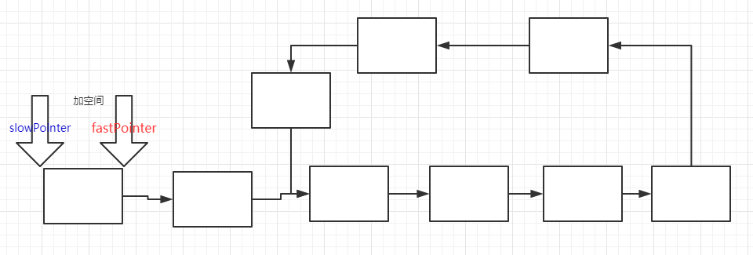

```python
# -*- coding:utf-8 -*-
# class ListNode:
#     def __init__(self, x):
#         self.val = x
#         self.next = None
class Solution:
    def EntryNodeOfLoop(self, pHead):
        # write code here
        #首先需要定义两个指针，其中一个快，跳两步，一个慢跳一步。
        #循环跳
        #要么是快的指针 为 none（没有环），要么是快慢指针相等（有环）。
        if pHead == None:
            return None 
		#定义两个指针，一个快的一个慢的。
        fastPointer = pHead
        slowPointer = pHead
		#当快指针存在时，而且快指针的结点指向的下一个也存在
        while fastPointer and fastPointer.next :
            #那么让快指针走两步
            fastPointer = fastPointer.next.next
            #让慢指针走一步
            slowPointer = slowPointer.next
            #如果慢指针等于快指针时，那么就说明这个链表中有环。有环的话那么就跳出，break
            if fastPointer == slowPointer:
                break
        #如果说两个指针没有相等的时候，快指针就已经走到链表的尽头了，说明这个链表没有环。那么就返回None。
        if fastPointer == None or fastPointer.next == None:
            return None
        #如果slow 走了 l 的长度 那么 fast 就走了 2l 的长度
        #假设 从开始到入口点的长度是 s；slow 在环里面走的长度是 d

        # 那么  L = s + d
        #假设 环内 slow 没走的 长度 是 m; fast 走的长度是多少
        # fast 走的长度 就是 ( m + d ) * n + d + s = 2 L
        #带入 ( m + d ) * n + d + s = 2 （s + d ）
        # s = m + (n-1)(m+d)
		#有环的话，那么就让快指针从头开始走，这次一次走一步，
        fastPointer = pHead
		#此时慢指针还在环里走着，没有走到结点
        while fastPointer != slowPointer:
            fastPointer = fastPointer.next
            slowPointer = slowPointer.next
        #当两个指针相等时，就会相遇，这时返回一个指针的值，就为 入口结点处。
        return fastPointer
```


定义：

假设 slow 走了 L 步，那么 fast 就走了 2L 步。

 我们 链表的头部 到 链表的环的入口结点处 的距离是 S

那么 从入口结点 到 我们 快慢指针相遇的地点 的距离 为 d。 

链表的环中，慢指针走过的距离是d，那么没走过的距离是M。

我们不确定的是快指针在链表的环里走过了多少圈来与慢指针相遇，因此 将这个参数设置为n。

那么 L = s + d

2L = 2(s+d) = n*(m + d) + d + s

由上面公式 推导出 n(m+d) = s + d

得到：s = n(m+d) -d；

s = nm + (n-1)(d)
s = m + (n-1)(m+d)

___

## 19.二进制中的1的个数

**输入一个整数，输出该数二进制表示中1的个数。其中负数用补码表示**

#### `知识点:`

#### 补码

特性：

1、一个负整数（或原码）与其补数（或补码）相加，和为模。

2、对一个整数的补码再求补码，等于该整数自身。

3、补码的正零与负零表示方法相同

#### 按位取反 ~

~，用法只有一个那就是按位取反，需要注意的是：

- ~的按位取反，包括符号位
- 正数各位取反变为负数，显示时转化为其补码
- 负数本身需要先转换为补码（符号位不变，各位取反再加 1），再对其补码进行各位去反

##### 1. ~5

5 的二进制为 0101，

~5

- （1）各位取反，1010
- （2）变为负数，转化为其补码形式（符号位保持不变），各位取反 1（1101），再加1（1110），也即 -6

```python
>> ~5
>> -6
```

##### 2. ~(-5)

-5 因为是负数，存储时存储的是其补码：

- -5 的补码是：1011，
- ~(-5)将其各位取反（包括符号位），也即 0100（4）

```python
>> ~(-5)
>> 4
```

___


```python
# -*- coding:utf-8 -*-
#第一种：
class Solution:
    def NumberOf1(self, n):
        # write code here
        #补码：正数不变，负数是它的正数的反码 + 1
        # -2 补码： -2 的 1 0000.。。000010，
        #                 1 1111.。。111101 + 1
        #-2 的补码就是    1 1111.。。111110
        #把输入的正数n转化为二进制的数，并把0b 替换掉，计算1的数量，如果输入的值不是正数的话
        #一个负整数（或原码）与其补数（或补码）相加，和为模。2 的32 次方 是模。
        #那么就是 2 的32 次方 然后 + n  这是在取一个负数的补码  就相当于  n & 0xffffffff
        #然后计算 这个数里面 1 的 数量
        return bin(n).replace("0b", "").count("1") if n >= 0 else bin(2 ** 32 + n).replace("0b", "").count("1")

    
#第二种：
# -*- coding:utf-8 -*-
class Solution2:
    def NumberOf1(self, n):
        # write code here
        # 1 出现的次数为0 次
        count = 0
        #判断 这个数 n 是不是负数，如果是负数的话 求其补码：
        if n < 0:
            n = n & 0xffffffff
        #如果这个数不是0 的话，那么它在二进制的表示中至少有一位是1，所以一开始我们赋值 count +=1.
        while n:
            count += 1
            #把一个整数先减去1，再和原整数做与运算，会把该整数最右边的1 变从成0，那么一个二进制中有多少个1，就可以进行多少次这样的操作。
            n = (n - 1) & n
        return count
    """
    例如：一个二进制1100， 它的第二位 是从最右边数起的一个1，减去一个1后，第二位变成0，它后面的两位0变成1，而前面的1保持不变，因此结果是1011.
    那把 这个整数 和它 减去1 的结果  做一个按位 与运算，相当于 把 最右边的 1 变成 0,。
    1011 和 1100 做 按位与 运算  1100 & 1011  结果为  1000，那么刚好是我们 要得到 将最右边的1 变成0 的结果   1000.
    
    """
```

___

## 20.不用加减乘除做加法[^本题考点 *按位运算*]

**写一个函数，求两个整数之和，要求在函数体内不得使用+、-、*、/四则运算符号。**

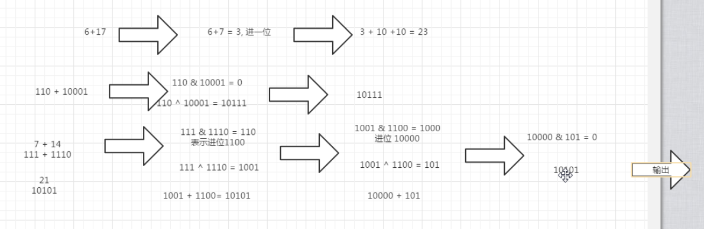


分析：

对于数字运算，如果说四则运算不能用的话，那么我们只能用位运算来做了。

我们以 5 + 17 为例 结果为 22，那么 22 的计算结果，我们可以分为三步 来进行：

​	第一步： 只做各位相加不进位  也就是说 没一位上的数字 相应的来相加 但是不进位，那么  5 + 7 为 12 

​	个位数 5 和 7 相加 不进位 是2  十位是0 和1  相加 为 1 

​	第二步： 5 + 7 中有进位，进位值 是10 ;

​	第三步： 把前面两个结果 加起来： 12 + 10 = 22

以上为我们用十进制计算的 策略，那么 我们用于位运算中是不是也合适，我们来举个栗子：

还是以 5 + 17 为例，那么 5 的二进制是101 ； 17 的二进制是 10001；

第一步：各位相加 但不进位： 101 + 10001 = 10110  不进位的话  结果为 10100 （最后一位两个数都是1，相加的结果需要进位，但是这一位不进位，意味着结果仍然是0）

第二步： 记下进位，它只在最后一位相加时产生了一个进位。

第三步： 把前面两个结果相加，得到的结果是 10110.

**那么现在我们把前面的 二进制的加法用位运算来替代的话**

第一步的 求 和 运算就是 不考虑 进位的话，对每一位来相加，0 和0 1 和1 的结果都是0,0+1，或者1+0 的结果 都是1；那么我们会看出它与我们学过的异或运算相同，就是相同为假，不同为真，所以叫 异  或  XOR 。

第二步： 对0 加 0、1加0、0加1 而言，都不会产生进位，只有1+1 的时候，会产生一个进位。此时 我们可以想象成两个数 先做了一个 位 与 & 运算，然后再向 左移 一位。只有两个数是1 的时候，位与 & 得到的结果是 1，其余的都是0。

第三步：把前面两个步骤的结果再相加，然后在继续判断是否有进位，直到没有进位为止，那么此时的相加的过程，依然是重复前面的两步，直到不产生进位为止。


```python
# -*- coding:utf-8 -*-
class Solution:
    def Add(self, num1, num2):
        #第一种代码：循环。简洁但是原理相同，那么我们以下面第二段代码为例；来解析。
        # while (num2):
        #     num1, num2 = (num1 ^ num2) & 0xFFFFFFFF, ((num1 & num2) << 1) & 0xFFFFFFFF
        # return num1 if num1 <= 0x7FFFFFFF else ~(num1 ^ 0xFFFFFFFF)
		
        #第二种代码：
        #首先两个数做 一个 异或 运算^ 那就是 在不进位的情况下，让两个相加 求和。
        xorNum = num1 ^ num2
        #让两个数 做 位与 操作，然后再向 左 移 一位，得到它 向前进位的值。
        andNum = (num1 & num2) << 1
		#判断，当 进位 的值不等于0 的时候，说明 一直有进位，也就是 过程没有结束。
        while andNum != 0:
            #那么我们就继续上面的操作。但是这次的 数值 改为上次的两个结果，
            #一个 是异或的结果，一个是 与 操作 & 以后 左移一位的 结果。
            tmp1 = xorNum ^ andNum
            tmp2 = (xorNum & andNum) << 1
			#因为如果这个数为负数的话，那么负数 左移 一位与正数 不同，负数 是数值变小，正数 数值变大
            #如果是正数的话那么这一步就 不变，如果是负数的话，这一步就对负数来起作用。
            #对于python来说  负数的 二进制 可能会有无数个1，我们用这个方法让它变成一个可数的数字长度。
            tmp1 = tmp1 & 0xffffffff

            xorNum = tmp1
            andNum = tmp2
         #一个负整数（或原码）与其补数（或补码）相加，和为模。 0xffffffff 
		# ~(xorNum ^ 0xFFFFFFFF)  这个是 异或数  与  模 来 异或，最后 按位 取反 来求得 负数的补码。
        return xorNum if xorNum <= 0x7ffffff else ~(xorNum ^ 0xFFFFFFFF)
```

## 21.数组中出现次数超过一半的数字[^本题考点 数组]

**数组中有一个数字出现的次数超过数组长度的一半，请找出这个数字。例如输入一个长度为9的数组{1,2,3,2,2,2,5,4,2}。由于数字2在数组中出现了5次，超过数组长度的一半，因此输出2。如果不存在则输出0。**

  思路：抵消掉  遇到不相同的数字就相互抵消掉，最终剩下的数字就可能是出现次数大于数组长度一半的数字。
        首先我们来遍历数字，遍历的时候需要记录上次出现的数字是什么，进而判断 下次出现的数字是否与现在这个数字相等，如果不相等的话，那么就把两个数字抵消掉，到最后没有抵消掉的数字，就可能是出现的次数大于数组长度的一半。


我们可以考虑在遍历数组的时候保存两个值：一个是数组中的一个数字，另一个是次数；当我们遍历到下一个数字的时候，如果下一个数字和我们之前保存的数字相同，则次数加1，如果下一个数字和我们之前保存的数字不同，则凑数减1.如果次数为0 ，我们需要保存下一次出现的次数，然后把次数设置为1.


```python
# -*- coding:utf-8 -*-
class Solution:
    def MoreThanHalfNum_Solution(self, numbers):
        # write code here
        #dict [key] = count
        #o(n) 空间复杂度为O(n)
     #第一种思路：建 一个字典，把数字作为键，数字出现的次数作为值，然后 遍历这个数组中的数，如果这个数作为键出现过，那么就让他的值加1，如果没有就把它添加到字典中。
        numsCount = {}
        numLen = len(numbers)
        for num in numbers:
            if num in numsCount:
                numsCount[num] += 1
            else:
                numsCount[num] = 1
             #如果说字典中某个键 大于 我们这个数组长度的一半，那么就返回这个键， 数组长度的一半 可以用 >> 1右移以为来实现，右移以为相当于 是除以2.
            if numsCount[num] > (numLen >> 1):
                return num
        return 0
        
        #想要空间复杂度为O（1），时间复杂度为o(n)
#第二种：
        #定义变量 上次出现的数字为0
        last = 0
        #上次出现的数字的数量为0 
        lastCount = 0
		#遍历数组中的数字
        for num in numbers:
            #如果说这个数字出现的次数为0了。
            if lastCount == 0:
                #那么就把上次出现的数字，变为需要保存的那个数字。
                last = num
                #并把次数设置为1 次，出现了这一次。
                lastCount = 1
            else:
                #否则就判断，这个数字是不是与上次出现的次数相同，如果相同的话，那么我们这个数字出现的次数就加1.
                if num == last:
                    lastCount += 1
                #如果不同的话，那么我们就让这两个数字抵消掉，那么这个数字出现的次数需要减 1；
                else:
                    lastCount -= 1
		#如果最后遍历完事之后 这个记录数字出现次数的 值为0 的话，那么就说明我们的这个数组里面的数刚好可以两两抵消掉
        if lastCount == 0:
            return 0
        #否则的话，就说明 数组里面 留下了没有抵消掉的数
        else:
            #这种情况是last可能是大于一半的数字
            #这个时候把 记录数字次数的变量 计数 为0 
            lastCount = 0
            #遍历数组中的数
            for num in numbers:
                #如果这个数与我们记录的数相等的话
                if num == last:
                    #让这个计数加1
                    lastCount += 1
			#最后判断一下，这个数的计数次数，是不是大于 我们数组长度的一半，如果是的话，就返回这个数，如果不是就返回0.
            if lastCount > (len(numbers)>> 1):
                return last
        return 0
```

___

## 22.数组中只出现一次的数字[^数组]

**一个整型数组里除了两个数字之外，其他的数字都出现了偶数次。请写程序找出这两个只出现一次的数字。**

思路：其他数字出现的次数都是偶数次，那么我们就可以用到异或的一个性质，那就是 任何一个数字异或它自己都等于0.，也就是说如果我们 从头到尾 异或 数组中的每个数字，那么最终的结果刚好是那个 只出现一次的数字，因为那些成对出现的数字都已经全部抵消掉了。

```python
# -*- coding:utf-8 -*-
class Solution:
    # 返回[a,b] 其中ab是出现一次的两个数字
    def FindNumsAppearOnce(self, array):
        # write code here
        #如果两个数相同那么两个数的异或操作为0
        #数组的长度如果小于2，那么就就不会有数字出现了偶数次。
        if len(array) < 2:
            return None

		#变量赋值 两个数的异或为none
        twoNumXor = None
        #遍历 数组中的数字
        for num in array:
            #判断 如果 两个数的数字异或的结果为0 的话，
            if twoNumXor == None:
                #那么 此时就让 两个数异或中的一个数 为此时遍历出来的那个数。
                twoNumXor = num
            #如果数 这个数不为 空 的话
            else:
                #那么就让这个 两个数异或的结果的值 （或者当 异或的值为空的时候，我们赋给的值 与 此时遍历数组中的数得到的 num 来异或。
                twoNumXor = twoNumXor ^ num
        #变量  计数 为 0 
        count = 0
        #当异或的 结果 为偶数时
        while twoNumXor % 2 == 0 :
            #那么我们就给它 除以2 ，每除一次2 就记录一次，直到 结果不为 奇数 为止。
            twoNumXor  = twoNumXor >> 1  # 右移以为 相当于 除以2
            count += 1
        #以上是用来计数  判断 这个 二进制数中 第一个1 是在哪一位上。
        
        #我们在这个结果中 找到 第一个为1 的位的位置，记为 第 n 位，那么 现在我们以第n 位 是不是 1
        
        mask = 1 << count   #向左 移 位 count 位。

        #为标准 把原 数组中的数字分成两个子数组，第一个数组中每个数字的第n 位 都是1，而 第 二个子 数组中的 每个数字的第 n 位 都是 0.由于我们的分配的标准是 数字中的某一位是0 还是1 ，那么数字相同的数肯定被分到了 同一组，那么每个 子数组中 都会包含一个 只 出现一次的数字，而 其他数字都出现了两次，这个时候，分别把 子数组中的 所有的数 异或，那么 最后的结果 就是 那个 出现一次的数。
        
        firstNum = None
        secondNum = None

        for num in array:
            if mask & num == 0:
                if firstNum == None:
                    firstNum = num
                else:
                    firstNum = firstNum ^ num
            else:
                if secondNum == None:
                    secondNum = num
                else:
                    secondNum = secondNum ^ num

        return firstNum,secondNum
```

___

## 23.整数中1出现的次数[^本题考点 数组]

**求出1~13的整数中1出现的次数,并算出100~1300的整数中1出现的次数？为此他特别数了一下1~13中包含1的数字有1、10、11、12、13因此共出现6次,但是对于后面问题他就没辙了。ACMer希望你们帮帮他,并把问题更加普遍化,可以很快的求出任意非负整数区间中1出现的次数（从1 到 n 中1出现的次数）。**

 

___

如上图所示，如果那个数 是我们 的 1-n 中 n 这个数，那么这个数就是一个特别大的数，不能遍历 计算每个数字的1 的个数， 那就只能去寻找1在数字中出现的规律来。

那么我们可以把 这个数字中 ，分段来 看 1 在这个数字片段中可能出现的情况都有多少。

**若 以上 栗子 中的 十万位上的 0  那一位  为 数字1 的话，有多少种 可能？ **

​	首先  直接 为1 的话，这个数就会大于 我们的n 这个数，所以 它需要 向前一位借 一位，来计算 可能出现的 情况 有多少种，那么就是 一共 有

`0-3458` 个数 那么就一共是 3459 中可能性。

​	**那么十万位 后面 出现1 的情况有多少种 可能性 ？**

​	0 后面一共有5 位，每 一 位 的数字 可能的情况 是 0-9 共 十 个数字，也就是说  后面 为的可能性是 `10^5`. 

那么就是说对于 十万位数字是0 来说，一共有3459*（10^5 )种 可能。

​	**接下来我们在考虑一个 数字 那就是 万 位 上的数字，8，如果8 这一位为1 的话，有多少种可能性？**

如果8 为1 的话，那么就是我们前面的数字 有 1-34590，共`34591`种情况，后面 是一共 4 位，那么就有		`10^4 `种情况。

那么就是说对于 万位数字是0 来说，一共有34591*(10^4) 种 可能。

​	**我们再考虑另一个特殊的，那就是我们的百位上的 1 那一位，除了现在的n 的百位上是1，那么其他 这个一位为1 的情况，一共有多少种可能？**

如果说1 这个数字不变的话，那么1前面 的位数 可能为1 的可能性就是 0-3459082，后面的两位的 可能性为 0-90，不能大于90，如果大于的话，需要 跟 百位来借 一位了，我们先考虑这种不借位的可能性，那就是

3459083*91，如果借位的话，那么前面就是 0-3459081，后面就10^2-91 为9 种 情况，那么最后 一共有

3459083 x 91+3459082 x 9，最后推导为 3459082 x 91 + 91 + 3459082 x 9，最后为 3459082 *10^2 +91种 可能性。

分析了三种特殊的情况，那么我们可以用递归的方式来找，只不过因为递归的话 时间复杂度比较高，那么我们可以写一个 与递归等价的 while 循环来实现，递归和 while 循环是可以互相转换的。


```python
class Solution:
    def NumberOf1Between1AndN_Solution(self, n):
        # write code here
        #循环的出口是 highValue = 0
        #我们从最低位开始一个位一个位的来寻找 1 的可能出现的 情况次数。
        # 一开始 精准度为1.高位低位中位 先赋值为1.
        preceise = 1
        highValue = 1
        lowValue = 1
        midValue =1
        #计数 后面的位数。
        count = 0
        #计数 1 的次数和
        sumNum = 0
        #循环的 出口是我们找不到最高位了，那么这个时候就说明，我们遍历到了 这个数字的最高位。
        while highValue != 0:
            #高位 先将这个数 除以10 得到高位
            highValue = n // (preceise * 10)
            #中位 先将这个数  与 10 取余。
            midValue = (n // preceise)%10
            #低位 先将这个数 除以 1 那么低位就是个位后面的，没有就是0.
            lowValue = n % preceise
            #每遍历一次 向右移一位，那么就是说 精准度要乘以10.
            preceise *= 10
			#如果这个数是0 的话，
            
            if midValue == 0:
                #那么它就是高位的值，乘以 10^后面的位数 次方，但是这个时候 对于中位 来说 它是个位，后面没有位，所以是0，
                num = (highValue)* pow(10,count)
            #如果这个数 大于1 的话，
            elif midValue > 1:
                #那么它 就是 最高位加1 乘以 10^后面的位数 次方，
                num = (highValue+1)*pow(10,count)
            else:
                #否则的话 它就是等于1 的情况了，对于等于1 的1情况，又是比较特殊的情况，它需要 最高位 * 它10 的后面位数个数的次方，然后要加上我们低位 的数值再加 1， 原因在上面的分析中已经给出。
                num = highValue*pow(10,count)+(lowValue+1)
            #最后 我们1 出现的 次数 就是这 三个 num 的和，。
            sumNum += num
            #没循环一次，这个三个就往左移一次吗，那么这个时候它们 后面的位数也就会 多一位。
            count += 1
		#最后返回这个  次数和。
        return sumNum
```

___

## 24.丑数

**把只包含质因子2、3和5的数称作丑数（Ugly Number）。例如6、8都是丑数，但14不是，因为它包含质因子7。 习惯上我们把1当做是第一个丑数。求按从小到大的顺序的第N个丑数。**

思路分析 第一种方法：所谓的一个数n 的因子，是指 n 能被m 整除，也就是 n%m == 0； 根据丑数 的定义，丑数只能被 2,3,5 整除，也就是说，如果一个数能被2 整除，能被3 整除，能被5 整除，如果最后的到的数是1.那么这个数就是丑数，否则就不是。 先搞清楚丑数的定义是什么？

因此按照这个思路我们就可以 写出下面的 代码。但是 这个代码 是逐个判断的每个整数是不是丑数的解法，它直观，但是不够高效，最大的问题是 一个不是丑数的数，我必须要计算 而且判断它是不是丑数。

```python
class Solution:
    def GetUglyNumber_Solution(self, index):
        # write code here
        if index < 1:
            return None
        #死循环，找丑数
        #判断一个数是不是丑数，先循环除以2，直到不能整除，
        #循环除以3 直到不能整除，循环除以5 直到不能整除
        #这时如果剩余的值是1  我们就说它是丑数
        #其他情况就都不是丑数
        def isUglyNumber(num):
            while num % 2 == 0:
                num = num //2
            while num % 3 == 0:
                num = num //3
            while num % 5 == 0:
                num = num //5
            if num == 1:
                return True
            else:
                return False
        count = 0
        num = 1
        while True:
            if isUglyNumber(num):
                count += 1
            if count == index:
                return num
            num += 1
```

第二种方法分析:

我们可以保存已经找到的丑数，然后 用空间环时间 来 找出丑数。

如何用空间换时间？

我们找一种，只需要计算丑数的办法,根据上面丑数的定义，我们可以知道，丑数应该是另一个丑数 乘以 2,3，或者5 的结果（1除外）。因此我们 可以创建一个 列表，里面的数字是排好序的 丑数，每个丑数都是前面的丑数乘以2,3，或者5得到的。


那么我们就可以在一个列表中，给它第一个 丑数的值，然后根据 它 得到剩下的 丑数的值，第一个丑数为1，那么我们在这个列表的起始位置 设置三个指针，这三个指针代表的值  分别为2,3,5.又由于这个列表中的所有的丑数 是有序的，从小到大排列的，那么我们在每次 给一个丑数 乘以 2,3,5 以后要与前面的丑数比较大小，然后在根据大小值 来放入列表中。由于一开始第一个丑数是1，那么 1 * 2 得到的是2,1*3 得到的是3，1 乘以5 得到的是5，那么三个数中比较大小，最小的是 1 乘以2，那么 肯定第一个先放置的是2，然后是 2 乘以2 和 1乘3,1乘5 比较大小，最小的是3 那么就放置 3，下一个 是 2 乘以3 是6,6 与 5  和4 比较大小 最小的是4，以此类推，那么现在的到的丑数的顺序就是1,2,3,4.。。。。。


```python


class Solution(object):
    def nthUglyNumber(self, index):
        #首先判断  要找的 丑数 是不是第0个 或者是负数，如果是的话，那么就返回0
        if index <= 0:
            return 0
        #然后判断要找的丑数 是不是第一个，如果是第一个，那么就返回1.
        if index == 1:
            return 1
        #在丑数 这个列表中 给出第一个丑数是1
        numbers = [1]
        #在列表的 一开始  设置三个 指针，也就是 三个指针的 索引位置是0，
        two, three, five = 0, 0, 0
        #丑数的个数 起始为 1
        count = 1
        #循环 当丑数的个数不等于我们要找到 那第 index 个 丑数时，就循环，等于的时候就跳出循环。
        while count != index :
            #给列表中的 2,3,5 这三个指针所在位置的 丑数 分别 乘以2,3,5
            n2, n3, n5 = numbers[two] * 2, numbers[three] * 3, numbers[five] * 5
            #比较这三个丑数的大小
            minValue = min(n2, n3, n5)
            #在丑数列表中，把三个中最小的那个 放进去。
            numbers.append(minValue)
            #每放进去一个，丑数的数量就加1
            count += 1
            #这个是指针移位的，如果说我们比较出来的 三个数中最小的丑数是 2 指针的话，那么2 指针就往前移动一位
            if minValue == n2:
                two += 1
            #如果是 3 那个指针的话，那么3 这个指针就移一位。
            if minValue == n3:
                three += 1
            #如果是 5 那个指针的话，那么5这个指针就移一位。
            if minValue == n5:
                five += 1
        #最后输出这个丑数列表中的 最后一位，那么就是我们的计数的丑数的个数 -1，就是最后一个丑数的索引值。
        return numbers[count-1]
```

___

