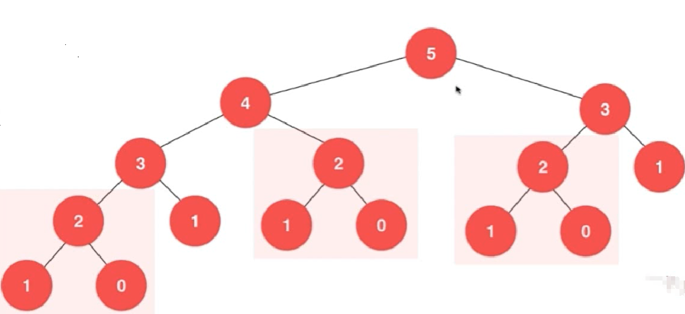

# 动态规划

## 斐波那契数列

我们还是以菲波那切数列为例，使用python编写一个最简单的菲波那切数列计算

```bash
# 大家都知道斐波那契数列，现在要求输入一个整数n，请你输出斐波那契数列的第n项（从0开始，第0项为0）  n<=39
class Solution:
    # 递归实现
    def Fibonacci(self, n):
        if n == 0:
            return 0;
        if n == 1:
            return 1;
        if n > 0:
            return self.Fibonacci(n - 1) + self.Fibonacci(n -2);
        else:
            return None
        return ret

if __name__ == '__main__':
    print(Solution().Fibonacc(10))
```

但是上述的代码其实存在着大量的计算过程，

