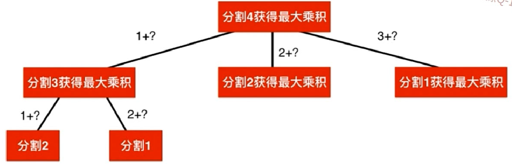
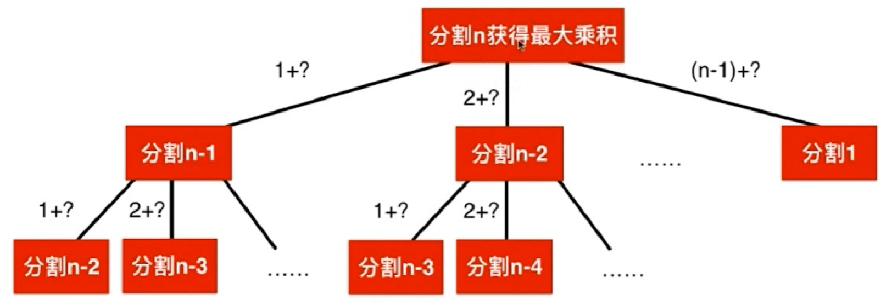
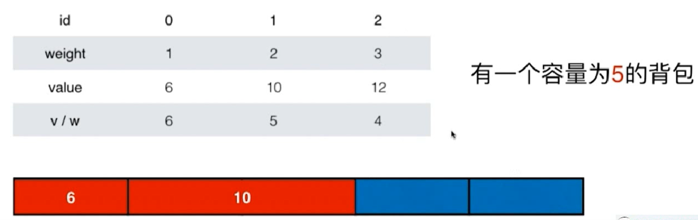
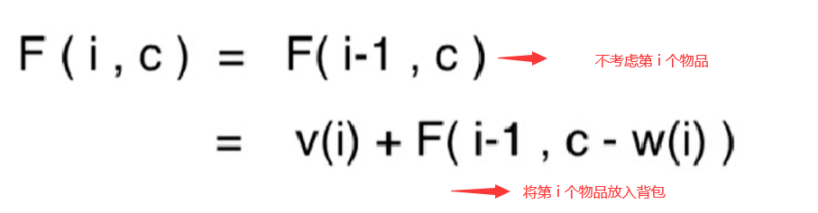
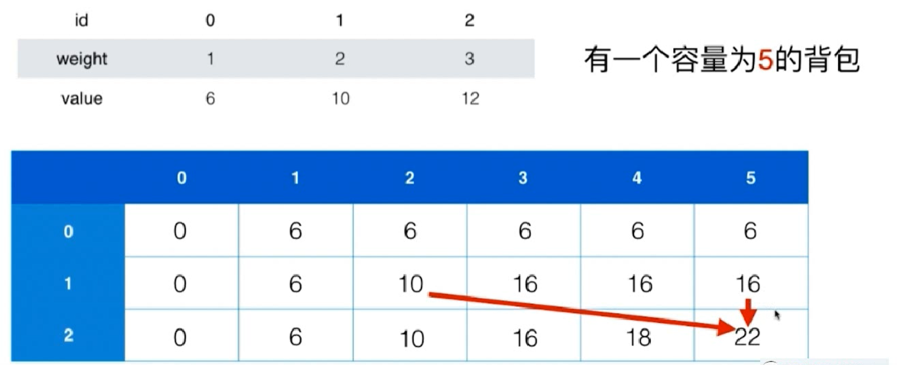
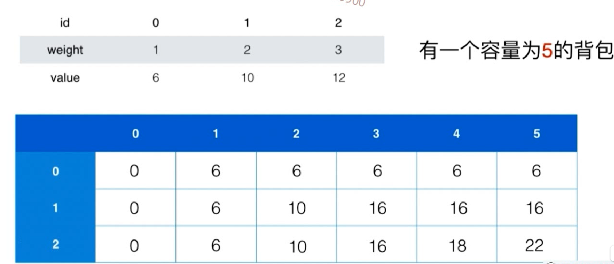
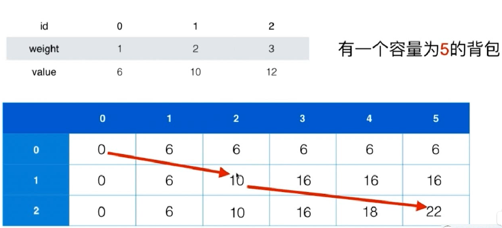
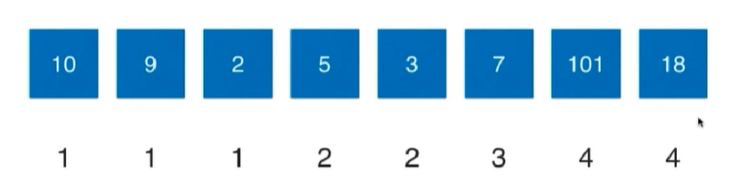
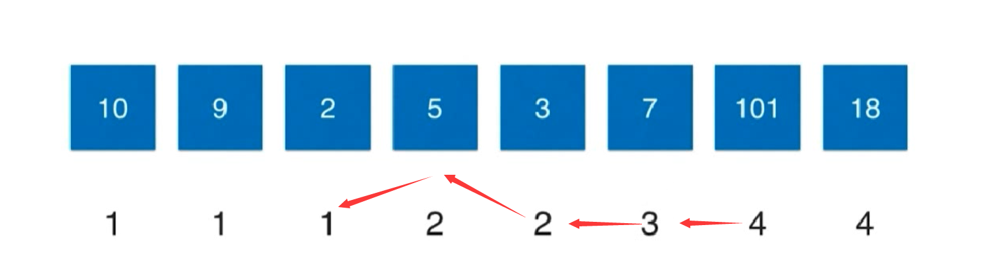
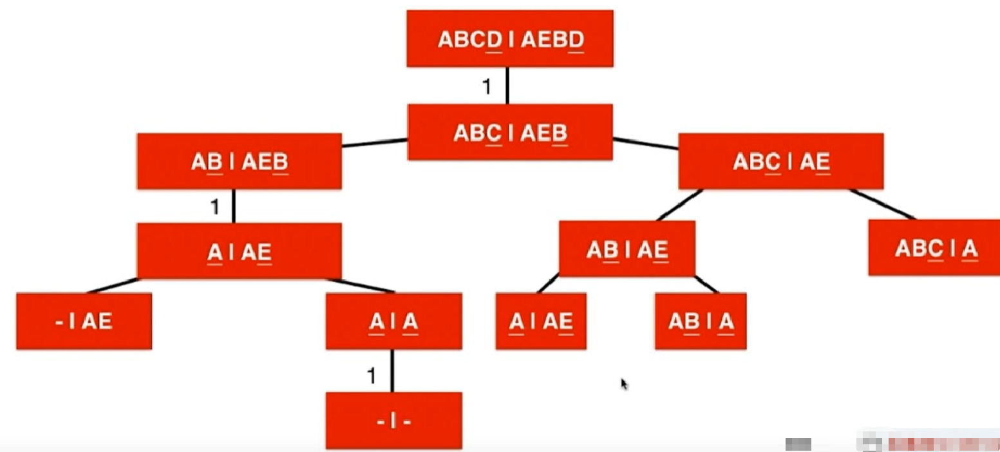

# 动态规划

## 视频教程

[动态规划](https://www.bilibili.com/video/BV1a4411y7uh)

## 斐波那契数列

我们还是以菲波那切数列为例，使用python编写一个最简单的菲波那切数列计算

```bash
# 大家都知道斐波那契数列，现在要求输入一个整数n，请你输出斐波那契数列的第n项（从0开始，第0项为0）  n<=39
class Solution:
    # 递归实现
    def Fibonacci(self, n):
        if n == 0:
            return 0;
        if n == 1:
            return 1;
        if n > 0:
            return self.Fibonacci(n - 1) + self.Fibonacci(n -2);
        else:
            return None
        return ret

if __name__ == '__main__':
    print(Solution().Fibonacc(10))
```

但是上述的代码其实存在着大量的计算过程，


也就是说我们同一个数，被多次进行计算了，如果我们能够保留中间解决的话，那么就可以省下很多计算时间

## 保留中间结果

下面这种方法，我们就可以保留中间的计算结果，采用的是一个字典map来进行存储

```bash
class Solution:
    map = {}
    # 保留中间结果
    def Fibonacci3(self, n):
        if n == 0:
            return 0
        if n == 1:
            return 1
        if self.map.get(n) == None:
            self.map[n] = self.Fibonacci3(n - 1) + self.Fibonacci3(n - 2)
        return self.map[n]

if __name__ == '__main__':
    print(Solution().Fibonacci3(10))
```

上面这个保留中间结果的操作，又被称之为 `记忆化搜索`

## 记忆化搜索

记忆化搜索其实就是 自上而下的解决问题，也就是说我们没有从最基本的来解决问题，而是假设最基本的已经解决了，就比如说，我们假设已经会求 第n个菲波那切数列了

```bash
self.map[n] = self.Fibonacci3(n - 1) + self.Fibonacci3(n - 2)
```

然后我们在这个基础在把 n-1 和 n-2的数加起来即可，这就是自上而下的解决问题。而还有另外一种解决问题的方法，就是自下而上，也就是我们要说的动态规划

## 动态规划

自上而下的解决问题，是我们首先就容易想到的一种方法，因为它更容易被我们所理解。而这里我们将的是一种自下而上的解决问题的思路，也就是我们先从小的问题开始解决，然后逐步解决大的问题，这个方法也叫动态规划 

```python
class Solution:

    # 动态规划
    map2 = {}
    def Fibonacci4(self, n):
        self.map2[0] = 0
        self.map2[1] = 1
        for i in range(2, n+1):
            self.map2[i] = self.map2.get(i-1) + self.map2.get(i - 2)
        return self.map2.get(n)

if __name__ == '__main__':
    print(Solution().Fibonacci4(10))

```

将原问题拆解成若干子问题，同时保存子问题的答案，使得每个子问题只求解一次，最终获得原问题的答案


先通过自顶向下的方法来思考问题，然后用动态规划来解决问题

## 爬楼梯

###  来源

leetcode70 [爬楼梯](https://leetcode-cn.com/problems/climbing-stairs/)

### 描述

假设你正在爬楼梯。需要 *n* 阶你才能到达楼顶。

每次你可以爬 1 或 2 个台阶。你有多少种不同的方法可以爬到楼顶呢？

**注意：**给定 *n* 是一个正整数。

示例 1：

输入： 2
输出： 2
解释： 有两种方法可以爬到楼顶。

```bash
1.  1 阶 + 1 阶
2.  2 阶
```


示例 2：

输入： 3
输出： 3
解释： 有三种方法可以爬到楼顶。

```bash
1.  1 阶 + 1 阶 + 1 阶
2.  1 阶 + 2 阶
3.  2 阶 + 1 阶
```

### 思考

我们也可以将上述的问题，想象成刚刚的菲波那切数列，求n的时候，我们先求 n -1 和 n -2，然后在相加


### 代码

```bash
# 爬楼梯
class Solution:
    map = {}
    def ClimbingStairs(self, n):
        # 爬1阶楼梯，有1种方法
        self.map[1] = 1
        # 爬2阶楼梯，有2种方法
        self.map[2] = 2

        for i in range(3, n+1):
            self.map[i] = self.map[i-1] + self.map[i-2]
        return self.map.get(n)
if __name__ == '__main__':
    print(Solution().ClimbingStairs(10))
```

## 三角形最小路径和

### 来源

[leetcode 三角形最小路径和](https://leetcode-cn.com/problems/triangle/)

### 描述

给定一个三角形，找出自顶向下的最小路径和。每一步只能移动到下一行中相邻的结点上。

相邻的结点 在这里指的是 下标 与 上一层结点下标 相同或者等于 上一层结点下标 + 1 的两个结点。

例如，给定三角形：

```bash
[
     [2],
    [3,4],
   [6,5,7],
  [4,1,8,3]
]
```

自顶向下的最小路径和为 `11`（即，**2** + **3** + **5** + **1** = 11）。

### 思路

我们现在通过自顶向下来思考，从最后的结果往前推，因为我们要保证找到最小的数，所以我们只需要每次把中间结果都保留即可，最后求得的数就是我们最小的和

### 代码

```python
# 三角形最小路径和
class Solution(object):
    def minimumTotal(self, triangle):
        for i in range(len(triangle) - 1, 0, -1):
            for j in range(i):
                triangle[i-1][j] += min(triangle[i][j], triangle[i][j+1])
        return triangle[0][0]
```


## 最小路径和

### 来源

leet64 [最小路径和](https://leetcode-cn.com/problems/minimum-path-sum/)

### 描述

给定一个包含非负整数的 m x n 网格，请找出一条从左上角到右下角的路径，使得路径上的数字总和为最小。

说明：每次只能向下或者向右移动一步。

示例:

```bash
输入:
[
  [1,3,1],
  [1,5,1],
  [4,2,1]
]
输出: 7
解释: 因为路径 1→3→1→1→1 的总和最小。
```

## 整数拆分

### 来源

#### [343. 整数拆分](https://leetcode-cn.com/problems/integer-break/)

### 描述

给定一个正整数 *n*，将其拆分为**至少**两个正整数的和，并使这些整数的乘积最大化。 返回你可以获得的最大乘积。

```bash
示例 1:

输入: 2
输出: 1
解释: 2 = 1 + 1, 1 × 1 = 1。

示例 2:

输入: 10
输出: 36
解释: 10 = 3 + 3 + 4, 3 × 3 × 4 = 36。
说明: 你可以假设 n 不小于 2 且不大于 58。
```

### 思路

暴力解法：回溯遍历算法将一个数做分割的所有可能性O(2^n)

我们在用画图的方式，将一个大的问题，转换为一个一个小的问题，转换成一个递归树



从我们拆分出来的结果来看，我们存在大量计算重复子问题，所以可以采用动态规划的方式来做，我们将4延伸出来，到一个分割n的问题上



### 最优子结构

通过求子问题的最优解，可以获得原问题的最优解

### 方法1

方法1采用的是自顶向下的 记忆化搜索来解决

```python
class Solution(object):
    map = {}
    # 使用记忆化搜索解决
    def integerBreak(self, n):
        if n == 1:
            return 1
        res = -1
        if self.map.get(n) == None:

            for i in range(1, n+1):
                # 找到最大值【需要判断三个值，一个 n * n-i】
                a = i * self.integerBreak(n - i)
                b = i * (n - i)
                c = res
                res = max(a, b, c)
            self.map[n] = res
            return res
        else:
            return self.map[n]

if __name__ == '__main__':
    print(Solution().integerBreak2(10))
```

### 方法2

采用自底向上的方法，也就是动态规划来解决

```python
class Solution(object):
    map = {}
    # 使用动态规划解决
    def integerBreak2(self, n):
        self.map[1] = 1
        for i in range(2, n+1):
            for j in range(1, i):
                # 求解 j+(i-j)的形式
                a = j*(i-j)
                b = j * self.map.get(i-j)
                c = -1
                if self.map.get(i) != None:
                    c = self.map.get(i)
                self.map[i] = max(a, b, c)
        return self.map[n]

if __name__ == '__main__':
    print(Solution().integerBreak2(10))

```

## 完全平方数

### 来源

leetcode279 [完全平方数](https://leetcode-cn.com/problems/perfect-squares/)

### 描述

给定正整数 *n*，找到若干个完全平方数（比如 `1, 4, 9, 16, ...`）使得它们的和等于 *n*。你需要让组成和的完全平方数的个数最少。

```bash
示例 1:

输入: n = 12
输出: 3 
解释: 12 = 4 + 4 + 4.

示例 2:

输入: n = 13
输出: 2
解释: 13 = 4 + 9.
```


## 解码方法

### 来源

leetcode91. [解码方法](https://leetcode-cn.com/problems/decode-ways/)

### 描述

一条包含字母 A-Z 的消息通过以下方式进行了编码：

'A' -> 1
'B' -> 2
...
'Z' -> 26
给定一个只包含数字的非空字符串，请计算解码方法的总数。

题目数据保证答案肯定是一个 32 位的整数。

```bash
示例 1：

输入："12"
输出：2
解释：它可以解码为 "AB"（1 2）或者 "L"（12）。
示例 2：

输入："226"
输出：3
解释：它可以解码为 "BZ" (2 26), "VF" (22 6), 或者 "BBF" (2 2 6) 。
示例 3：

输入：s = "0"
输出：0
示例 4：

输入：s = "1"
输出：1
示例 5：

输入：s = "2"
输出：1
```


## 不同路径

### 来源

leetcode62 [不同路径](https://leetcode-cn.com/problems/unique-paths/)

leetcode63 [不同路径II](https://leetcode-cn.com/problems/unique-paths-ii/)

### 描述

一个机器人位于一个 m x n 网格的左上角 （起始点在下图中标记为“Start” ）。

机器人每次只能向下或者向右移动一步。机器人试图达到网格的右下角（在下图中标记为“Finish”）。

问总共有多少条不同的路径？


```bash
例如，上图是一个7 x 3 的网格。有多少可能的路径？

示例 1:

输入: m = 3, n = 2
输出: 3
解释:
从左上角开始，总共有 3 条路径可以到达右下角。
1. 向右 -> 向右 -> 向下
2. 向右 -> 向下 -> 向右
3. 向下 -> 向右 -> 向右
示例 2:

输入: m = 7, n = 3
输出: 28
 

提示：

1 <= m, n <= 100
题目数据保证答案小于等于 2 * 10 ^ 9
```


## 打家劫舍

### 来源

leetcode198 [打家劫舍](https://leetcode-cn.com/problems/house-robber/)

### 描述

你是一个专业的小偷，计划偷窃沿街的房屋。每间房内都藏有一定的现金，影响你偷窃的唯一制约因素就是相邻的房屋装有相互连通的防盗系统，如果两间相邻的房屋在同一晚上被小偷闯入，系统会自动报警。

给定一个代表每个房屋存放金额的非负整数数组，计算你 不触动警报装置的情况下 ，一夜之内能够偷窃到的最高金额。

```bash
示例 1：

输入：[1,2,3,1]
输出：4
解释：偷窃 1 号房屋 (金额 = 1) ，然后偷窃 3 号房屋 (金额 = 3)。
     偷窃到的最高金额 = 1 + 3 = 4 。

示例 2：

输入：[2,7,9,3,1]
输出：12
解释：偷窃 1 号房屋 (金额 = 2), 偷窃 3 号房屋 (金额 = 9)，接着偷窃 5 号房屋 (金额 = 1)。
     偷窃到的最高金额 = 2 + 9 + 1 = 12 。
```


提示：

0 <= nums.length <= 100
0 <= nums[i] <= 400

### 思考

检查所有房子的组合，对每一个组合，检查是否有相邻的房子，如果没有，记录其价值。找出最大值。O((2^n) * n)

我们还可以转换成递归问题，画出如下所示的图


注意其中对状态的定义：

- 考虑偷取【x ... n-1】范围里的房子（函数的定义）
- 根据对状态的定义，决定状态的转移【状态转移方程】

```bash
f(0)=max{v(0)+f(2),v(1)+f(3),v(2)+f(4),.…, v(n-3)+f(n-1),v(n-2),v(n-1)}
```

v(0)：表示从0号房子取出的价值 + f(2) 中的价值

### 记忆化搜索解决

```python
class Solution(object):
    # map.get(index): 表示考虑抢劫 nums[i ... n] 所能获得的最大收益
    map = {}
    # 考虑抢劫 nums[index... nums.size] 这个范围的所有房子
    def tryRob(self, nums, index):
        if index >= len(nums):
            return 0
        if self.map.get(index) != None:
            return self.map.get(index)
        res = 0
        for i in range(index, len(nums)):
            res = max(nums[i] + self.tryRob(nums, i+2), res)
        self.map[index] = res
        return res

    def rob(self, nums):
        return self.tryRob(nums, 0)

if __name__ == '__main__':
    print(Solution().rob([2,7,9,3,1]))
```

### 动态规划解决

```python
class Solution(object):
    # map.get(index): 表示考虑抢劫 nums[i ... n] 所能获得的最大收益
    map = {}

    def rob2(self, nums):
        n = len(nums)
        if n == 0:
            return 0

        self.map[n - 1] = nums[n -1]
        for i in range(n-2, 0, -1):
            # 求解map[i]
            for j in range(i, n):
                a = nums[j]
                if j + 2 < n:
                    a = nums[j] + self.map.get(j+2)
                b = 0
                if self.map.get(i) != None:
                    b = self.map.get(i)
                self.map[i] = max(a ,b)
        return self.map.get(0)

if __name__ == '__main__':
    print(Solution().rob2([2,7,9,3,1]))
```


## 打家劫舍II

### 来源

leetcode 213 [打家劫舍II](https://leetcode-cn.com/problems/house-robber-ii/)

## 打家劫舍III

### 来源

leetcode337  [打家劫舍III](https://leetcode-cn.com/problems/house-robber-iii/)

## 最佳买卖股票时机含冻结期

来源

leetcode 309. [最佳买卖股票时机含冷冻期](https://leetcode-cn.com/problems/best-time-to-buy-and-sell-stock-with-cooldown/)


## 0-1背包问题

### 描述

有一个背包，它的容量为C（Capacity），。现在有n种不同的物品，编号为0..n-1，其中每一件物品的重量为w（i），价值为v（i）。问可以向这个背包中盛放哪些物品，使得在不超过背包容量的基础上，物品的总价值最大。

### 解答

每一件物品都可以放进背包，也可以不放进背包。O((2^n)*n)

### 贪心算法

贪心算法？优先放入平均价值最高的物品？



贪心算法只能够求得次优解

### 思考

F(n, C)：考虑将n个物品放进容量为C的背包，使得物品的价值最大



上述公式就是我们的状态转移方程，对于一个物品，我们有两种可能的结果

- 不将该物品放入空间
- 将该物品放入空间，然后对应的背包体积需要减少

### 记忆化搜索

我们通过记忆化搜索，采用递归的方式，进行解答

```python

class Solution:
    # 用 [0 .... index] 的物品，来填充容积为 capacity的背包的最大价值
    map = {}
    def bestValue(self, weight, value, index, capacity):
        # 当物品无法放入的时候，或者没有价值
        if index < 0 or capacity <= 0:
            return 0

        # 记忆化搜索，从map中获取
        if self.map.get(str(index) + "_" + str(capacity)) != None:
            return self.map.get(index + "_" + capacity)

        # 当这个物品不放入的时候
        res = self.bestValue(weight, value, index-1, capacity)

        # 当这个物品放入的时候, 首先判断物品能否放入背包
        if capacity >= weight[index]:
            # 价值该物品存入背包的时候
            res2 = value[index] + self.bestValue(weight, value, index-1, capacity - weight[index])
            # 两种策略，找出价值最大的结果
            res = max(res, res2)

        self.map[str(index) + "_" + str(capacity)] = res
        return res
    
if __name__ == '__main__':
    weight = [1, 2, 3]
    value = [6, 10, 12]
    print(Solution().bestValue(weight, value, len(weight) - 1, 5))

```

### 动态规划

下面我们采用动态规划来对问题进行解答



代码如下

```python

class Solution:
    # 用 [0 .... index] 的物品，来填充容积为 capacity的背包的最大价值
    map = {}
    # 采用记忆化搜索
    def bestValue(self, weight, value, index, capacity):
        # 当物品无法放入的时候，或者没有价值
        if index < 0 or capacity <= 0:
            return 0

        # 记忆化搜索，从map中获取
        if self.map.get(str(index) + "_" + str(capacity)) != None:
            return self.map.get(index + "_" + capacity)

        # 当这个物品不放入的时候
        res = self.bestValue(weight, value, index-1, capacity)

        # 当这个物品放入的时候, 首先判断物品能否放入背包
        if capacity >= weight[index]:
            # 价值该物品存入背包的时候
            res2 = value[index] + self.bestValue(weight, value, index-1, capacity - weight[index])
            # 两种策略，找出价值最大的结果
            res = max(res, res2)

        self.map[str(index) + "_" + str(capacity)] = res
        return res

    # 采用动态规划
    def bestValue2(self, weight, value, index, capacity):
        n = len(weight)
        if n == 0:
            return 0
        for j in range(capacity):
            if j >= weight[0]:
                self.map["0_" + str(j)] = weight[0]
            else:
                self.map["0_" + str(j)] = 0

        for i in range(1, n):
            for j in range(capacity):
                # 两种策略， 假设不放入到背包中
                res = self.map.get(str(i-1) + "_" + str(j))

                # 假设物品能够放入到背包中
                if j >= weight[i]:
                    res2 = value[i] + self.map.get(str(i-1) + "_" + str(j-weight[i]))
                    res = max(res, res2)
                # 重新调整数组
                self.map[str(i) + "_" + str(j)] = res
        return self.map.get(str(n-1) + "_" + str(capacity))

if __name__ == '__main__':
    weight = [1, 2, 3]
    value = [6, 10, 12]
    print(Solution().bestValue2(weight, value, len(weight) - 1, 5))
```

### 优化

从上面的代码我们可以知道，0-1背包问题，它的时空复杂度如下

- 时间复杂度：O(n * C)
- 空间复杂度：O(n * C)

我们再次到 0-1背包问题之前提到的状态转移方程

> F(n, C) 考虑将n个物品放进容量为C的背包，使得价值最大
>
> F(i, c) = max(F(i-1, c) , v(i) + F(i-1, c- w(i)))

从上面的方程我们可以发现，第i行元素只依赖于第i-1行元素。理论上，只需要保持两行元素

空间复杂度：O(2 * C) = O(C)

```

class Solution:
    # 用 [0 .... index] 的物品，来填充容积为 capacity的背包的最大价值
    map = {}

    # 采用动态规划
    def bestValue2(self, weight, value, index, capacity):
        n = len(weight)
        if n == 0:
            return 0
        for j in range(capacity):
            if j >= weight[0]:
                self.map["0_" + str(j)] = weight[0]
            else:
                self.map["0_" + str(j)] = 0

        for i in range(1, n):
            for j in range(capacity):
                # 两种策略， 假设不放入到背包中
                res = self.map.get(str((i-1)%2) + "_" + str(j))

                # 假设物品能够放入到背包中
                if j >= weight[i]:
                    res2 = value[i] + self.map.get(str((i-1)%2) + "_" + str(j-weight[i]))
                    res = max(res, res2)
                # 重新调整数组
                self.map[str(i) + "_" + str(j)] = res
        return self.map.get(str((n-1)%2) + "_" + str(capacity))

if __name__ == '__main__':
    weight = [1, 2, 3]
    value = [6, 10, 12]
    print(Solution().bestValue2(weight, value, len(weight) - 1, 5))
```

有没有只使用一行大小的C来完成数组的动态规划呢？

### 背包问题具体解

同时我们还通过最后的状态数组，来反推我们具体的解



然后从右下角出发，不断寻找我们的结果



## 最长上升子序列

### 来源

leetcode 300 [最长上升子序列](https://leetcode-cn.com/problems/longest-increasing-subsequence/)

### 描述

给定一个整数序列，求其中最长上升子序列的长度

如 [10,9,2,5,3,7,101,18]，其最长上升子序列的长度为4.

最长上升子序列为 [2,5,7,101]

- 注意1：什么是子序列？
- 注意2：什么是上升？
- 注意3：一个序列可能有多个最长上升子序列；但这个最长的长度只有1个

### 思考

如果使用暴力解法：选择所有的子序列进行判断。O((2^n)*n)，也就是说对于一个数组，我们需要考虑每个元素是否放入到我们的序列中，只有两种情况，一个是放入，一个是不放入，最后n次代表判断是否是上升子序列

LIS(i)表示第i个数字为结尾的最长上升子序列的长度

LIS(i) 表示 [0 .... i ] 的范围内，选择数字 nums[i] 可以获得的最长上升子序列长度 

然后我们得到了状态转移方程

```bash
LIS(i) = max( 1 + LIS(j) if nums[i] > nums[j])
```

我们通过计算，求出LIS状态



### 代码

我们通过分析后，就可以从自底向上的动态规划方法，来求得我们的值

```python
# 最长上升子序列
class Solution(object):
    def lengthOfLIS(self, nums):
        if nums == []:
            return 0
        status = [1 for _ in range(len(nums))]
        for i in range(1, len(nums)):
            max = 1
            for j in range(i):
                if nums[j] < nums[i] and status[j] >= max:
                    max = status[j] + 1
            status[i] = max
        result = 1
        for i in status:
            if i > result:
                result = i
        return result

if __name__ == '__main__':
    print(Solution().lengthOfLIS([10,9,2,5,3,7,101,18]))
```

我们也可以通过状态数组，反推我们的结果，得到有哪些最长上升子序列满足条件



## 摆动序列

### 来源

leetcode.376 [摆动序列](https://leetcode-cn.com/problems/wiggle-subsequence/)

### 描述

如果连续数字之间的差严格地在正数和负数之间交替，则数字序列称为摆动序列。第一个差（如果存在的话）可能是正数或负数。少于两个元素的序列也是摆动序列。

例如， [1,7,4,9,2,5] 是一个摆动序列，因为差值 (6,-3,5,-7,3) 是正负交替出现的。相反, [1,4,7,2,5] 和 [1,7,4,5,5] 不是摆动序列，第一个序列是因为它的前两个差值都是正数，第二个序列是因为它的最后一个差值为零。

给定一个整数序列，返回作为摆动序列的最长子序列的长度。 通过从原始序列中删除一些（也可以不删除）元素来获得子序列，剩下的元素保持其原始顺序。

示例 1:

```bash
输入: [1,7,4,9,2,5]
输出: 6 
解释: 整个序列均为摆动序列。
```

示例 2:

```bash
输入: [1,17,5,10,13,15,10,5,16,8]
输出: 7
解释: 这个序列包含几个长度为 7 摆动序列，其中一个可为[1,17,10,13,10,16,8]。
```

**示例 3:**

```
输入: [1,2,3,4,5,6,7,8,9]
输出: 2
```

### 思考


## 最长公共子序列

### 来源

leetcode.1143 [最长公共子序列](https://leetcode-cn.com/problems/longest-common-subsequence/)

### 描述

给定两个字符串 text1 和 text2，返回这两个字符串的最长公共子序列的长度。

一个字符串的 子序列 是指这样一个新的字符串：它是由原字符串在不改变字符的相对顺序的情况下删除某些字符（也可以不删除任何字符）后组成的新字符串。
例如，"ace" 是 "abcde" 的子序列，但 "aec" 不是 "abcde" 的子序列。两个字符串的「公共子序列」是这两个字符串所共同拥有的子序列。

若这两个字符串没有公共子序列，则返回 0。

示例 1:

```bash
输入：text1 = "abcde", text2 = "ace" 
输出：3  
解释：最长公共子序列是 "ace"，它的长度为 3。
```

示例 2:

```bash
输入：text1 = "abc", text2 = "abc"
输出：3
解释：最长公共子序列是 "abc"，它的长度为 3。
```

示例 3:

```bash
输入：text1 = "abc", text2 = "def"
输出：0
解释：两个字符串没有公共子序列，返回 0。
```

### 思考

LCS(m, n)   S1[0 .... m] 和 S2[0 ... n ] 的最长公共子序列的长度

```bash
S1[m] == S2[n]:
	LCS(m, n) = 1 + LCS(m-1, n-1)
	
S1[m] != S2[n]:
	LCS(m, n) = max(LCS(m-1, n), LCS(m, n-1))
```



我们通过比较 ABCD 和 AEBD，画出我们的递归树，就能非常形象的了解我们算法的执行过程


同时，我们需要了解的是，dijkstra单源最短路径算法也是动态规划


## 分割等和子集

对于我们上面遇到的背包问题，其实很多时候不会直接从题目中就能知道答案，而是需要我们通过计算得到，例如下面这个算法，其实也是一个典型的背包问题

### 来源

leetcode.416 [分割等和子集](https://leetcode-cn.com/problems/partition-equal-subset-sum/)

### 描述

给定一个只包含正整数的非空数组。是否可以将这个数组分割成两个子集，使得两个子集的元素和相等。

注意:

每个数组中的元素不会超过 100
数组的大小不会超过 200

```bash
示例 1:

输入: [1, 5, 11, 5]

输出: true

解释: 数组可以分割成 [1, 5, 5] 和 [11].
```


示例 2:

```bash
输入: [1, 2, 3, 5]

输出: false

解释: 数组不能分割成两个元素和相等的子集.
```

### 思考

这个算法其实就是典型的背包问题，在n个物品中，选出一定物品，填满 sum /2 的背包，和背包问题的区别就是，这里不涉及到物品的价值，而是只需要将 背包完全填满即可。

我们需要考虑的问题就是：F(n, C) 考虑将n个物品填满容量为C的背包，从而得到如下所示的状态转移方程

```bash
F(i, c) = F(i-1, c) || F(i-1, c-w(i))
```

### 记忆化搜索

我们使用记忆化搜索的方式

```python
class Solution(object):
    map = {}
    # 使用 nums[0 ... index]，是否可以完全填充一个容量为sum的背包
    def tryPartition(self, nums, index, sum):
        if sum == 0:
            return True
        if sum < 0 or index < 0:
            return False
        if self.map.get(str(index) + "_" + str(sum)) != None:
            return self.map.get(str(index) + "_" + str(sum))

        result = self.tryPartition(nums, index - 1, sum) or self.tryPartition(nums, index - 1, sum - nums[index])
        self.map[str(index) + "_" + str(sum)] = result
        return result

    def canPartition(self, nums):
        sum = 0
        for i in nums:
            sum += i
        if sum % 2 != 0:
            return False
        return self.tryPartition(nums, len(nums) -1, sum/2)

if __name__ == '__main__':
    print(Solution().canPartition([2,2,3,5]))
```

## 零钱兑换

### 来源

leetcode.322 [零钱兑换](https://leetcode-cn.com/problems/coin-change/)

### 描述

给定不同面额的硬币 coins 和一个总金额 amount。编写一个函数来计算可以凑成总金额所需的最少的硬币个数。如果没有任何一种硬币组合能组成总金额，返回 -1。

你可以认为每种硬币的数量是无限的。

示例 1：

```bash
输入：coins = [1, 2, 5], amount = 11
输出：3 
解释：11 = 5 + 5 + 1
```

示例 2：

```bash
输入：coins = [2], amount = 3
输出：-1
```

示例 3：

```bash
输入：coins = [1], amount = 0
输出：0
```

示例 4：

```bash
输入：coins = [1], amount = 1
输出：1
```

示例 5：

```bash
输入：coins = [1], amount = 2
输出：2
```

### 代码


## 组合总和

### 来源

leetcode.377 [组合总和 Ⅳ](https://leetcode-cn.com/problems/combination-sum-iv/)

### 描述

给定一个由正整数组成且不存在重复数字的数组，找出和为给定目标正整数的组合的个数。

```bash
nums = [1, 2, 3]
target = 4

所有可能的组合为：
(1, 1, 1, 1)
(1, 1, 2)
(1, 2, 1)
(1, 3)
(2, 1, 1)
(2, 2)
(3, 1)

请注意，顺序不同的序列被视作不同的组合。

因此输出为 7。
```


## 一和零

### 来源

leetcode.474  [一和零](https://leetcode-cn.com/problems/ones-and-zeroes/)

### 描述

在计算机界中，我们总是追求用有限的资源获取最大的收益。

现在，假设你分别支配着 m 个 0 和 n 个 1。另外，还有一个仅包含 0 和 1 字符串的数组。

你的任务是使用给定的 m 个 0 和 n 个 1 ，找到能拼出存在于数组中的字符串的最大数量。每个 0 和 1 至多被使用一次。

示例 1:

```bash
输入: strs = ["10", "0001", "111001", "1", "0"], m = 5, n = 3
输出: 4
解释: 总共 4 个字符串可以通过 5 个 0 和 3 个 1 拼出，即 "10","0001","1","0" 。
```

示例 2:

```bash
输入: strs = ["10", "0", "1"], m = 1, n = 1
输出: 2
解释: 你可以拼出 "10"，但之后就没有剩余数字了。更好的选择是拼出 "0" 和 "1" 。
```


## 单词拆分

### 来源

leetcode.139  [单词拆分](https://leetcode-cn.com/problems/word-break/)

### 描述

给定一个非空字符串 s 和一个包含非空单词的列表 wordDict，判定 s 是否可以被空格拆分为一个或多个在字典中出现的单词。

说明：

拆分时可以重复使用字典中的单词。
你可以假设字典中没有重复的单词。
示例 1：

```bash
输入: s = "leetcode", wordDict = ["leet", "code"]
输出: true
解释: 返回 true 因为 "leetcode" 可以被拆分成 "leet code"。
```

示例 2：

```bash
输入: s = "applepenapple", wordDict = ["apple", "pen"]
输出: true
解释: 返回 true 因为 "applepenapple" 可以被拆分成 "apple pen apple"。
     注意你可以重复使用字典中的单词。
```

示例 3：

```bash
输入: s = "catsandog", wordDict = ["cats", "dog", "sand", "and", "cat"]
输出: false
```


## 目标和

### 来源

leetcode.494 [目标和](https://leetcode-cn.com/problems/target-sum/)

### 描述

给定一个非负整数数组，a1, a2, ..., an, 和一个目标数，S。现在你有两个符号 + 和 -。对于数组中的任意一个整数，你都可以从 + 或 -中选择一个符号添加在前面。

返回可以使最终数组和为目标数 S 的所有添加符号的方法数。

示例：

```bash
输入：nums: [1, 1, 1, 1, 1], S: 3
输出：5
解释：

-1+1+1+1+1 = 3
+1-1+1+1+1 = 3
+1+1-1+1+1 = 3
+1+1+1-1+1 = 3
+1+1+1+1-1 = 3

一共有5种方法让最终目标和为3。
```


