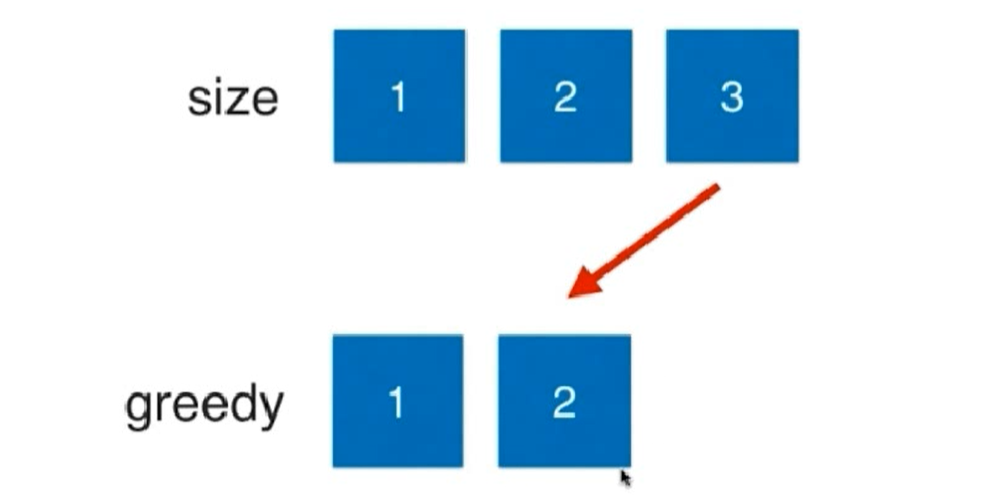
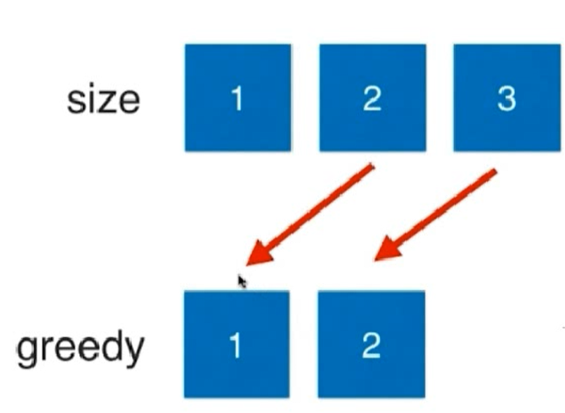

# 贪心算法

## 分发饼干

### 来源

leetcode.455 [分发饼干](https://leetcode-cn.com/problems/assign-cookies/)

### 描述

假设你是一位很棒的家长，想要给你的孩子们一些小饼干。但是，每个孩子最多只能给一块饼干。

对每个孩子 i，都有一个胃口值 g[i]，这是能让孩子们满足胃口的饼干的最小尺寸；并且每块饼干 j，都有一个尺寸 s[j] 。如果 s[j] >= g[i]，我们可以将这个饼干 j 分配给孩子 i ，这个孩子会得到满足。你的目标是尽可能满足越多数量的孩子，并输出这个最大数值。


示例 1:

```bash
输入: g = [1,2,3], s = [1,1]
输出: 1
解释: 
你有三个孩子和两块小饼干，3个孩子的胃口值分别是：1,2,3。
虽然你有两块小饼干，由于他们的尺寸都是1，你只能让胃口值是1的孩子满足。
所以你应该输出1。
```

示例 2:

```bash
输入: g = [1,2], s = [1,2,3]
输出: 2
解释: 
你有两个孩子和三块小饼干，2个孩子的胃口值分别是1,2。
你拥有的饼干数量和尺寸都足以让所有孩子满足。
所以你应该输出2.
```

### 思考

我们可以使用贪心算法，把最大的饼干给最贪心的小朋友，让他开心



然后剩下的最大的，在继续分配



因为贪心算法总是涉及到最大值和最小值，所以贪心算法和我们的排序是分不开的

### 代码

```bash
class Solution(object):
    def findContentChildren(self, g, s):
        """
        :type g: List[int]
        :type s: List[int]
        :rtype: int
        """
        g = sorted(g, reverse=True)
        s = sorted(s, reverse=True)

        # 饼干索引
        si = 0
        # 贪心索引
        gi = 0
        # 几个小朋友开心
        res = 0
        while gi < len(g) and si < len(s):
            if s[si] >= g[gi]:
                # 如果当前的饼干能够满足最贪心的小朋友，那么就进行分配
                res = res + 1
                si = si + 1
                gi = gi + 1
            else:
                gi = gi + 1
        return res

if __name__ == '__main__':
    print(Solution().findContentChildren([1,5,4,2], [2,1,7,6]))
```

这里的时间复杂度就是 O(n*logn)，最要体现在排序方面，也就是使用快排进行排序


## 判断子序列

