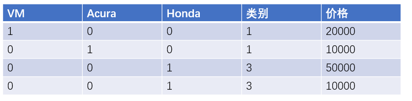
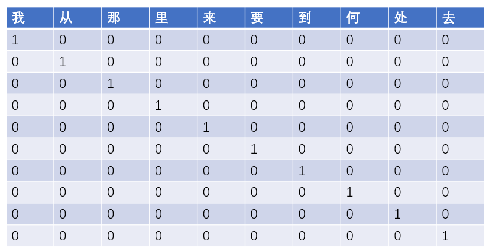
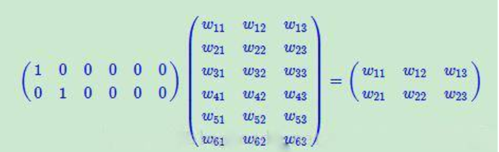
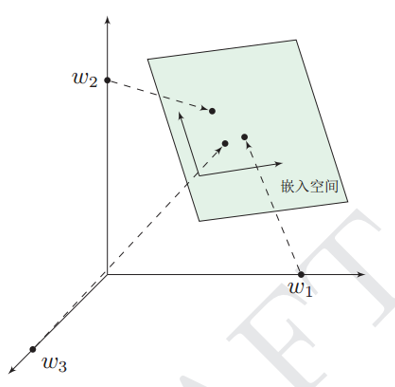
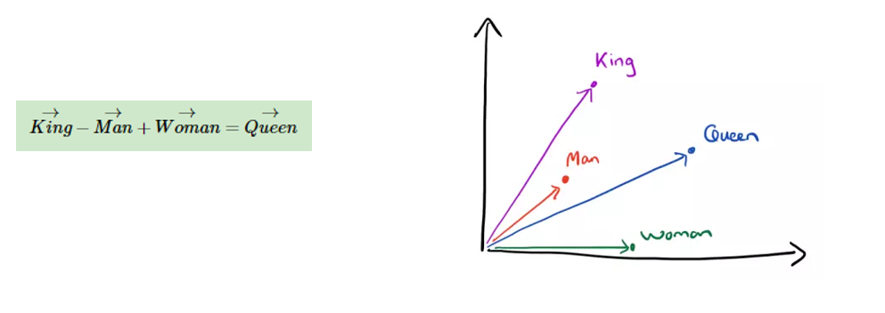
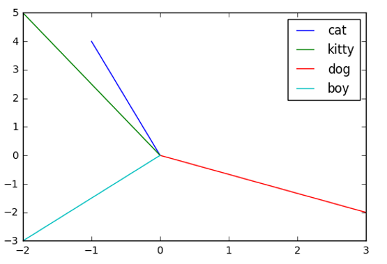
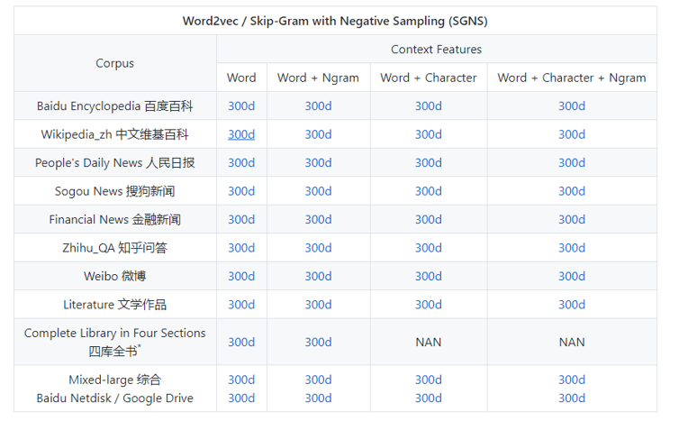

# Embedding层的作用

## 前言

在深度学习实验中经常会遇到Embedding层，网络上关于Embedding层介绍非常含糊。Embedding是数学领域的专有名词：指某个对象X被嵌入到另一个对象Y中。Word Embedding 是NLP中一组语言模型和特征学习技术的总称。主要作用是：嵌入层将正整数转换为具有固定大小的词向量

## One-Hot编码

大家都知道，模型是不会接受原始文本作为输入的，它只能处理数值型数据，因此文本向量化是让模型处理文本的前提。文本向量化是指将文本转换为数值张量的过程。文本向量化的方法有很多种。而one-hot编码是其中的一种。

定义：使用 N位状态寄存器对N个状态进行编码，每个状态都是一个独立的寄存器位，并且在任意时候只有一位有效。One-Hot编码是分类变量作为二进制向量的表示。首先要求分类值映射到整数，然后每个整数值都被表示为二进制向量。

优势：扩充特征的作用

### 例子

给定下面的数据，我们进行one-hot编码处理

我们对上面的值进行One-Hot编码后，就会变成下面的内容

### One-Hot编码在文本中的应用

one-hot编码在文本中的应用是，它将每个词与一个唯一的整数索引关联，然后将这个整数索引i转换成长度为N（N是词典大小）的二进制向量，这个向量的特点是只有第i个元素是1，其余元素为0。

对于这样一句话：我从哪里来，要到何处去，经过 One-Hot编码后

### One-Hot优点

- 解决了分类器不好处理离散数据的问题
- 能够起到扩充特征的作用

### One-Hot 缺点

- 基于词袋模型，不考虑词与词之间的顺序
- 得到的特征是离散稀疏的

这是它最明显的缺点。过于稀疏时，过度占用资源。其实我们这篇文章，虽然100W字，但是其实我们整合起来，有99W字是重复的，只有1W字是完全不重复的。那我们用100W X 10W的岂不是白白浪费了99W X 10W的矩阵存储空间。这个时候，Embedding层就起作用了

## Embedding层

为了解决构建语言模型的时候，出现维数灾难，Embedding层的作用就体现出来了，Embedding层的最主要的一个功能就是降维

假设我们有一个 100W * 10W的矩阵，然后乘上10W*20的矩阵，就能够降到100W* * 20了

我们将词汇表里的词用 Royalty, Masculinity, Femininity和Age 4个维度来表示

我们将king这个词从一个可能非常稀疏的向量坐在的空间，映射到现在这个四维向量所在的空间这个过程就被称为 word embedding（词嵌入），也就是说我们将一个高维词向量嵌入到一个低维空间中。

通过一系列的降维操作后，我们就很容易分析词与词之间的关系了，假设我们现在降到2维，我能就能发现下面的这样一个有趣的现象

对于一个词，如果我们想要去想它的属性是一件非常困难的事情，所以这个时候，我们只需要交给神经网络，定义好 它的维度，然后通过神经网络去学习它的每一个属性的大小，我们并不需要关心这些属性到底代表着什么，我们只需要知道词向量的夹角越小，表示他们的语言就更加接近。

通过上面的图，我们知道，cat （猫）和 kitty（猫咪） 是非常接近的，这就是Embedding层作用。

## 中文词向量

一般我们进行模型训练的时候，都是使用别人已经做好的词向量

项目地址：https://github.com/Embedding/Chinese-Word-Vectors

