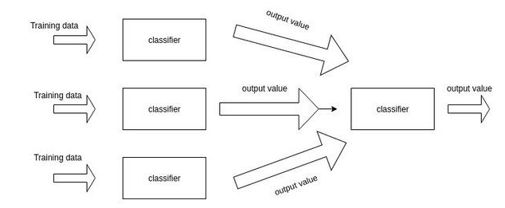
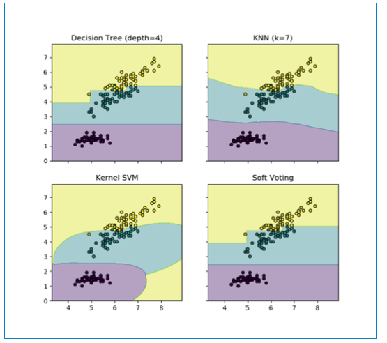
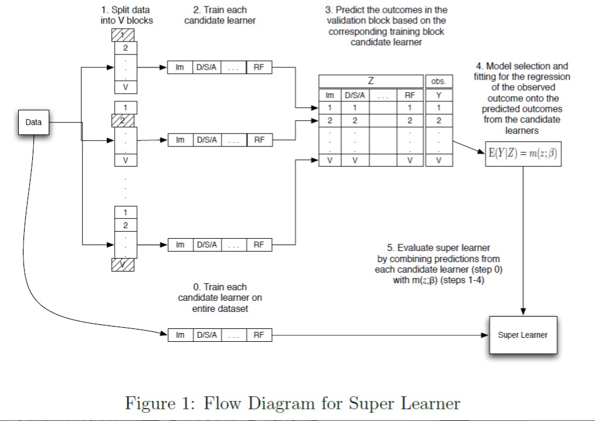

# Stacking算法介绍

## 介绍

Stacking是Kaggle比赛中最常见的集成学习模型，一般来说，就是训练一个多层（一般是两层，本文中默认两层）的学习器结构，第一层（也叫学习层）用n个不同的分类器（或者参数不同的模型）将得到预测结果合并成新的特征集，并作为下一层分类器的输出。一个简单的示意图如下所示



给出一个比较简单的例子：如果你想要预测明天是否下雨，并由相关的气象数据。你训练了十个分类器比如逻辑回归，svm，knn等。你通过stacking的方法在第一层将十个分类器的结果作为了第二层的训练器的数据，通过第二层的输出训练器得到了最终预测的结果。

## Stacking框架架构和运行原理

刚开始看Stacking好像是有交叉验证的既视感，其实并不是这样。假设是五折的Stacking，我们有train数据集和一个test数据集，那么一个基本的stacking框架会进行如下几个操作：

- 选择基模型。我们可以有XGBoost、LightGBM、RandomForest、SVM、ANN、KNN、LR等，你能想到的各种基本算法模型
- 把训练数据集分为不交叉的无分，我们标记为train1 ...  train5
- 从train1开始作为预测集，使用train2 到 train5建模，然后预测train1，并保留结果
  - 然后从train2作为预测集，使用train1, train3 ... train5 建模，预测train2，并保留结果，如此进行下去，直到把train1 到train5都预测一遍。
- 把预测的结果按train1  到  train5的位置对应填补上，得到对train整个数据集在第一个基模型的stacking转换
- 在上述建立的五个模型过程中，每个模型分别对test数据集进行预测，并最终保留这五列结果，然后对这五列取平均，作为第一个基模型对test数据的一个stacking转换。
- 然后选择第二个基模型，重复以上操作，再次得到train整个数据集在第二个基模型的一个stacking转换
- 依次类推，有几个基模型，就会对整个train数据集生成几列新的特征表达。同样，也会对test有几列新的特征表达。
- 最后一般使用LR作为第二层的模型进行建模预测【有点类似于投票选取结果】

## 关于投票法

投票法（Voting）是集成学习里面针对分类问题的一种结合策略，基本思想是选择所有机器学习算法当中输出最多的那个类。

分类的机器学习算法输出有两种类型：一种是直接输出类标签，另外一种是输出类概率

使用前者进行投票，叫做硬投票（Hard Voting）

使用后者进行分类叫做软投票（Soft Voting）

### 硬投票

硬投票是选择算法输出最多的标签，如果标签数量相等，那么按照升序的次序进行选择。下面是一个例子：

```python
from sklearn import datasets
from sklearn.model_selection import cross_val_score
from sklearn.linear_model import LogisticRegression
from sklearn.naive_bayes import GaussianNB
from sklearn.ensemble import RandomForestClassifier
from sklearn.ensemble import VotingClassifier
 
iris = datasets.load_iris()
X, y = iris.data[:,1:3], iris.target
clf1 = LogisticRegression(random_state=1)
clf2 = RandomForestClassifier(random_state=1)
clf3 = GaussianNB()
 
eclf = VotingClassifier(estimators=[('lr',clf1),('rf',clf2),('gnb',clf3)], voting='hard')
#使用投票法将三个模型结合在以前，estimotor采用 [(name1,clf1),(name2,clf2),...]这样的输入，和Pipeline的输入相同 voting='hard'表示硬投票
 
for clf, clf_name in zip([clf1, clf2, clf3, eclf],['Logistic Regrsssion', 'Random Forest', 'naive Bayes', 'Ensemble']):
    scores = cross_val_score(clf, X, y, cv=5, scoring='accuracy')
    print('Accuracy: {:.2f} (+/- {:.2f}) [{}]'.format(scores.mean(), scores.std(), clf_name))
```

输出结果如下：

```
Accuracy: 0.90 (+/- 0.05) [Logistic Regrsssion]
Accuracy: 0.93 (+/- 0.05) [Random Forest]
Accuracy: 0.91 (+/- 0.04) [naive Bayes]
Accuracy: 0.95 (+/- 0.05) [Ensemble]

实际当中会报：DeprecationWarning
```

### 软投票

软投票是使用各个算法输出的类概率来进行类的选择，输入权重的话，会得到每个类的类概率的加权平均值，值大的类会被选择。

```python
from itertools import product
 
import numpy as np
import matplotlib.pyplot as plt
 
from sklearn import datasets
from sklearn.tree import DecisionTreeClassifier
from sklearn.neighbors import KNeighborsClassifier
from sklearn.svm import SVC
from sklearn.ensemble import VotingClassifier
 
iris = datasets.load_iris()
X = iris.data[:,[0,2]] #取两列，方便绘图
y = iris.target
 
clf1 = DecisionTreeClassifier(max_depth=4)
clf2 = KNeighborsClassifier(n_neighbors=7)
clf3 = SVC(kernel='rbf', probability=True)
eclf = VotingClassifier(estimators=[('dt',clf1),('knn',clf2),('svc',clf3)], voting='soft', weights=[2,1,1])
#weights控制每个算法的权重, voting=’soft' 使用了软权重
 
 
clf1.fit(X,y)
clf2.fit(X,y)
clf3.fit(X,y)
eclf.fit(X,y)
 
x_min, x_max = X[:,0].min() -1, X[:,0].max() + 1
y_min, y_max = X[:,1].min() -1, X[:,1].max() + 1
xx, yy = np.meshgrid(np.arange(x_min, x_max, 0.01), np.arange(y_min, y_max, 0.01))  #创建网格
 
fig, axes = plt.subplots(2, 2, sharex='col', sharey='row', figsize=(10, 8)) #共享X轴和Y轴
 
for idx, clf, title in zip(product([0, 1],[0, 1]),
                           [clf1, clf2, clf3, eclf],
                           ['Decision Tree (depth=4)', 'KNN (k=7)',
                            'Kernel SVM', 'Soft Voting']):
    Z = clf.predict(np.c_[xx.ravel(), yy.ravel()]) #起初我以为是预测的X的值，实际上是预测了上面创建的网格的值，以这些值来进行描绘区域
    Z = Z.reshape(xx.shape)
    axes[idx[0], idx[1]].contourf(xx, yy, Z, alpha=0.4)
    axes[idx[0], idx[1]].scatter(X[:, 0],X[:, 1], c=y, s=20, edgecolor='k')
    axes[idx[0], idx[1]].set_title(title)
plt.show()
```

输出结果如下：



## Stacking存在的问题

不了解Stacking的朋友可能会任务它是一种集成框架，集多个模型的长处而产生更好的结果。

Stacking中的各个模型（基分类器）追求的是 “准而不同”。Stacking中的子模型一般应该是独立准确，而不同的基分类器之间有所差异。

Bagging中的基学习器追求的是 “弱而不同”。bagging中的学习器往往是决策树，主要就是看中了决策树的不稳定性。过于准确的基学习器会使得Bagging的集成失去意义

Stacking另一个比较特别的是层状结构。以常见的两层Stacking为例，第一层是不同的基模型（多个），而第二层是以上一层基模型的输出结果为输入数据的分类器（一个）。从某种意义上看，和神经网络的结构相似。为了防止过拟合，一般在第二层不使用原始训练数据进行训练，而仅依赖于第一层训练器的输出结果。

**Stacking是否一定可以提升效果？是否集成后比单个基学习器要好？**

这个首先和你怎么做的stacking有很大关系，不是每一种stacking都有质量保证。早期的很多stacking方法从实验角度来看效果一般，但是也不至于退步。

某次从理论上来看，现在比较通用的stacking模型，已经在理论上证明了集成结果应该 渐进等价 于 其第一层的最优子模型。因此stacking的结果不应该有大幅度的下降。

不谈公式，仅从集成的思路上看，假设多个学习器之间却有不同，互相独立，且最终合并起来，那么每个单独模型的方法 应该有所降低，最终结果应该提升。即使多个相似的基学习器并不互相独立，甚至极端情况下，完全相同，也不会恶化集成结果，最多是没有提升而已，这个想法就可以类比回归中的共线性，一般主要影响解释能力，而不是预测能力所以常常会保留不做处理。因此Stacking在直觉上也不会恶化预测能力。



如果上述操作，效果还是表现不佳？那么可能是以下几个问题引起的

- 本身数据集就不大，stacking不适合极小的数据集
- 很有可能是代码出现了问题，比如没有正确的使用交叉验证
- 个别模型因为某种不明的原因出现奇差，在巧合情况下决定了第二层的输入数据
- 第二层的模型选择问题，比如在多标签预测下和二分类下的选择应有所差别

## 如果解决Stacking存在的问题

在猜测不到为什么你的模型不工作，或者stacking后大幅度下降。在有限的信息下，给出一些建议：

- 观察每个子模型，移除那些明显逊色的模型
- 继续丰富子模型的种类，如果想不出新的模型，可以切换不同的参数的类似模型。
- 如果你的数据集非常小，Stacking不一定有效，没必要坚持用Stacking
- 重新检查基学习器的训练，可以尝试用randomized search来包括一些新的 “准而不同” 的模型
- 还有一种微乎其微的可能性，就是你的模型事实上提升了，但是准确率（accuracy）不是很好的衡量标准（当数据严重不平衡的时候），你以为效果表查了，所以可以试试ROC


## 参考

[【机器学习】：sklearn中的投票法](https://blog.csdn.net/rocling/article/details/93634499)

[为什么做stacking之后，准确率反而降低了？](https://www.zhihu.com/question/59769987/answer/269367049)

[【干货】比赛后期大招之stacking技术分享](https://zhuanlan.zhihu.com/p/27493821)

