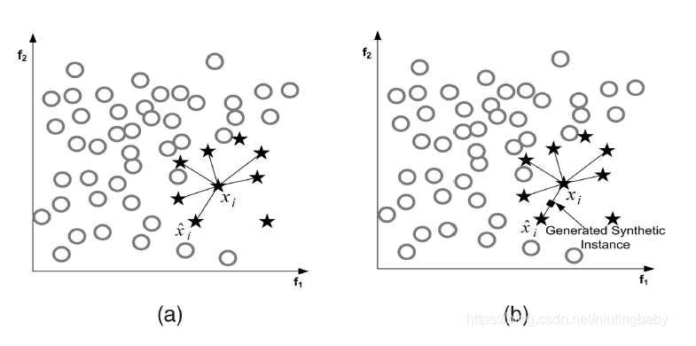
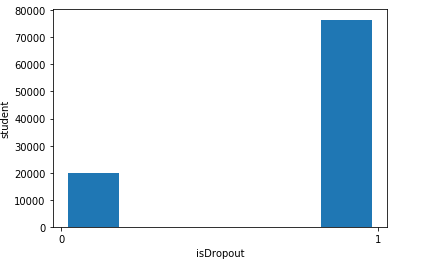
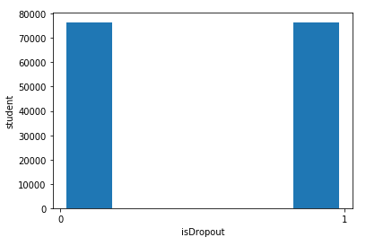

# 使用SMOTE算法进行过采样

## 前言

SMOTE算法的思想是合成新的少数类样本,合成的策略是对每个少数类样本a,从它的最近邻中随机选一个样本b,然后在a、b之间的连线上随机选一点作为新合成的少数类样本

通过研究，我发现Github有人已经实现了一个 [KmeansSmote算法](https://github.com/felix-last/kmeans_smote)平衡数据集，Kmeans的作用主要是聚类算法，然后在结合SMOTE过采样，以重新平衡数据集。

从官网上的简介说到，K-Means Smote算法是一种针对类不平衡数据的过采样方法。它通过在输入空间的安全和关键区域生成少数类样本来辅助分类。该方法避免了产生噪声，有效地克服了类间和类内的不平衡。

## 算法流程

SMOTE算法主要用于合成少数类样本，它是基于随机过采样算法的一种改进方案，由于随机过采样采取简单复制样本的策略来增加少数类样本，这样容易产生模型过拟合的问题，即使得模型学习到的信息过于特别而不够泛化，SMOTE算法的基本思想是对少数类样本进行分析，并根据少数类样本人工合成新样本并添加到数据集中。

- 对于少数类中的每一个样本x，以欧式距离为标准计算它到少数类样本集中所有样本的距离，得到其k近邻
- 根据样本不平衡比例设置一个采样比例，以确定每一个少数类样本x，从其K近邻中随机选择若干个样本，假设选择的近邻为 xn
- 对于每一个随机选出的近邻xn，分别与原样本按照如下的公式构建新的样本
  - $ x_{nex} = x + rand(0, 1) * (x^` - x)$



## SMOTE算法缺陷

该算法主要存在两个方面的问题

- 近邻选择时，存在一定的盲目性。从上面的算法流程可以看出，在算法执行过程中，需要确定K值，即选择多少个近邻的样本，这需要用户自行解决。从K值的定义可以看出，K值的下限是M值（M值为从K个近邻中随机挑选出的近邻样本的个数，且有M<K ）M的大小可以根据正负类样本数量 和 数据集最后需要达到的平衡率决定。但K值的上限

## 安装

安装的前提是确保下面的依赖已经安装成功

```
imbalanced-learn (>=0.4.0, <0.5)
numpy (numpy>=1.13, <1.16)
scikit-learn (>=0.19.0, <0.21)
```

首先需要使用pip命令进行安装

```
pip install kmeans-smote
```

## 使用

目前我的数据集中存在不平衡的问题，如果所示，我们首先将数据集中的标签进行统计

```
import numpy as np
import pandas as pd
from kmeans_smote import KMeansSMOTE
import matplotlib.pyplot as plt

# 导入测试集和
train = pd.read_csv('./GaussianNB/train.csv',header=0)
test = pd.read_csv('./GaussianNB/test.csv',header=0)

# 画出正负样本的比值
def drawDropout(x):    
    plt.hist(x,bins=5,rwidth=0.8)
    my_x_ticks = np.arange(0, 2, 1)
    plt.xticks(my_x_ticks)
    plt.xlabel('isDropout')
    plt.ylabel('student')
    plt.show()
    
y = train["result"]
X = train.drop(["enrollment_id","result"],axis=1)
drawDropout(y)    
```

能够看到，大概存在1:4的关系，貌似也不是很不平衡，我们就看看效果如何



开始使用Kmeans-Smote算法进行平衡

```
[print('Class {} has {} instances'.format(label, count))
 for label, count in zip(*np.unique(y, return_counts=True))]

kmeans_smote = KMeansSMOTE(
    kmeans_args={
        'n_clusters': 100
    },
    smote_args={
        'k_neighbors': 10
    }
)
X_resampled, y_resampled = kmeans_smote.fit_sample(X, y)

[print('Class {} has {} instances after oversampling'.format(label, count))
 for label, count in zip(*np.unique(y_resampled, return_counts=True))]
```

输出的结果如下所示，原来的是 1 ：4 的关系，经过平衡后，我们合成了少数类样本，然后达到1：1的效果

```
Class 0 has 19917 instances
Class 1 has 76517 instances
Class 0 has 76517 instances after oversampling
Class 1 has 76517 instances after oversampling
```

