# 集成学习简介

集成学习是通过构建并组合多个学习器来完成学习任务的算法，集成学习常见的有两类

- Bagging：基学习器之间无强依赖关系，可同时生成的并行化方法
- Boosting：基学习器之间存在强烈的依赖关系，必须串行生成基分类器的方法
  - Adaboost：对样本进行加权的过程，然后来进行基学习器的训练，集成后得到最终的学习器
  - GBDT：梯度提升算法
    - XGBoost：
    - LightGBM

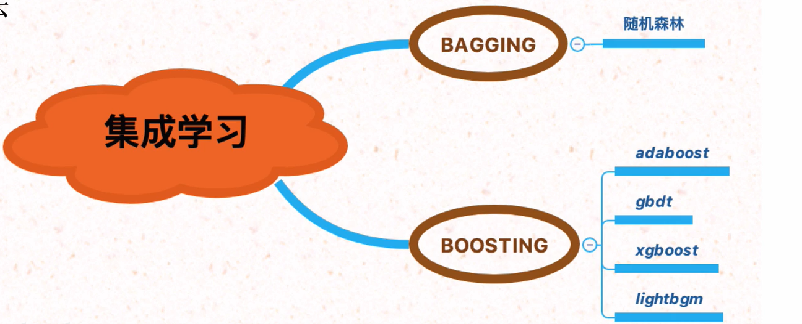

## Bagging算法

Bagging（Bootstrap Aggregating）方法：

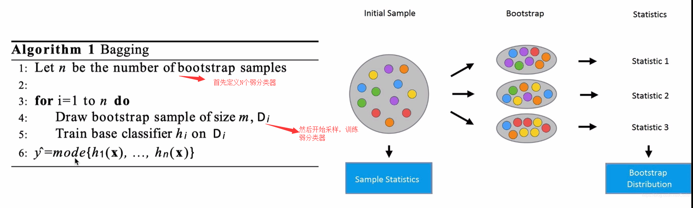

训练完成后，我们进行预测

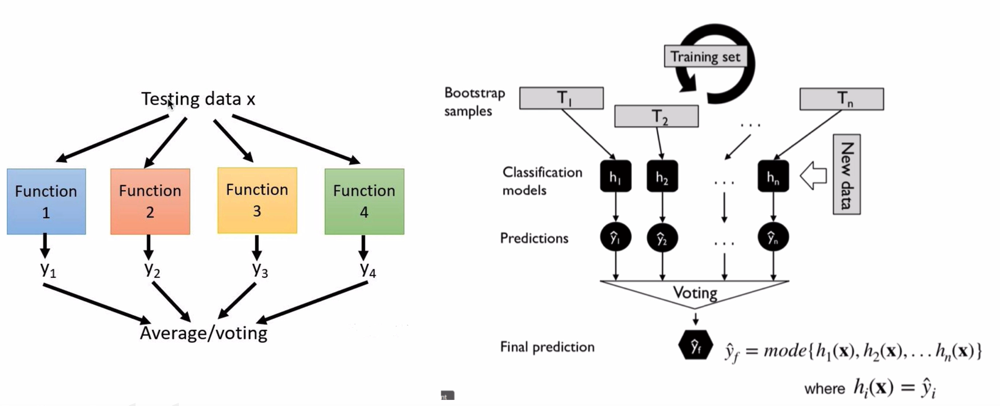

如果是预测问题，我们只需要通过Average求平均

如果是分类问题，我们需要进行投票表决


## Boosting算法

Boosting方法是将“弱学习算法”提升为“强学习算法”的过程，通过反复学习得到一系列弱分类器（决策树和逻辑回归），组合这些弱分类器得到一个强分类器。 Boosting算法要涉及到两个部分，加法模型和前向分步算法

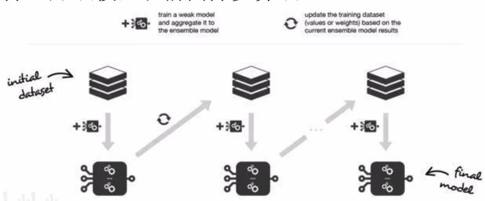

### 加法模型

加法模型就是说强分类器由一系列弱分类器线性相加而成。一般组合形式如下
$$
F_{M}(x ; P)=\sum_{m=1}^{n} \beta_{m} h\left(x ; a_{m}\right)
$$
其中，h（x;am）是弱分类器，am是弱分类器学习到的最优参数，m是弱学习在强分类器中所占比重，P是所有Lm和βm的组合。这些弱分类器线性相加组成强分类器前向分步是在训练过程中，下一轮迭代产生的分类器是在上一轮的基础上训练得来的。即

### 前向步骤

前向步骤是在训练过程中，下一轮迭代产生的分类器是在上一步的基础上训练得来的。即
$$
F_{m}(x)=F_{m-1}(x)+\beta_{m} h_{m}\left(x ; a_{m}\right)
$$


## 随机森林

随机森林 = Bagging + 决策树

同时训练多个决策树，预测时综合考虑多个结果进行预测，例如取多个节点的均值（回归），或者是众数（分类）。

### 优势

- 消除了决策树容易过拟合的缺点
- 减小了预测的方差，预测值不会因训练数据的小变化而剧烈变化

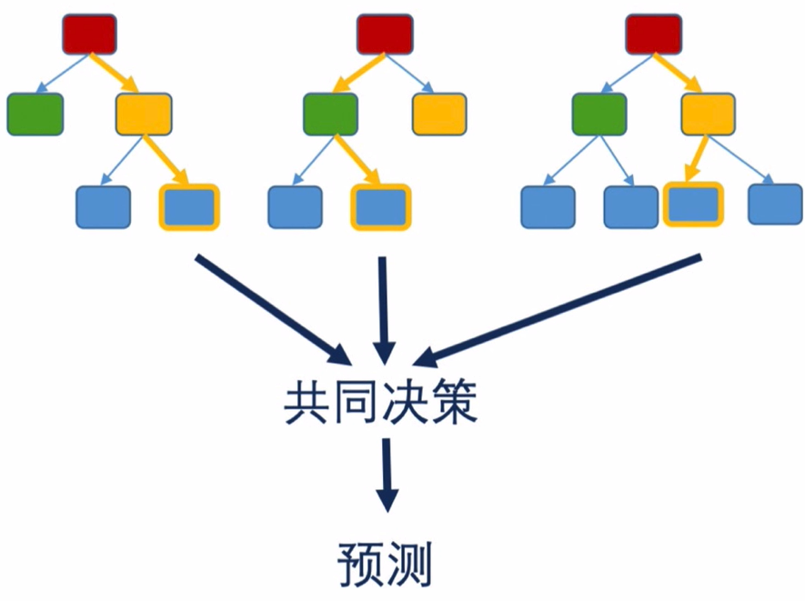

### 随机性

随机森林的随机性体现在以下两点

- 从原来的训练数据集随机（带放回bootstrap）取一个子集作为森林中某一个决策树的训练数据集
- 每一个选择分叉的特征时，限定为在随机选择的特征的子集中寻找一个特征。

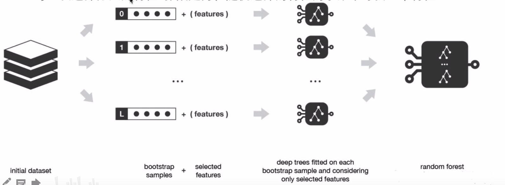


### 实例

通过案例来看下随机森林的应用 现有某公司的员工离职数据，我们通过构建决策树和随机森林，来预测某一员工是否会离职。并找出影响员工离职的重要特征

见代码：DecisionTree.RandomForest.ipynb


## Adaboost

提升树中的算法，Adaboost是在样本上做文章的，在每次训练完基学习器之后，来调整样本的分布，在最后集成的时候，也是需要在不同的分类器前面添加权重参数。

### 思想

Adaboost的思想是将关注点放在被错误分类的样本上，减小上一轮被正确分类的样本权值提高被错误分类的样本权值

Adaboost采用加权投票的方法分类误差小的弱分类器的权重大，而分类误差大的弱分类器的权重小。

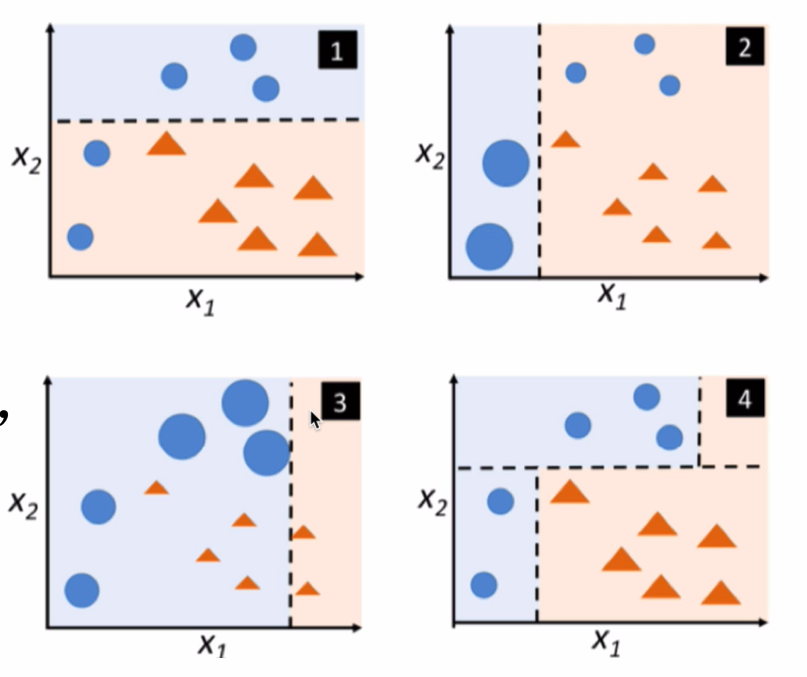

例如上图所示，在第一步的时候，我们进行分类，同时有分类正确的，和分类错误的。

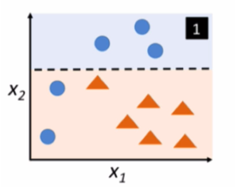

在第二步的时候，我们需要将分类正确的样本权重缩小，通知增大分类错误的权重，然后再次进行分类，这样下次分类的时候，就会更加关注与上次分错的样本，从而得到下面的分类结果

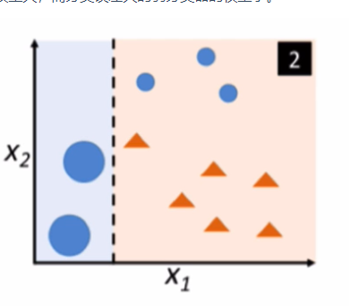


然后我们再次调整分错样本的权值

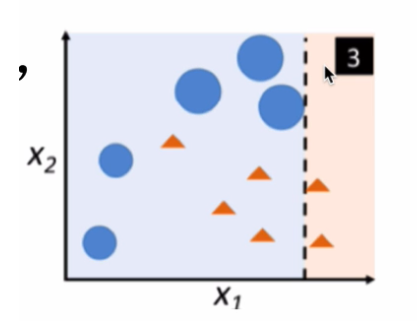

最终我们将前面的弱分类器进行集成，得到我们最终的分类结果

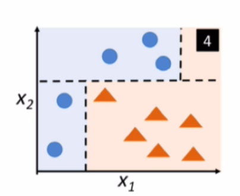

### 算法流程

假设输入训练数据为：
$$
T=\left\{\left(x_{1}, y_{1}\right),\left(x_{2}, y_{2}\right),\left(x_{N}, y_{N}\right)\right\}
$$
其中:x∈X≤Rn，y∈Y=-1，1，迭代次数即弱分类器个数为M

初始化训练样本的权值分布为：
$$
D_{1}=\left(w_{1,1}, w_{1,2}, \ldots, w_{1, i}\right), w_{1, i}=\frac{1}{N}, i=1,2, \ldots, N
$$


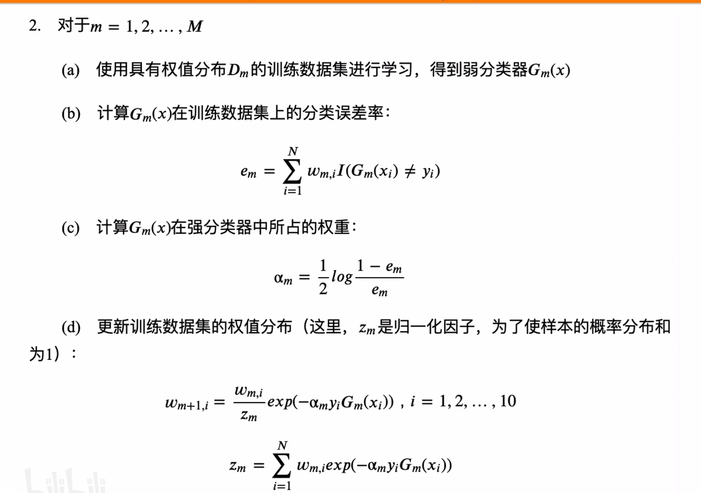

上述的更新权重的过程就是：如果我们分类正确了，那么就需要缩小权重，如果分类错误，那么就需要放大权重，然后不断循环，最后得到M个弱分类器

最终得到的分类器为：
$$
F(x)=\operatorname{sign}\left(\sum_{i=1}^{N} \alpha_{m} G_{m}(x)\right)
$$
在整个过程中，令人困惑的是：分类器的权重的确定

假设经过m-1轮迭代，得到弱分类器Fm-1（x），根据前向分布，有
$$
F_{m}(x)=F_{m-1}(x)+\alpha_{m} G_{m}(x)
$$
AdaBoost的损失函数是指数损失，则有：
$$
\text {Loss}=\sum_{i=1}^{N} \exp \left(-y_{i} F_{m}\left(x_{i}\right)\right)=\sum_{i=1}^{N} \exp \left(-y_{i}\left(\boldsymbol{F}_{m-1}\left(x_{i}\right)+\alpha_{m} G_{m}\left(x_{i}\right)\right)\right)
$$
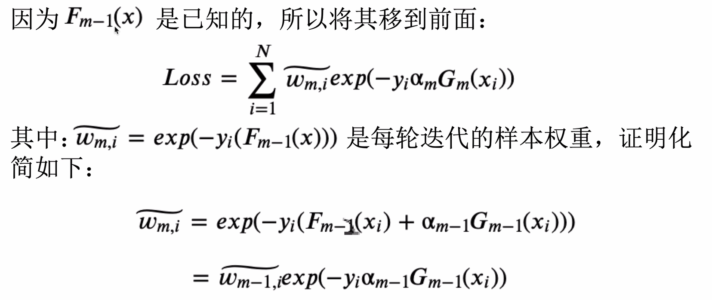

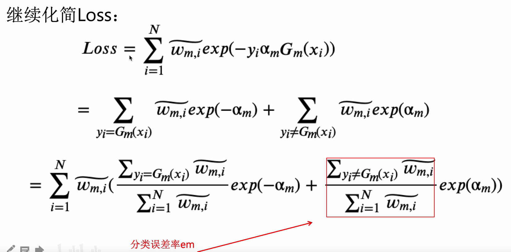

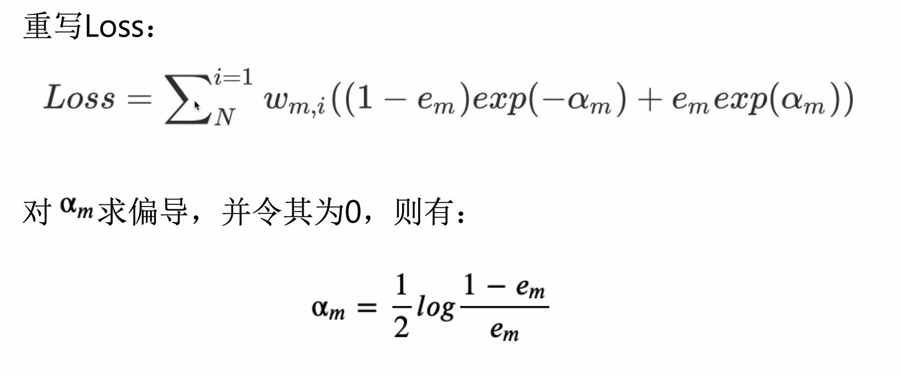

Adaboost可以看成是加法模型、损失函数为指数损失函数、学习算法为前向分布算法时的二分类学习方法，接下来我们使用SkLearn中的AdaBoost的接口进行实践

```
AdaBoostClassifier(base_estimator=None, $n_{-}$ estimators $=50$ learning_rate $=1.0,$ algorithm='SAMME.R', random_state=None)
```

base_estimator：代表基学习器是什么

### Adaboost实践

参考代码：adaboost.ipynb


## GBDT

BDT：提升树

GBDT：梯度提升树

### BDT

我们首先看一下简单的提升树（Boosting Decision Tree），提升树是以CART决策树为基学习器的集成学习方法。

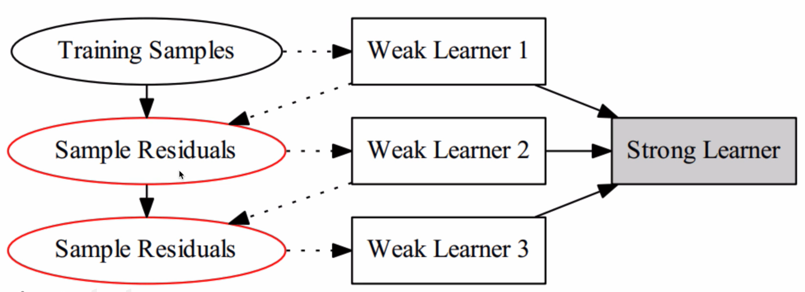

我们通过不同的训练数据，来训练弱学习器，最后通过不同的学习器，组合成为强学习器

提升树实际上就是加法模型和前向分布算法，将其表示为：

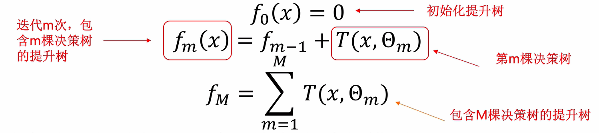

x是参数  0<sub>m</sub> 是参数

在前向分布算法第m步时，给定当前的模型 f<sub>m - 1</sub> ( x ) ，求解：

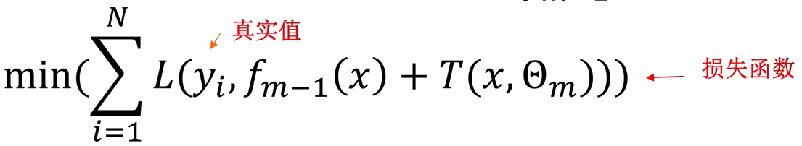

得到第m棵决策树T(x,  0<sub>m</sub>) ，不同问题的提升树的区别在于损失函数的不同，如分类用指数损失函数，回归用平方误差损失函数。

当提升树采用平方损失函数时，第m次迭代时表示为：

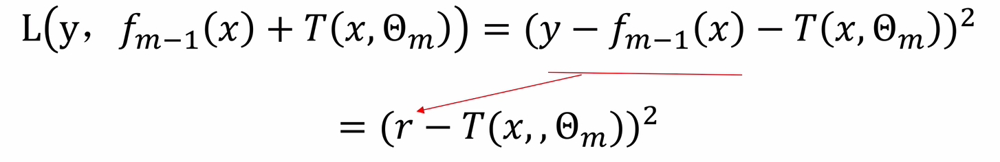

称r为残差，所以第m棵决策树（x，⊙m）是对该残差的拟合。要注意的是提升树算法中的基学习器CART树是回归树。

>残差在数理统计中是指实际观察值与估计值（[拟合值](https://baike.baidu.com/item/拟合值/9461734)）之间的差。

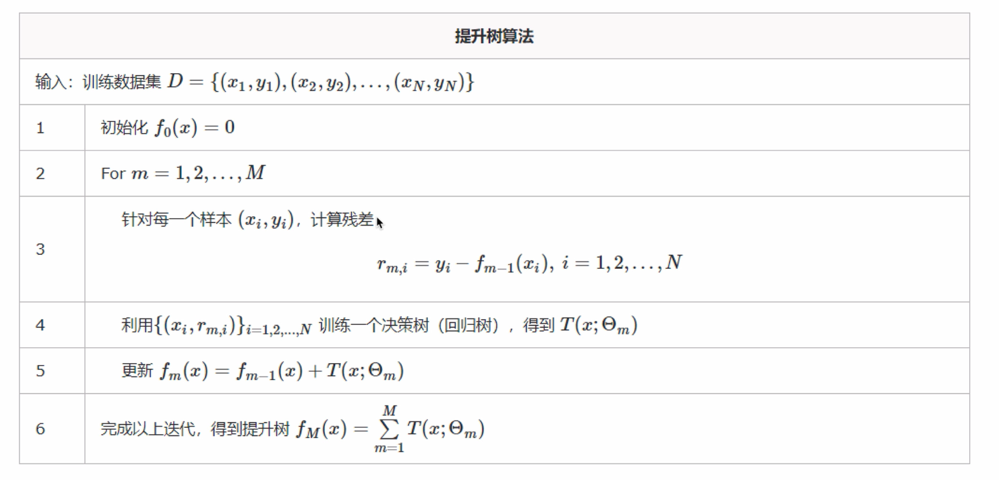

### GBDT

GBDT全称为: Gradient Boosting Decision Tree，即梯度提升决策树，理解为 梯度提升 + 决策树。 Friedman提出了利用最速下降的近似方法，利用损失函数的负梯度拟合基学习器

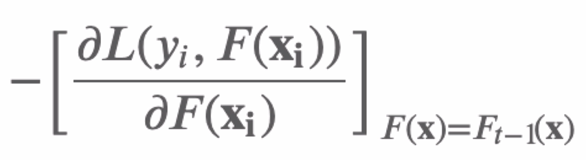

怎么理解这个近似，我们通过平方损失函数来给大家介绍

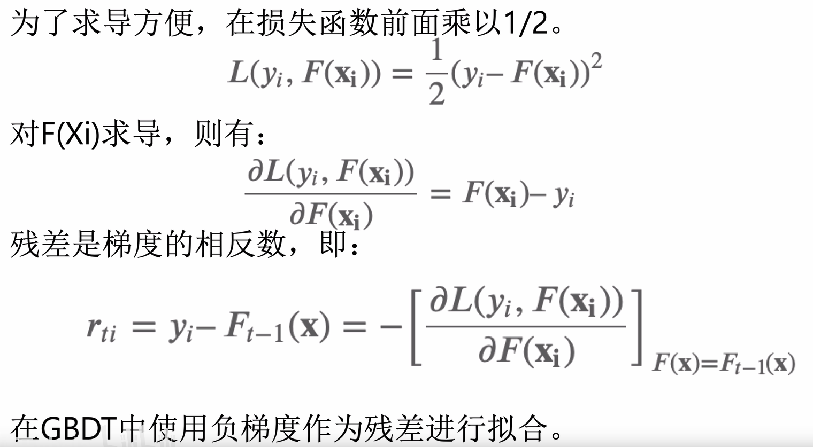

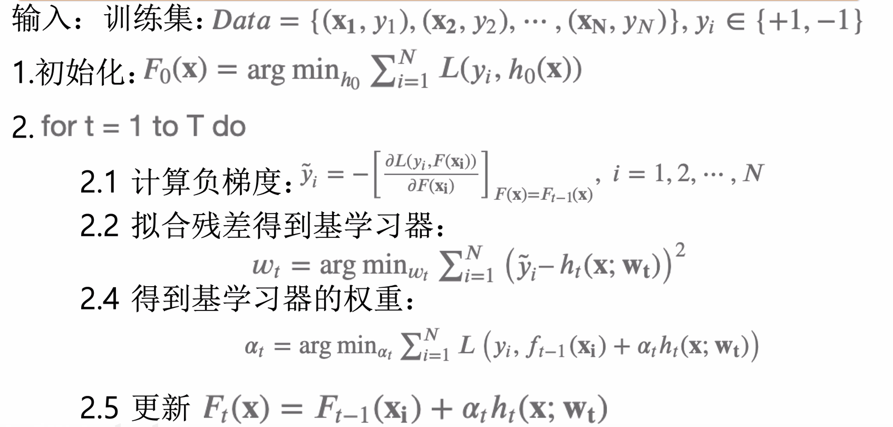

GBDT的梯度提升流程如下所示：

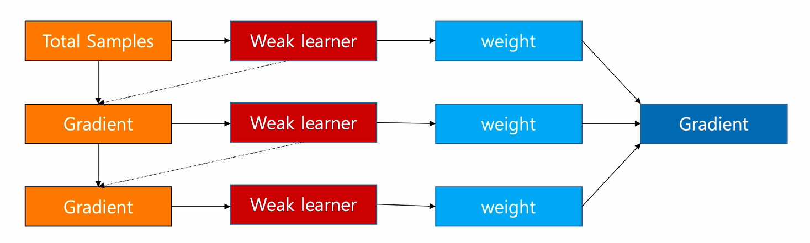

GBDT与提升树的区别是残差使用梯度代替，而且每个基学习器有对应的参数权重。

GBDT使用梯度提升的决策树（CART），CART树回归将空间划分为K个不相交的区域，并确定每个区域的输出CK，数学表达式如下：

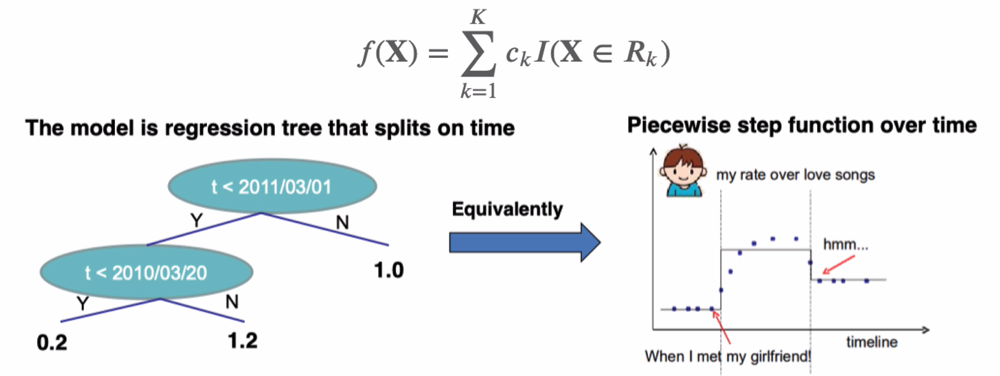

### GBDT完成回归任务

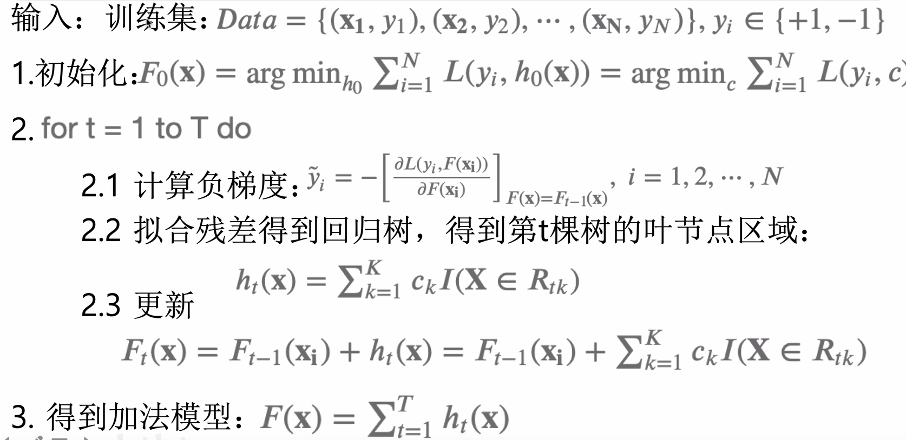

### 使用GBDT完成分类任务

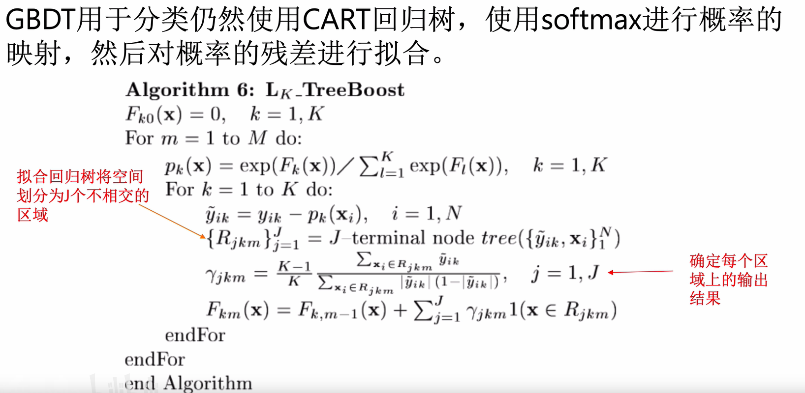

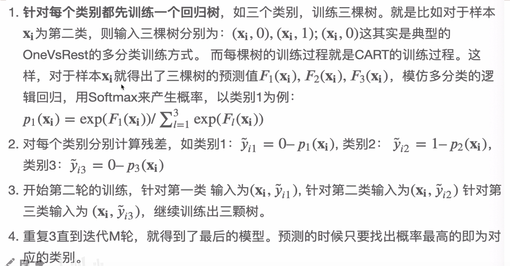


## XGBoost

ⅹGBoost是GBDT的一种，也是加法模型和前向优化算法在监督学习中，可以分为:模型，参数，目标函数和学习方法

- 模型：给定输入X后预测输出y的方法，比如说回归，分类，排序等
- 参数：模型中的参数，比如线性回归中的权重和偏置
- 目标函数：即损失函数，包含正则化项
- 学习方法：给定目标函数后求解模型和参数的方法，比如
- 梯度下降法，数学推导等

这四方面的内容也指导着 XGBoost系统的设计。

### 模型形式

假设要判断一个人是否喜欢电脑游戏，输入年龄、性别、职业等特征，可以得到如下的回归树：

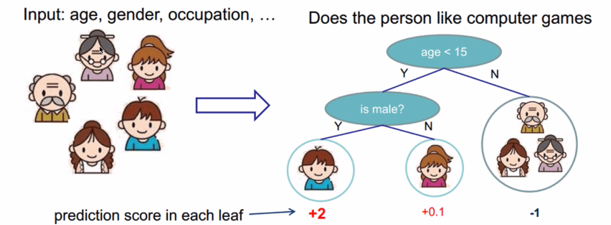

在叶子节点上会有一个分数，利用这个分数我们可以回归，或者映射成概率进行分类等。

但是一颗CART树的拟合能力有限，我们可以进行集成学习，比如用两棵树进行预测，结果是两个树的和：

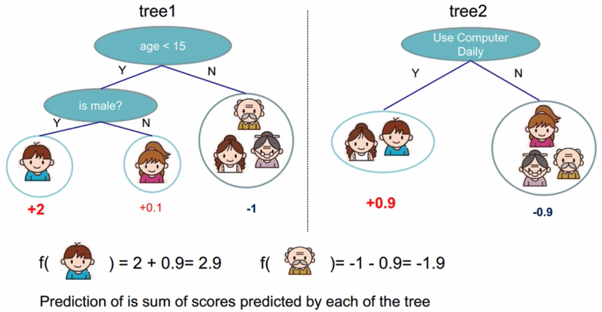

用多棵树进行预测的方法就是随机森林或提升树。

给定数据集：
$$
D=\left(X_{i}, y_{i}\right)\left(|\mathrm{D}|=\mathrm{n}, x_{i} \in R^{m}, y_{i} \in R\right)
$$
XGBoost利用前向分布算法，学习到包含K棵树的加法模型：
$$
\hat{y}_{i}=\sum_{t=1}^{K} f_{t}\left(x_{i}\right), \quad f_{t} \in \mathcal{F}
$$
其中有K棵树，f是回归树，而F对应回归树组成的函数空间，那怎么得到这些树，也就是树的结构和叶子节点的预测结果？

### 目标函数

定义目标函数，包含正则项：
$$
\operatorname{Obj}(\Theta)=\sum_{i=1}^{N} l\left(y_{i}, \hat{y}_{i}\right)+\sum_{j=1}^{t} \Omega\left(f_{j}\right), \quad f_{j} \in \mathcal{F}
$$
如何优化这个目标函数呢？因为f是决策树，而不是数值型的向量，我们不能使用梯度下降的算法进行优化。

XGBoost是前向分布算法，我们通过贪心算法寻找局部最优解：
$$
\hat{y}_{i}^{(t)}=\sum_{j=1}^{t} f_{j}\left(x_{i}\right)=\hat{y}_{i}^{(t-1)}+f_{t}\left(x_{i}\right)
$$
每一次迭代我们寻找使损失函数降低最大的 f（CART树），因此目标函数可改写成
$$
\begin{aligned}
O b j^{(t)} &=\sum_{i=1}^{N} l\left(y_{i}, \hat{y}_{i}^{(t)}\right)+\sum_{j=1}^{t} \Omega\left(f_{j}\right) \\
&=\sum_{i=1}^{N} l\left(y_{i}, \hat{y}_{i}^{(t-1)}+f_{t}\left(\mathbf{x}_{\mathbf{i}}\right)\right)+\Omega\left(f_{t}\right)+\text {constant(在t轮时，前t-1次迭代正则项看作是常数)} \\
&=\sum_{i=1}^{N} l\left(y_{i}, \hat{y}_{i}^{(t-1)}+f_{t}\left(\mathbf{x}_{\mathbf{i}}\right)\right)+\Omega\left(f_{t}\right)
\end{aligned}
$$
接下来，我们采用泰勒展开对目标参数进行近似：
$$
\begin{aligned}
O b j^{(t)} &=\sum_{i=1}^{N} l\left(y_{i}, \hat{y}_{i}^{(t)}\right)+\sum_{j=1}^{t} \Omega\left(f_{j}\right) \\
&=\sum_{i=1}^{N} l\left(y_{i}, \hat{y}_{i}^{(t-1)}+f_{t}\left(\mathbf{x}_{\mathbf{i}}\right)\right)+\Omega\left(f_{t}\right)+\text {constant} \\
&=\sum_{i=1}^{N} l\left(y_{i}, \hat{y}_{i}^{(t-1)}+f_{t}\left(\mathbf{x}_{\mathbf{i}}\right)\right)+\Omega\left(f_{t}\right)
\end{aligned}
$$
移除对第t轮迭代来说的常数项 l(yi, yi<sup>(t -1 )</sup>)得到：
$$
O b j^{(t)}=\sum_{i=1}^{N}\left(g_{i} f_{t}\left(\mathbf{x}_{\mathbf{i}}\right)+\frac{1}{2} h_{i} f_{t}^{2}\left(\mathbf{x}_{\mathbf{i}}\right)\right)+\Omega\left(f_{t}\right)
$$
所以目标函数只依赖于每条数据在误差函数上的一阶倒数和二阶导数

#### 泰勒公式

泰勒公式（ Taylor‘s formula）是一个用函数在某点的信息描述其附近取值的公式，对于一般的函数，泰勒公式的系数的选择依赖于函数在一点的各阶导数值。函数f（x）在x0处的基本形式如下
$$
\begin{aligned}
f(x) &=\sum_{n=0}^{\infty} \frac{f^{(n)}\left(x_{0}\right)}{n !}\left(x-x_{0}\right)^{n} \\
&=f\left(x_{0}\right)+f^{1}\left(x_{0}\right)\left(x-x_{0}\right)+\frac{f^{2}\left(x_{0}\right)}{2}\left(x-x_{0}\right)^{2}+\cdots+\frac{f^{(n)}\left(x_{0}\right)}{n !}\left(x-x_{0}\right)^{n}
\end{aligned}
$$
还有一种常见的写法为，假设x+1=x+△x，将f（x+1）在x处 的泰勒展开为
$$
f\left(x^{t+1}\right)=f\left(x^{t}\right)+f^{1}\left(x^{t}\right) \Delta x+\frac{f^{2}\left(x^{t}\right)}{2} \Delta x^{2}+\cdots
$$

#### 正则项

树的复杂度可以用树的深度，内部节点个数，叶子节点个数来衡量，XGBoost中正则项用来衡量树的复杂度：树的叶子节点个数T和每棵树的叶子节点输出分数W的平方和（相当于L2正则化）

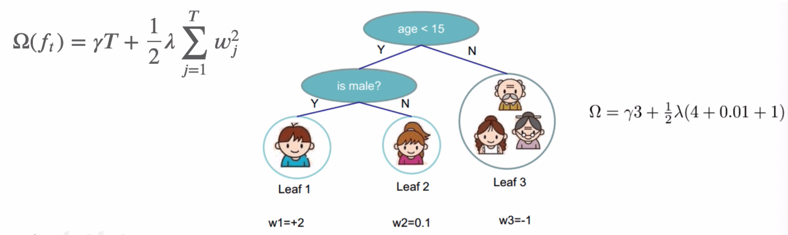

XGBoost的目标函数改写成：

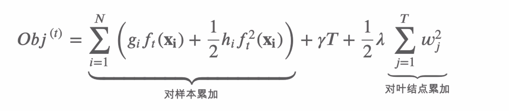

上式中第一部分是对样本的累加，而后面的部分是正则项，是对叶节点的累加

定义Q函数将输入X映射到某个叶子节点上，则有：

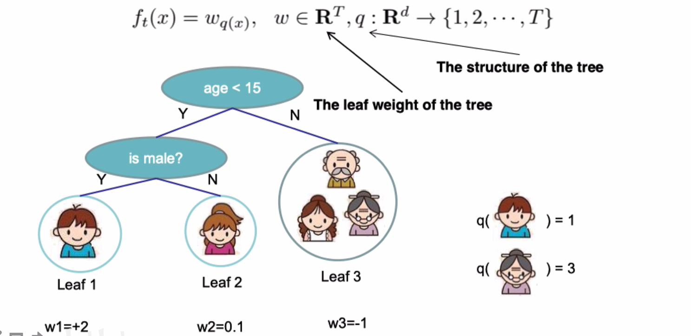

定义每个叶子节点 j 上的样本集合为 I<sub>j</sub> = {i | q(x<sub>i</sub>) = j }，则目标函数可以改写成：
$$
\begin{aligned}
O b j^{(t)} &=\sum_{i=1}^{N}\left(g_{i} f_{t}\left(\mathbf{x}_{\mathbf{i}}\right)+\frac{1}{2} h_{i} f_{t}^{2}\left(\mathbf{x}_{\mathbf{i}}\right)\right)+\gamma T+\frac{1}{2} \lambda \sum_{j=1}^{T} w_{j}^{2} \\
&=\sum_{i=1}^{N}\left(g_{i} w_{q\left(\mathbf{x}_{i}\right)}+\frac{1}{2} h_{i} w_{q\left(\mathbf{x}_{i}\right)}^{2}\right)+\gamma T+\frac{1}{2} \lambda \sum_{j=1}^{T} w_{j}^{2} \\
&=\sum_{j=1}^{T}\left(\sum_{i \in I_{j}} g_{i} w_{j}+\frac{1}{2} \sum_{i \in I_{j}} h_{i} w_{j}^{2}\right)+\gamma T+\frac{1}{2} \lambda \sum_{j=1}^{T} w_{j}^{2} \\
&=\sum_{j=1}^{T}\left(G_{j} w_{j}+\frac{1}{2}\left(\boldsymbol{H}_{j}+\lambda\right) w_{j}^{2}\right)+\gamma T
\end{aligned}
$$
这个就是目标函数的最终结果

接下来我们进行目标函数的优化，即计算第t轮时使用目标函数最小的叶节点的输出分数W，直接对W求导，使得导数为0，得：
$$
w_{j}=-\frac{G_{j}}{H_{j}+\lambda}
$$
将其带入损失函数中：
$$
\begin{aligned}
O b j^{(t)} &=\sum_{j=1}^{T}\left(G_{j} w_{j}+\frac{1}{2}\left(H_{j}+\lambda\right) w_{j}^{2}\right)+\gamma T \\
&=\sum_{j=1}^{T}\left(-\frac{G_{j}^{2}}{H_{j}+\lambda}+\frac{1}{2} \frac{G_{j}^{2}}{H_{j}+\lambda}\right)+\gamma T \\
&=-\frac{1}{2} \sum_{j=1}^{T}\left(\frac{G_{j}^{2}}{H_{j}+\lambda}\right)+\gamma T
\end{aligned}
$$
上式越小越好，即目标函数越小

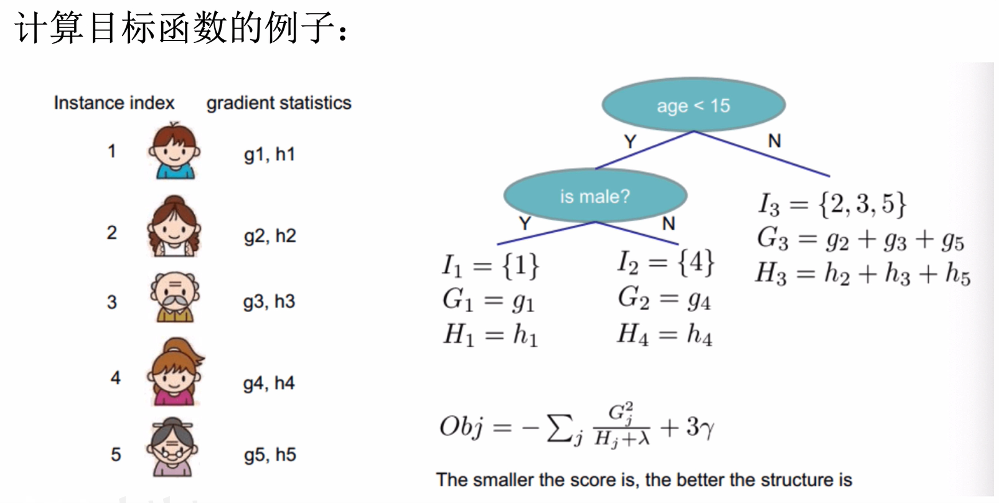

### 学习策略 - 确定树结构

采用贪心算法，每次尝试分裂一个叶节点，计算分裂后的增益，选择增益最大的。类似于在ID3中的信息增益，和CART树中的基尼指数，那XGBoost中怎么计算增益呢？损失函数是：
$$
O b j^{(t)}=-\frac{1}{2} \sum_{j=1}^{T}\left(\frac{G_{j}^{2}}{H_{j}+\lambda}\right)+\gamma T
$$
其中红色部分衡量了叶子节点对总体损失的贡献，目标函数越小越好，则红色部分就越大越好，在XGBoost中增益计算方法是：

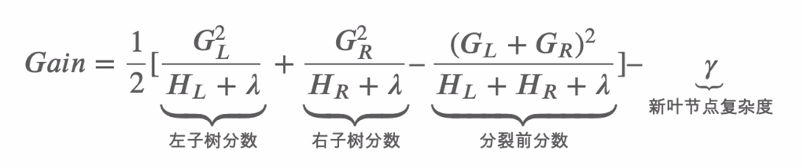

Gain值越大，说明分裂后能使目标函数减少的越多，也就是越好。

#### 精确 贪心算法

就像CART树一样，枚举所有的特征和特征值，计算树的分裂方式


假设枚举年龄特征 xj，考虑划分点 a，计算枚举 xj < a  和 a <= xj的导数和：

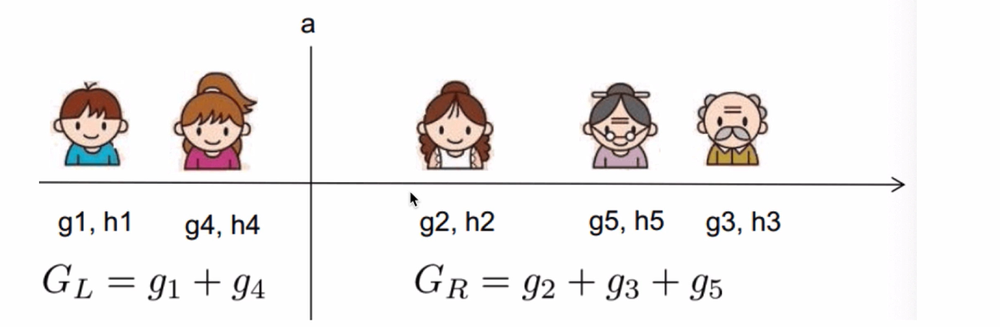

对于一个特征，对特征取值排完序后，枚举所有的分裂点a，只要从左到右扫描就可以枚举出所有分割的梯度GL和GR，计算增益。假设树的高度为H，特征数d，则复杂度为O（ Hanlon）。其中，排序为0（logn），每个特征都要排序乘以d，每一层都要这样一遍，所以乘以高度H。

#### 近似算法

当数据量庞大，无法全部存入内存中时，精确算法很慢，因此引入近似算法。根据特征k的分布确定L个候选切分点Sk={Sk1，Sk2，…Sk } 然后根据候选切分点把相应的样本放入对应的桶中，对每个桶的GH进行累加，在候选切分点集合上进行精确贪心査找。算法描述如

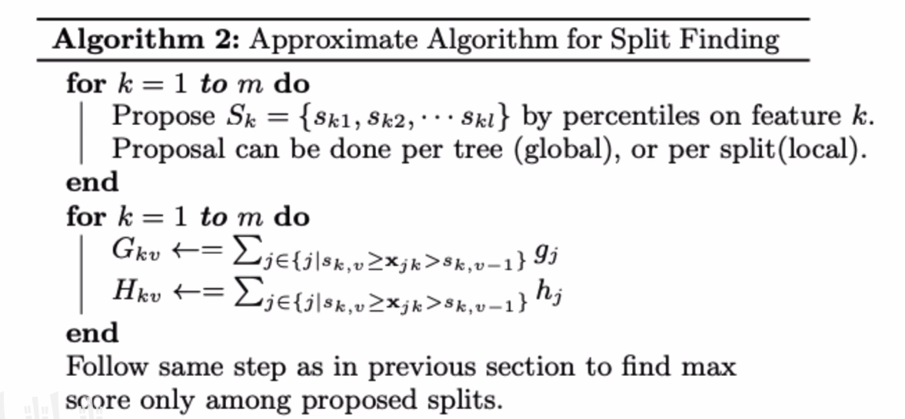

根据分位数给出相应的候选切分点，简单例子如下所示：

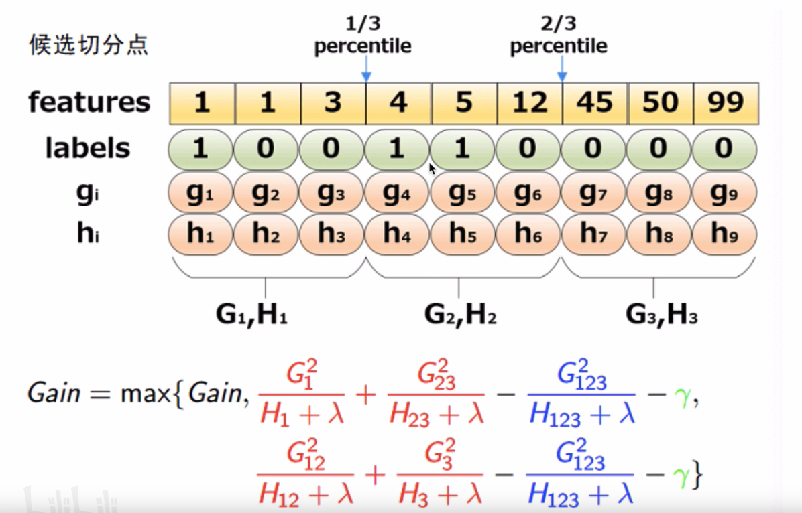

何时选取划分点？全局策略（Global）和局部策略（Local）

- 全局策略：学习每棵树前，提出候选的切分点，当切分点树足够多的时候，和精确的贪心算法性能相当
- 局部策略：树节点分裂时，重新提出候选切入点，切分点个数不需要这么多，性能与贪心算法相差不多。

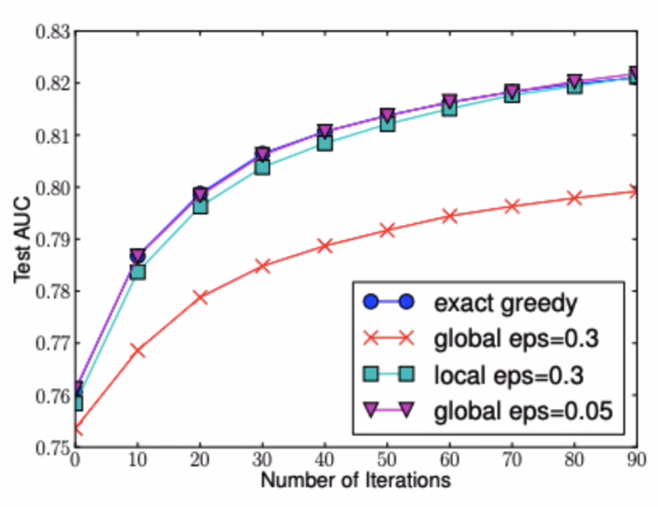

XGBoost中没有采用简单的分位数方法，而是提出了以二阶梯度h为权重的分位数算法（Weighted Quantile Sketch），对特征K构造multi-set的数据集：
$$
D_{k}=\left(x_{1 k}, h_{1}\right),\left(x_{2 k}, h_{2}\right), \ldots,\left(x_{n k}, h_{n}\right)
$$
其中，X表示样本的特征k的取值，而h是对应的二阶梯度 定义一个 rank function，表示第k个特征小于z的样本比例:
$$
r_{k}(z)=\frac{1}{\sum_{(x, h) \in D_{k}} h} \sum_{(x, h) \in D_{k}, x<z} h
$$


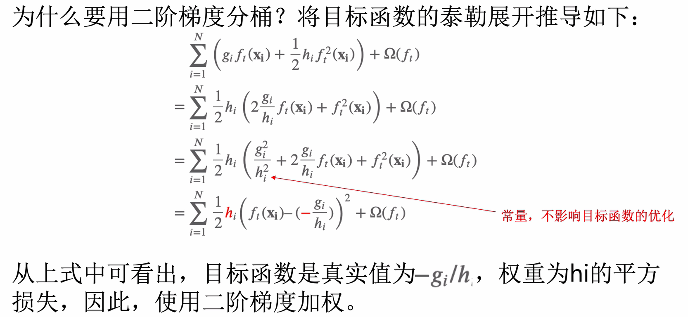

#### 稀疏值的处理

稀疏值产生的原因：数据缺失值，大量的零值，One-hot编码，XGBoost能对缺失值自动进行处理，思想是对于缺失值自动学习出它该，划分的方向，流程如右图所示

简单来说

- 将特征k的缺失值都放在右子树，枚举划分点，计算最大的gan
- 将特征k的缺失值都放在左子树，枚举划分点，计算最大的gain最后求出最大增益，确定缺失值的划分

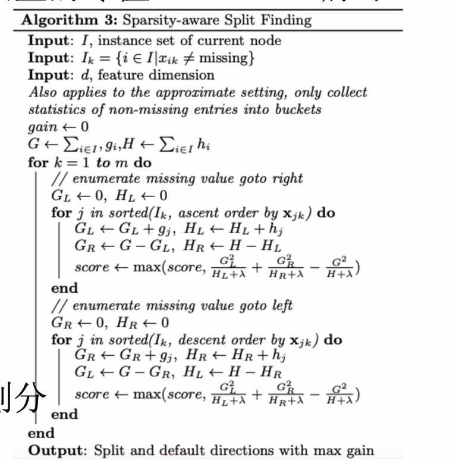

#### 步长

在XGBoost中也加入了步长，也叫收缩率
$$
\hat{y}_{i}^{t}=\hat{y}_{i}^{(t-1)}+\eta f_{t}\left(x_{i}\right)
$$
这有助于防止过拟合，步长通常取0.1

#### 列采样

 列抽样技术：一种是按层随机，另一种是按树随机（构建树前就随机选择特征）。

- 按层随机方式，在每次分裂一个结点的时候，对同一层内的每个结点分裂之前，先随机选择一部分特征，这时候只需要遍历一部分特征，来确定最后分割点。
- 按树随机方式，即构建树结构前就随机选择特征，之后所有叶子结点的分裂都只使用这部分特征

### 系统设计

在构建树的过程中，最耗时是找最优的切分点，而这个过程中，最耗时的部分是将数据排序。为了减少排序的时间，提出了Block结构存储数据。

- Block中数据以稀疏格式CSC进行存储
- Block中的特征进行排序（不对缺失值排序）
- Block中特征还需存储指向样本的索引，这样才能根据特征的值来取梯度
- 一个Block中存储一个或多个特征的值

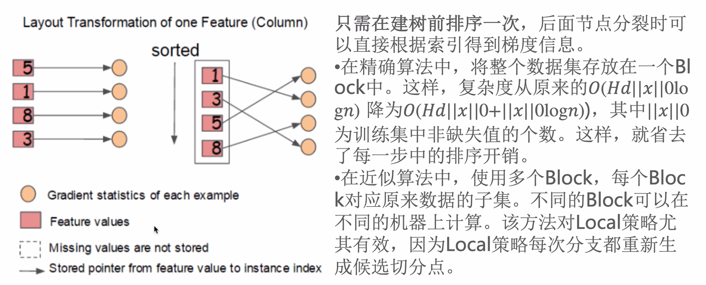

使用Block结构的缺点是获取梯度的时候，是通过索引来获取的，而这些梯度的获取顺序是按照特征的大小顺序的，这将导致非连续的内存访问，可能使得CPU cache缓存命中率低，从而影响算法效率。


对于精确算法中，使用缓存预取，具体来说，对每个线程分配一个连续的Buffer，读取梯度信息并存入Buffer中，这样就实现了非连续到连续的转换，然后在统计梯度信息，该方式在训练样本数大的时候特别有用

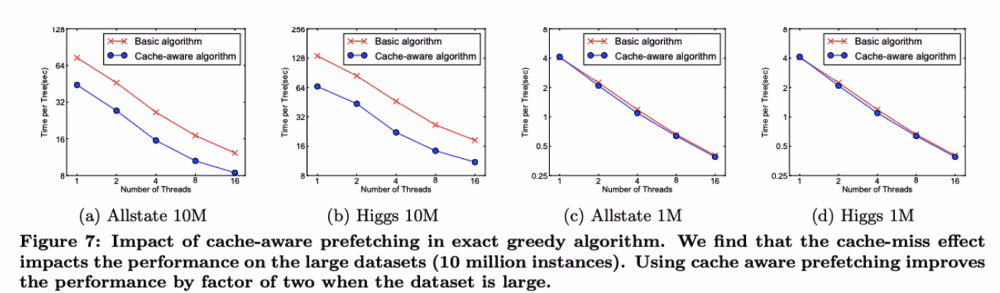

当数据量太大不能全部放入主内存的时候，为了使得out-of-core计算成为可能，将数据划分为多个Block并存放在磁盘上。

- 计算的时候，使用独立的线程预先将Block放入主内存，因此可以在计算的同时读取磁盘
- Block压缩，貌似采用的是近些年性能比较出色的LZ4压缩算法，按列进行压缩，读取的时候用另外的线程解压。对于行索引，只保存第一个索引值，然后用16位的整数保存与该Block第一个索引的差值。
- Block Sharding，将数据划分到不同的硬盘上，提高磁盘吞吐量。

### 实践

安装XGBoost的工具，使用skLearn中的鸢尾花和波士顿放假的数据，完成分类和回归的演示。


## LightGBM

LightGBM也是属于GBDT算法，是一款常见的GBDT的工具包，由微软亚洲研究院开发，速度比XGBoost快，精度也还可以，它的设计理念是

- 单个机器在不牺牲速度的情况下，尽可能使用更多的数据
- 多机并行的时候，通信的代价尽可能地低，并且在计算上可以做到线性加速

所以其使用分布式的GBDT，选择了基于直方图的决策树算法。

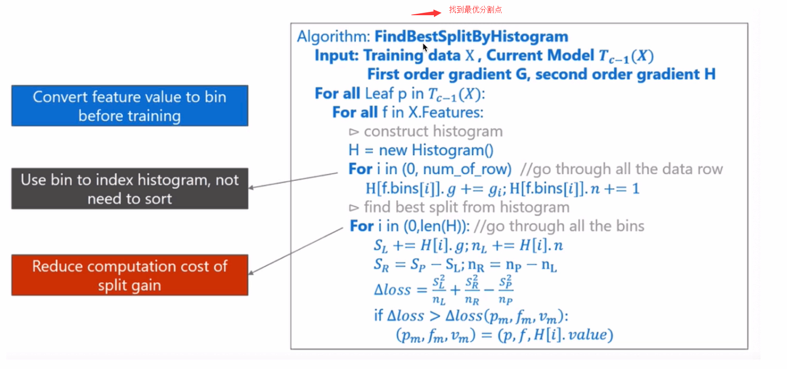

LightGBM 和 XGBoost的对比如下

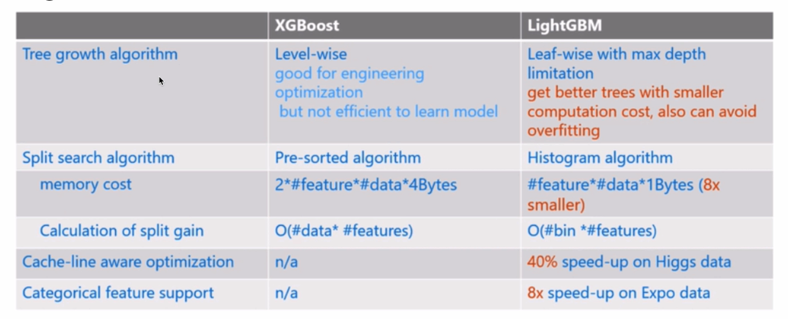

### 直方图算法

XGBoost中的Exact Greedy（贪心）算法：

- 对每个特征都按照特征值进行排序
- 在每个排好序的特征都寻找最优切分点
- 用最优切分点进行切分

优点是比较精确，缺点是空间消耗比较大，时间开销大和对内存不友好，使用直方图算法进行划分点的查找可以克服这些缺点。


直方图算法 （Histogram algorithm）把连续的浮点特征值离散化为K个整数（也就是分桶bins的思想），比如【0，0.1】 -> 0，【0.1, 0.3】-> 1。并根据特征所在的bin对其进行梯度累加和个数统计，然后根据直方图，寻找最优的切分点

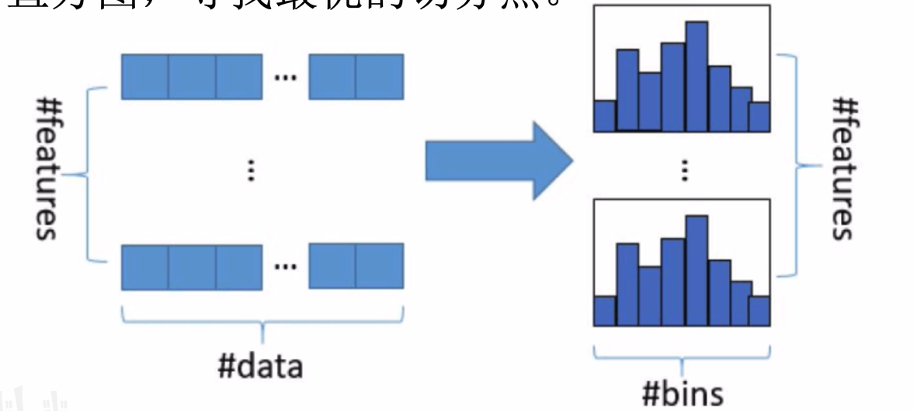

直方图构建算法：

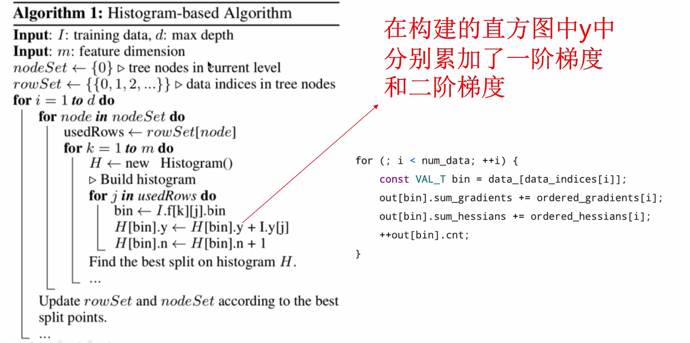

#### 如何分桶

数值型特征和类别特征采用的方法是不同的

**数值型特征**

- 对特征值去重后进行排序（从大到小），并统计每个值的counts
- 取max_bin和distinct_value.size()中较小的值作为bins_num
- 计算bins中的平均样本个数 mean_bin_size，若某个distinct_value的count大于mean_bin_size，则该特征作为bins的上界，小于该特征值的第一个distinct value作为下界，若某个distinct_value的count小于mean_bin_size，则要进行累计后在分组。

 **类别型特征**

- 首先对特征取值按出现的次数排序（大到小）
- 取前min（max_bin，distinct_values_int.size() ）中 的每个特征做第3步，忽略一些出现次数很少的特征取值
- 用bin_2_categorical_bin_2_categorical_（vector类型）和categorical_2_bin_categorical_2_bin 将特征取值和bin一一对应起来，这样就可以方便进行两者之间的切换了。

#### 构建直方图

给定一个特征值，我们可以转换为对应的bin了，就要构建直方图了，直方图累加了一阶梯度和二阶梯度，并统计了取值的个数

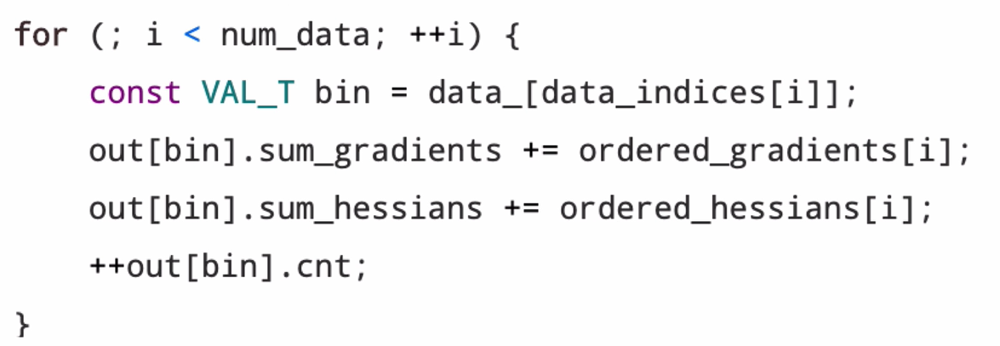

#### 直方图作差

一个叶子节点的直方图可以由它的父亲节点的直方图与其兄弟节点的直方图做差得到，使用这个方法，构建完一个叶子节点的直方图后，就可以用较小的代价得到兄弟节点的直方图，相当于速度提升了一倍

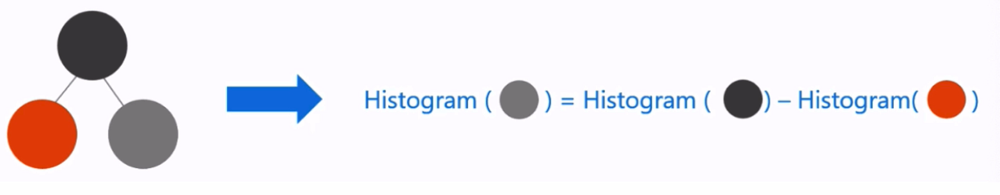

#### 寻找最优的切分点

最优的切分点

- 遍历所有的bin
- 以当前的bin作为分割点，累加左边的bins至当前bin的地图和Sl及样本数量nl，并利用直方图做差求得右边的梯度和样本数量
- 带入公司计算增益loss
- 在遍历过程中取得最大的增益，以此时的特征和bin的特征值作为分裂节点的特征及取值。

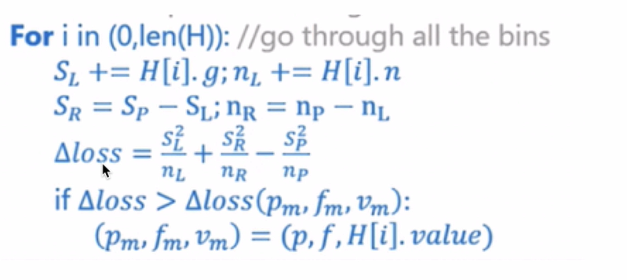

#### 直方图算法的优点

- 减少内存占用
- 缓存命中率提高，直方图中梯度的存放是连续的
- 计算效率提高，相对于XGBoost中预排序每个特征遍历数据，复杂度为O(Feature * data)，而直方图算法之需要遍历每个特征的直方图即可，复杂度为O(Feature * bins)
- 在进行数据并行时，可大幅度降低通信代价

### 直方图算法的改进

直方图算法仍有优化的空间，建立直方图的复杂度为O(feature * data)，如果能降低特征数或者降低样本数，训练的时间会大大减少，加入特征存在冗余时，可以使用PCA等算法降维，但特征通常是精心设计的，去除他们中的任何一个可能会影响训练精度，因此LightGBM提出了GOSS算法和EFB算法。

### GOSS算法

样本的梯度越小，样本的训练误差就越小，表示样本已训练的很好，直接的做法就是丢掉这部分样本，然而丢掉会影响数据的分布，因此在LightGBM中采取了one-side采样的方式来适配，GOSS采样策略，它保留所有的大梯度样本，对小梯度样本进行随机采样。


原始直方图算法下，在第j个特征，值为d处进行分裂带来的增益可以定义为：
$$
\begin{aligned}
V_{j | O}(d) &=\frac{1}{n_{O}}\left(\frac{\left(\sum_{x_{i} \in A_{l}} g_{i}+\frac{1-a}{b} \sum_{x_{i} \in B l} g_{i}\right)^{2}}{n_{l}^{j}(d)}+\frac{\left(\sum_{x_{i} \in A_{r}} g_{i}+\frac{1-a}{b} \sum_{x_{i} \in B_{l}} g_{r}\right)^{2}}{n_{r}^{j}(d)}\right) \\
\text { 其中 } A_{l} &=x_{i} \in A: x_{i j} \leq d, A_{r}=x_{i} \in A: x_{i j}>d \\
B_{l}=x_{i} & \in B: x_{i j} \leq d, B_{r}=x_{i} \in B: x_{i j}>d
\end{aligned}
$$
注意：A表示大梯度样本集，而B表示小梯度样本中随机采样的结果。

### EFB算法

高维数据通常是稀疏的，而且许多特征是互斥的，即两个或多个特征列不会同时为非0，LightGBM根据这一特点提出了EFB算法，将互斥特征进行合并，能够合并的特征为#bundle，从而将特征的维度降下来，响应的，构建histogram锁耗费的时间复杂度也从O(data * feature)变成了O（data * bundle），其中feature << bundle，方法说起来很简单，但是实现起来有两大难点

- 哪些特征可以合并为一个bundle？：Greedy bundle
- 如果将特征合并为bundle，实现降维：Merge Exclusive Features

Greedy bundle的原理与图着色相同，给定一个图G，定点为V，表示特征，边为E，表示特征之间的互斥关系，接着采用贪心算法对图进行着色，一次来生成Bundle。

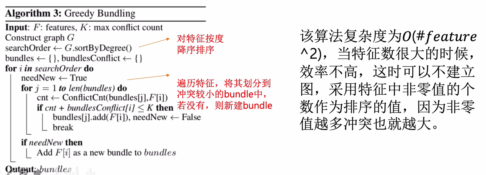

MEF(Merge Exclusive Features)将bundle中的特征合并为新的特征，合并的关键是原有的不同特征值在构建后的bundle中仍能够识别，由于急于histogram的方法存储的是离散的bin而不是连续的数值，因此可以通过添加偏移的方法将不同的特征的bin值设定为不同的区间。

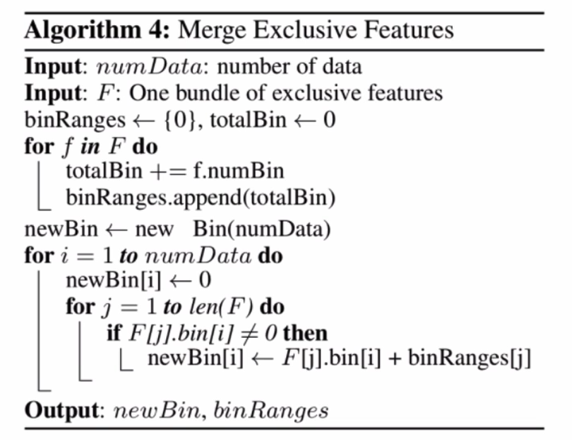


### 树的生长策略

在XGBoost中，树是按层生长的，同一层的所有节点都做分裂，最后剪枝，他不加区分的对待同一层的叶子，带来了很多没必要的开销，因为实际上很多叶子的分裂增益较低，没必要进行搜索和分裂。

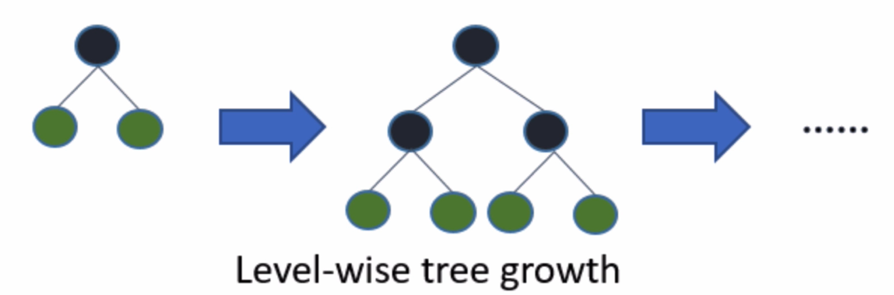

LightGBM的生长策略是leaf-wise，以降低模型损失最大化为目的，对当前所有叶子节点中切分增益最大的leaf节点进行切分，leaf-wise的缺点是生成比价深的决策树，为了防止过拟合，可以在模型中设置决策树的深度。


### 系统设计

LightGBM具有支持高效并行的特点，原生支持并行学习，目前支持

- 特征并行
- 数据并行
- Voting（投票）并行（数据并行的一种）

### 特征并行

特征并行是并行化决策树中寻找最优划分点的过程，特征并行是将对特征进行划分，每个worker找到局部的最佳切入点，使用点对点通信找到全局的最佳切入点

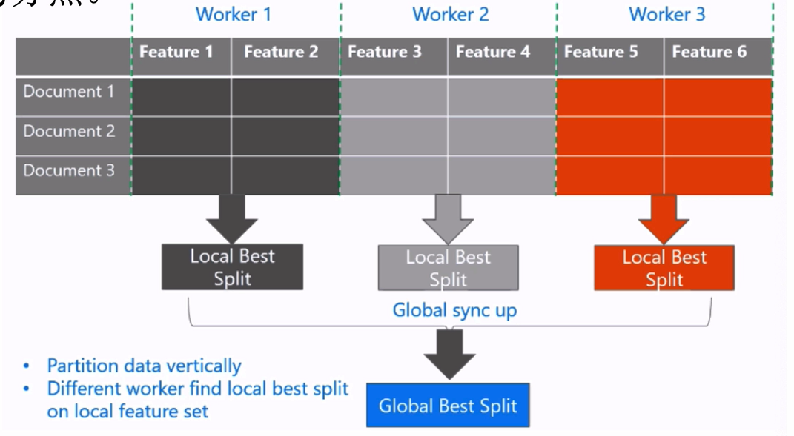

#### 传统算法

不同的worker存储不同的特征集，在找到全局的最佳划分点后，具有该划分点的worker进行节点分裂，然后广播切分后的左右子树数据结果，其它worker收到结果后也进行划分。

#### LightGBM中的算法

每个worker中保存了所有的特征集，在找到全局的最佳划分点后，每个worker可自行进行划分，不在进行广播划分结果，减小了网络的通信量，但存储代价变高。


### 数据并行

数据并行的目标是并行化整个决策学习的过程，每个worker中拥有部分数据，独立的构建局部直方图，合并后得到全局直方图，在全局直方图中寻找最优切分点进行分裂。

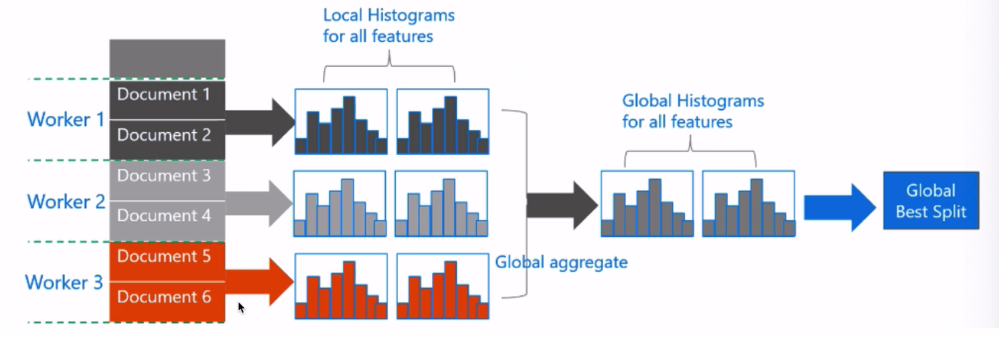

### Voting Parallel 投票并行

LightGBM采用一种称为PV-Tree的算法进行投票并行，其实这本质上也是数据并行的一种，PV-Tree和普通的决策树差不多，只是在寻找最优切分点上有所不同

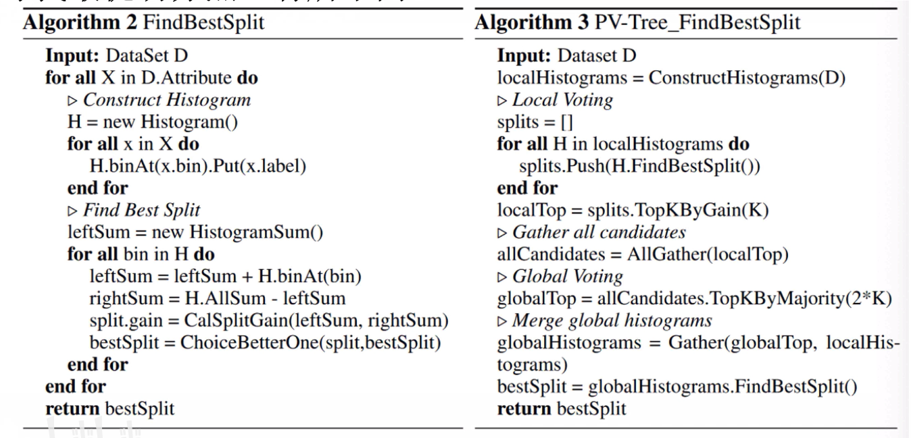

每个worker拥有部分数据，独自构建直方图并找到 top-k最优的划分特征，中心worker聚合得到最优的2K个全局划分特征，再向每个worker收集top-2k特征的直方图，并进行合并得到最优划分，广播给所有worker进行本地划分。

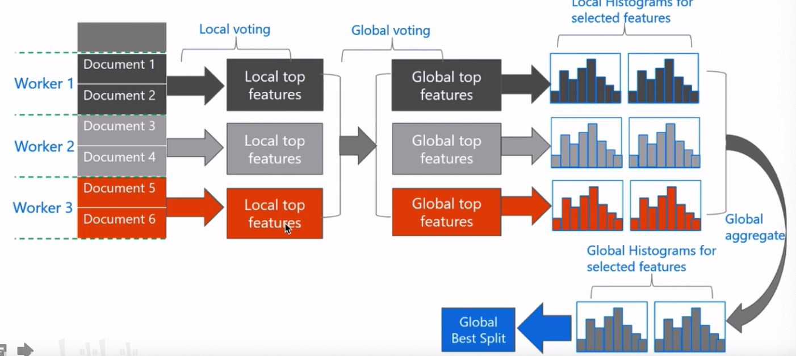

### 实践

使用XGBoost设置树的深度，在LightGBM中是叶子节点的个数

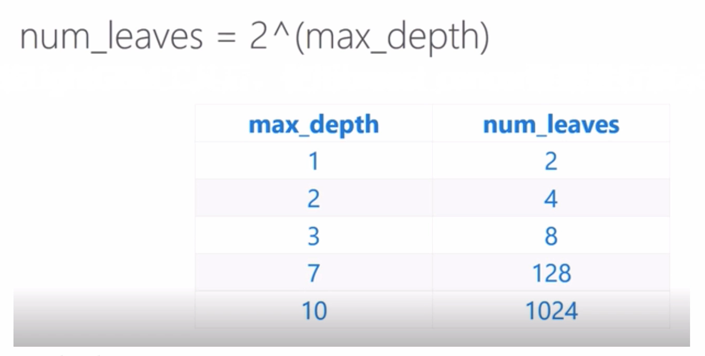

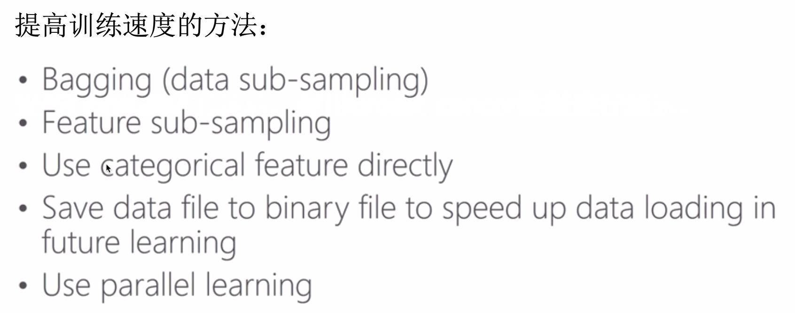

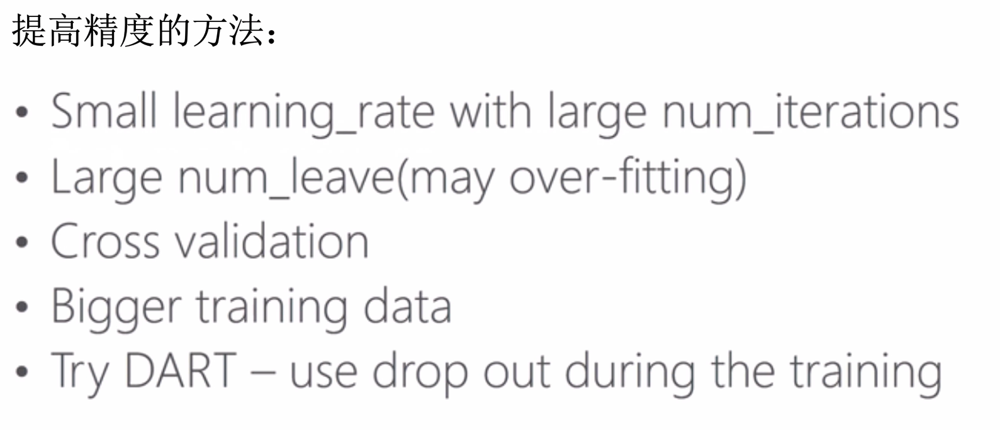

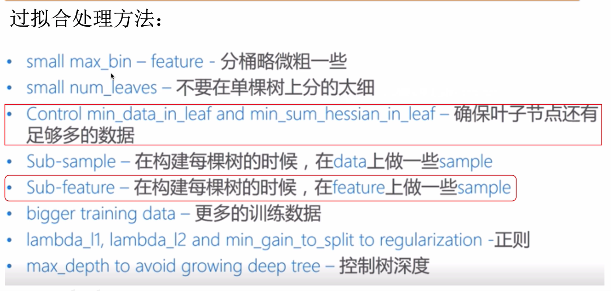