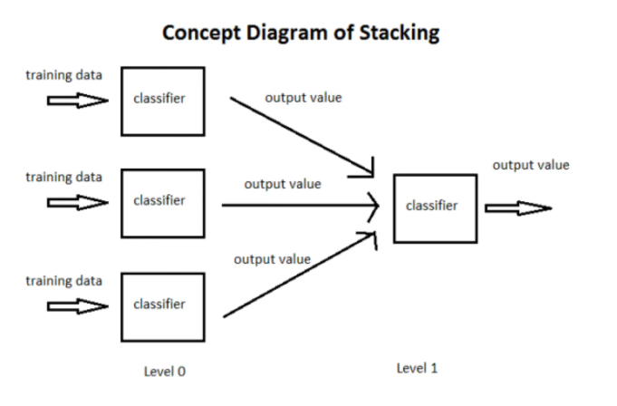
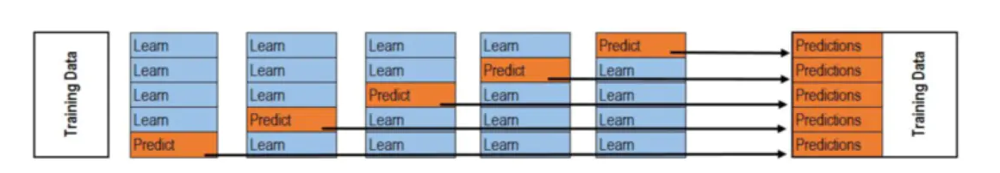
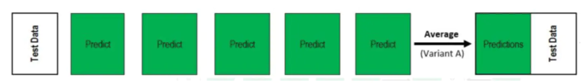

# Stacking

## 原理

stacking 就是当用初始训练数据学习出若干个基学习器后，将这几个学习器的预测结果作为新的训练集，来学习一个新的学习器。




## Stacking分类应用

这里我们用二分类的例子做介绍。 例如我们用 RandomForestClassifier, ExtraTreesClassifier, GradientBoostingClassifier 作为第一层学习器（当然这里我们可以添加更多的分类器，也可以用不同的特征组合但是同样的学习方法作为基分类器）：

```python
clfs = [
        RandomForestClassifier(n_estimators = n_trees, criterion = 'gini'),
        ExtraTreesClassifier(n_estimators = n_trees * 2, criterion = 'gini'),
        GradientBoostingClassifier(n_estimators = n_trees),
    ]
```

接着要训练第一层学习器，并得到第二层学习器所需要的数据，这里会用到 k 折交叉验证。我们首先会将数据集进行一个划分，比如使用80%的训练数据来训练，20%的数据用来测试，

```
dev_cutoff = len(Y) * 4/5
    X_dev = X[:dev_cutoff]
    Y_dev = Y[:dev_cutoff]
    X_test = X[dev_cutoff:]
    Y_test = Y[dev_cutoff:]
```

然后对训练数据通过交叉验证训练 clf，并得到第二层的训练数据 blend_train,同时，在每个基分类器的每一折交叉验证中，我们都会对测试数据进行一次预测，以得到我们blend_test，二者的定义如下：

```python
blend_train = np.zeros((X_dev.shape[0], len(clfs))) # Number of training data x Number of classifiers
blend_test = np.zeros((X_test.shape[0], len(clfs))) # Number of testing data x Number of classifiers
```

按照上面说的，blend_train基于下面的方法得到，注意，下图是对于一个分类器来说的，所以每个分类器得到的blend_train的行数与用于训练的数据一样多，所以blend_train的shape为X_dev.shape[0]*len(clfs)，即训练集长度 * 基分类器个数：



而对于第二轮的测试集blend_test来说，由于每次交叉验证的过程中都要进行一次预测，假设我们是5折交叉验证，那么对于每个分类器来说，得到的blend_test的shape是测试集行数 * 交叉验证折数，此时的做法是，对axis=1方向取平均值，以得到测试集行数 * 1 的测试数据，所以总的blend_test就是测试集行数 * 基分类器个数，可以跟blend_train保持一致：



得到blend_train 和 blend_test的代码如下：

```python
for j, clf in enumerate(clfs):
        print 'Training classifier [%s]' % (j)
        blend_test_j = np.zeros((X_test.shape[0], len(skf))) # Number of testing data x Number of folds , we will take the mean of the predictions later
        for i, (train_index, cv_index) in enumerate(skf):
            print 'Fold [%s]' % (i)
            
            # This is the training and validation set
            X_train = X_dev[train_index]
            Y_train = Y_dev[train_index]
            X_cv = X_dev[cv_index]
            Y_cv = Y_dev[cv_index]
            
            clf.fit(X_train, Y_train)
            
            # This output will be the basis for our blended classifier to train against,
            # which is also the output of our classifiers
            blend_train[cv_index, j] = clf.predict(X_cv)
            blend_test_j[:, i] = clf.predict(X_test)
        # Take the mean of the predictions of the cross validation set
        blend_test[:, j] = blend_test_j.mean(1)
    
```

接着我们就可以用 blend_train, Y_dev 去训练第二层的学习器 LogisticRegression(当然也可以是别的分类器，比如lightGBM，XGBoost）：

```
 bclf = LogisticRegression()
bclf.fit(blend_train, Y_dev)
```

最后，基于我们训练的二级分类器，我们可以预测测试集 blend_test，并得到 score：

```
Y_test_predict = bclf.predict(blend_test)
score = metrics.accuracy_score(Y_test, Y_test_predict)
print 'Accuracy = %s' % (score)
```

如果是多分类怎么办呢，我们这里就不能用predict方法啦，我么要用的是predict_proba方法，得到基分类器对每个类的预测概率代入二级分类器中训练，修改的部分代码如下：

```python
blend_train = np.zeros((np.array(X_dev.values.tolist()).shape[0], num_classes*len(clfs)),dtype=np.float32)  # Number of training data x Number of classifiers
blend_test = np.zeros((np.array(X_test.values.tolist()).shape[0], num_classes*len(clfs)),dtype=np.float32)  # Number of testing data x Number of classifiers

    # For each classifier, we train the number of fold times (=len(skf))
    for j, clf in enumerate(clfs):
        for i, (train_index, cv_index) in enumerate(skf):
            print('Fold [%s]' % (i))

            # This is the training and validation set
            X_train = X_dev[train_index]
            Y_train = Y_dev[train_index]
            X_cv = X_dev[cv_index]

            X_train = np.concatenate((X_train, ret_x),axis=0)
            Y_train = np.concatenate((Y_train, ret_y),axis=0)
            clf.fit(X_train, Y_train)
            blend_train[cv_index, j*num_classes:(j+1)*num_classes] = clf.predict_proba(X_cv)
            blend_test[:, j*num_classes:(j+1)*num_classes] += clf.predict_proba(X_test)
blend_test = blend_test / float(n_folds)
```

上面的代码修改的主要就是blend_train和blend_test的shape，可以看到，对于多分类问题来说，二者的第二维的shape不再是基分类器的数量，而是class的数量*基分类器的数量，这是大家要注意的，否则可能不会得到我们想要的结果。

## 参考

https://www.jianshu.com/p/3d2bd58908d0

https://blog.csdn.net/u012526003/article/details/79109418