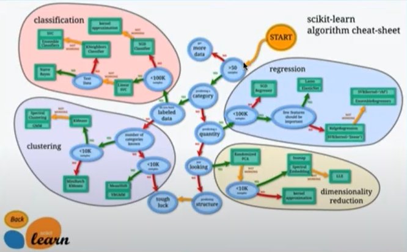
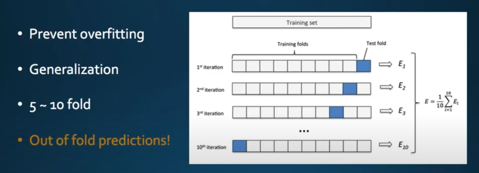
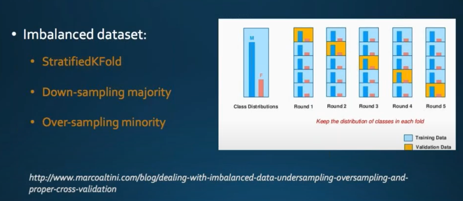
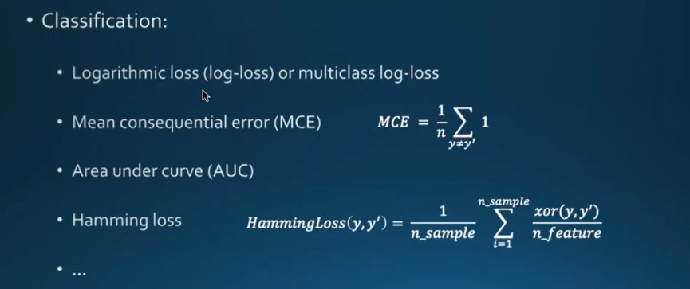
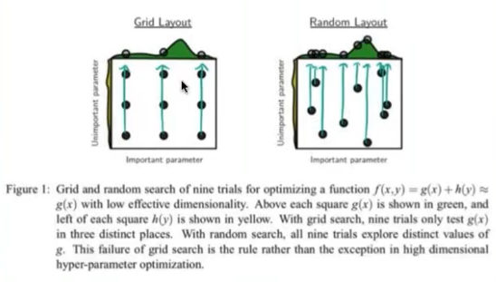

# 模型融合方法

youtube视频介绍模型融合：

https://www.youtube.com/watch?v=BS4SY3HhVDI&t=4320s

Kaggle比赛上的，介绍模型组合

https://www.kaggle.com/arthurtok/introduction-to-ensembling-stacking-in-python

## BasicModel：Start From simple

- 让你的第一个模型开始工作
  - 交叉验证:通常为5 - 10倍
  - 了解模型评估指标估计器的
  - 初始超参数调优
  - 提交：观看CV评分和公共排名

- 尝试不同的算法
- 基线作为一个单一的模型

## Alogorithms

## Cross-validation

交叉验证

不平衡的数据集

## Model Evaluation

取决于不同的比赛

回归问题

- Mean absolute error（MAE）
- Root mean squared error（RMSE）

分类问题

- Logarithmic loss（log-loss）or multiclass log-loss
- Mean consequential error（MCE）
- Area under curve（AUC）
- Hamming loss

## Hyper-parameter Optimization

- Grid search
  - Brute force
  - Expensive computation
  - Less efficient
- Random Search

