# 机器学习算法之Boosting算法

原文链接：

- https://www.biaodianfu.com/lightgbm.html
- https://www.biaodianfu.com/xgboost.html
- https://www.biaodianfu.com/boosting.html


## 机器学习分类

- 监督学习

  在监督学习中，训练数据由输入和期望的输出组成，然后对非训练数据进行预测输出，也就是找出输入x与输出y之间的函数关系F：y = F(x)。根据输出的精确特性又可以分为分类和回归。分类和回归的区别在于输出变量的类型。

  - 定量输出称为回归，或者说是连续变量预测。
  - 定性输出称为分类，或者说是离散变量预测。

  举个例子：

  - 预测明天的气温是多少度，这是一个回归任务。
  - 预测明天是阴、晴还是雨，就是一个分类任务。

  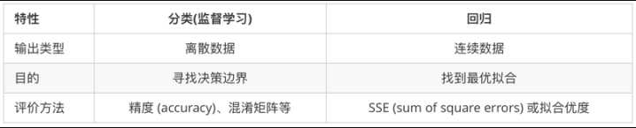

- 无监督学习

  无监督学习是一种机器学习方法，用于发现数据中的模式。输入无监督算法的数据都没有标签，也就是只为算法提供了输入变量(X)而没有对应的输出变量。在无监督学习中，算法需要自行寻找数据中的有趣结构。

  无监督学习问题可以有以下三种类型：

  - 关联：发现目录中项目共现的概率。其广泛应用于“购物篮分析”。例如，如果一个顾客购买了面包，他会有80% 的概率也购买鸡蛋。
  - 聚类：将样本分组，这样，同一聚类中的物体与来自另一聚类的物体相比，相互之间会更加类似。
  - 降维：正如其含义，降维指减少一个数据集的变量数量，同时保证还能传达重要信息。降维可以通过特征抽取方法和特征选择方法完成。特征选择方法会选择初始变量的子集。特征抽取方法执行从高维度空间到低维度空间的数据转换。例如，PCA算法就是一种特征抽取方式。

## 集成学习

集成学习是通过训练弱干个弱学习器，并通过一定的结合策略，从而形成一个强学习器。有时也被称为多分类器系统（multi-classifier system）、基于委员会的学习（committee-based learning）等。

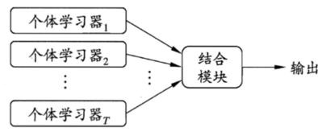

集成学习先产生一组“个体学习器”（individual learner），再用某种策略将它们结合起来。通常来说，很多现有的学习算法都足以从训练数据中产生一个个体学习器。一般来说，我们会将这种由个体学习器集成的算法分为两类

- 同质（homogeneous）的，即集成中仅包含同种类型的一个体学习器，像“决策树集成”中就仅包含决策树，“神经网络集成”中就全是神经网络。同质集成中的个体学习器又称为基学习器（base learner），相应的学习算法也被称为基学习算法（base learning algorithm）。
- 异质（heterogenous）的，相对同质，异质集成中的个体学习其就是由不同的学习算法生成的，这是，个体学习器就被称为组件学习器（component learner）

其中用的比较多的是同质学习器。同质学习器按照个体学习器之间是否存在依赖关系可以分为两类：

- 第一个是个体学习器之间存在强依赖关系，一系列个体学习器基本都需要串行生成，代表算法是boosting系列算法；
- 第二个是个体学习器之间不存在强依赖关系，一系列个体学习器可以并行生成，代表算法是bagging和随机森林（Random Forest）系列算法。

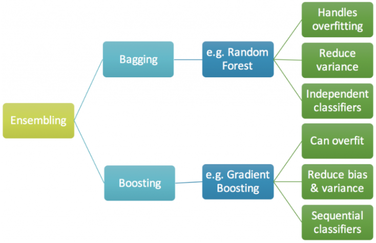

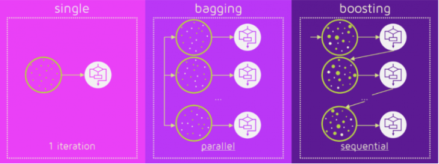

现在我们来简单评估一下集成学习方法的性能：考虑一个简单的例子，在二分类任务中，假定三个分类器在三个测试样本上的表现如下图所示，其中√代表正确，×代表分类错误，集成学习的结果则是由投票法（voting）决出，即“少数服从多数”：

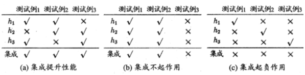

在a图中每个分类器只有66.6%的精度的时候，集成学习达到了100%的精度；在b图中，三个分类器相同导致集成性能没有提高；c图中由于每个分类器的精度只有33.3%导致集成学习的效果变得更糟。由此我们可以看出来，集成学习中对个体学习器的要求应该是“好而不同”，即既满足准确性，又满足多样性（diversity），也即是说，学习器既不能太坏，而且学习器与学习器之间也要有差异。

随着集成中个体分类器数目T的增大，集成的错误率将指数级下降从而最终趋于0（这里还有一个前置条件就是个体分类器的错误率不能大于50%）。但我们曾假设各个分类器之间的错误率是相互独立的，而实际上再同一个任务中个体学习器视为解决同一个问题训练出来的，这也就意味着它们之间显然不可能相互独立。换句话说，个体学习器的“准确性”和“多样性”本身也是存在冲突的。一般的，准确性很高之后，若要增加多样性就需要准确性做出一定的牺牲。因此，如何产生“好而不同”的个体学习器，便是集成学习研究的核心

目前，有三种常见的集成学习框架：bagging，boosting和stacking。国内，南京大学的周志华教授对集成学习有很深入的研究，其在09年发表的一篇概述性论文[《](http://cs.nju.edu.cn/zhouzh/zhouzh.files/publication/springerEBR09.pdf)[Ensemble Learning》](http://cs.nju.edu.cn/zhouzh/zhouzh.files/publication/springerEBR09.pdf)对这三种集成学习框架有了明确的定义，概括如下：

Bagging：从训练集从进行子抽样组成每个基模型所需要的子训练集，对所有基模型预测的结果进行综合产生最终的预测结果：

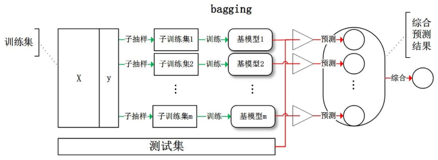


Boosting：训练过程为阶梯状，基模型按次序一一进行训练（实现上可以做到并行），基模型的训练集按照某种策略每次都进行一定的转化。对所有基模型预测的结果进行线性综合产生最终的预测结果：

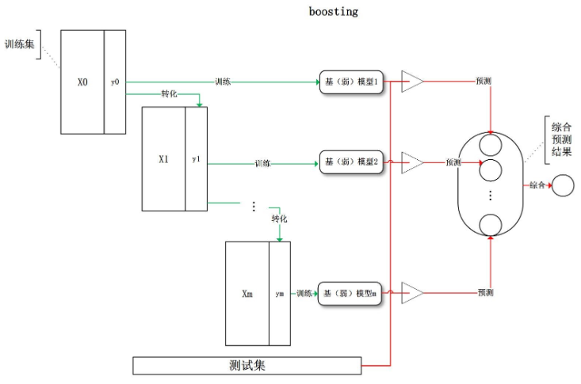

Stacking：将训练好的所有基模型对训练基进行预测，第j个基模型对第i个训练样本的预测值将作为新的训练集中第i个样本的第j个特征值，最后基于新的训练集进行训练。同理，预测的过程也要先经过所有基模型的预测形成新的测试集，最后再对测试集进行预测

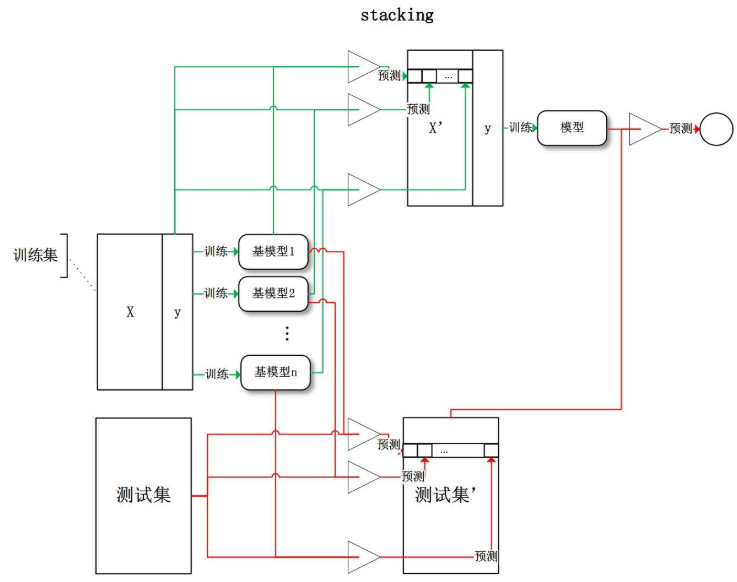

有了这些基本概念之后，直觉将告诉我们，由于不再是单一的模型进行预测，所以模型有了“集思广益”的能力，也就不容易产生过拟合现象。但是，直觉是不可靠的，接下来我们将从模型的偏差和方差入手，彻底搞清楚这一问题。

## 什么是Boosting？

Boosting 是个非常强大的学习方法, 它也是一个监督的分类学习方法。它组合许多“弱”分类器来产生一个强大的分类器组。一个弱分类器的性能只是比随机选择好一点，因此它可以被设计的非常简单并且不会有太大的计算花费。将很多弱分类器结合起来组成一个集成的类似于SVM或者神经网络的强分类器。

现在我们知道boosting是组合多个弱学习器形成一个强学习器，那么一个自然而然的问题就是“boosting如何确定弱的规则？”为了发现弱的规则，我们可以应用不同分配下的基础的（机器）学习算法，每个算法都会生成一个弱规则，这是一个迭代的过程，多次迭代后，Boosting算法可以将它们组合成一个强大的决策规则。为了选择正确的分配方式，可以遵循下面几个步骤：

- 步骤1：所有分布下的基础学习器对于每个观测值都应该有相同的权重
- 步骤2：如果第一个基础的学习算法预测错误，则该点在下一次的基础学习算法中有更高的权重
- 步骤3：迭代第2步，直到到达预定的学习器数量或预定的预测精度。

最后，将输出的多个弱学习器组合成一个强的学习器，提高模型的整体预测精度。Boosting总是更加关注被错误分类的弱规则。

Boosting算法的底层可以是任何算法，关于boosting算法，我们需要知道其中最有名的3个算法：

- AdaBoost(Adaptive Boosting)
- GBM(Gradient Boosting Machine)
- XGBoost

## AdaBoost

假设我们有一个分类问题，给定一个训练样本集，从这个分类问题中求出一个粗糙的分类规则（弱分类器）往往要比求一个精确的分类规则（强分类器）容易得多。提升方法便是从弱学习算法出发，反复学习得到一系列弱分类器（又称为基本分类器），然后通过组合这些弱分类器来构成一个强分类器。大多数的提升方法都是改变训练数据的概率分布（或说训练数据的权值分布），来针对不同的训练分布调用弱学习算法学习一系列弱分类器。这样一来，对于提升方法而言，就有了两个问题需要去解决：

- 在每一轮如何改变训练数据的权值或概率分布？
- 如何将弱分类器组合成一个强分类器？

AdaBoost针对第一个问题的做法是提高那些被前一轮弱分类器错误分类样本的权值，并降低那些被正确分类的样本的权值。经过一轮的权值加大后，后一轮的弱分类器就会更关注那些没有被正确分类的样本。持续下去，分类问题便会被一系列弱分类器“分而治之”。而对于第二个问题，即弱分类器的组合，AdaBoost采取加权多数表决法，具体的所，就是加大误差率小的弱分类器的权值，使其在表决中起更大的作用，另一方面，减小分类误差率大的弱分类器的权值，使其在表决中起较小的作用。

下面这张图对Ada-boost做了恰当的解释：

- Box 1: 你可以看到我们假设所有的数据点有相同的权重（正号、负号的大小都一样），并用一个决策树桩D1将它们分为两部分。我们可以看到这个决策树桩将其中的三个正号标记的数据点分类错误，因此我们将这三个点赋予更大的权重交由下一个预测树桩进行分类。
- Box 2: 在这里你可以看到三个未被正确分类的（+）号的点的权重变大。在这种情况下，第二个决策树桩D2试图将这三个错误的点准确的分类，但是这又引起新的分类错误，将三个（-）号标记的点识别错误，因此在下一次分类中，这三个（-）号标记的点被赋予更大的权重。
- Box 3: 在这里三个被错误分类的（-）号标记的点被赋予更大的权重，利用决策树桩D3进行新的分类，这时候又产生了新的分类错误，图中用小圆圈圈起来的一个负号点和两个正号点
- Box 4: 在这里，我们将D1、D2和D3三个决策器组合起来形成一个复杂的规则，你可以看到这个组合后的决策器比它们任何一个弱分类器表现的都足够好。

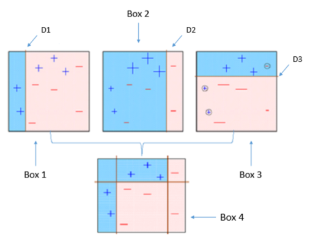

该原理可同样用于回归算法。它在不同权重的训练数据集上生成一系列的弱学习器，最开始的时候所有的数据拥有相同的权重，对于第一个分类器没有正确分类的点则在下一个决策器中的权重将会加大，作为一个迭代的过程，直到分类器数量达到预定值或预测精度达到预定值。大多数情况下，我们在AdaBoost中使用decision stamps。但是如果它可以接受带有权重的训练集，我们也可以使用其他任何的机器学习算法作为基础学习器。我们可以使用AdaBoost算法解决分类和回归问题。

Python 代码：

``` python
from sklearn.ensemble import AdaBoostClassifier # For Classification
from sklearn.ensemble import AdaBoostRegressor  # For Regression
from skleran.tree import DecisionTreeClassifier
 
dt = DecisionTreeClassifier()
clf = AdaBoostClassifier(n_estimators=100, base_estimator=dt, learning_rate=1)
# Above I have used decision tree as a base estimator, you can use any ML learner as base estimator if it accepts sample weight
clf.fit(x_train, y_train)
```

可以调整参数以优化算法的性能：

- n_estimators：它控制了弱学习器的数量
- learning_rate：控制在最后的组合中每个弱分类器的权重，需要在learning_rate和n_estimators间有个权衡
- base_estimators：它用来指定不同的ML算法。

也可以调整基础学习器的参数以优化它自身的性能。

## Gradient Boosting

Gradient Boosting是一种Boosting的方法，它主要的思想是，每一次建立模型是在之前建立模型损失函数的梯度下降方向。这句话有一点拗口，损失函数(loss function)描述的是模型的不靠谱程度，损失函数越大，则说明模型越容易出错（其实这里有一个方差、偏差均衡的问题，但是这里就假设损失函数越大，模型越容易出错）。如果我们的模型能够让损失函数持续的下降，则说明我们的模型在不停的改进，而最好的方式就是让损失函数在其梯度（Gradient)的方向上下降。

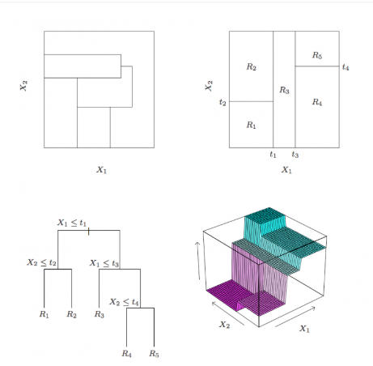

**偏差和方差**

广义的偏差（bias）描述的是预测值和真实值之间的差异，方差（variance）描述距的是预测值作为随机变量的离散程度。[《Understanding the Bias-Variance Tradeoff》](http://scott.fortmann-roe.com/docs/BiasVariance.html)当中有一副图形象地向我们展示了偏差和方差的关系：

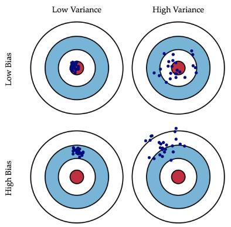

模型的偏差是一个相对来说简单的概念：训练出来的模型在训练集上的准确度。要解释模型的方差，首先需要重新审视模型：模型是随机变量。设样本容量为n的训练集为随机变量的集合(X1, X2, …, Xn)，那么模型是以这些随机变量为输入的随机变量函数（其本身仍然是随机变量）：F(X1, X2, …, Xn)。抽样的随机性带来了模型的随机性。

定义随机变量的值的差异是计算方差的前提条件，通常来说，我们遇到的都是数值型的随机变量，数值之间的差异再明显不过（减法运算）。但是，模型的差异性呢？我们可以理解模型的差异性为模型的结构差异，例如：线性模型中权值向量的差异，树模型中树的结构差异等。在研究模型方差的问题上，我们并不需要对方差进行定量计算，只需要知道其概念即可。研究模型的方差有什么现实的意义呢？我们认为方差越大的模型越容易过拟合：假设有两个训练集A和B，经过A训练的模型Fa与经过B训练的模型Fb差异很大，这意味着Fa在类A的样本集合上有更好的性能，而Fb反之，这便是我们所说的过拟合现象。我们常说集成学习框架中的基模型是弱模型，通常来说弱模型是偏差高（在训练集上准确度低）方差小（防止过拟合能力强）的模型。

基于boosting框架的整体模型可以用线性组成式来描述，其中hi(x)为基模型与其权值的乘积：
$$
F(x)=\sum_{i}^{m} h_{i}(x)
$$
根据上式，整体模型的训练目标是使预测值F(x)逼近真实值y，也就是说要让每一个基模型的预测值逼近各自要预测的部分真实值。由于要同时考虑所有基模型，导致了整体模型的训练变成了一个非常复杂的问题。所以，研究者们想到了一个贪心的解决手段：每次只训练一个基模型。那么，现在改写整体模型为迭代式：

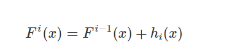

这样一来，每一轮迭代中，只要集中解决一个基模型的训练问题：使Fi(x)逼近真实值y。

使Fi(x)逼近真实值，其实就是使hi(x)逼近真实值和上一轮迭代的预测值Fi−1(x)之差，即残差y−Fi−1(x)。最直接的做法是构建基模型来拟合残差。研究者发现，残差其实是最小均方损失函数的关于预测值的反向梯度：

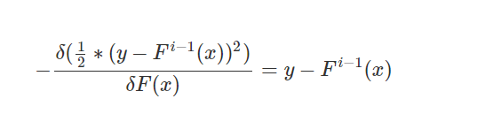

也就是说，若Fi−1(x)加上拟合了反向梯度的hi(x)得到Fi(x)，该值可能将导致平方差损失函数降低，预测的准确度提高。

引入任意损失函数后，我们可以定义整体模型的迭代式如下：

Gradient Boosting是非常经典而又重要的提升方法，他与AdaBoost一样都是讲弱分类器合成强分类，但是其大致区别有:

- Gradient Boosting通过残差来变量的改变错误分类的权重,而AdaBoost就真的直接去修改分类错误的训练权重了
- Gradient Boosting接入的分类器一般完整的决策树居多，但是AdaBoost一般使用二层决策树

Gradient Boosting中最有代表性的就是GBDT,该模型虽好，使用时理解数据以及正确调参才是王道

在Python Sklearn库中，我们可以使用Gradient Tree Boosting或GBDT（Gradient Boosting Descision Tree）。它是一个关于任意可微损失函数的一个泛化，可以用来解决分类和回归问题。

```python
from sklearn.ensemble import GradientBoostingClassifier  # For Classification
from sklearn.ensemble import GradientBoostingRegressor   # For Regression
 
clf = GradientBoostingClassfier(n_estimators=100, learning_rate=1.0, max_depth=1)
clf.fit(X_train, y_train)
```

可以调整参数以优化算法的性能：

- n_estimators :控制弱学习器的数量
- learning_rate:控制最后组合中弱学习器的权重，，需要在learning_rate和n_estimators间有个权衡
- max_depth：单个回归估计的最大深度。最大深度限制了树的结点数量。调整该参数的最佳性能：最好的值取决于输入的变量

你可以调整损失函数以获得更好地性能。

## XGBoost

XGBoost 是 “Extreme Gradient Boosting”的简称，是GBDT的一种高效实现，XGBoost中的基学习器除了可以是CART（gbtree）也可以是线性分类器（gblinear）。

Gradient Boosting Decision Tree从名称上来讲包含三个部分：Decision Tree、Boosting、Gradient Boosting。决策树我们都比较熟悉，在此略过不谈。Boosting这种方法，是指用一组弱分类器，得到一个性能比较好的分类器；这里用到的思路是给每个弱分类器的结果进行加权。Gradient Boosting是指使用gradient信息对分类器进行加权，之后的部分会详细介绍gradient加权的思路。综上，GBDT是一种使用gradient作为信息，将不同的弱分类decision trees进行加权，从而获得较好性能的方法。

GBDT的一般步骤

- Step 1: 初始化。初始化y_hat在第0时刻的值。
- Step 2：求残差。通过类似梯度下降法的思路，每次y都向梯度下降的方向挪一小步。只是在GBDT，y挪的一小步并不是一个variable，而是一个function。
- Step 3：构建决策树。使用决策树逼近这个残差 –g，得到第t个决策树：f_t。
- Step 4：求叶节点权重。
- Step 5：更新输出y。y(t) = y(t – 1) + learning_rate * f_t

在GBDT思想下，XGBoost对其中的步骤进行了具体实现。

- 变化1：提高了精度 – 对Loss的近似从一阶到二阶。。传统GBDT只使用了一阶导数对loss进行近似，而XGBoost对Loss进行泰勒展开，取一阶导数和二阶导数。同时，XGBoost的Loss考虑了正则化项，包含了对复杂模型的惩罚，比如叶节点的个数、树的深度等等。通过对Loss的推导，得到了构建树时不同树的score。具体score计算方法见论文Sec 2.2。
- 变化2：提高了效率 – 近似算法加快树的构建。XGBoost支持几种构建树的方法。
  - 第一：使用贪心算法，分层添加decision tree的叶节点。对每个叶节点，对每个feature的所有instance值进行排序，得到所有可能的split。选择score最大的split，作为当前节点。
  - 第二：使用quantile对每个feature的所有instance值进行分bin，将数据离散化。
  - 第三：使用histogram对每个feature的所有instance值进行分bin，将数据离散化。
- 变化3：提高了效率 – 并行化与cache access。XGBoost在系统上设计了一些方便并行计算的数据存储方法，同时也对cache access进行了优化。这些设计使XGBoost的运算表现在传统GBDT系统上得到了很大提升。

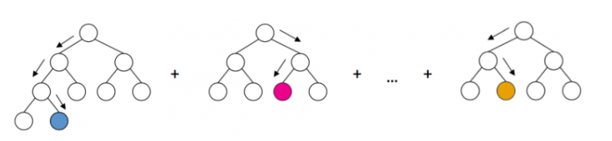

Xgboost和GBDT的区别

- 传统GBDT以CART作为基分类器，xgboost还支持线性分类器，这个时候xgboost相当于带L1和L2正则化项的逻辑斯蒂回归（分类问题）或者线性回归（回归问题）。
- 传统GBDT在优化时只用到一阶导数信息，xgboost则对代价函数进行了二阶泰勒展开，同时用到了一阶和二阶导数。顺便提一下，xgboost工具支持自定义代价函数，只要函数可一阶和二阶求导。
- Xgboost在代价函数里加入了正则项，用于控制模型的复杂度。正则项里包含了树的叶子节点个数、每个叶子节点上输出的score的L2模的平方和。从Bias-variance tradeoff角度来讲，正则项降低了模型的variance，使学习出来的模型更加简单，防止过拟合，这也是xgboost优于传统GBDT的一个特性。
- Shrinkage（缩减），相当于学习速率（xgboost中的eta）。xgboost在进行完一次迭代后，会将叶子节点的权重乘上该系数，主要是为了削弱每棵树的影响，让后面有更大的学习空间。实际应用中，一般把eta设置得小一点，然后迭代次数设置得大一点。（补充：传统GBDT的实现也有学习速率）
- 列抽样（column subsampling）。xgboost借鉴了随机森林的做法，支持列抽样，不仅能降低过拟合，还能减少计算，这也是xgboost异于传统gbdt的一个特性。
- 缺失值的处理。对于特征的值有缺失的样本，xgboost可以自动学习出它的分裂方向。
- xgboost工具支持并行。boosting不是一种串行的结构吗?怎么并行的？注意xgboost的并行不是tree粒度的并行，xgboost也是一次迭代完才能进行下一次迭代的（第t次迭代的代价函数里包含了前面t-1次迭代的预测值）。xgboost的并行是在特征粒度上的。我们知道，决策树的学习最耗时的一个步骤就是对特征的值进行排序（因为要确定最佳分割点），xgboost在训练之前，预先对数据进行了排序，然后保存为block结构，后面的迭代中重复地使用这个结构，大大减小计算量。这个block结构也使得并行成为了可能，在进行节点的分裂时，需要计算每个特征的增益，最终选增益最大的那个特征去做分裂，那么各个特征的增益计算就可以开多线程进行。
- 可并行的近似直方图算法。树节点在进行分裂时，我们需要计算每个特征的每个分割点对应的增益，即用贪心法枚举所有可能的分割点。当数据无法一次载入内存或者在分布式情况下，贪心算法效率就会变得很低，所以xgboost还提出了一种可并行的近似直方图算法，用于高效地生成候选的分割点。

XGBoost优势：

- 显式地将树模型的复杂度作为正则项加在优化目标
- 公式推导里用到了二阶导数信息，而普通的GBDT只用到一阶
- 允许使用列抽样(column(feature)sampling)来防止过拟合，借鉴了Random Forest的思想，sklearn里的gbm好像也有类似实现。
- 实现了一种分裂节点寻找的近似算法，用于加速和减小内存消耗。
- 节点分裂算法能自动利用特征的稀疏性。
- 样本数据事先排好序并以block的形式存储，利于并行计算
- penalty function Omega主要是对树的叶子数和叶子分数做惩罚，这点确保了树的简单性。
- 支持分布式计算可以运行在MPI，YARN上，得益于底层支持容错的分布式通信框架rabit。

参考链接：

- [http://xgboost.apachecn.org/](http://xgboost.apachecn.org/#/)
- https://xgboost.readthedocs.io/en/latest/index.html
- http://www.52caml.com/head_first_ml/ml-chapter6-boosting-family/
- https://www.zybuluo.com/Team/note/1095836
- https://www.zybuluo.com/hanxiaoyang/note/985880
- https://yxzf.github.io/2017/03/xgboost-v1/
- https://www.ibm.com/developerworks/cn/analytics/library/machine-learning-hands-on6-adaboost/index.html

### 使用集成学习的要求

- 集成学习中对个体学习器的要求应该是“好而不同”，即既满足准确性，又满足多样性（diversity）
- 也即是说，学习器既不能太坏，而且学习器与学习器之间也要有差异。

