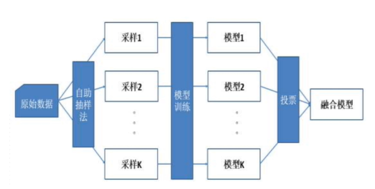
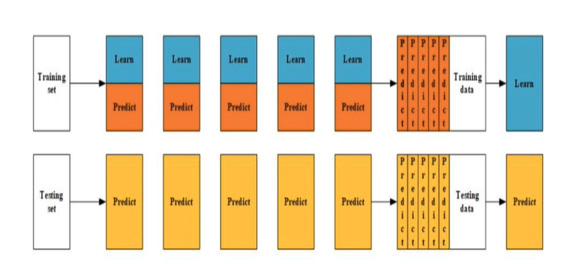
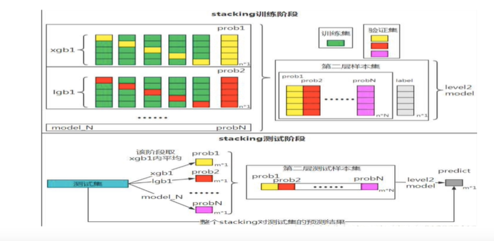

# 模型融合

来源：https://www.bilibili.com/video/BV13K4y1k7Vy

模型融合的主要目的是降低偏差和方差

## 集成学习

### 各类模型和实现

- Bagging
  - 随机森林：（效率很高，在头部的时候可以使用）
- Boosting
  - AdaBoost
  - GBDT：（使用了残差）
  - XGBoost
  - LightGBM
  - CatBoost：（主要用于分类）
- Stacking
  - Stacking
- Blending：（和Stacking类似，建议在数据量比较大的时候使用）
  - Blending

### Voting

投票机制

### Blending

## Stacking

这个时候需要使用强模型，在做Stacking模型

