# DockerCompose一键部署蘑菇博客(Nacos版)

## 前言

首先，特别感谢群里小伙伴 [@你钉钉响了](https://gitee.com/it00021hot) 和 [@touch fish](https://gitee.com/chengccn1)， 一块完成了蘑菇博客的镜像制作。

原来的部署方式是采用单个Docker镜像来进行部署的，每次拉取一个超大型的镜像【大概5G】，如果在拉取镜像的时候，遇到网络卡顿等外界影响，很容易导致拉取失败，同时因为这种部署方式不太符合微服务架构的思想。

因此后面我们将所有的服务制作成单个的镜像，然后通过docker compose 进行容器编排，来协调每个容器同时对外提供服务，同时提供了Docker容器的可视化管理工具Portainer进行管理，同时达到对服务容器化的目的，也为以后使用K8S集群管理蘑菇博客做了很好的铺垫~。

本文不再讲蘑菇博客如何制作镜像，Docker Compose的使用，以及将镜像推送到阿里云容器镜像服务和DockerHub，如果感兴趣的小伙伴可以参考另外的几篇博客。

- [Docker Compose入门学习](http://www.moguit.cn/#/info?blogOid=568)
- [使用GithubAction构建蘑菇博客镜像提交DockerHub](http://www.moguit.cn/#/info?blogOid=567)
- [Docker图形化工具Portainer介绍与安装](http://www.moguit.cn/#/info?blogOid=569)
- [使用DockerCompose制作蘑菇博客YAML镜像文件](http://www.moguit.cn/#/info?blogOid=567)

本文主要讲解使用Docker Compose 一键部署蘑菇项目，如果想尝试其他方式【传统CentOS安装软件】，可以参考 [使用Docker快速搭建蘑菇博客（Nacos分支）](http://www.moguit.cn/#/info?blogUid=8100dcb585fff77e3fa25eed50e3708e)

如果你也拥有域名并且备案了的话，可以给蘑菇博客配置域名的方式访问：[蘑菇博客配置域名解析](http://moguit.cn/#/info?blogUid=06565868c0e86fe8125a9d55430cd266)

如果你的服务器带宽只有1M，可以使用免费的百度云加速，加快页面渲染速度：[如何使用百度云加速提升网站访问速度](http://www.moguit.cn/#/info?blogUid=af053959672343f8a139ec27fd534c6c)

## 虚拟内存

如果你的服务器内存也是2G的话，请务必先配置一下交换内存【推荐虚拟内存4G】：[CentOS如何增加虚拟内存](http://www.moguit.cn/#/info?blogUid=36ee5efa56314807a9b6f1c1db508871)

## 安装Docker

因为我们需要拉取镜像，所以需要在服务器提前安装好Docker，首先配置一下Docker的阿里yum源

```bash
cat >/etc/yum.repos.d/docker.repo<<EOF
[docker-ce-edge]
name=Docker CE Edge - \$basearch
baseurl=https://mirrors.aliyun.com/docker-ce/linux/centos/7/\$basearch/edge
enabled=1
gpgcheck=1
gpgkey=https://mirrors.aliyun.com/docker-ce/linux/centos/gpg
EOF
```

然后yum方式安装docker

```bash
# yum安装
yum -y install docker-ce
# 查看docker版本
docker --version  
# 开机自启
systemctl enable docker
# 启动docker
systemctl start docker
```

配置docker的镜像源

```bash
cat >> /etc/docker/daemon.json << EOF
{
  "registry-mirrors": ["https://b9pmyelo.mirror.aliyuncs.com"]
}
EOF
```

然后重启docker

```bash
systemctl restart docker
```

## 安装Docker Compose

Docker Compose是用来定义和运行多个Docker应用程序的工具。通过Compose，可以使用YAML文件来配置应用程序需要的所有服务，然后使用一个命令即可从YML文件配置中创建并启动所有服务。

首先到Github release中下载我们的docker-compose

```bash
https://github.com/docker/compose/releases
```

然后选择Linux版本下载


> 如果上述地址下载过于缓慢，请备用地址【下载后解压zip】：[点我传送](https://wws.lanzous.com/iTHoIiuilvi)

把下载到的文件使用Xftp工具，拷贝到 `/usr/local/bin/` 目录下

```bash
# 重命名
mv docker-compose-Linux-x86_64  docker-compose
# 加入执行权限
sudo chmod +x /usr/local/bin/docker-compose
# 查看docker-compose版本
docker-compose -v
```

## 开放安全组

下面我们需要将一些端口暴露到外网能够访问，所以需要开放的安全组，如果是使用阿里云的小伙伴，必须在 阿里云的官网，配置相应的安全组，不然外面是没办法访问的。关于安全组的配置，在云服务器ECS的管理页面

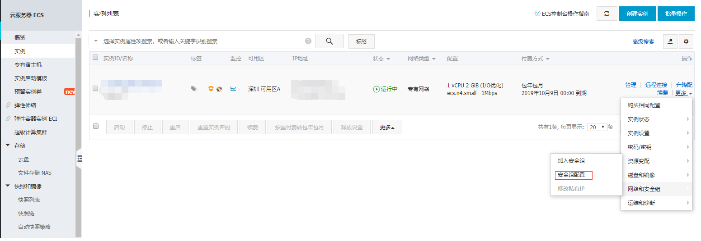

在点击配置规则

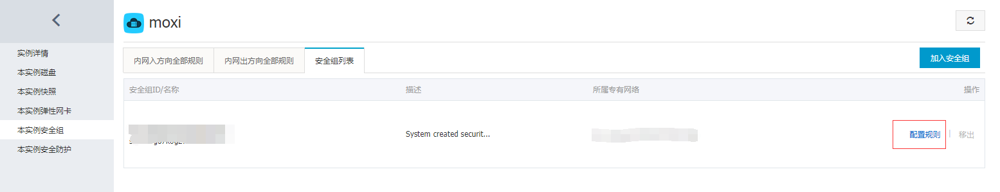

然后点击右上角按钮，把需要用到的端口号都填写进去

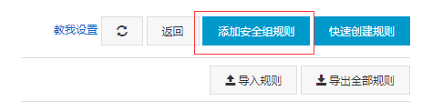

【此处为了测试暴露了全部需要用到端口，后期小伙伴可以根据自己的需要进行端口的开放】

按照下面的规则，把每一个添加进去即可, 需要添加的端口号有

```bash
RabbitMQ消息队列：15672
Zipkin链路追踪: 9411
发Email端口：465   
图片资源：8600   
前端Web页面:9527    
后端Admin页面：9528  
Redis:6379   
Mysql:3306   
Tomcat[里面部署的solr]:8080
HTTP端口：80
Kibana端口：5601
mogu_admin端口：8601
mogu_picture端口：8602
mogu_web端口：8603
mogu_sms端口：8604
mogu_search端口：8605
mogu_monitor端口：8606
mogu_gateway端口：8607
nacos端口: 8848
sentinel端口: 8070
portainer端口：9000
```


## 一键部署博客

### 创建网络

因为Docker容器之间，需要互相通信访问，所以我们需要创建我们的Docker网络

```bash
docker network create mogu
```

### 拷贝到服务器

下面将源码中的 `docker-compose` 文件夹拷贝到我们的服务器中


首先我们来查看一下docker-compose的目录结构

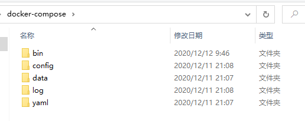

- bin：相关一键启动脚本的目录
  - completeStartup.sh：完整版启动脚本
  - completeShutdown.sh：完整版关闭脚本
  - kernStartup.sh：核心版启动脚本【只包含必要的组件】
  - kernShutdown.sh：核心版关闭脚本
  - update.sh：用于更新镜像【同步最新代码时使用】
- config：存放配置文件
- data：存放数据文件
- log：存放日志文件
- yaml：存放docker compose的yaml文件

下面我们开始，将docker-compose文件夹，拷贝服务器目录位置随意，我是拷贝到  `/root/docker-compose` 目录，然后给命令设置执行权限

```bash
# 进入目录
cd docker-compose
# 添加执行权限
chmod +x bin/kernStartup.sh
chmod +x bin/kernShutdown.sh
chmod +x bin/update.sh
chmod +x config/wait-for-it.sh
```

### 修改前端配置

下面我们需要修改前端页面请求的地址，我们在 `docker-compose\config` 目录，将里面的ip地址，修改为我们目前服务器的ip地址【可以拷贝出来在本地替换】

```bash
# 修改vue_mogu_admin项目配置
vim config/vue_mogu_admin.env

# 修改vue_mogu_web项目配置
vim config/vue_mogu_web.env
```

可以直接拷贝在本地，使用记事本进行修改，或者通过vim的全局替换命令

```bash
:%s/120.78.126.96/192.168.177.150/g
```

### 开始部署

下面我们执行命令，进行一键部署，我们执行 `kernStartup.sh` ，它会给我们安装蘑菇博客所需的核心服务

```bash
# 启动一键部署脚本 【核心版脚本】
./bin/kernStartup.sh
# 一键关闭【需要关闭时使用】
./bin/kernShutdown.sh
```

执行完成后，就会在我们的镜像仓库中拉取对应的镜像【如果本地没有的话】

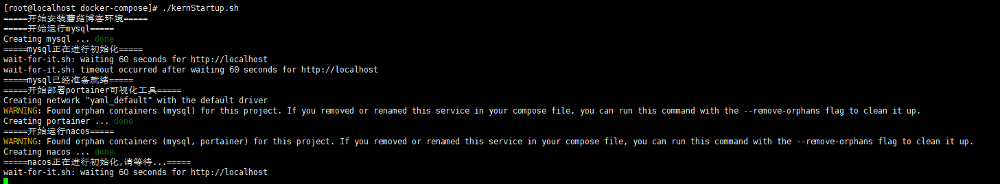

我们在一边拉取镜像的时候，我们可以看看镜像的拉取情况

```bash
docker images;
```

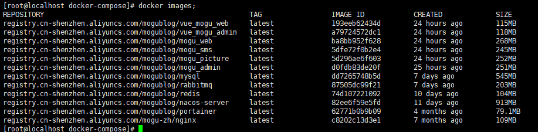

能够看到我们的镜像已经成功拉取下来了，接着我们看启动的情况

```bash
docker ps -a
```

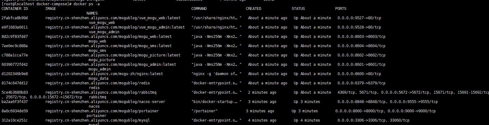

注意：如果我们通过命令查看，发现某个容器没有正常运行，如下图所示 【没有出错的，可以直接跳过】


是 portainer 容器运行失败，我们就需要对该容器进行重启，可以使用下面命令【找到该容器的 yml脚本】

```bash
docker-compose -f yaml/portainer.yml up -d
```

## 运行测试

### 运行容器查看 【可以不启动】

我们安装了Portainer容器可视化工具，主要进行Docker容器的状态监控，以及镜像和容器的安装，关于具体Portainer可视化工具的使用，参考博客：Docker图形化工具Portainer介绍与安装

```bash
# 访问portainer可视化界面【首次需要创建密码，选择local环境】
http://ip:9000
```

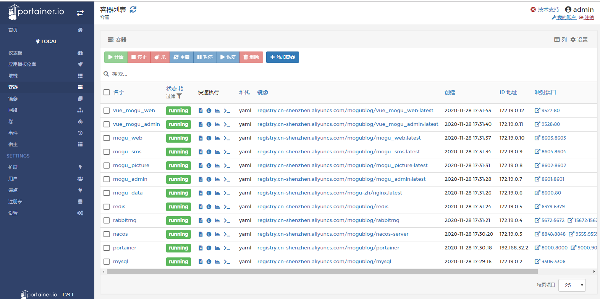

### 后台测试

首先我们需要登录Nacos查看后台服务是否成功注册

```bash
# Nacos管理页【默认账号密码：nacos nacos】
http://ip:8848/nacos
```

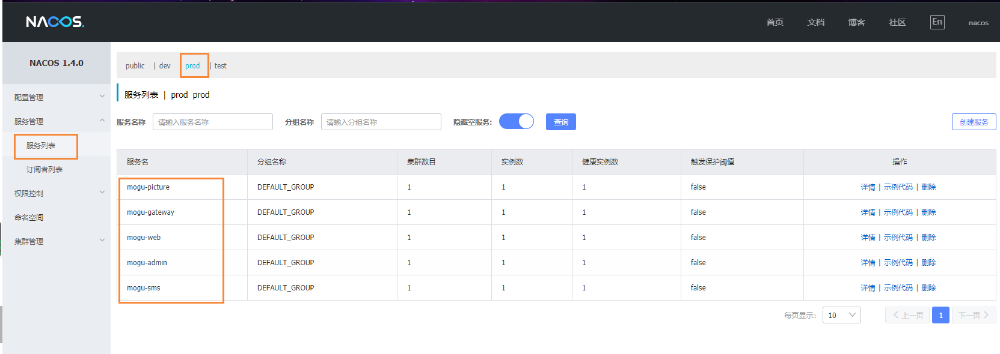

> 如果还存在某些服务没有注册上来，那么就需要等待一会【因为后台启动需要时间】

我们在通过访问下列swagger接口，测试接口是否正常

```bash
# admin端
http://your_ip:8601/swagger-ui/index.html
# web端
http://your_ip:8603/swagger-ui/index.html
```

如果能够进入下面页面的话，说明后台是没有问题的了，下面我们可以验证一下接口


验证登录


在swagger页面的右上角，有一个authorize的按钮，点击后，将token粘贴进去，即可操作全部接口进行测试了~


### 前台测试

接着访问前端和后端页面进行测试即可

```bash
# 前端页面
http://ip:9527
# 后端页面
http://ip:9528
```

前端页面【没有图片，需要自己修改配置后手动上传，关于配置如何修改往下看~】

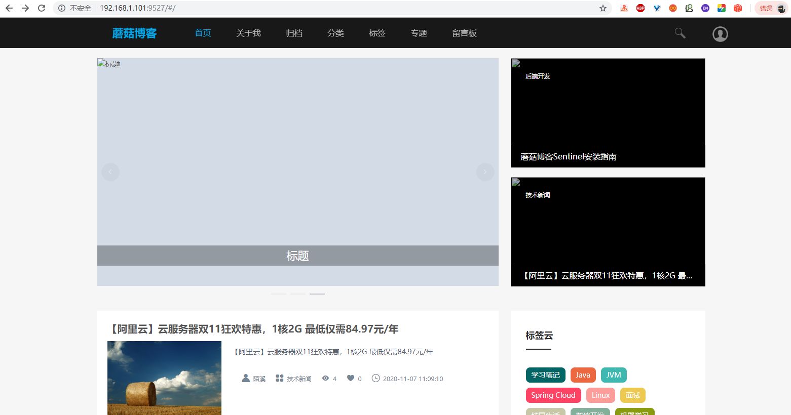

后端页面【没有图片，需要自己修改配置后手动上传，关于配置如何修改往下看~】

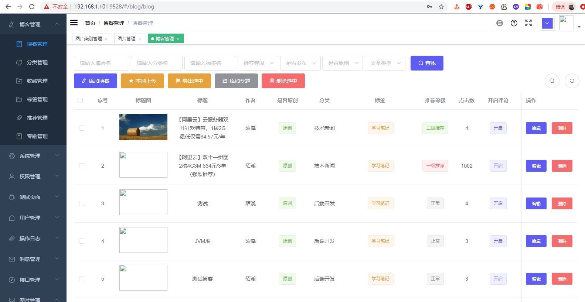


## 修改项目配置

最后在项目成功启动后，我们还需要修改一些配置

### mogu_web配置

我们进入到nacos配置文件管理界面，找到的 mogu_web_prod.yaml文件


我们需要将下面的域名，改成自己的

```bash
data:
  # 门户页面
  webSite:
    url: http://101.132.122.175/:9527/#/
    # 有域名可以改成如下
    # url: http://www.moguit.cn/#/
    
  # mogu_web网址，用于第三方登录回调
  web:
    url: http://101.132.122.175/:8603
```

同时在配置文件的最下面，还需要修改第三方注册需要的 clientId 和 ClientSecret：如果不清楚如何获取的小伙伴，可以查看我的这篇博客，在后面部分对ID的获取有相关介绍：

- [SpringBoot+Vue如何集成第三方登录JustAuth](http://moguit.cn/#/info?blogUid=8cbadb54967257f12d6cc7eb1a58a361)
-  [使用JustAuth集成QQ登录](http://www.moguit.cn/#/info?blogUid=fe9e352eb95205a08288f21ec3cc69e0)

```bash
# 第三方登录
justAuth:
  clientId:
    gitee: XXXXXXXXXXXXXXXXXXXXXX
    github: XXXXXXXXXXXXXXXXXXXXXX
    qq: XXXXXXXXXXXXXXXX # APP ID 
  clientSecret:
    gitee: XXXXXXXXXXXXXXXXXXXXXX
    github: XXXXXXXXXXXXXXXXXXXXXX
    qq: XXXXXXXXXXXXXXXXXX # APP Key
```

### mogu_sms配置

我们进入到nacos配置文件管理界面，找到的 mogu_sms_prod.yaml文件


在mogu_sms中，主要修改的就是邮箱的配置，我们将发送邮件的信息改成自己的

```bash
#mail
mail:
    username: XXXXXXX@163.com
    password: XXXXXXX #授权码开启SMTP服务里设置
```

注意，上面的password是授权码，授权码不是密码，以163邮箱为例，我们需要开启SMTP服务，然后设置授权码

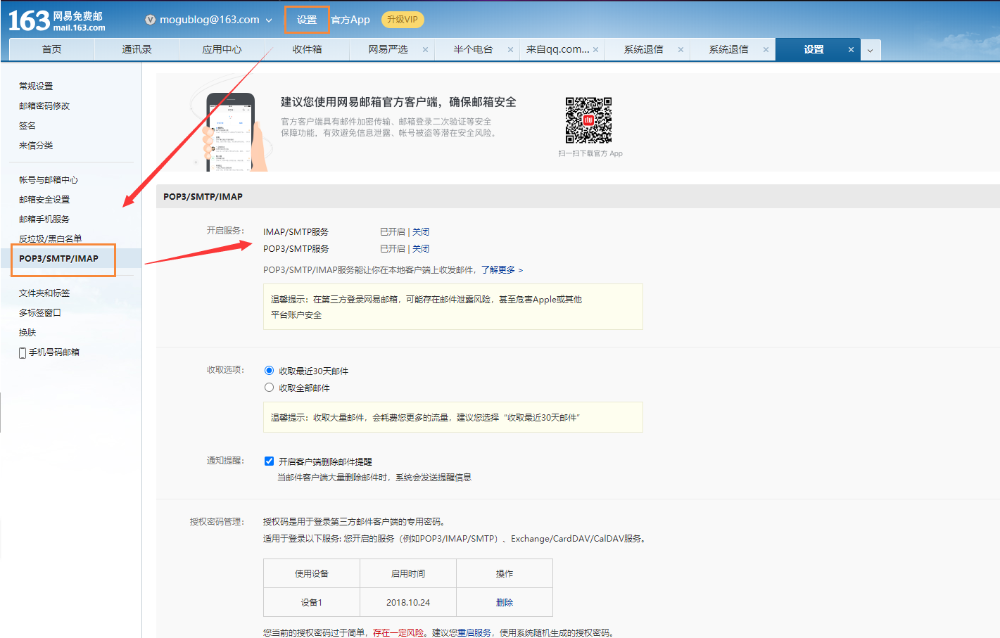


### 修改图片配置

图片默认使用的是本地图片上传，如果想使用其它的存储方式，可以参考另外的博客

- [蘑菇博客配置七牛云存储](http://www.moguit.cn/#/info?blogUid=735ed389c4ad1efd321fed9ac58e646b)
- [使用Minio搭建对象存储服务](http://www.moguit.cn/#/info?blogUid=a1058b2d030310e2c5d7b0584e514f1f)

本文主要以本地文件存储为例，我们到系统配置，首先修改图片显示的本地域名


修改完成后，进行保存，然后在图片管理上传新的图片

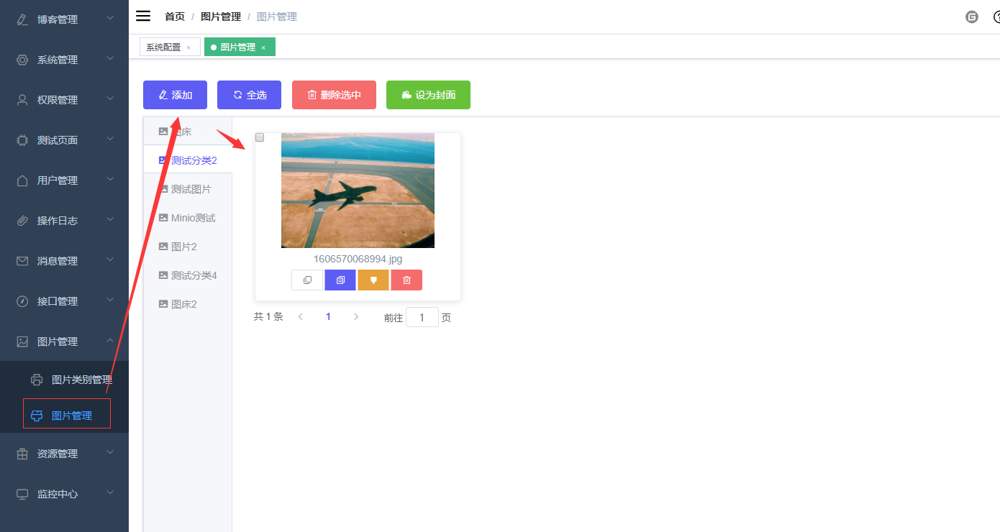

>  要是图片无法正常显示，可以F12看看图片路径是否是修改后的IP，同时对应的 8600端口的 安全组是否开放

最后到博客管理页面，编辑博客，然后选择图片插入即可~

