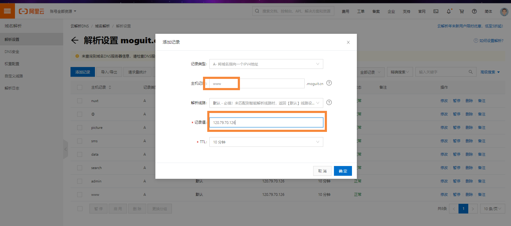
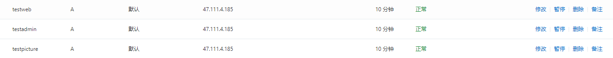
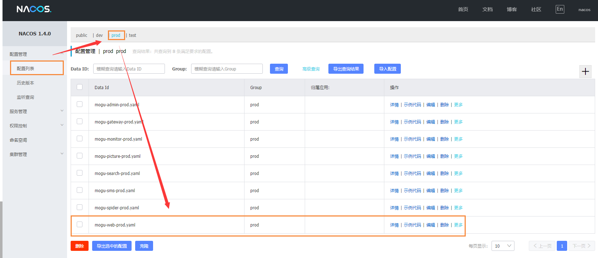
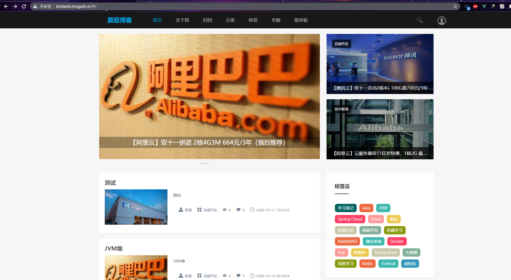
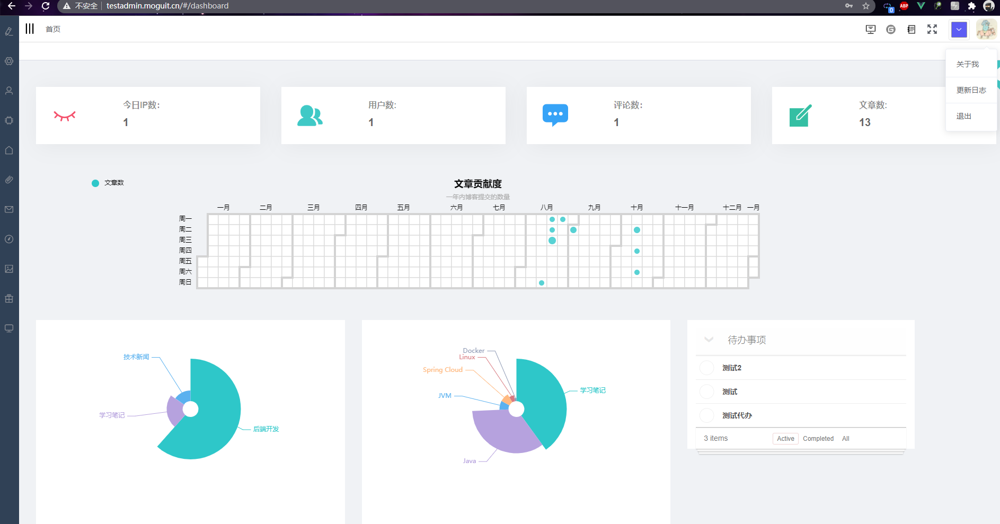

# DockerCompose部署的博客增加域名访问

## 前言

最近群里的小伙伴在配置域名访问的时候一直存在问题，因此本篇博客主要讲解使用 [DockerCompose一键部署蘑菇博客(Nacos版)](http://www.moguit.cn/#/info?blogOid=565) 后，如何配置域名访问我们的服务器。

如果小伙伴还未一键搭建好博客项目，那么请先完成部署后，在参考下面教程完成域名配置。

## 配置域名解析

如果是在阿里云购买的域名，我们首先搜索域名，进入后，点击解析


我们配置好对应的二级域名



这里我主要配置的二级域名有：

```
# 前台首页
testweb.moguit.cn
# 后台首页
testadmin.moguit.cn
# 图片域名
testpicture.moguit.cn
```

当然小伙伴们也可以调整成自己的，因为另外的几个二级域名被正式服务器使用了，小伙伴可以按照下面规则更换

```bash
testweb -> www
testadmin -> admin
testpicture -> picture
```

添加完成后，如下所示



## 修改Nginx配置

首先我们到 nginx 的配置文件

```bash
# 到配置文件目录
cd /root/docker-compose/config
# 编辑配置文件
vim mogu_data.conf
```

然后把里面的域名都对应的修改成自己的，下面是修改后的样子

```bash
    server {
        listen       80;
        server_name  testpicture.moguit.cn;

        add_header Access-Control-Allow-Origin *;
        add_header Access-Control-Allow-Methods 'GET, POST, OPTIONS';
        add_header Access-Control-Allow-Headers 'DNT,X-Mx-ReqToken,Keep-Alive,User-Agent,X-Requested-With,If-Modified-Since,Cache-Control,Content-Type,Authorization,lang,access-token';
        if ($request_method = 'OPTIONS') {
         return 204;
        }

        location / {
                root   /home/mogu_blog/mogu_data/;
                index  index.html index.htm;
        }
    }

    server {
        listen       8600;
        server_name  localhost;

        add_header Access-Control-Allow-Origin *;
        add_header Access-Control-Allow-Methods 'GET, POST, OPTIONS';
        add_header Access-Control-Allow-Headers 'DNT,X-Mx-ReqToken,Keep-Alive,User-Agent,X-Requested-With,If-Modified-Since,Cache-Control,Content-Type,Authorization,lang,access-token';
        if ($request_method = 'OPTIONS') {
         return 204;
        }

        location / {
                root   /home/mogu_blog/mogu_data/;
                index  index.html index.htm;
        }
    }


   server {
        listen      80;
        server_name testweb.moguit.cn;
        location / {
          proxy_pass   http://vue_mogu_web/;
        }
    }

    server {
        listen       80;
        server_name  testadmin.moguit.cn;
        location / {
           proxy_pass   http://vue_mogu_admin/;
        }
    }
```

## 修改前端配置

找到 **docker-compose/config/vue_mogu_admin.env** 文件，然后将 **BLOG_WEB_URL** 修改为门户页面

```BASH
NODE_ENV=production
ADMIN_API=http://47.111.4.185:8607/mogu-admin
PICTURE_API=http://47.111.4.185:8607/mogu-picture
WEB_API=http://47.111.4.185:8607/mogu-web
Search_API=http://47.111.4.185:8607/mogu-search
FILE_API=http://47.111.4.185:8600/
BLOG_WEB_URL=http://testweb.moguit.cn
SOLR_API=http://47.111.4.185:8080/solr
ELASTIC_SEARCH=http://47.111.4.185:5601
```

找到 **docker-compose/config/vue_mogu_admin.env** 文件，然后将 **VUE_MOGU_WEB** 修改为门户页面

```bash
NODE_ENV=production
VUE_MOGU_WEB=http://testweb.moguit.cn
PICTURE_API=http://47.111.4.185:8607/mogu-picture
WEB_API=http://47.111.4.185:8607/mogu-web
SEARCH_API=http://47.111.4.185:8607/mogu-searc
```

##  修改后端配置

我们首先进入到 **nacos** 管理页面



将里面的 webSite修改成门户页面

```bash
data:
  # 门户页面
  webSite:
    url: http://testweb.moguit.cn/#/
```

## 测试

修改完成后，我们需要重启一下我们的项目

```bash
# 到docker compose下的 bin 目录
cd /root/docker-compose/bin
# 重启nginx
docker-compose -f mogu_data.yml restart
```

重启完，我们尝试着访问下面的地址

```bash
# 门户页面
http://testweb.moguit.cn/#/
# 后台页面
http://testadmin.moguit.cn/#/
```

门户页面



后台页面

