# 使用Docker快速搭建蘑菇博客(Eureka版)

最近几天一直在研究怎么样才能够快速搭建蘑菇博客项目，对了，我的服务器是阿里云购买的云服务器ECS，配置是 1核2G ，学生优惠价，100多一年。。。 嗯，这应该是搭建蘑菇博客的最低配置了，内存少于2G的话，可能会启动不起来，本来2G也是不够用的，我是把所有的微服务和solr都放到一个tomcat中，才勉强跑起来的。 目前为了更加方便大家的部署，我已经修改成jar包的方式进行部署启动了，tomcat仅用于作为solr启动的web容器。

如果你的服务器内存也是2G的话，请务必先配置一下交换内存：[CentOS如何增加虚拟内存](http://www.moguit.cn/#/info?blogUid=36ee5efa56314807a9b6f1c1db508871)

如果你也拥有对应的域名并且备案了的话，可以给蘑菇博客配置域名的方式访问：[蘑菇博客配置域名解析](http://moguit.cn/#/info?blogUid=06565868c0e86fe8125a9d55430cd266)

如果你的服务器带宽只有1M，可以使用免费的百度云加速，加快页面渲染速度：[如何使用百度云加速提升网站访问速度](http://www.moguit.cn/#/info?blogUid=af053959672343f8a139ec27fd534c6c)

> tip：特别注意，因为镜像中的代码可能不是最新版本，因此推荐在按照本篇博客，安装好docker环境后，需要在参考 [蘑菇博客部署阿里云(Eureka版)](http://www.moguit.cn/#/info?blogUid=ab8377106a0d4b9f8d66131e4312c69e) 这篇博客，重新将前后端代码都重新部署一遍，同时也记得把doc中的两个SQL文件也重新导入，确保服务器为最新代码

如果你之前安装好了蘑菇博客的docker环境，修改的博客的源码，想要重新发布到自己服务器上：[蘑菇博客如何部署到阿里云服务器(Eureka版)](http://www.moguit.cn/#/info?blogUid=ab8377106a0d4b9f8d66131e4312c69e)

因为配置那些环境比较麻烦，（主要包括Nginx，Solr，Redis，Tomcat，Mysql，RabbitMQ）当然如果小伙伴喜欢自己配置的话，也可以不使用我搭建好的镜像，可以参考下面几篇博客哦，希望你也能够配置成功的~！（想直接通过Docker部署的，可以忽略下面几步..）

1、[CentOS下如何安装Nginx](http://www.moguit.cn/#/info?blogUid=e8d3e38ba35b4765ae128256eb44e341)

2、[CentOS下Rdeis的安装和部署](http://www.moguit.cn/#/info?blogUid=d0e2c4337d7a4a85b176834c8c674fdf)

3、[CentOS下Solr的安装和部署](http://www.moguit.cn/#/info?blogUid=7c7404c456904be5b7736238f28d2515)

4、[CentOS下Mariadb的安装和部署](http://www.moguit.cn/#/info?blogUid=d5b6dff48e5d42b1afcbf6ab591bdab1)

5、[CentOS下RabbitMQ的安装和部署](http://www.moguit.cn/#/info?blogUid=2af543cdbd4342e1812e72687aac4580)

6、[CentOS下ElasticSearch的安装和部署](http://moguit.cn/#/info?blogUid=ee342088a5d0f5b96bcb4582d9b563aa)

好了。下面我介绍的是用Docker快速搭建蘑菇博客。话不多说，下面我就直接进入正题。

## 注册Docker账号

首先大家先去DockerHub注册账号，用于拉取Docker镜像和存储镜像

注意：注册DockerHub的目的，是为了能够方便以后大家把自己的镜像上传上去，如果DockerHub无法访问，或者不想上传镜像的话，可以忽略这一步，同时在3步 也忽略 docker login，直接进行Docker pull 拉取我的镜像即可

DockerHub官网：[点我传送](https://hub.docker.com/)

关于更多docker命令和介绍，可以看这篇博客：[Docker常用命令](http://www.moguit.cn/#/info?blogUid=8974a6ce5bae4bf68f1aa37f07c96d0f)

## Docker安装和启动

注册成功后，进入我们的CentOS系统中（如果是Ubuntu的话，可能安装docker的方式不同，请自行百度安装）

下面介绍的是使用yum方式安装docker

### 配置docker的阿里云yum源

```
cat >>/etc/yum.repos.d/docker.repo<<EOF
[docker-ce-edge]
name=Docker CE Edge - \$basearch
baseurl=https://mirrors.aliyun.com/docker-ce/linux/centos/7/\$basearch/edge
enabled=1
gpgcheck=1
gpgkey=https://mirrors.aliyun.com/docker-ce/linux/centos/gpg
EOF
```

###  安装docker

```
# yum安装
yum -y install docker-ce

#查看docker版本
docker --version  

# 设置开机自启
systemctl enable docker

# 启动docker
systemctl start docker
```

## Docker login登录

使用Docker login命令登录，需要输入刚刚注册的账号和密码（ps：如果不想发布镜像到dockerhub，可以忽略）

```
# 登录dockerhub
docker login
```

## 拉取蘑菇博客的镜像

```
docker pull moxi/mogu_blog
```

因为镜像有点大，所以拉取的话，可能会有点慢，所以耐下等待下


如果拉取失败，或者出现超时的情况、或者拉取过慢，可以尝试使用下面的方法： [CentOS7中Docker拉取镜像失败的解决方法](http://www.moguit.cn/#/info?blogUid=5296cfe28b35caa808a5387ff95734c7)

如果还是拉取速度很慢的话，推荐在早上的时候拉取镜像，因为DockerHub是国外的网站，早上的时候，他们美国这边都已经到了晚间了，基本不占用太多带宽，拉取速度会更快一些~

## 查看镜像

拉取成功后，使用命令查看已经拉取的镜像

```
docker images
```

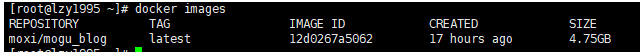

好了，能看到刚刚拉取的镜像，大概有4.75G大（ps.. 现在因为装了很多东西..已经10多G了），因为这里面包含了需要图片资源和项目的一些安装包。

## 制作蘑菇博客docker容器

```
docker run --privileged -d -it -h mogu_blog_2 --name mogu_blog_2 -v /etc/localtime:/etc/localtime:ro -p 11122:22 -p 15672:15672 -p 8600:8600 -p 9527:9527 -p 9528:9528 -p 6379:6379 -p 3306:3306 -p 80:80 -p 8080:8080 -p 8601:8601 -p 8602:8602 -p 8603:8603 -p 8604:8604 -p 8605:8605 -p 8606:8606 -p 8607:8607 -p 8761:8761 -p 5601:5601 -p 9411:9411 -p 465:465 moxi/mogu_blog /usr/sbin/init
```

使用下面的命令，就能够制作成一个docker容器了，他会将上面写的一些端口号都映射到宿主机中，所以宿主机那些端口号不能别占用了哦。

当然同时，宿主机的那些端口号也必须开放，如果是使用阿里云的小伙伴，必须在 阿里云的官网，配置相应的安全组，不然外面是没办法访问的。

关于安全组的配置，在云服务器ECS的管理页面

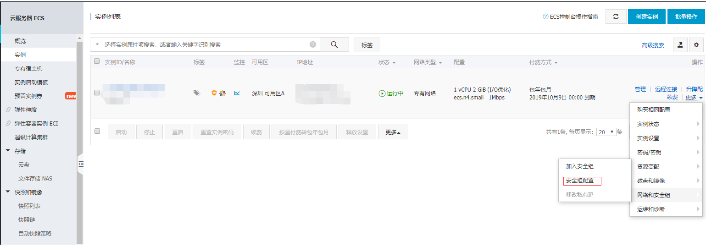

在点击配置规则

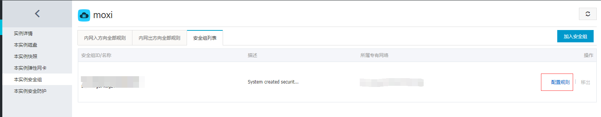

然后点击右上角按钮，把需要用到的端口号都导入进去


安装下面的规则，把每一个添加进去即可, 需要添加的端口号有：

```bash
蘑菇Docker内部容器SSH连接：11122
RabbitMQ消息队列：15672
Zipkin链路追踪: 9411
发Email端口：465   
图片资源：8600   
前端Web页面:9527    
后端Admin页面：9528  
Redis:6379   
Mysql:3306   
Tomcat(里面部署的solr):8080
HTTP端口：80
Kibana端口：5601
mogu_admin端口：8601
mogu_picture端口：8602
mogu_web端口：8603
mogu_sms端口：8604
mogu_search端口：8605
mogu_monitor端口：8606
mogu_gateway端口：8607
mogu_eureka端口：8761
```

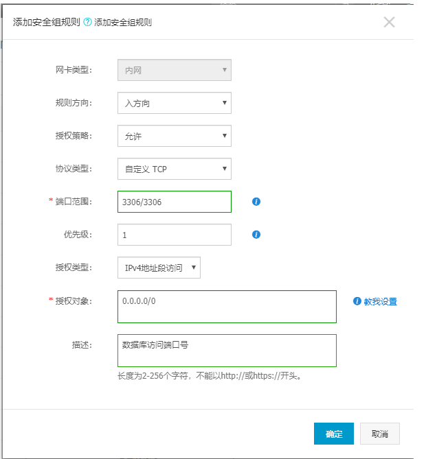

## 查看容器状态

好了，回到刚刚的内容，我们在执行第六步的时候，已经制作好了容器了，使用下面的命令，查看容器状态

```
# 查看容器状态
docker ps -a
```

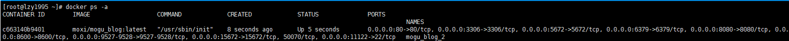


## 打开XShell，连接

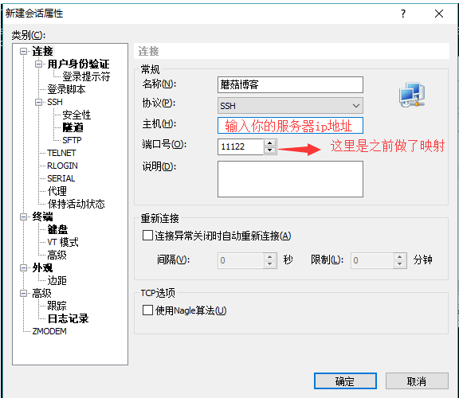

输入用户名： root

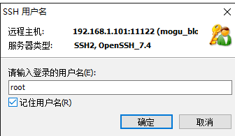

输入密码：mogu2018


成功进入系统，下面我们就需要把对应的服务都开启

注意：该密码是docker镜像的初始密码，如果需要更改的话，可以使用下列命令更改密码

```
passwd
```

## 启动对应的服务

### 启动Nginx

```
# 进入nginx的安装目录下
cd /soft/nginx/sbin/

# 启动nginx
./nginx
```

好吧，启动报错

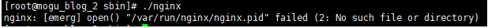

看问题需要创建一个目录，那么就开始创建吧

```
mkdir -p /var/run/nginx
```

再次使用启动命令，启动成功


我们在使用命令 ，查看已经启动的端口号

```
netstat -tunlp
```

 

我们已经看到了，现在已经开机自启了 RabbitMQ的 5672 15672 ， mysql的 3306， 其他的一些就是项目的端口，现在我们还需要启动 redis的 6379 和 tomcat的 8080


注意：如果我们查看端口号没有RabbitMQ，我们需要手动启动对应的服务

新开一个xshell连接，启动rabbitmq：

```
# 后台启动RabbitMQ
rabbitmq-server -detached
```

### 启动redis

```
# 进入redis的安装目录
cd /soft/redis/bin/

# 后台启动redis
./redis-server redis.conf

# 查看启动端口号
netstat -tunlp
```

 我们看到redis已经正常启动了


### 启动tomcat中的solr

tip：如果配置了Solr作为全文检索，那么需要启动Solr，否则可以忽略这一步

```
# 进入tomcat目录
cd /soft/tomcat/bin

# 启动
./startup.sh

# 查看启动信息
tail -f ../logs/catalina.out
```

### 启动微服务

启动 mogu_eureka & mogu_picture & mogu_sms & mogu_admin & mogu_web

```
#进入到项目目录
cd /home/mogu_blog
```

我们查看项目结构，有以下几个文件夹


下面说明每个文件夹的作用

```
mogu_admin：admin端API接口服务
mogu_data：存在蘑菇博客的图片资源
mogu_eureka：服务发现
mogu_picture: 图片服务器，用于图片上传和下载
mogu_sms: 消息发送服务器，用于邮件和短信发送
mogu_web：web端API接口服务
mogu_monitor：监控模块
mogu_zipkin：链路追踪模块
vue_mogu_admin：VUE的后台管理页面
vue_mogu_web：VUE的门户网站
```

首先进入mogu_eureka目录下

我们查看一下目录结构

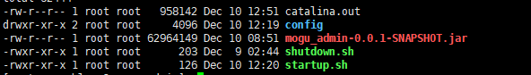

```
./startup.sh  #启动脚本
./shutdown.sh #关闭脚本
mogu_admin***.jar #springboot打包的可执行jar包
/config #外部配置文件
catalina.out #启动脚本后，生成的日志文件
```

然后我们使用下面的命令进行启动

```
# 进入mogu_eureka目录
cd mogu_eureka
# 启动项目
./startup.sh
```

不过需要注意的是：mogu_picture 、 mogu_web、mogu_sms 我们还需要修改一些配置，才能够启动成功

> tip：因为镜像中的代码可能不是最新版本，因此推荐在按照本篇博客，安装好docker环境后，需要在参考下面蘑菇博客部署阿里云这篇博客，重新将前后端代码都重新部署一遍，同时也记得把doc中的两个SQL文件也重新导入，确保服务器为最新代码~

### mogu_picture修改配置

首先我们在启动startup.sh脚本前，先修改对应目录下 config文件夹的application.yml配置文件，直接修改可能会里面是乱码，可以先把它取出来，到window下修改，然后在放入

```
# 进入picture目录下
cd /home/mogu_blog/mogu_picture/config
# 编辑配置
vim application.yml
```

然后找到下面的内容，把对应的ip地址改成自己云服务器的即可

```
#Data image url
file:
  upload:
    path: /home/mogu_blog/mogu_data/
```

修改完成后，我们回到上级目录，执行启动脚本

```
# 返回上一级
cd ..
# 启动项目
./startup.sh
```

### mogu_web修改配置

同理，找到mogu_web下的config文件，我们需要将下面的域名，改成自己的IP地址

```
#Data image url
data:
  # 门户页面
  webSite:
    url: http://101.132.122.175:9527/#/
  # mogu_web网址，用于第三方登录回调
  web:
    url: http://101.132.122.175:8603
  # 静态资源映射，通过nginx
  image:
    url: http://101.132.122.175:8600/
```

同时在配置文件的最下面，还需要修改第三方注册需要的 clientId 和 ClientSecret：如果不清楚如何获取的小伙伴，可以查看我的这篇博客，在后面部分对ID的获取有相关介绍：[SpringBoot+Vue如何集成第三方登录JustAuth](http://moguit.cn/#/info?blogUid=8cbadb54967257f12d6cc7eb1a58a361)

```yml
# 第三方登录
justAuth:
  clientId:
    gitee: XXXXXXXXXXXXXXXXXXXXXX
    github: XXXXXXXXXXXXXXXXXXXXXX
  clientSecret:
    gitee: XXXXXXXXXXXXXXXXXXXXXX
    github: XXXXXXXXXXXXXXXXXXXXXX
```

###  mogu_sms修改配置

在mogu_sms中，主要修改的就是邮箱的配置，我们将发送邮件的信息改成自己的

```yml
#mail
mail:
    username: XXXXXXX@163.com
    password: XXXXXXX #授权码开启SMTP服务里设置
```

注意，上面的password是授权码，授权码不是密码，以163邮箱为例，我们需要开启SMTP服务，然后设置授权码


修改完成后，我们启动对应的项目即可，最终我们需要启动的项目有： mogu_eureka，mogu_picture, mogu_sms, mogu_admin, mogu_web

**tip:（用于以后使用图形化客户端进行连接）**

mysql的账号和密码是 root  mogu2018

redis的密码是 mogu2018

## 验证是否后台是否启动成功

等服务器都启动完成后，下面我们验证一下后台是否正常启动，访问下列的地址：

```
http://your_ip:8761
```

首次登录会出现登录框：用户名：user  密码：password123

如果我们看到下面四个服务都注册到eureka中，那说明启动成功

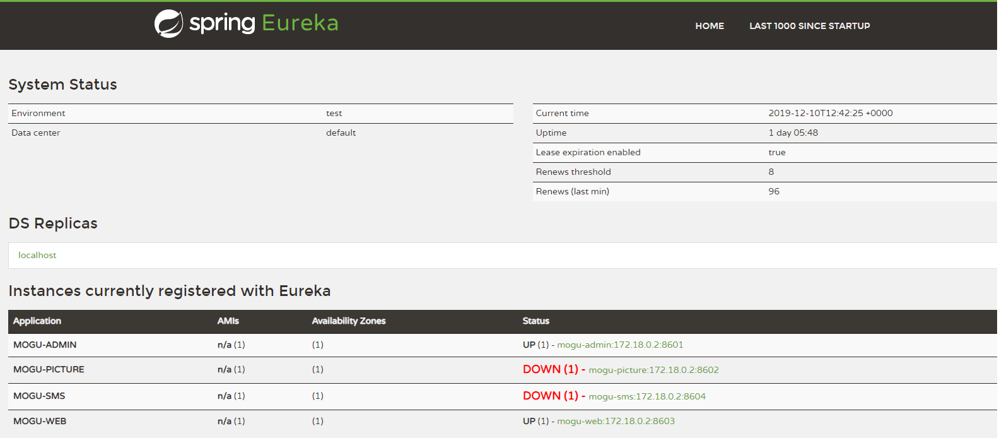

我们在通过访问下列swagger接口，测试接口是否正常

```
http://your_ip:8601/swagger-ui.html
http://your_ip:8603/swagger-ui.html
```

如果能够进入下面页面的话，说明后台是没有问题的了，下面我们可以验证一下接口


验证登录

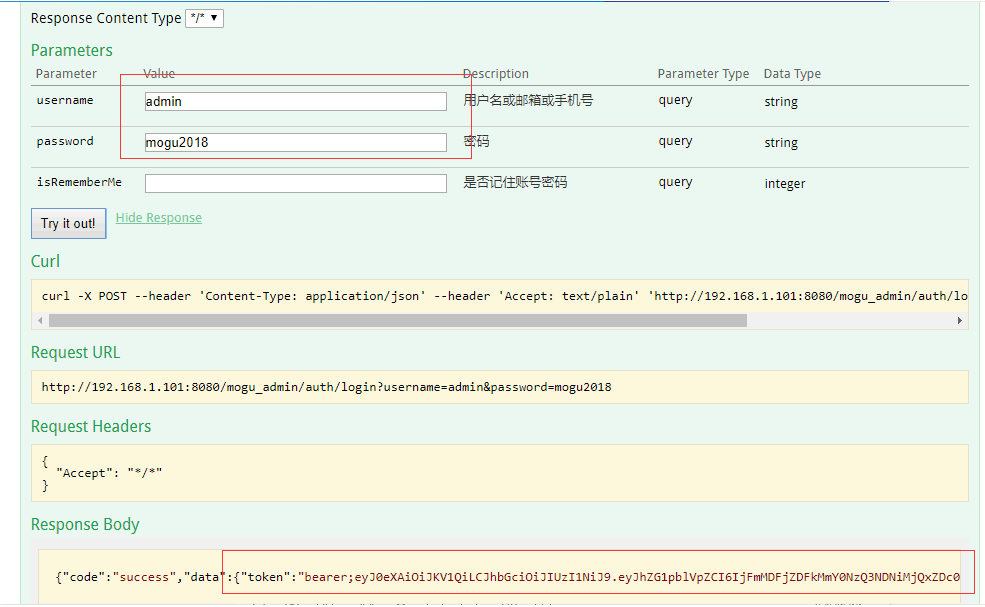

登录功能正常使用，我们把token复制到来，然后在swagger页面的右上角，有一个authorize的按钮，点击后，将token粘贴进去，即可操作全部接口进行测试了~

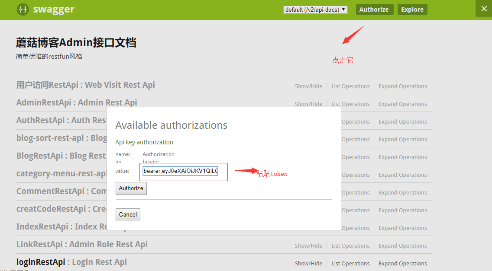

## 修改前端项目配置

我们现在需要修改两个地方的配置，分别是：vue_mogu_admin 和 vue_mogu_web

下面我们到 vue_mogu_web/config/目录下，修改prod.env.js文件

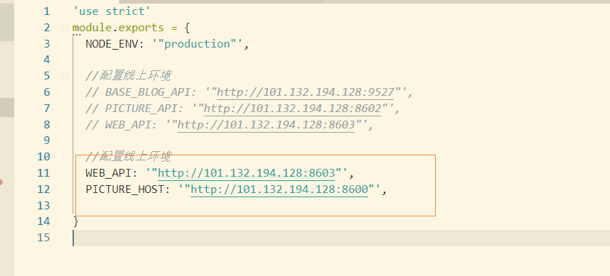

把里面的ip地址换成你主机的地址即可

```
WEB_API: '"http://your_ip:8603"',
PICTURE_HOST: '"http://your_ip:8600"',
```

同理，在修改 vue_mogu_admin下的地址，把里面的ip地址，换成你服务器的ip即可

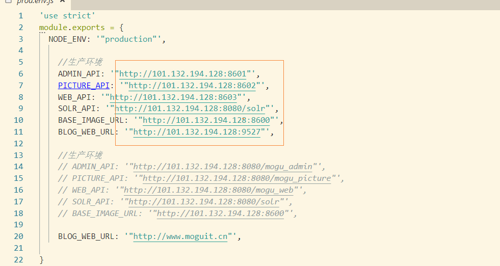

修改完成后，需要进行重新编译~ 打包~ 部署~

我们首先在 vue_mogu_admin 目录下，执行下列命令进行打包（打包过程中.....可能会遇到一些语法规范错误，请无视~）

```
# 安装依赖
npm install --registry=https://registry.npm.taobao.org

# 打包
npm run build
```

打包完成后，会生成一个dist目录，我们将整个dist目录，压缩成 zip格式

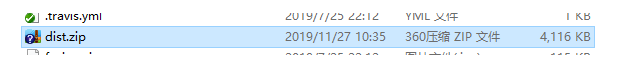

然后使用xftp工具，丢入到我们的前端目录下，目录在 /home/mogu_blog/vue_mogu_admin

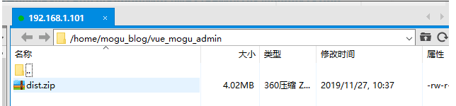

注意：如果该文件夹下存在 dist文件夹，我们需要将其删除，然后在解压

然后使用下面命令进行解压

```
unzip dist.zip
```

同理的操作，在执行一下上述操作，将vue_mogu_web项目也进行打包，部署到 /home/mogu_blog/vue_mogu_web目录下即可

## 访问蘑菇博客项目

### 访问前端项目

例如： 192.168.1.101:9527 


### 访问后端项目

 ip地址:9528  用户名和密码是： admin mogu2018

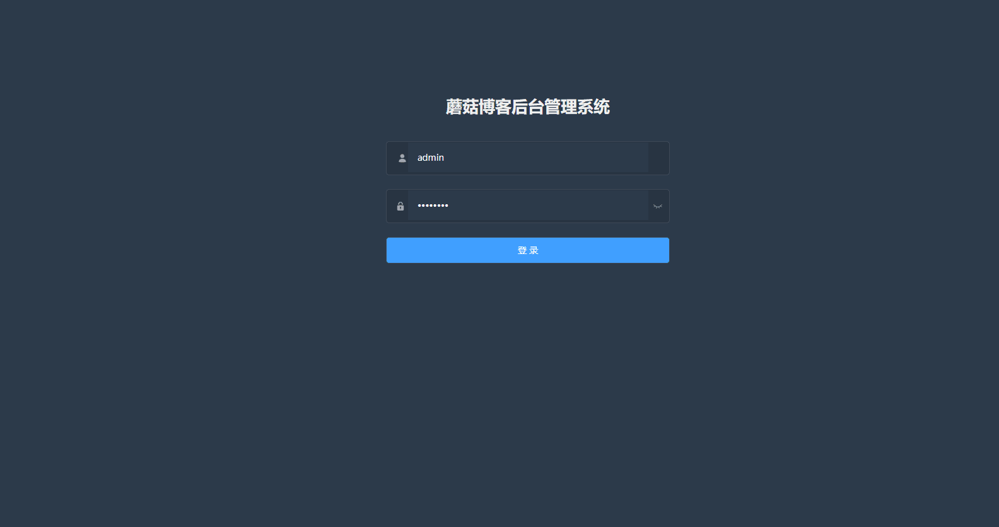

## 总结：

好了，到目前为止，蘑菇博客已经搭建完成。当然小伙伴并不是拉取来就能直接用的， 如果ip地址不一样的话，是不能直接使用的，后面的话，需要拉取源码后，修改对应的配置信息后，然后在打包部署，才能够使用的。