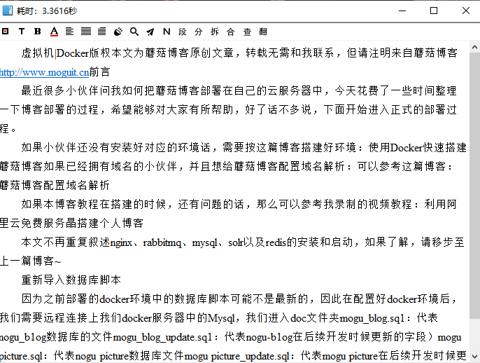
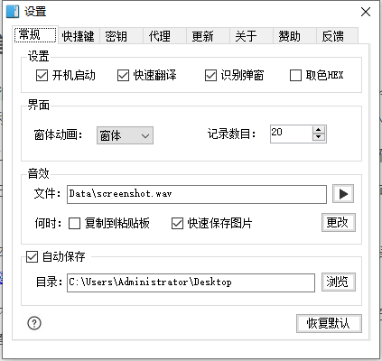

# OCR文字识别软件

## 概述

OCR（optical character recognition）文字识别是指电子设备（例如扫描仪或数码相机）检查纸上打印的字符，然后用字符识别方法将形状翻译成计算机文字的过程；即，对文本资料进行扫描，然后对图像文件进行分析处理，获取文字及版面信息的过程。如何除错或利用辅助信息提高识别正确率，是OCR最重要的课题。衡量一个OCR系统性能好坏的主要指标有：拒识率、误识率、识别速度、用户界面的友好性，产品的稳定性，易用性及可行性等。

## 前言

前阵子沉迷于B站视频学习，然后有很多视频都是不提供课件和ppt的，如果自己需要做笔记的话，需要自己暂停视频，然后手动敲，虽然说。。这么一个动作可以加深一下学习记忆，但是也让我苦不堪言，仿佛回到了老师在黑板上写，我在下面抄写的情景，最后老师讲的啥也没听到，满满的一本子笔记就感觉自己学会了。。

所以为了避免这类事情的再次重演，我寻找了几款ORC文字识别工具，帮助我们能够提高生产力。

## 树洞OCR 

树洞 OCR 文字识别（一款跨平台的 OCR 小工具） 同时也在Github上开源了，官网地址：[点我传送](https://github.com/AnyListen/tools-ocr)

我最开始尝试了一些，页面比较简陋，而且功能不是特别完善，截图翻译的时候比较难受，特别是在双屏的环境下

## 雨梦OCR

一款超易用文字提取&翻译软件，下载即用，免安装。目前支持，截图提取文本 | 图片导入提取 | 文本自动合并 | 文本自动翻译 | 多个OCR接口，支持多种语言提取 | 支持百度，腾讯，谷歌翻译接口 | 自定义快捷键 | 支持只截图

官网地址：[点我传送](http://hanxinyumeng.cn/)

这个比上面的树洞OCR操作起来就更友好了，因为我主要的用处是用于截屏翻译，这个在截屏翻译这块做的还可以，能满足需求，但是存在一个问题就是，雨梦OCR是收费版本的，还不是买断制，是需要1年19元的收费，但是每天会提供50次免费使用好像，如果对这个OCR使用不是特别频繁的话，是可以使用的。

## 天若OCR

天若 OCR 文字识别开源版是基于 @天若幽心 [开源的代码](https://github.com/tianruoyouxin/tianruoocr_last) 进行完善制作而成，目前该大佬好像去开发上面的树洞OCR了？？

官网地址：https://github.com/AnyListen/tianruoocr

我们选择release发行版，进行下载

下面里面的zip文件

然后运行里面的exe文件即可，运行后会创建一个状态栏图标，我们按F4即可截图

界面还是挺美观的，而且功能也很强大，还支持请求的接口，所以目前来说 天若OCR是首选~

