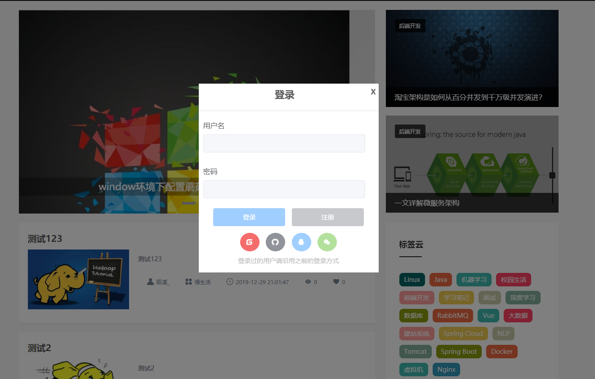
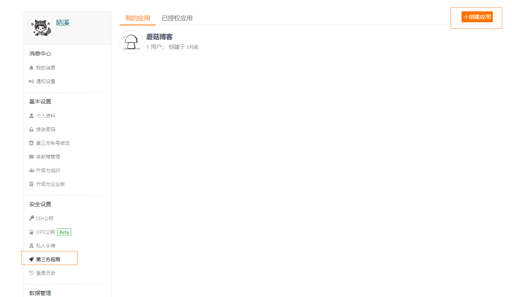
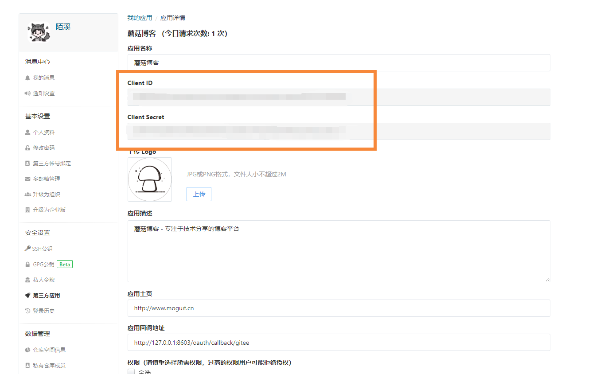
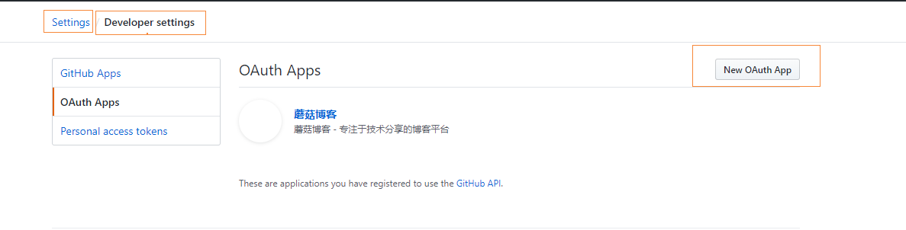
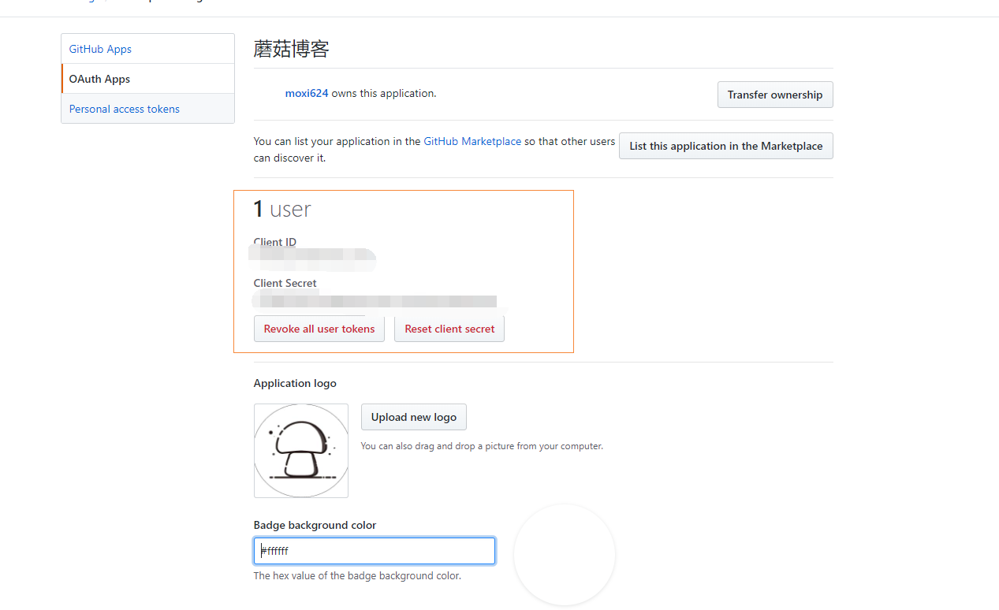
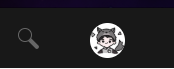

# SpringBoot+Vue如何集成第三方登录登录JustAuth

## 前言

这两天打算给蘑菇博客增加第三方登录模块，所有对目前的第三方登录的Github和Gitee中的Demo进行的调查，发现在gitee有个做的非常不错的项目：史上最全的整合第三方登录的开源库。目前已支持Github、Gitee、微博、钉钉、百度、Coding、腾讯云开发者平台、OSChina、支付宝、QQ、微信、淘宝、Google、Facebook、抖音、领英、小米、微软、今日头条、Teambition、StackOverflow、Pinterest、人人、华为、企业微信、酷家乐、Gitlab、美团、饿了么和推特等第三方平台的授权登录。 Login, so easy!

JustAuth仓库：https://gitee.com/yadong.zhang/JustAuth

JustAuth文档：https://docs.justauth.whnb.wang/#/

## 编写登录页面Vue样式和代码

首先需要编写一个登录框代码，下面是使用vue创建了一个组件 LoginBox，同时里面还引入了阿里矢量库中的几个图标，感兴趣的小伙伴可以查看这篇博客：[Vue项目使用阿里巴巴矢量图标库](http://moguit.cn/#/info?blogUid=1310f62f726ef0892e1de19bc14bba09)

```vue
<template>
  <div>
    <div class="box loginBox" v-if="showLogin == true">
      <div class="title"  >
        <span class="t1">
          登录
        </span>
        <div class="t2" @click="closeLogin()">
          X
        </div>
      </div>
      <el-divider></el-divider>
      <el-form :label-position="labelPosition" :model="loginForm">
        <el-form-item label="用户名">
          <el-input v-model="loginForm.userName" disabled></el-input>
        </el-form-item>
        <el-form-item label="密码">
          <el-input type="password" v-model="loginForm.password" disabled></el-input>
        </el-form-item>
        <el-row class="btn">
          <el-button class="loginBtn" type="primary" @click="startLogin" disabled>登录</el-button>
          <el-button class="registerBtn" type="info" @click="goRegister" disabled>注册</el-button>
        </el-row>

        <el-row class="elRow">
          <el-tooltip content="码云" placement="bottom">
            <el-button type="danger" circle @click="goAuth('gitee')">
              <span class="iconfont">&#xe602;</span>
            </el-button>
          </el-tooltip>

          <el-tooltip content="Github" placement="bottom">
            <el-button type="info" circle @click="goAuth('github')">
              <span class="iconfont">&#xe64a;</span>
            </el-button>
          </el-tooltip>

          <el-tooltip content="QQ" placement="bottom">
            <el-button type="primary" circle disabled>
              <span class="iconfont">&#xe601;</span>
            </el-button>
          </el-tooltip>

          <el-tooltip content="微信" placement="bottom">
            <el-button type="success" circle disabled>
              <span class="iconfont">&#xe66f;</span>
            </el-button>
          </el-tooltip>

        </el-row>
        <div class="loginTip">登录过的用户请沿用之前的登录方式</div>
      </el-form>
    </div>

    <div class="box registerBox" v-if="showLogin == false">
      <div class="title">
        <span class="t1">
          登录
        </span>
        <div class="t2" @click="closeLogin()">
          X
        </div>
      </div>
      <el-divider></el-divider>
      <el-form :label-position="labelPosition" :model="registerForm">
        <el-form-item label="用户名">
          <el-input v-model="registerForm.userName"></el-input>
        </el-form-item>

        <el-form-item label="密码">
          <el-input type="password" v-model="registerForm.password"></el-input>
        </el-form-item>

        <el-form-item label="重复密码">
          <el-input type="password" v-model="registerForm.password2"></el-input>
        </el-form-item>

        <el-form-item label="邮箱">
          <el-input v-model="registerForm.email"></el-input>
        </el-form-item>

        <el-row class="btn">
          <el-button class="loginBtn" type="primary" @click="startRegister">注册</el-button>
          <el-button class="registerBtn" type="info" @click="goLogin">返回登录</el-button>
        </el-row>

        <div class="loginTip">注册后，需要到邮箱进行邮件认证~</div>
      </el-form>
    </div>

    <div class="mask"></div>

  </div>
</template>

<script>
  import {login, register} from "@/api/user";

  export default {
    name: "share",
    data() {
      return {
        // 显示登录页面
        showLogin: true,
        isLogin: false,
        table: false,
        dialog: false,
        loading: false,
        labelPosition: "right",
        loginForm: {
          userName: "",
          password: ""
        },
        registerForm: {
          userName: "",
          password: "",
          password2: "",
          email: ""
        }
      };
    },
    components: {},
    created() {
    },
    methods: {
      startLogin: function () {
        var params = {};
        params.userName = this.loginForm.userName;
        params.passWord = this.loginForm.password;
        params.isRememberMe = 0;
        console.log("登录表单", params);
        login(params).then(response => {
          if (response.code == "success") {
            console.log(response.data);
          }
        });
      },
      startRegister: function () {

        var params = {};
        params.userName = this.registerForm.userName;
        params.passWord = this.registerForm.password;
        params.email = this.registerForm.email;
        console.log("登录表单", params);
        register(params).then(response => {
          if (response.code == "success") {
            console.log(response.data);
          }
        });
      },
      goLogin: function () {
        console.log("去登录页面");
        this.showLogin = true;
      },
      goRegister: function () {
        console.log("去注册页面");
        this.showLogin = false;
      },
      goAuth: function (source) {
        console.log("go", source)
        var params = new URLSearchParams();
        params.append("source", source);
        login(params).then(response => {
          if (response.code == "success") {
            console.log(response.data.url);
            var token = response.data.token;
            console.log(response);
            window.location.href = response.data.url
          }
        });
      },
      closeLogin: function() {
        this.$emit("closeLoginBox", "");
      }
    }
  };
</script>


<style>
  .box {
    width: 400px;
    height: 420px;
    background: white;
    position: fixed;
    margin: auto;
    left: 0;
    right: 0;
    top: 0;
    bottom: 0;
    z-index: 1000; /* 要比遮罩层大 */
  }

  .registerBox {
    height: 570px;
  }

  .box .title {
    height: 48px;
    font-size: 22px;
    font-weight: bold;
    text-align: center;
    line-height: 48px;
  }
  .box .title .t2 {
    font-size: 16px;
    float: right;
    margin-right: 6px;
    margin-top: -6px;
    cursor: pointer;
  }

  .box .el-divider--horizontal {
    margin: 12px 0;
  }

  .box .el-form-item__label {
    margin-left: 10px;
    font-size: 16px;
  }

  .box .el-input__inner {
    margin-left: 10px;
    width: 90%;
  }

  .box .btn {
    text-align: center;
  }

  .box .loginBtn {
    width: 40%;
  }

  .box .registerBtn {
    width: 40%;
  }

  .elRow {
    margin-top: 15px;
    text-align: center;
  }

  .loginTip {
    margin-top: 10px;
    font-size: 14px;
    text-align: center;
    color: #bababa;
  }

  .remarksBox {
    position: fixed;
    left: 50%;
    margin-left: -100px;
    top: 50%;
    margin-top: -50px;
    border: 1px solid red;
    width: 200px;
    height: 100px;
    text-align: center;
    z-index: 1000; /* 要比遮罩层大 */
  }

  /* 遮罩层 */
  .mask {
    position: fixed;
    left: 0;
    top: 0;
    width: 100%;
    height: 100%;
    background-color: rgba(0, 0, 0, 0.5);
    z-index: 999;
  }
</style>
```

下面是运行后的结果如下所示



因为目前没打算自己制作登录和注册功能，所以用户名、密码、以及登录和注册都被设置成disabled了，下面是引入的接口：login

```javascript
import request from '@/utils/request'

export function login(params) {
  return request({
    url: process.env.WEB_API + '/oauth/render',
    method: 'post',
    params
  })
}
```

## 引入第三方登录

完成了前端的页面后，我们就需要撰写后端代码了

首先需要引入JustAuth的Maven依赖，我们在pom文件中添加对应依赖

```xml
<!--JustAuth第三方登录模块-->
<dependency>
    <groupId>me.zhyd.oauth</groupId>
    <artifactId>JustAuth</artifactId>
    <version>1.13.1</version>
</dependency>
```

然后在编写定义一个Controller，这里我创建了一个AuthRestApi.java文件

```java
package com.moxi.mogublog.web.restapi;

import com.alibaba.fastjson.JSONObject;
import com.moxi.mogublog.utils.JsonUtils;
import com.moxi.mogublog.utils.ResultUtil;
import com.moxi.mogublog.utils.StringUtils;
import com.moxi.mogublog.web.global.MessageConf;
import com.moxi.mogublog.web.global.SQLConf;
import com.moxi.mogublog.web.global.SysConf;
import com.moxi.mogublog.xo.entity.User;
import com.moxi.mogublog.xo.service.UserService;
import io.swagger.annotations.Api;
import io.swagger.annotations.ApiOperation;
import me.zhyd.oauth.config.AuthConfig;
import me.zhyd.oauth.exception.AuthException;
import me.zhyd.oauth.model.AuthCallback;
import me.zhyd.oauth.model.AuthResponse;
import me.zhyd.oauth.model.AuthToken;
import me.zhyd.oauth.request.AuthGiteeRequest;
import me.zhyd.oauth.request.AuthGithubRequest;
import me.zhyd.oauth.request.AuthRequest;
import me.zhyd.oauth.utils.AuthStateUtils;
import org.apache.log4j.LogManager;
import org.apache.log4j.Logger;
import org.springframework.beans.factory.annotation.Autowired;
import org.springframework.beans.factory.annotation.Value;
import org.springframework.data.redis.core.StringRedisTemplate;
import org.springframework.web.bind.annotation.GetMapping;
import org.springframework.web.bind.annotation.PathVariable;
import org.springframework.web.bind.annotation.RequestMapping;
import org.springframework.web.bind.annotation.RestController;

import javax.servlet.http.HttpServletRequest;
import javax.servlet.http.HttpServletResponse;
import java.io.IOException;
import java.util.HashMap;
import java.util.Map;
import java.util.concurrent.TimeUnit;

/**
 * 第三方登录认证
 */
@RestController
@RequestMapping("/oauth")
@Api(value = "认证RestApi", tags = {"AuthRestApi"})
public class AuthRestApi {

    private static Logger log = LogManager.getLogger(IndexRestApi.class);

    @Autowired
    private UserService userService;
    @Value(value = "${justAuth.clientId.gitee}")
    private String giteeClienId;
    @Value(value = "${justAuth.clientSecret.gitee}")
    private String giteeClientSecret;
    @Value(value = "${justAuth.clientId.github}")
    private String githubClienId;
    @Value(value = "${justAuth.clientSecret.github}")
    private String githubClientSecret;
    @Value(value = "${data.webSite.url}")
    private String webSiteUrl;
    @Value(value = "${data.web.url}")
    private String moguWebUrl;
    @Value(value = "${BLOG.USER_TOKEN_SURVIVAL_TIME}")
    private Long userTokenSurvivalTime;
    @Autowired
    private StringRedisTemplate stringRedisTemplate;

    @ApiOperation(value = "获取认证", notes = "获取认证")
    @RequestMapping("/render")
    public String renderAuth(String source, HttpServletResponse response) throws IOException {
        log.info("进入render:" + source);
        AuthRequest authRequest = getAuthRequest(source);
        String token = AuthStateUtils.createState();
        String authorizeUrl = authRequest.authorize(token);
        Map<String, String> map = new HashMap<>();
        map.put(SQLConf.URL, authorizeUrl);
        return ResultUtil.result(SysConf.SUCCESS, map);
    }


    /**
     * oauth平台中配置的授权回调地址，以本项目为例，在创建gitee授权应用时的回调地址应为：http://127.0.0.1:8603/oauth/callback/gitee
     */
    @RequestMapping("/callback/{source}")
    public void login(@PathVariable("source") String source, AuthCallback callback, HttpServletRequest request, HttpServletResponse httpServletResponse) throws IOException {
        log.info("进入callback：" + source + " callback params：" + JSONObject.toJSONString(callback));
        AuthRequest authRequest = getAuthRequest(source);
        AuthResponse response = authRequest.login(callback);
        String result = JSONObject.toJSONString(response);
        System.out.println(JSONObject.toJSONString(response));

        Map<String, Object> map = JsonUtils.jsonToMap(result);
        Map<String, Object> data = JsonUtils.jsonToMap(JsonUtils.objectToJson(map.get(SysConf.DATA)));
        Map<String, Object> token = JsonUtils.jsonToMap(JsonUtils.objectToJson(data.get(SysConf.TOKEN)));
        String accessToken = token.get(SysConf.ACCESS_TOKEN).toString();
        User user = userService.insertUserInfo(request, result);

        if (user != null) {
            //将从数据库查询的数据缓存到redis中
            stringRedisTemplate.opsForValue().set(SysConf.USER_TOEKN + SysConf.REDIS_SEGMENTATION + accessToken, JsonUtils.objectToJson(user), userTokenSurvivalTime, TimeUnit.SECONDS);
        }

        httpServletResponse.sendRedirect(webSiteUrl + "?token=" + accessToken);
    }

    @RequestMapping("/revoke/{source}/{token}")
    public Object revokeAuth(@PathVariable("source") String source, @PathVariable("token") String token) throws IOException {
        AuthRequest authRequest = getAuthRequest(source);
        return authRequest.revoke(AuthToken.builder().accessToken(token).build());
    }

    @RequestMapping("/refresh/{source}")
    public Object refreshAuth(@PathVariable("source") String source, String token) {
        AuthRequest authRequest = getAuthRequest(source);
        return authRequest.refresh(AuthToken.builder().refreshToken(token).build());
    }

    @ApiOperation(value = "获取用户信息", notes = "获取用户信息")
    @GetMapping("/verify/{accessToken}")
    public String verifyUser(@PathVariable("accessToken") String accessToken) {
        String userInfo = stringRedisTemplate.opsForValue().get("TOKEN:" + accessToken);
        if (StringUtils.isEmpty(userInfo)) {
            return ResultUtil.result(SysConf.ERROR, MessageConf.INVALID_TOKEN);
        } else {
            Map<String, Object> map = JsonUtils.jsonToMap(userInfo);
            return ResultUtil.result(SysConf.SUCCESS, map);
        }
    }

    @ApiOperation(value = "删除accessToken", notes = "删除accessToken")
    @RequestMapping("/delete/{accessToken}")
    public String deleteUserAccessToken(@PathVariable("accessToken") String accessToken) {
        stringRedisTemplate.delete(SysConf.USER_TOEKN + SysConf.REDIS_SEGMENTATION + accessToken);
        return ResultUtil.result(SysConf.SUCCESS, MessageConf.DELETE_SUCCESS);
    }


    private AuthRequest getAuthRequest(String source) {
        AuthRequest authRequest = null;
        switch (source) {
            case SysConf.GITHUB:
                authRequest = new AuthGithubRequest(AuthConfig.builder()
                        .clientId(githubClienId)
                        .clientSecret(githubClientSecret)
                        .redirectUri(moguWebUrl + "/oauth/callback/github")
                        .build());
                break;
            case SysConf.GITEE:
                authRequest = new AuthGiteeRequest(AuthConfig.builder()
                        .clientId(giteeClienId)
                        .clientSecret(giteeClientSecret)
                        .redirectUri(moguWebUrl + "/oauth/callback/gitee")
                        .build());
                break;
            default:
                break;
        }
        if (null == authRequest) {
            throw new AuthException(MessageConf.OPERATION_FAIL);
        }
        return authRequest;
    }
}
```

application.yml部分配置文件如下所示：

```yaml
data:
  # 门户页面
  webSite:
    url: http://localhost:9527/#/
  # mogu_web网址，用于第三方登录回调
  web:
    url: http://127.0.0.1:8603
    
# 第三方登录
justAuth:
  clientId:
    gitee: XXXXXXXXXXXXXXXXXXXXXXXXXXXXXXXXXXXXXXXXXX
    github: XXXXXXXXXXXXXXXXXXXXXXXXXXXXXXXXXXXXXXXXXX
  clientSecret:
    gitee: XXXXXXXXXXXXXXXXXXXXXXXXXXXXXXXXXXXXXXXXXX
    github: XXXXXXXXXXXXXXXXXXXXXXXXXXXXXXXXXXXXXXXXXX    
```

关于clientId和clientSecret需要到各自的码云和github设置上进行获取：

在码云中：我们首先进入设置页面，然后选择第三方应用，然后创建应用



然后开始填写对应的内容


重新点击第三方应用，获取到对应的ClientID和Client Secret替换即可



Github上的操作同理，我们需要设置setting，然后选择Developer settings，OAuth Apps：创建一个新的



这里填写的信息和刚刚码云上差不多


然后最后在创建成功后复制对应的ClientID和Client Secret即可：



在AuthRestApi中，下面几个方法的主要作用是：

- renderAuth：获取认证，前端通过login方法，即访问的是该接口，然后会创建一个认证请求，里面调用了getAuthRequest方法
- getAuthRequest：该方法需要传入一个source参数，该参数主要是失败用户请求的接口，然后封装一个URL，最后通过renderAuth返回到前台页面中，该方法前端接受后，最终会生成一个URL，然后跳转到对应的页面进行授权即可

例如下面的vue代码：

```
    goAuth: function (source) {
        var params = new URLSearchParams();
        params.append("source", source);
        login(params).then(response => {
          if (response.code == "success") {
            console.log(response.data.url);
            var token = response.data.token;
            console.log(response);
            window.location.href = response.data.url
          }
        });
      },
```

vue代码，就是通过source判断我点击的按钮，如果是github，那么source为 ”github“，然后调用后台的登录方法，通过传递的source，生成一个授权页面url，最后我们通过window.location.href 跳转到授权页面：


回调的接口如下所示：

```java
    /**
     * oauth平台中配置的授权回调地址，以本项目为例，在创建gitee授权应用时的回调地址应为：http://127.0.0.1:8603/oauth/callback/gitee
     */
    @RequestMapping("/callback/{source}")
    public void login(@PathVariable("source") String source, AuthCallback callback, HttpServletRequest request, HttpServletResponse httpServletResponse) throws IOException {
        log.info("进入callback：" + source + " callback params：" + JSONObject.toJSONString(callback));
        AuthRequest authRequest = getAuthRequest(source);
        AuthResponse response = authRequest.login(callback);
        String result = JSONObject.toJSONString(response);
        System.out.println(JSONObject.toJSONString(response));

        Map<String, Object> map = JsonUtils.jsonToMap(result);
        Map<String, Object> data = JsonUtils.jsonToMap(JsonUtils.objectToJson(map.get(SysConf.DATA)));
        Map<String, Object> token = JsonUtils.jsonToMap(JsonUtils.objectToJson(data.get(SysConf.TOKEN)));
        String accessToken = token.get(SysConf.ACCESS_TOKEN).toString();
        User user = userService.insertUserInfo(request, result);

        if (user != null) {
            //将从数据库查询的数据缓存到redis中
            stringRedisTemplate.opsForValue().set(SysConf.USER_TOEKN + SysConf.REDIS_SEGMENTATION + accessToken, JsonUtils.objectToJson(user), userTokenSurvivalTime, TimeUnit.SECONDS);
        }

        httpServletResponse.sendRedirect(webSiteUrl + "?token=" + accessToken);
    }
```

我们需要将得到的用户信息，存储到数据库，同时生成一个token，通过url的方式，传递到前台，然后前台得到token后，通过token获取用户信息：

```java
    @ApiOperation(value = "获取用户信息", notes = "获取用户信息")
    @GetMapping("/verify/{accessToken}")
    public String verifyUser(@PathVariable("accessToken") String accessToken) {
        String userInfo = stringRedisTemplate.opsForValue().get("TOKEN:" + accessToken);
        if (StringUtils.isEmpty(userInfo)) {
            return ResultUtil.result(SysConf.ERROR, MessageConf.INVALID_TOKEN);
        } else {
            Map<String, Object> map = JsonUtils.jsonToMap(userInfo);
            return ResultUtil.result(SysConf.SUCCESS, map);
        }
    }
```

然后在vue项目中，我们只需要判断是否有token通过url传递过来

```javascript
 let token = this.getUrlVars()["token"];
      // 判断url中是否含有token
      if (token != undefined) {
        setCookie("token", token, 1)
      }

      // 从cookie中获取token
      token = getCookie("token")
      if (token != undefined) {
        authVerify(token).then(response => {
          if (response.code == "success") {
            this.isLogin = true;
            this.userInfo = response.data;
          } else {
            this.isLogin = false;
            delCookie("token");
          }
        });
      } else {
        this.isLogin = false;
 }
```

如果有，那么就通过token获取用户信息，登录完成后，就能够看到头像回显了：



