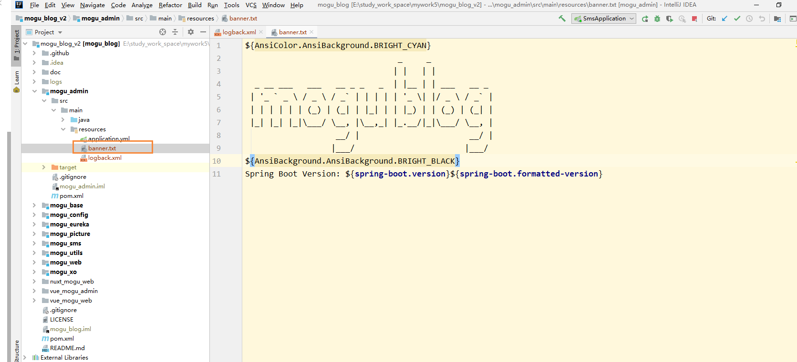
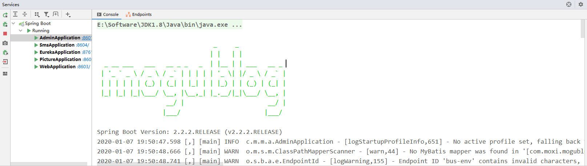

# SpringBoot项目启动增加自定义Banner

## 前言

最近有个老哥推荐我给博客启动的时候加上自定义Banner，开始我还不太明白他说的是那部分，后面给我发了这样一个，瞬间就懂了~

```
////////////////////////////////////////////////////////////////////  
//                          _ooOoo_                               //  
//                         o8888888o                              //  
//                         88" . "88                              //  
//                         (| ^_^ |)                              //  
//                         O\  =  /O                              //  
//                      ____/`---'\____                           //  
//                    .'  \\|     |//  `.                         //  
//                   /  \\|||  :  |||//  \                        //  
//                  /  _||||| -:- |||||-  \                       //  
//                  |   | \\\  -  /// |   |                       //  
//                  | \_|  ''\---/''  |   |                       //  
//                  \  .-\__  `-`  ___/-. /                       //  
//                ___`. .'  /--.--\  `. . ___                     //  
//              ."" '<  `.___\_<|>_/___.'  >'"".                  //  
//            | | :  `- \`.;`\ _ /`;.`/ - ` : | |                 //  
//            \  \ `-.   \_ __\ /__ _/   .-` /  /                 //  
//      ========`-.____`-.___\_____/___.-`____.-'========         //  
//                           `=---='                              //  
//      ^^^^^^^^^^^^^^^^^^^^^^^^^^^^^^^^^^^^^^^^^^^^^^^^^^        //  
//            佛祖保佑       永不宕机      永无BUG                    //
//////////////////////////////////////////////////////////////////// 
```

也就是用于替换我们启动时候的这个页面


其实修改的方法也比较简单，只需要在resource目录下，放一个banner.txt文件即可，文件下面就存放我们需要显示的banner，那么在启动的时候，就会加载出对应的图像出来



## 制作Banner

当然这里面的banner图像也并不是自己手动制作出来的，而是通过下面的网站制作的：

[http://patorjk.com/software/taag/#p=display&f=Graffiti&t=Type%20Something%20](http://patorjk.com/software/taag/#p=display&f=Graffiti&t=Type Something )

我们在上面输入我们需要显示的内容，然后复制里面的文本到banner.txt即可


同时里面也是也可以设置颜色的

```
# 设置字体颜色为绿色
${AnsiColor.GREEN}
# 设置背景颜色为绿色
AnsiBackground.GREEN
# 显示SpringBoot版本
${spring-boot.version}
```

下面是我的完整Banner.txt文件，如下所示

```
${AnsiColor.GREEN}
                                _     _
                               | |   | |            
  _ __ ___   ___   __ _ _   _  | |__ | | ___   __ _ 
 | '_ ` _ \ / _ \ / _` | | | | | '_ \| |/ _ \ / _` |
 | | | | | | (_) | (_| | |_| | | |_) | | (_) | (_| |
 |_| |_| |_|\___/ \__, |\__,_| |_.__/|_|\___/ \__, |
                   __/ |                       __/ |
                  |___/                       |___/
${AnsiColor.BRIGHT_BLACK}
Spring Boot Version: ${spring-boot.version}${spring-boot.formatted-version}
```

这里因为设置字体颜色会让后面的颜色都会变成对应的颜色，所以我们需要在之前在设置成黑色，这样才不会出现满屏的绿色了

下面是我的启动页面，如下所示：



