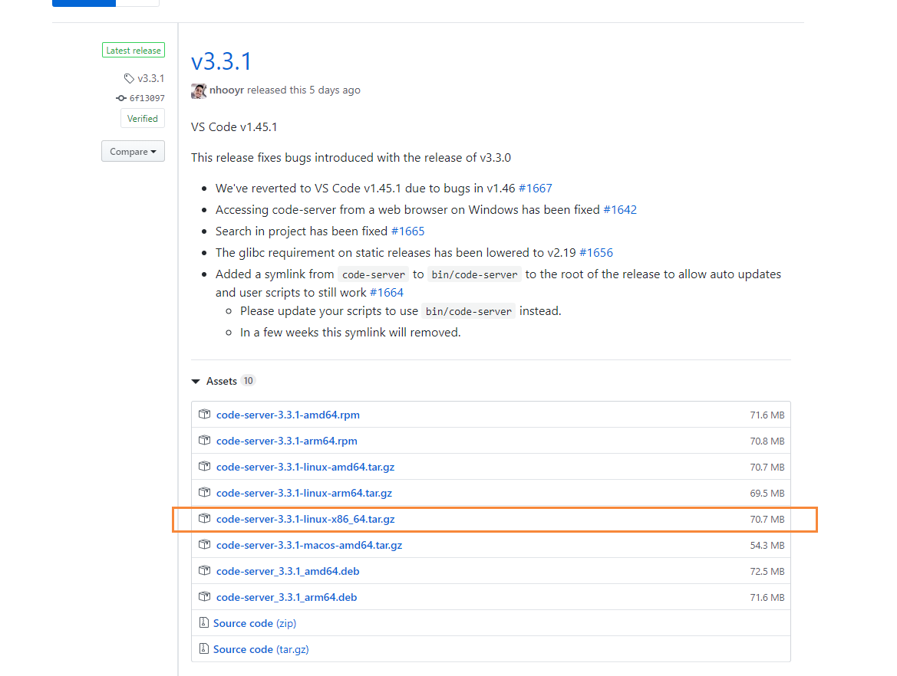
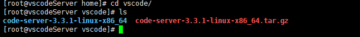
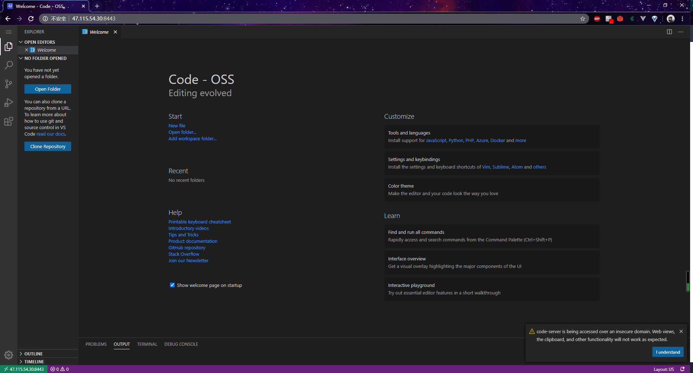

# VSCode服务版搭建教程

## 前言

因为之前买了个iPad，并且也配了一个蓝牙键盘，但是受限于没有合适的编辑器，因此想把ipad作为生产工具并做不到，只是用来看直播和Bilibili还挺香的。然后最近发现vscode有 server版本，也就是服务器版本，通过在自己服务器上进行配置，然后通过浏览器来来进行访问，突然发现打开新世界的大门。

## 安装

为了考虑到以后环境的可移植性比较强，做到一次安装到处运行，因此这里我使用的是使用docker来进行安装。

因为最开始我已经对一个centos的镜像做了ssh远程无密登录，因此这次我就直接拉取一个包含了ssh的镜像。

```shell
docker pull moxi/centos_ssh
```

下载安装后，我们启动该容器，同时开放两个端口号，分别是 11222 和 8443端口号

```
docker run --privileged -d -it -h vscodeServer --name vscodeServer -v /etc/localtime:/etc/localtime:ro -p 11222:22  -p 8443:8443  moxi/centos_ssh /usr/sbin/init
```

制作好容器后，我们登录进去，注意连接的端口号为11222，然后输入密码 www.moguit.cn 进入我们的centos_ssh容器。

进入docker容器内部后，去github上下载好[vscode server](https://github.com/cdr/code-server/releases)



然后再到我们的服务器中解压，使用下列命令

```
tar -zxvf code-server-3.3.1-linux-x86_64.tar.gz
```

解压完成后，如下图所示



然后进入下列目录

```
cd code-server-3.3.1-linux-x86_64
```

修改端口号和密码

```
vi ~/.config/code-server/config.yaml
```


使用命令启动，这个命令需要独占一个窗口

```
./code-server --host 0.0.0.0 --port 8443
```

不过上面的方式存在一个问题就是，需要独占一个窗口，如果终端关闭的话，将不能继续执行，因此我们需要使用的linux的开启一个守护进程 nohup，我们创建一个启动脚本

```
#!/bin/bash
nohup ./code-server --port 8443  --host 0.0.0.0  > catalina.out  2>&1 &
```

启动成功后，输入 ip + 8443端口号，即可访问到vs code的浏览器版本了



下面就是我通过ipad打开code server了