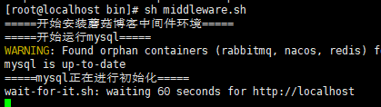
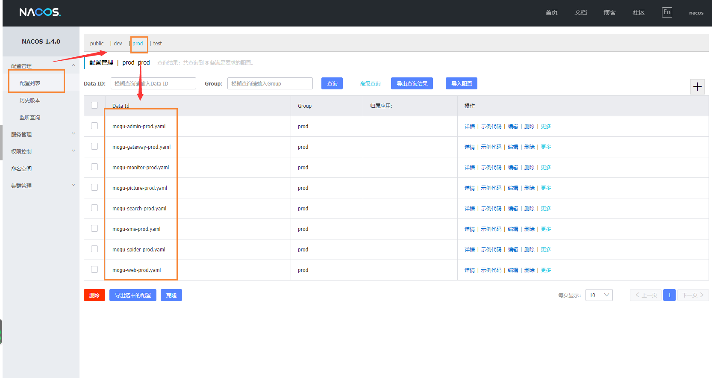
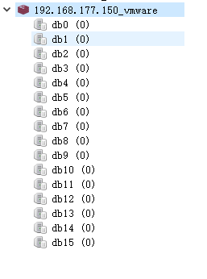
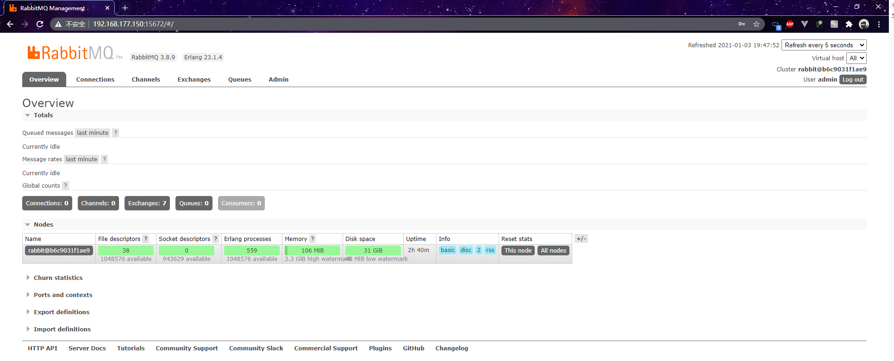
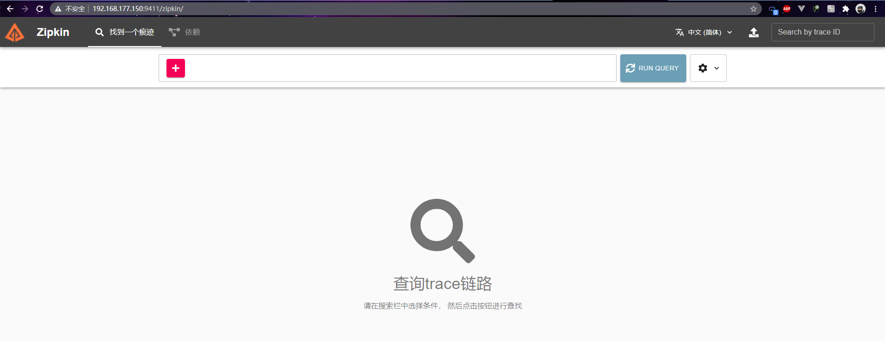
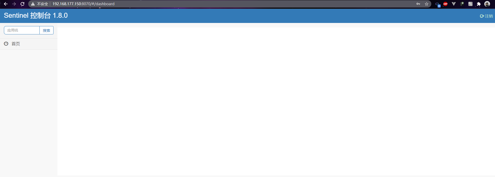
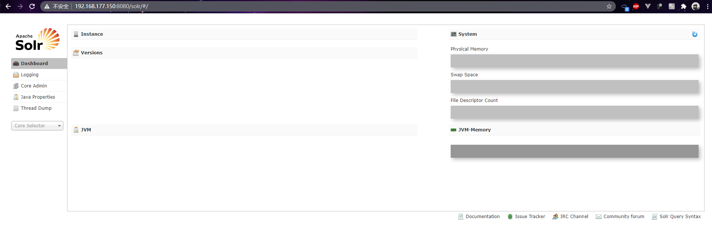
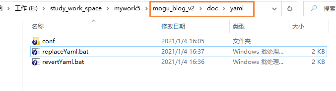
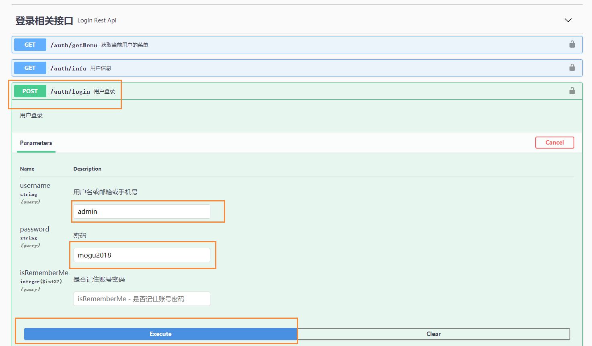
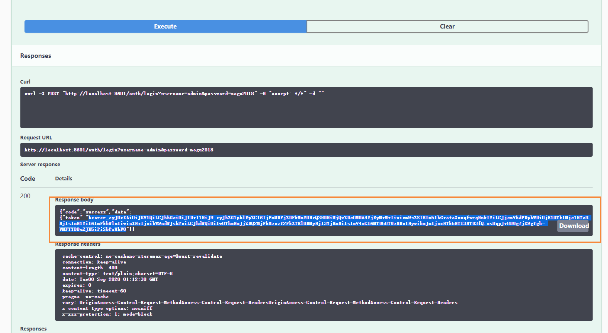

# Windows+VMware一键搭建蘑菇博客本地开发环境

## 前言

大家好，我是**陌溪**

这阵子很多新手小伙伴打算入坑蘑菇博客的开发，但是被博客所依赖的软件的安装和配置所劝退，导致最终无法顺利的完成蘑菇博客本地环境的搭建。鉴于此，我打算使用**VMware**快速搭建蘑菇博客所依赖的中间件，帮助小伙伴减轻痛苦。

注意：本博客使用的是 **Nacos/master** 分支代码 ，**Eureka** 分支环境搭建请参考 [本篇教程](http://moguit.cn/#/info?blogOid=14)

如何想把所有软件安装到 **Windows** 中，参考博客：[Windows环境下配置蘑菇博客环境](http://moguit.cn/#/info?blogOid=14)

**IDEA** 开发环境需要提前安装 **lombok** 插件：[IDEA中引入Lombok](http://moguit.cn/#/info?blogUid=4ccb7df5d537f52d954eb15f094c90a3) 

参考：[蘑菇博客切换搜索模式](http://moguit.cn/#/info?blogUid=4042b4f4088e4e37e95d9fc75d97298b)，完成蘑菇博客的搜索引擎切换，目前支持 **Solr**、**ElasticSearch**、**MySQL** 的方式，选择一种搜索方式即可。

## VMware中安装CentOS

首先需要在 **VMware** 中安装 **CentOS** 环境，推荐硬盘大小设置为 **40GB**，内存大小为 **4GB**。

同时为了以后搭建更加方便，最好能够给 **CentOS** 服务器设置固定 **IP**

参考博客：[VMWare中CentOS如何配置固定IP](http://moguit.cn/#/info?blogOid=126)

此教程不仅仅适用于 VMWare中的CentOS，如果本地配置不行的话，也可以购买云服务器完成下面的部署

最低配置：1核2G 【[需开启虚拟内存](http://moguit.cn/#/info?blogOid=96)】

推荐配置：2核4G 【双十二特惠】

> 【阿里云】云服务器双12狂欢特惠，1核2G 5M轻量级应用服务器114元/年【博主使用】 [点我传送](https://www.aliyun.com/minisite/goods?userCode=w7aungxw) 
>
> 【腾讯云】云产品限时秒杀，爆款1核2G云服务器，首年99元（老用户重新用微信QQ注册即可） [点我进入](https://curl.qcloud.com/zry6xub9)

### 安装Docker

因为我们需要拉取镜像，所以需要在服务器提前安装好Docker，首先配置一下Docker的阿里yum源

```bash
cat >/etc/yum.repos.d/docker.repo<<EOF
[docker-ce-edge]
name=Docker CE Edge - \$basearch
baseurl=https://mirrors.aliyun.com/docker-ce/linux/centos/7/\$basearch/edge
enabled=1
gpgcheck=1
gpgkey=https://mirrors.aliyun.com/docker-ce/linux/centos/gpg
EOF
```

然后yum方式安装docker

```bash
# yum安装
yum -y install docker-ce
# 查看docker版本
docker --version  
# 开机自启
systemctl enable docker
# 启动docker
systemctl start docker
```

配置docker的镜像源

```bash
cat >> /etc/docker/daemon.json << EOF
{
  "registry-mirrors": ["https://b9pmyelo.mirror.aliyuncs.com"]
}
EOF
```

然后重启docker

```bash
systemctl restart docker
```

因为Docker容器之间，需要互相通信访问，所以我们需要创建我们的Docker网络

```bash
docker network create mogu
```

### 安装Docker Compose

Docker Compose是用来定义和运行多个Docker应用程序的工具。通过Compose，可以使用YAML文件来配置应用程序需要的所有服务，然后使用一个命令即可从YML文件配置中创建并启动所有服务。

下载地址：[点我传送](https://wws.lanzous.com/iTHoIiuilvi)

把下载到的文件使用Xftp工具，拷贝到 `/usr/local/bin/` 目录下

```bash
# 重命名
mv docker-compose-Linux-x86_64  docker-compose
# 加入执行权限
sudo chmod +x /usr/local/bin/docker-compose
# 查看docker-compose版本
docker-compose -v
```

### 关闭防火墙

然后关闭CentOS的防火墙

```bash
systemctl stop firewalld.service    
```

## 下载源码

下载蘑菇博客的源码

```bash
https://gitee.com/moxi159753/mogu_blog_v2
```

然后找到，docker-compose 目录


首先我们来查看一下docker-compose的目录结构


- bin：相关一键启动脚本的目录
- config：存放配置文件
- data：存放数据文件
- log：存放日志文件
- yaml：存放docker compose的yaml文件

下面我们开始，将docker-compose文件夹，拷贝服务器目录位置随意，我是拷贝到 `/root/docker-compose` 目录，然后给命令设置执行权限

```bash
# 进入目录
cd docker-compose
# 添加执行权限
chmod +x bin/middleware.sh
chmod +x bin/kernShutdown.sh
chmod +x bin/wait-for-it.sh
```

可能是因为windows与Unix文本编辑器默认格式不同，引起脚本无法执行的情况，因此需要进行转换

```bash
# 安装 dos2unix
yum -y install dos2unix*
# 转换脚本
dos2unix bin/middleware.sh
dos2unix bin/kernShutdown.sh
dos2unix bin/wait-for-it.sh
```

## 部署核心组件

下面我们将部署蘑菇博客所依赖的核心中间件，例如：**Nacos**、**MySQL**、**Redis**、**RabbitMQ**、**Nginx** 等

首先到  **docker-compose/bin** 目录下，执行脚本

```bash
# 开始部署核心组件
sh middleware.sh
# 以后打算关闭的话，执行 ./kernShutdown.sh
```

下面是安装过程，需要耐心等待



在部署完中间件后，我们需要进行测试中间件安装是否成功。

### MySQL

首先测试 **MySQL** 数据库，可以使用图形化工具如：**SQLyog**

> CentOS IP：192.168.177.150 【配置的固定CentOS IP】
>
> MySQL用户名：root
>
> MySQL密码：mogu2018


连接后，即可看到我们安装好的蘑菇博客业务数据库


### Nacos

Nacos服务注册和配置中心，如果想更加详细的了解Nacos的使用

参考 [【SpringCloud】使用Nacos实现服务注册发现和配置中心等功能](http://moguit.cn/#/info?blogUid=e6e619349d31dded928c9265c5a9c672)

访问下面 **URL** 进行测试

```bash
# Nacos后台配置页面，默认账号和密码：nacos  nacos
http://192.168.177.150:8848/nacos
```

打开后，我们在配置列表即可看到我们的配置文件



### Redis

Redis使用 **RedisDesktopManager** 进行连接

> Host：192.168.177.150 
>
> Redis密码：mogu2018

开始连接


因为目前 **Redis** 还没有缓存数据，所以为空，以后有数据的话，将会使用 **db0** 数据库



### RabbitMQ

RabbitMQ是消息队列，我们可以访问其图形化界面

```bash
# 图形化地址
192.168.177.150:15672
# 默认账号和密码为：admin  mogu2018
```

然后即可进入到RabbitMQ的可视化页面




## 部署非核心组件

除了核心组件之外，还有一些组件可以**根据自己的情况选择是否启动**，如果**本地内存不允许**的话，也可以直接**跳过**本节的非核心组件的部署~

### Zipkin

Zipkin是一个开源的分布式的链路追踪系统，每个微服务都会向zipkin报告计时数据，聚合各业务系统调用延迟数据，达到链路调用监控跟踪，深入了解可参考博客：[使用Zipkin搭建蘑菇博客链路追踪](http://www.moguit.cn/#/info?blogUid=35bd93cabc08611c7f74ce4564753ef9)

链路追踪服务可以选择安装，不过如果没有安装的话，在启动的时候会出现这样一个错误，不过该错误不会影响正常使用，可以忽略

```bash
I/O error on POSt request for "http://localhost:9411/api/v2/span" ：connect timeout
```

到 **docker-compose/bin** 目录下，执行下面脚本安装 **zipkin**

```bash
docker-compose -f zipkin.yml up -d
```

脚本将会给我们拉取zipkin镜像，并进行启动


启动完成后，我们访问下面 **URL** 进行测试

```bash
http://192.168.177.150:9411/zipkin/
```

启动后的页面如下所示



### Sentinel

随着微服务的流行，服务和服务之间的稳定性变得越来越重要。**Sentinel** 以流量为切入点，从流量控制、熔断降级、系统负载保护等多个维度保护服务的稳定性。

参考[【SpringCloud】使用Sentinel实现熔断和限流](http://moguit.cn/#/info?blogUid=408e9c889ebf96a66af2adfdc258ba5f) ，了解Sentinel以及使用

到 **docker-compose/bin** 目录下，执行下面脚本安装 **Sentinel**

```bash
docker-compose -f sentinel.yml up -d
```

脚本将会给我们拉取 sentinel 镜像，并进行启动


启动完成后，我们访问下面 **URL** 进行测试

```bash
# 访问Sentinel登录页面，输入账号密码： sentinel  sentinel
http://192.168.177.150:8070
```

即可进入到sentinel后台管理，因为我们的微服务还没有启动，所以暂时还看不到任何东西




### 搜索模块

目前蘑菇博客支持三种搜索模式的配置，分别是 **Solr**、**ElasticSearch** 和 **SQL**，小伙伴可以按照自己的服务器配置进行相应的部署，默认是 **SQL** 搜索，即无需启动 **mogu-search** 也能正常运行。

参考：[蘑菇博客切换搜索模式](http://moguit.cn/#/info?blogUid=4042b4f4088e4e37e95d9fc75d97298b) ，进行三种模式的切换（三种方式选择一种，默认是 **SQL** 搜索，可以配置**ElasticSearch** 或者 **Solr** 作为全文检索 ）

####  Solr

首先下载 **Solr**，因为Solr的配置比较复杂，因此我已经将配置好的 **Solr** 上传到网盘，小伙伴可以直接下载

下载地址：[点我传送](https://wws.lanzous.com/iZ3Nak07auh)

下载完成后解压，将其上传到 **CentOS** 服务器上，存放的目录为  **docker-compose/data/solr_data** 下


然后在到 **docker-compose/yaml** ，执行下面脚本

```bash
docker-compose -f solr.yml up -d
```

启动完成后，我们访问下面 **URL** 进行测试

```bash
http://192.168.177.150:8080/solr
```

即可成功访问到 **Solr** 的图形化页面



#### ElasticSearch

关于ElasticSearch的配置和相关介绍，可以参考这篇博客：[ElasticSearch安装与介绍](http://moguit.cn/#/info?blogOid=375)

下面到 **docker-compose/yaml** ，执行下面脚本，安装ELK模块

```bash
docker-compose -f elk.yml up -d
```

启动完成后，我们访问下面 **URL** 进行测试

```bash
http://192.168.177.150:5601
```

如果能出现下面的页面，说明已经成功安装了 ElasticSearch 和 Kibana，在这里kibana只是作为ElasticSearch的图形化显示工具，相当于原来的SolrAdmin页面一样。


## 启动后端项目

在启动项目前，我们需要修改一下 **hosts** 文件


然后加入如下配置 

```bash
192.168.177.150	  redis
192.168.177.150	  rabbitmq
192.168.177.150	  solr
192.168.177.150	  zipkin
192.168.177.150	  sentinel
192.168.177.150 mysql
192.168.177.150 nacos
127.0.0.1	  mogu_monitor
127.0.0.1	  mogu_web
127.0.0.1	  mogu_search
127.0.0.1	  mogu_admin
127.0.0.1	  mogu_sms
127.0.0.1	  mogu_gateway
```

注意：里面的 **192.168.177.150** 是我CentOS的IP地址，小伙伴需要修改成自己的 **IP** 地址

当然也推荐小伙伴们使用 **SwitchHosts!** 来进行自由切换

### 自动修改项目配置

本着让小伙伴们 **能不动手就不动手** 的原则，我写了个自动修改配置的脚本，在 **mogu_blog_v2/doc/yaml** 目录下



这里里面有个两个 **windows bat** 

- replaceYaml.bat：替换项目的配置
- revertYaml.bat：还原项目的配置

只需要双击 **replaceYaml.bat** 即可完成配置的替换

如果需要手动替换的下，参考下面这节，否者可以直接跳过~

### 手动修改项目配置

如果选择手动配置的话，需要使用本地 **IDEA** 打开项目，然后修改配置文件

首先修改的是 **mogu_admin** 项目的 **application.yml**，将 **dev** 改成 **prod**


然后修改 **bootstrap.yaml** ，将 **dev** 改成 **prod**，同时还需要修改 **nacos** 和 **sentinel** ，将 localhost改为对应的服务名称即可。


我们重复上面操作，将  **mogu_web**、**mogu_sms**、**mogu_gateway**、**mogu_picture**、**mogu_montor** 等项目都进行修改。

### 启动项目

修改完成后，直接启动项目即可。其中我们需要启动核心组件包含下面几个【服务启动没有先后顺序】

```bash
mogu_admin、mogu_web、mogu_sms、mogu_picture、mogu_gateway
```

下面是启动完成的图片，一共包含五个核心服务


等服务器都启动完成后，下面我们验证一下后台是否正常启动，回到我们的Nacos管理界面

```bash
http://192.168.177.150:8848/nacos
```

如果我们看到下面五个服务都注册到Nacos中，那说明启动成功

- mogu_picture
- mogu_sms
- mogu_admin
- mogu_web
- mogu_gateway

如果我们看到下面五个服务都注册到Nacos中，那说明启动成功


在通过访问下列swagger接口，测试接口是否正常

```bash
############ admin端swagger ##################
http://localhost:8601/swagger-ui/index.html

############ picture端swagger ##################
http://localhost:8602/swagger-ui/index.html

############ web端swagger ##################
http://localhost:8603/swagger-ui/index.html
```

如果能够进入下面页面的话，说明后台是没有问题的了，下面我们可以验证一下接口


验证登录



然后执行完成后，复制到token



然后在swagger页面的右上角，有一个authorize的按钮，点击后，将token粘贴进去，即可操作全部接口进行测试了~


## 启动前端项目

前端项目使用的是 **Vue** 编写的，所以在这之前，需要下载好nodejs，因为nodejs里的npm模块是用于管理vue项目中的依赖，就类似于maven一样

node官网：https://nodejs.org/en/

在安装的时候，记得选择好加入到环境变量中，这样我们就能在任何地方都使用。

查看是否安装成功： **npm -v**

### 安装 vue_mogu_admin 依赖

进入vue_mogu_admin 文件夹内，使用下面命令进行安装

```bash
# 指定node-sass的国内镜像源
npm i node-sass --sass_binary_site=https://npm.taobao.org/mirrors/node-sass

# 使用淘宝镜像源进行依赖安装，解决国内下载缓慢的问题(出现警告可以忽略)
npm install --registry=https://registry.npm.taobao.org

# 启动项目
npm run dev

#打包项目（在部署的时候才需要使用）
npm run build
```

强烈建议不要用直接使用 cnpm 安装，会有各种诡异的 bug，可以通过重新指定 registry 来解决 npm 安装速度慢的问题。若还是不行，可使用 [yarn](https://github.com/yarnpkg/yarn) 替代 `npm`。

Windows 用户若安装不成功，很大概率是`node-sass`安装失败，[解决方案](https://github.com/PanJiaChen/vue-element-admin/issues/24)。

另外因为 `node-sass` 是依赖 `python`环境的，如果你之前没有安装和配置过的话，需要自行查看一下相关安装教程。

在启动项目成功后，会跳转到：**localhost:9528** ，我们输入账号密码： **admin**  **mogu2018** 访问即可


### 安装 vue_mogu_web依赖

这个步骤其实和admin端的安装时一致的，这里就不做过多的叙述

进入vue_mogu_web 文件夹内，使用下面命令进行安装

```bash
# 使用淘宝镜像源进行依赖安装，解决国内下载缓慢的问题(出现警告可以忽略)
npm install --registry=https://registry.npm.taobao.org

# 启动项目
npm run dev

#打包项目（在部署的时候才需要使用）
npm run build
```

下面是启动成功的界面，跳转到  **localhost:9527**


## 修改项目配置

最后在项目成功启动后，我们还需要修改一些配置，才算完全搭建好博客

### mogu_web配置

我们进入到nacos配置文件管理界面，找到的 mogu_web_prod.yaml文件


我们需要将下面的域名，改成自己的

```bash
data:
  # 门户页面
  webSite:
    url: http://192.168.177.150:9527/#/
    
  # mogu_web网址，用于第三方登录回调
  web:
    url: http://192.168.177.150:8603
```

同时在配置文件的最下面，还需要修改第三方注册需要的 clientId 和 ClientSecret：如果不清楚如何获取的小伙伴，可以查看我的这篇博客，在后面部分对ID的获取有相关介绍：

- [SpringBoot+Vue如何集成第三方登录JustAuth](http://moguit.cn/#/info?blogUid=8cbadb54967257f12d6cc7eb1a58a361)
- [使用JustAuth集成QQ登录](http://www.moguit.cn/#/info?blogUid=fe9e352eb95205a08288f21ec3cc69e0)

```bash
# 第三方登录
justAuth:
  clientId:
    gitee: XXXXXXXXXXXXXXXXXXXXXX
    github: XXXXXXXXXXXXXXXXXXXXXX
    qq: XXXXXXXXXXXXXXXX # APP ID 
  clientSecret:
    gitee: XXXXXXXXXXXXXXXXXXXXXX
    github: XXXXXXXXXXXXXXXXXXXXXX
    qq: XXXXXXXXXXXXXXXXXX # APP Key
```

### mogu_sms配置

我们进入到nacos配置文件管理界面，找到的 mogu_sms_prod.yaml文件


在mogu_sms中，主要修改的就是邮箱的配置，我们将发送邮件的信息改成自己的

```bash
#mail
mail:
    username: XXXXXXX@163.com
    password: XXXXXXX #授权码开启SMTP服务里设置
```

注意，上面的password是授权码，授权码不是密码，以163邮箱为例，我们需要开启SMTP服务，然后设置授权码


### 修改图片配置

图片默认使用的是本地图片上传，如果想使用其它的存储方式，可以参考另外的博客

- [蘑菇博客配置七牛云存储](http://www.moguit.cn/#/info?blogUid=735ed389c4ad1efd321fed9ac58e646b)
- [使用Minio搭建对象存储服务](http://www.moguit.cn/#/info?blogUid=a1058b2d030310e2c5d7b0584e514f1f)

本文主要以本地文件存储为例，我们到系统配置，首先修改图片显示的本地域名


修改完成后，进行保存，然后在图片管理上传新的图片


> 要是图片无法正常显示，可以F12看看图片路径是否是修改后的IP，同时对应的 8600端口的防火墙是否开放

最后到博客管理页面，编辑博客，然后选择图片插入即可~

