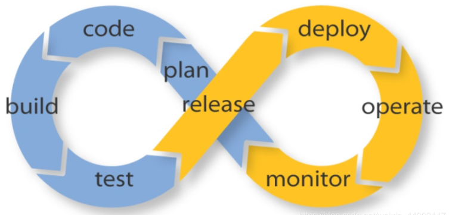
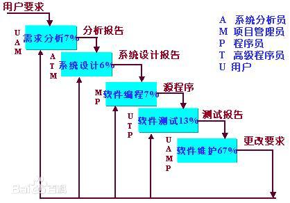
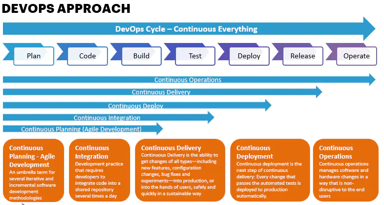
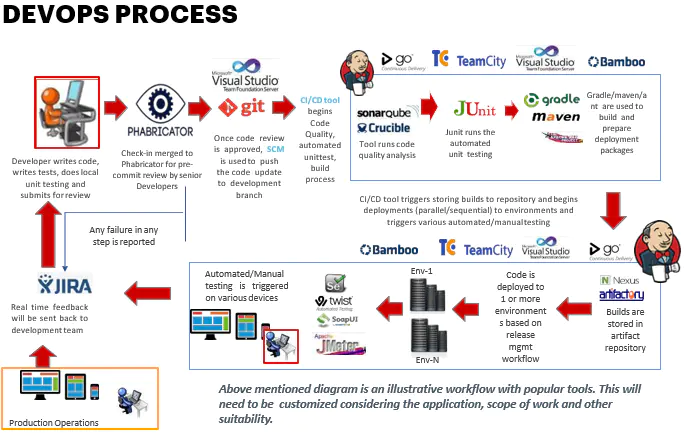
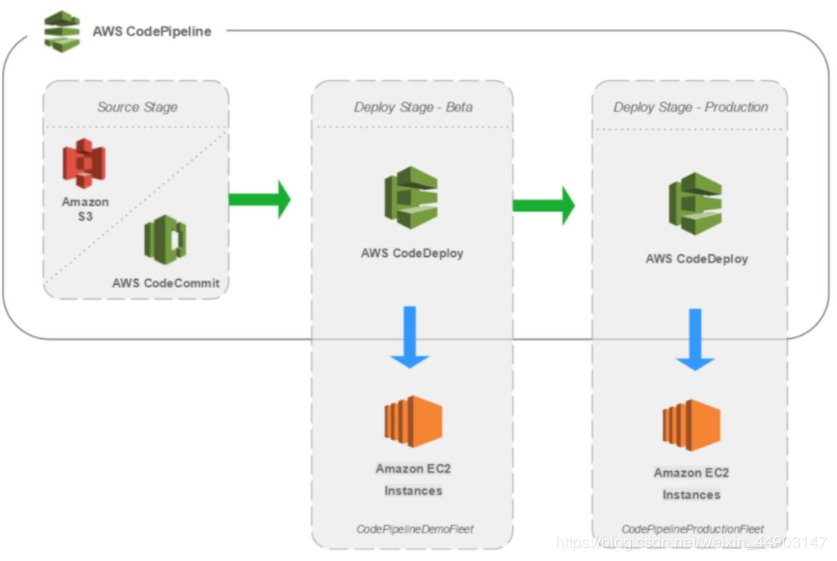

# 什么是CICD

## 简介

CI/CD的采用，让软件的发布流程变得更加轻松~

从最初的瀑布模型，到后来的敏捷开发，现在是DevOps，这是现代开发人员构建出色的产品技术路线。同时随着DevOps的兴起，出现了持续集成（Continuous Integration）、持续交付（Continuous Delivery）、持续部署（Continuous Deployment）的新方法。传统的软件开发和交付方法正在迅速变得过时。从历史上来看，在敏捷时代，大多数公司每月，每季度，每两年都会发布软件。然而，在DevOps时代，每周，每天都是常态。当SaaS正在占领世界时，您可以轻松的动态更新应用，而无需强迫客户下载新组件。很多时候，我们甚至都不会意识到正在发生变化。开发团队通过软件交付流水线（Pipeline）实现自动化，以缩短交付周期，大多数团队都有自动化流程来检查代码并部署到新环境。

## 瀑布模型

瀑布模型（Waterfall Model）是一个项目开发架构，开发过程中是通过一系列阶段顺序展开的，从系统需求分析开始，直到产品发布和维护，每个阶段都会产生循环反馈，因此，如果有信息未被覆盖或者发现了问题，那么最好返回上一阶段并进行适当的修改，项目开发进程从一个阶段流动到下一个阶段，这也是瀑布模型名称的由来。包括软件工程开发、企业项目开发、产品生产以及市场销售等构造瀑布模型。

### 瀑布模型的优点

- 为项目提供了按阶段划分的检查点
- 当前一阶段完成后，您只需要关注后续的阶段
- 可在迭代模型中应用瀑布模型
  - 增量迭代应用与瀑布模型，迭代1解决最大的问题，每次迭代产生一个可运行的版本，同时增加更多的功能。每次迭代必须经过质量和集成测试。
- 它提供了一个模板，这个模板使得分析、设计、编码、测试和支持的方法可以在该模板下有一个共同的指导。

### 瀑布模型的缺点

同时因为瀑布模型强调文档的作用，并要求每个阶段都要仔细验证。但是这种模型的线性过程太过于理想化，已不再适合线代的软件开发模型，几乎被业界抛弃

- 每个阶段的划分完全固定，阶段之间产生大量的文档，极大的增加了工作量
- 由于开发模型是线性的，用户只有等到整个过程的末期才能见到开发成果，从而增加了开发风险。
- 通过过多的强制完成日期和里程碑来跟踪各个项目阶段
- 瀑布模型的突出缺点是不适应用户需求的变化
- 早期的错误可能要等到开发后期的测试阶段才能发现，进而带来严重的后果

## 敏捷开发

敏捷开发以用户的需求进化为核心，采用迭代、循序渐进的方法进行软件开发，在敏捷开发中，软件项目在构建初期被切分成多个子项目，各个子项目的成果都经过测试，具备可视，可集成和可运行的特征，换而言之，就是把一个大项目分为多个相互联系，但也可以独立运行的小项目，并分别完成，再此过程中，软件一直处于可使用状态。

### 敏捷开发原则

- 快速迭代
- 让测试人员和开发人员参与需求讨论
- 编写可测试的需求文档
- 多沟通，尽量减少文档
- 做好产品原型
- 及早考虑测试

## DevOps

DevOps（Development 和 Operations的组合词）是一组过程、方法与系统的统称，用于促进开发（应用程序、软件工程）、技术运营和质量保障（QA）部门之间的沟通、协作与整合。

它是一种重视软件开发人员（Dev）和IT运维技术人员（Ops）之间沟通合作的文化，运动或惯例。透过自动化软件交付和架构变更的流程，来使得构建、测试、发布软件能够变得更加快捷、频繁和可靠。

### DevOps和敏捷开发的关系

首先敏捷开发是关于软件开发的过程与模式，DevOps更多是关于软件部署和运维管理，产品管理是关于产品的定义和需求规划。

更具体的说，DevOps是补充但不能取代敏捷。因为DevOps不会取代敏捷，它非常好的补充了敏捷开发。它通过消除资源浪费和简化部署等方式来实现这一目标，从而实现更快，更持续的生产部署。许多组织都进行敏捷开发，自动化测试和持续交付。但是运维人员可能会说

> 嘿嘿，你不能跨域那条线，这是我们的领土，你留在你的领地，我们照顾我们的

从开发和运维的关系上，可以看看传统软件开发方式和DevOps方式之间的区别

传统方式：

- 在软件开发中，无论是瀑布模型还是敏捷开发，都是由开发团队来构建软件
- 开发团队需要与运维团队进行大规模的交接，运维团队负责执行一系列部署活动，将软件代码移动至生产环境，并负责维护后续的系统稳定运行 
- 生产环境的基础设施与开发或测试不同
- 需要有额外检查和平衡，以确保它一切功能正常。
- 部署是由不同的人完成的，运维团队之前从未见过或听过任何此类软件。

但是DevOps打破了开发和部署之间的界限

- 如果将软件放入到容器，并把容器运送到不同的环境中会怎么样？
- 如果为每个环境简化了检查和测试以及流程，那么直接转向生成该怎么办？
- 如果自动化了所有测试用例，所有的配置管理，环境管理和发布管理，直接launch是否可以？
- 如果开发团队将代码移至生产中，并在其后续进行管理，那么运维团队与开发团队形成密切合作会怎么样？

所以说，DevOps是敏捷开发的补充，是将运维纳入产品开发过程的思维方式，是敏捷开发方法论的升级。

### DevOps方法和工具链

## CI/CD

### 持续集成（CI）

将各个开发人员的工作集合在一个代码仓库中，通常每天需要进行几次，主要目的是要尽早的发现集成错误，使团队更加紧密结合，更好地写作办公。

通过持续集成，开发人员能够频繁将其代码集成到公共代码仓库的主分支中。开发人员能够在任何时候多次向仓库提交作品，而不是独立地开发每个功能模块并在开发周期结束时一一提交。
这里的一个重要想法是让开发人员更快，更频繁地做到这一点，从而降低集成成本。实际情况中，开发人员在集成时经常会发现新代码和已有代码存在冲突。如果集成较早并更加频繁，那么冲突将更容易解决且执行成本更低。当然，还有一些权衡。此流程变更不提供任何额外的质量保证。实际上，许多组织发现这种集成变得更加昂贵，因为它们依赖于手动过程来确保新代码不会引入新的错误，并且不会破坏现有代码。为了减少集成任务期间的摩擦，持续集成依赖于测试套件和自动化测试执行。然而，要认识到自动化测试和持续测试是完全不同的这一点很重要，我们会在文章结尾处详细说明。
CI 的目标是将集成简化成一个简单、易于重复的日常开发任务，这将有助于降低总体构建成本，并在周期的早期发现缺陷。要想有效地使用 CI 必须转变开发团队的习惯，要鼓励频繁迭代构建，并且在发现 bug 的早期积极解决。

### 持续交付（CD）

持续交付目的是最小化部署或释放过程中固有的摩擦。它的实现通常能够将构建部署的每个步骤自动化，以便于任何时刻能够安全地完成代码的发布。

CD实际上是 CI 的扩展，其中软件交付流程进一步自动化，以便随时轻松地部署到生成环境中。CD 集中依赖于部署流水线，团队通过流水线自动化测试和部署过程。此流水线是一个自动化系统，可以针对构建执行一组渐进的测试套件。CD 具有高度的自动化，并且在一些云计算环境中也易于配置。在流水线的每个阶段，如果构建无法通过关键测试会向团队发出警报。否则，将继续进入下一个测试，并在连续通过测试后自动进入下一个阶段。流水线的最后一个部分会将构建部署到和生产环境等效的环境中。这是一个整体的过程，因为构建、部署和环境都是一起执行和测试的，它能让构建在实际的生产环境可部署和可验证。
AWS上提供了现代CI / CD管道的可靠展示。亚马逊是云计算提供商之一，提供令人印象深刻的CI / CD 管道环境，并提供一个演练过程，您可以从其中选择众多开发资源，并将它们链接在一个易于配置且易于监控的管道中。

许多人认为持续交付的吸引力主要在于，它自动化了从提交代码到仓库，再到测试和发布产品过程的所有步骤。这是构建和测试过程细致的自动化，但是如何发布以及发布什么仍然是需要人工操作，持续部署可以改变这一点。

### 持续部署

持续部署扩展了持续交付，以便软件构建，在通过所有测试时自动部署。在这样的流程中，不需要人为决定何时及如何投入生产环境。CI/CD 系统的最后一步将在构建后的组件/包退出流水线时自动部署。此类自动部署可以配置为快速向客户分发组件、功能模块或修复补丁，并准确说明当前提供的内容。

采用持续部署的组织可以将新功能快速传递给用户，得到用户对于新版本的快速反馈，并且可以迅速处理任何明显的缺陷。用户对无用或者误解需求的功能的快速反馈有助于团队规划投入，避免将精力集中于不容易产生回报的地方。随着 DevOps 的发展，新的用来实现 CI/CD 流水线的自动化工具也在不断涌现。这些工具通常能与各种开发工具配合，包括像 GitHub 这样的代码仓库和 Jira 这样的 bug 跟踪工具。此外，随着 SaaS 这种交付方式变得更受欢迎，许多工具都可以在现代开发人员运行应用程序的云环境中运行，例如 GCP 和 AWS。最受欢迎的自动化工具是 Jenkins（以前的 Hudson），这是一个由数百名贡献者和商业公司 Cloudbees 支持的开源项目。Cloudbees 甚至聘请了 Jenkins 的创始人，并提供了一些 Jenkins 培训项目和附加组件。除了开源项目之外，还有一些更现代化的商业产品例如 CircleCI，Codeship 和 Shippable。这些产品各有优缺点，我鼓励开发人员在开发流程中一一尝试它们，以了解它们在您的环境中的工作方式，以及它们如何与您的工具、云平台、容器系统等协作。

## 参考

[https://baike.baidu.com/item/%E7%80%91%E5%B8%83%E6%A8%A1%E5%9E%8B/9817778?fr=aladdin](https://baike.baidu.com/item/瀑布模型/9817778?fr=aladdin)

https://dzone.com/articles/what-is-cicd