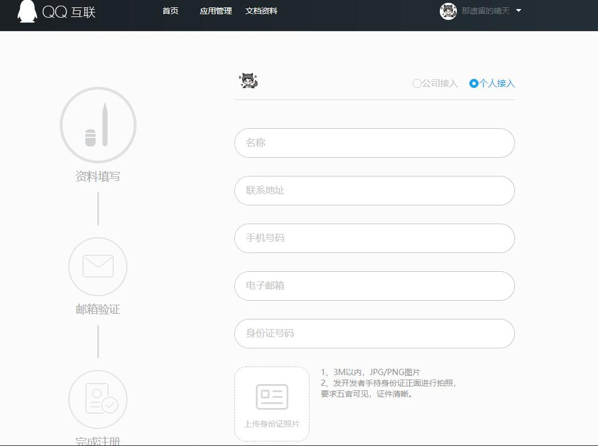
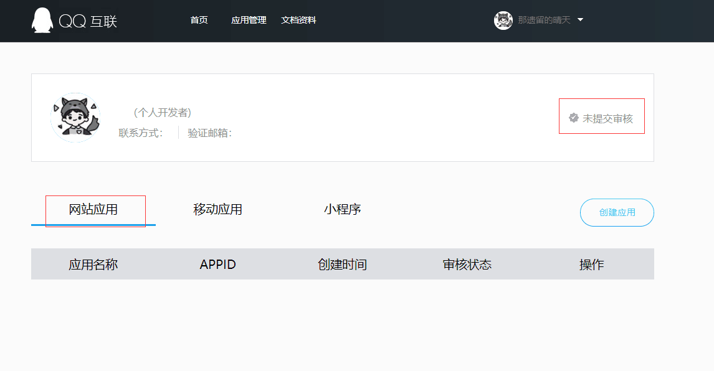
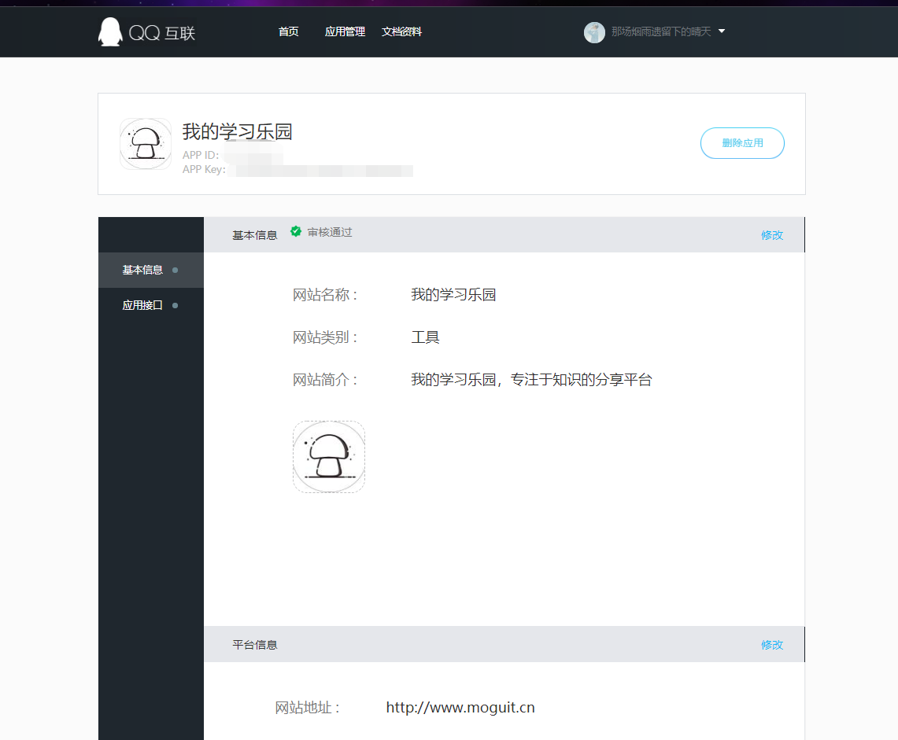
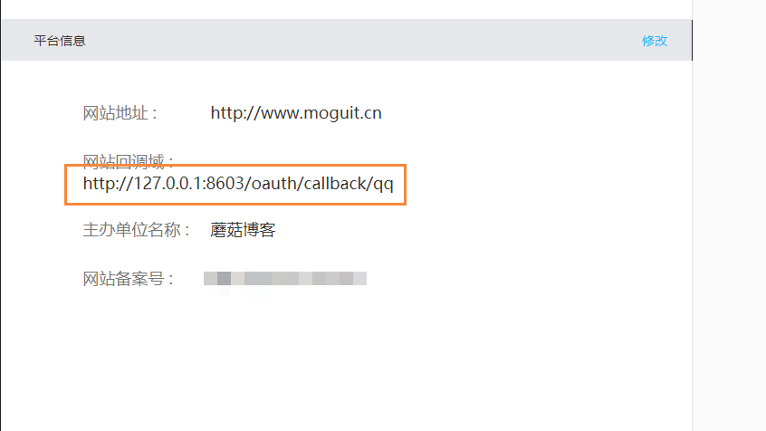
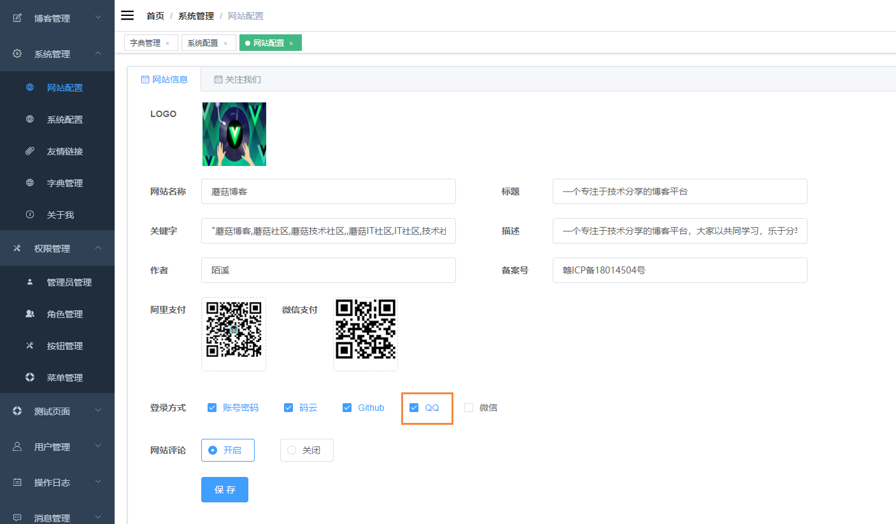
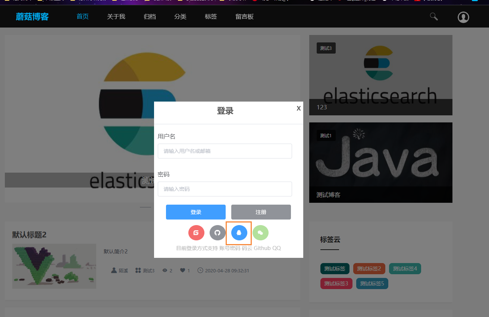
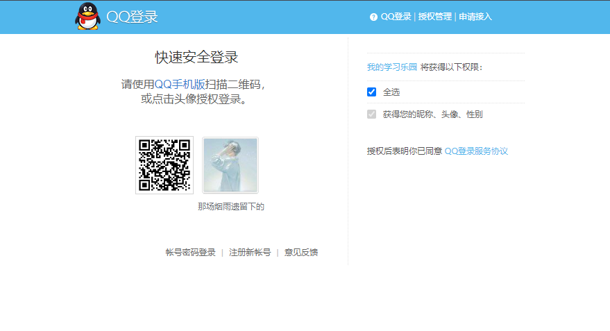
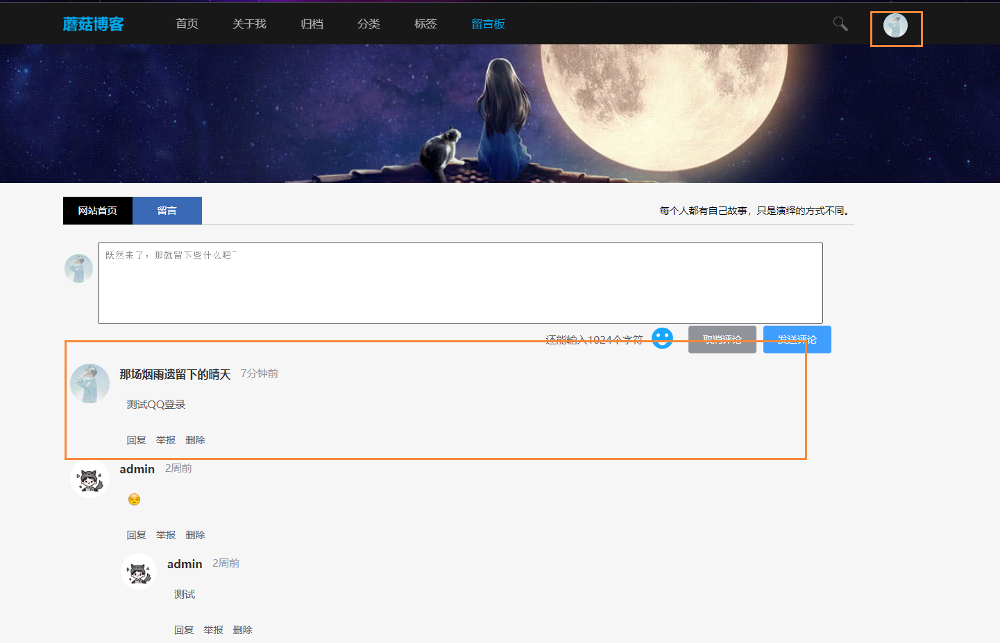

# 使用JustAuth集成QQ登录

## 前言

JustAuth是史上最全的整合第三方登录的开源库。目前已支持Github、Gitee、微博、钉钉、百度、Coding、腾讯云开发者平台、OSChina、支付宝、QQ、微信、淘宝、Google、Facebook、抖音、领英、小米、微软、今日头条、Teambition、StackOverflow、Pinterest、人人、华为、企业微信、酷家乐、Gitlab、美团、饿了么和推特等第三方平台的授权登录。 Login, so easy!

官方地址：[点我传送](https://gitee.com/yadong.zhang/JustAuth)

## 使用

最开始我其实使用JustAuth集成了Gitee登录和Github登录，因为首先这集成起来比较方便，只需要点击就可以申请到公钥和私钥。而且微信登录和QQ登录则比较麻烦，需要层层审核，好了话不多说，下面开始进入正题。

首先我们需要进入的是QQ互联的官网进行申请：[点我传送](https://connect.qq.com/devuser.html#/create/1/)



这里就需要填写姓名，地址，还有手持身份证拍照。。这里特别需要注意， 重点在于身份证要求清晰，直接能看到身份证号，我因为这个问题都被打回一次了。

在弄好了个人接入后，我们在点击顶部导航栏的应用管理，然后选中网站应用，如果没有提交审核的话，是下面这个状态，无法创建应用，上面的审核通过了，那么就可以创建我们的应用了。



下面演示的是我已经创建审核通过后的，在我们创建应用的时候也有一些坑。

- 首先是网站的名称必须是备案域名上写的名称，比如我的域名当初备案的是 我的学习乐园，如果我写蘑菇博客就不行，已经被打回一次。



下面是平台的一些信息，我们主要的就是关注的网站回调域，这里方便测试我填写的是本地的127.0.0.1的回调接口，然后就是还有上图我们看到的APPID 和 APP Key。



然后在修改我们的配置文件

```
# 第三方登录
justAuth:
  clientId:
    qq: XXXXXXXXXXXXXXXX # APP ID 
  clientSecret:
    qq: XXXXXXXXXXXXXXXXXX # APP Key
```

## 完整代码下

下面是蘑菇博客中，第三方登录的部分源码：[点我传送](https://gitee.com/moxi159753/mogu_blog_v2/blob/master/mogu_web/src/main/java/com/moxi/mogublog/web/restapi/AuthRestApi.java)

```
/**
 * 第三方登录认证
 */
@RestController
@RequestMapping("/oauth")
@Api(value = "第三方登录相关接口", tags = {"第三方登录相关接口"})
@Slf4j
public class AuthRestApi {
    @Autowired
    WebUtil webUtil;
    @Autowired
    SystemConfigService systemConfigService;
    @Autowired
    FeedbackService feedbackService;
    @Autowired
    LinkService linkService;
    @Autowired
    RabbitMqUtil rabbitMqUtil;
    @Autowired
    private UserService userService;
    @Value(value = "${justAuth.clientId.gitee}")
    private String giteeClienId;
    @Value(value = "${justAuth.clientSecret.gitee}")
    private String giteeClientSecret;
    @Value(value = "${justAuth.clientId.github}")
    private String githubClienId;
    @Value(value = "${justAuth.clientSecret.github}")
    private String githubClientSecret;
    @Value(value = "${justAuth.clientId.qq}")
    private String qqClienId;
    @Value(value = "${justAuth.clientSecret.qq}")
    private String qqClientSecret;
    @Value(value = "${data.webSite.url}")
    private String webSiteUrl;
    @Value(value = "${data.web.url}")
    private String moguWebUrl;
    @Value(value = "${BLOG.USER_TOKEN_SURVIVAL_TIME}")
    private Long userTokenSurvivalTime;
    @Value(value = "${PROJECT_NAME_EN}")
    private String PROJECT_NAME_EN;
    @Value(value = "${DEFAULE_PWD}")
    private String DEFAULE_PWD;
    @Autowired
    private StringRedisTemplate stringRedisTemplate;
    @Autowired
    private PictureFeignClient pictureFeignClient;

    @ApiOperation(value = "获取认证", notes = "获取认证")
    @RequestMapping("/render")
    public String renderAuth(String source, HttpServletResponse response) throws IOException {
        log.info("进入render:" + source);
        AuthRequest authRequest = getAuthRequest(source);
        String token = AuthStateUtils.createState();
        String authorizeUrl = authRequest.authorize(token);
        Map<String, String> map = new HashMap<>();
        map.put(SQLConf.URL, authorizeUrl);
        return ResultUtil.result(SysConf.SUCCESS, map);
    }


    /**
     * oauth平台中配置的授权回调地址，以本项目为例，在创建gitee授权应用时的回调地址应为：http://127.0.0.1:8603/oauth/callback/gitee
     */
    @RequestMapping("/callback/{source}")
    public void login(@PathVariable("source") String source, AuthCallback callback, HttpServletRequest request, HttpServletResponse httpServletResponse) throws IOException {
        log.info("进入callback：" + source + " callback params：" + JSONObject.toJSONString(callback));
        AuthRequest authRequest = getAuthRequest(source);
        AuthResponse response = authRequest.login(callback);
        if (response.getCode() == 5000) {
            // 跳转到500错误页面
            httpServletResponse.sendRedirect(webSiteUrl + "500");
            return;
        }
        String result = JSONObject.toJSONString(response);
        Map<String, Object> map = JsonUtils.jsonToMap(result);
        Map<String, Object> data = JsonUtils.jsonToMap(JsonUtils.objectToJson(map.get(SysConf.DATA)));
        Map<String, Object> token = new HashMap<>();
        String accessToken = "";
        if (data == null || data.get(SysConf.TOKEN) == null) {
            // 跳转到500错误页面
            httpServletResponse.sendRedirect(webSiteUrl + "500");
            return;
        } else {
            token = JsonUtils.jsonToMap(JsonUtils.objectToJson(data.get(SysConf.TOKEN)));
            accessToken = token.get(SysConf.ACCESS_TOKEN).toString();
        }
        
        httpServletResponse.sendRedirect(webSiteUrl + "?token=" + accessToken);
    }

    private void updateUserPhoto(Map<String, Object> data, User user) {
        QueryWrapper<SystemConfig> queryWrapper = new QueryWrapper<>();
        queryWrapper.eq(SQLConf.STATUS, EStatus.ENABLE);
        queryWrapper.last("LIMIT 1");
        Map<String, Object> systemConfigMap = systemConfigService.getMap(queryWrapper);
        // 获取到头像，然后上传到自己服务器
        FileVO fileVO = new FileVO();
        fileVO.setAdminUid(SysConf.DEFAULT_UID);
        fileVO.setUserUid(SysConf.DEFAULT_UID);
        fileVO.setProjectName(SysConf.BLOG);
        fileVO.setSortName(SysConf.ADMIN);
        fileVO.setSystemConfig(systemConfigMap);
        List<String> urlList = new ArrayList<>();
        urlList.add(data.get(SysConf.AVATAR).toString());
        fileVO.setUrlList(urlList);
        String res = this.pictureFeignClient.uploadPicsByUrl(fileVO);
        Map<String, Object> resultMap = JsonUtils.jsonToMap(res);
        if (resultMap.get(SysConf.CODE) != null && SysConf.SUCCESS.equals(resultMap.get(SysConf.CODE).toString())) {
            if (resultMap.get(SysConf.DATA) != null) {
                List<Map<String, Object>> listMap = (List<Map<String, Object>>) resultMap.get(SysConf.DATA);
                if (listMap != null && listMap.size() > 0) {
                    Map<String, Object> pictureMap = listMap.get(0);

                    String localPictureBaseUrl = systemConfigMap.get(SQLConf.LOCAL_PICTURE_BASE_URL).toString();
                    String qiNiuPictureBaseUrl = systemConfigMap.get(SQLConf.QI_NIU_PICTURE_BASE_URL).toString();
                    String picturePriority = systemConfigMap.get(SQLConf.PICTURE_PRIORITY).toString();

                    user.setAvatar(pictureMap.get(SysConf.UID).toString());

                    // 判断图片优先展示
                    if ("1".equals(picturePriority)) {
                        // 使用七牛云
                        if (pictureMap != null && pictureMap.get(SysConf.QI_NIU_URL) != null && pictureMap.get(SysConf.UID) != null) {
                            user.setPhotoUrl(qiNiuPictureBaseUrl + pictureMap.get(SysConf.QI_NIU_URL).toString());
                        }
                    } else {
                        // 使用自建图片服务器
                        if (pictureMap != null && pictureMap.get(SysConf.PIC_URL) != null && pictureMap.get(SysConf.UID) != null) {
                            user.setPhotoUrl(localPictureBaseUrl + pictureMap.get(SysConf.PIC_URL).toString());
                        }
                    }
                }
            }
        }
    }

    @RequestMapping("/revoke/{source}/{token}")
    public Object revokeAuth(@PathVariable("source") String source, @PathVariable("token") String token) throws IOException {
        AuthRequest authRequest = getAuthRequest(source);
        return authRequest.revoke(AuthToken.builder().accessToken(token).build());
    }

    @RequestMapping("/refresh/{source}")
    public Object refreshAuth(@PathVariable("source") String source, String token) {
        AuthRequest authRequest = getAuthRequest(source);
        return authRequest.refresh(AuthToken.builder().refreshToken(token).build());
    }


    /**
     * 鉴权
     *
     * @param source
     * @return
     */
    private AuthRequest getAuthRequest(String source) {
        AuthRequest authRequest = null;
        switch (source) {
            case SysConf.GITHUB:
                authRequest = new AuthGithubRequest(AuthConfig.builder()
                        .clientId(githubClienId)
                        .clientSecret(githubClientSecret)
                        .redirectUri(moguWebUrl + "/oauth/callback/github")
                        .build());
                break;
            case SysConf.GITEE:
                authRequest = new AuthGiteeRequest(AuthConfig.builder()
                        .clientId(giteeClienId)
                        .clientSecret(giteeClientSecret)
                        .redirectUri(moguWebUrl + "/oauth/callback/gitee")
                        .build());
                break;
            case SysConf.QQ:
                authRequest = new AuthQqRequest(AuthConfig.builder()
                        .clientId(qqClienId)
                        .clientSecret(qqClientSecret)
                        .redirectUri(moguWebUrl + "/oauth/callback/qq")
                        .build());
                break;
            default:
                break;
        }
        if (null == authRequest) {
            throw new AuthException(MessageConf.OPERATION_FAIL);
        }
        return authRequest;
    }
}

```

## 效果

添加完成后，我们需要在网站管理开启QQ登录功能



然后点击我们的QQ登录，就会跳转到对应的QQ登录页面





点击头像登录即可，下图是登录后的结果

