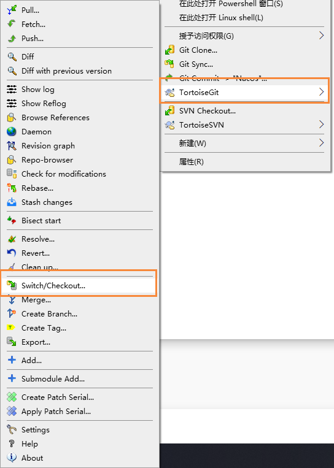
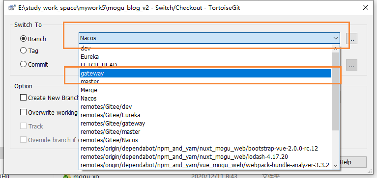
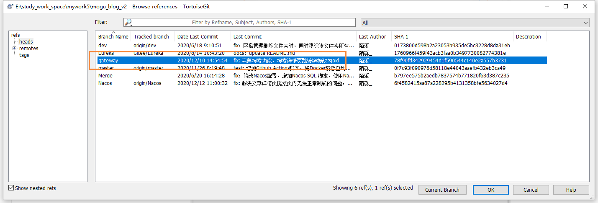
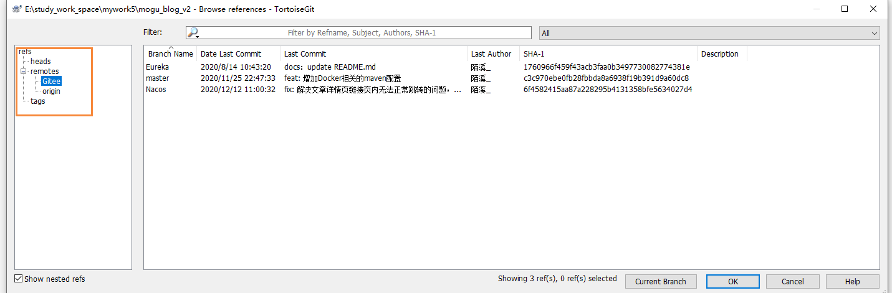

# 使用TortoiseGit删除Git分支

## 前言

平时我在进行开发的时候，比如需要开发一个新功能，这里以蘑菇博客开发服务网关-gateway功能为例

一般我都会在原来master分支的基础上，然后拉取一个新的分支【gateway】，然后在 gateway分支上进行编码操作，但是在该功能开发完成后，我们就会将 gateway分支的代码合并到 master分支，完成了代码的开发。最后把原来的geteway分支又保留了下来，其实该分支已经没有作用了

## 删除

其实我们可以通过TortoiseGit管理工具来进行删除的，首先 选择 Switch / Checkout

假设我们现在要删除gateway分支，首先我们需要切换到其它的分支上，这里切换到Nacos分支

切换完成后，我们点击 右边的按钮

然后选择 gateway 分支，右键 选择 Delete Branch

即可删除我们本地的分支，如果我们要删除远程的分支的话，那么就要在右侧进行选择

然后在进行删除操作，删除完提交代码即可