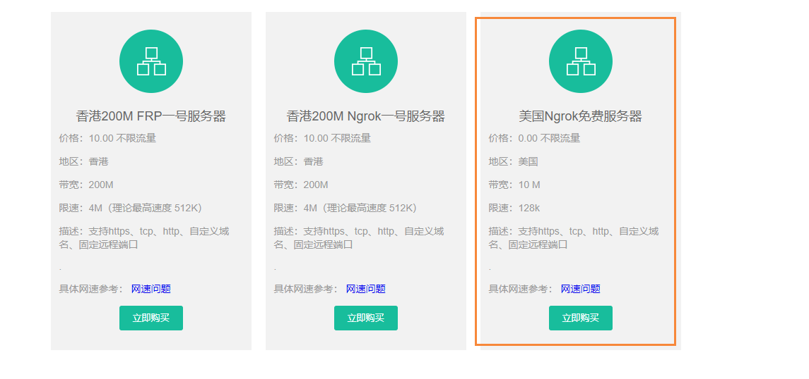
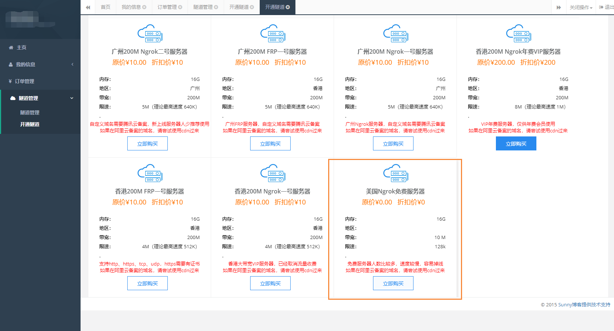
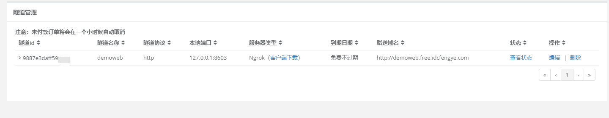
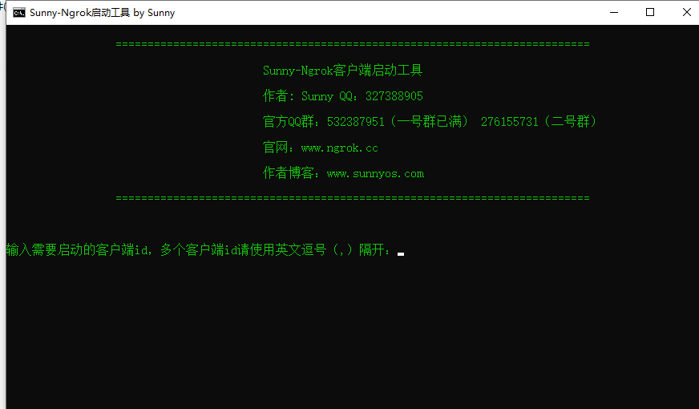

# 使用ngrok进行内网穿透

## 前言

有时候我们本地开发了一个功能想要分享给其它小伙伴使用，那么就需要使用到内网穿透了，将公网的ip映射到我们的本机端口号中，然后实现内网穿透。

## ngrok介绍

下面的ngrok的相关介绍

- 提供免费内网穿透服务，免费服务器支持绑定自定义域名
- 管理内网服务器，内网web进行演示
- 快速开发微信程序和第三方支付平台调试
- 本地WEB外网访问、本地开发微信、TCP端口转发
- 本站新增FRP服务器，基于 [FRP](http://github.com/fatedier/frp) 实现https、udp转发
- 无需任何配置，下载客户端之后直接一条命令让外网访问您的内网不再是距离

并且提供了免费的穿透服务

下面我们进入到ngrok的官网：[点我传送](http://www.ngrok.cc/)，然后注册账号后登陆，选择 左侧开通隧道，然后移动到下方，选择免费的服务器。

然后我们就进入创建隧道的页面

然后点击添加即可，在添加成功的页面，我们能够看到隧道id 和 赠送域名。我们首先复制到隧道id

然后下载ngrok软件：[点我传送](http://www.ngrok.cc/download.html)，选中window64Bit版本下载

下载解压后，我们点击bat文件运行

这个时候，我们就需要在输入刚刚我们复制的隧道号，然后回车

输入完成后，我们就看到已经成功映射到了我们的8603端口上了。

首先我们先本地对8603端口号进行测试，输入 http://localhost:8603/swagger-ui.html

下面我们ngrok进行测试，在浏览器输入： http://demoweb.free.idcfengye.com/swagger-ui.html，发现能够成功进行内网穿透

