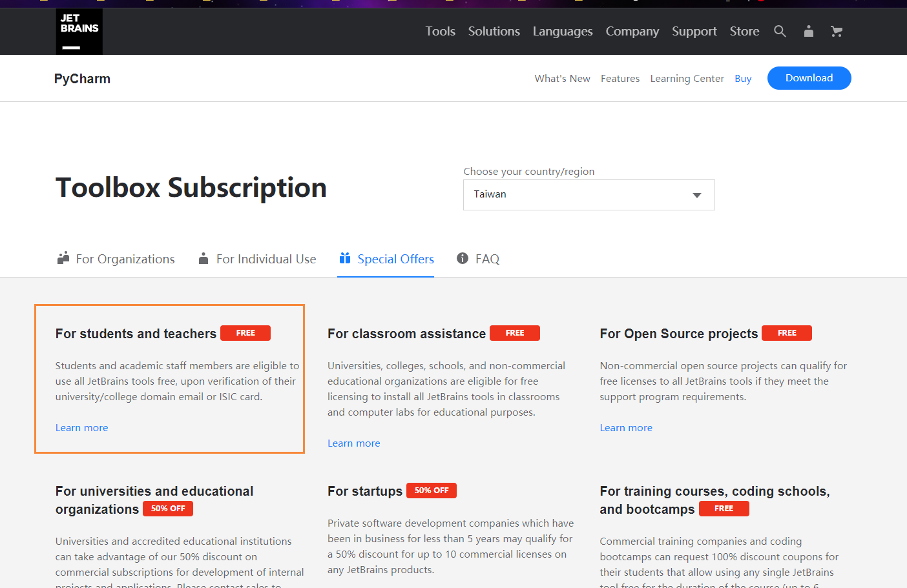
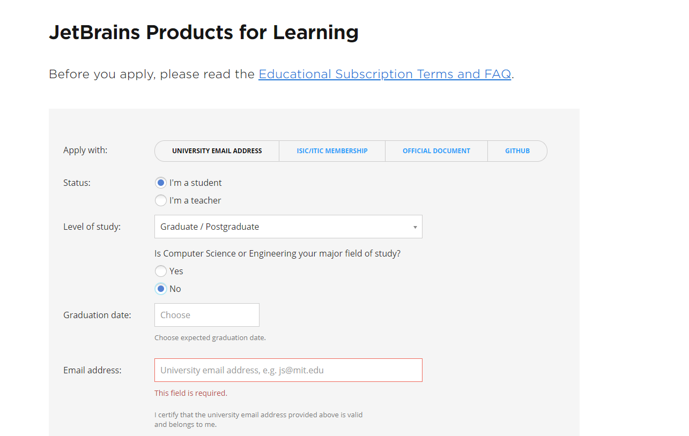
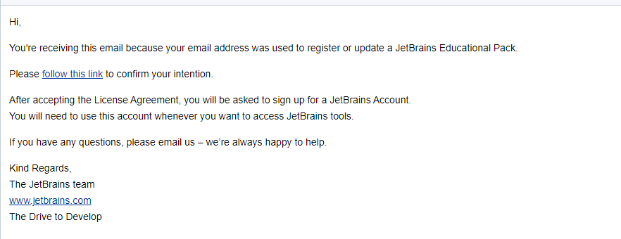

# 使用学校邮箱申请JetBrains全家桶

## 前言

之前通过蘑菇博客申请到了一个开源License，让我能够使用Jetbrain全家桶来搬砖，但是因为我有两台电脑，而一个开源License只能让一个账号登录，所以这次我申请到了一个学校的邮箱账号，然后再去申请一个Jetbrains的账号。

## 步骤1

首先到Jetbrains的官网上，找到[学生申请入口](https://www.jetbrains.com/pycharm/buy/?fromIDE#discounts?billing=yearly)

然后在填写你的信息，以及教育邮箱

填写完成后，即可收到一个邮件

然后同意条款后，注册一个账号和密码，即可拥有学生版的Jetbrains了~