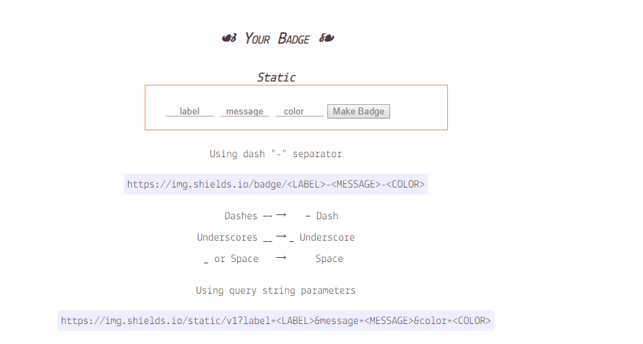
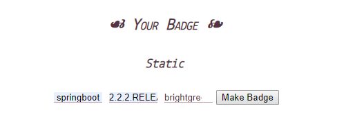

# 如何制作github小徽章

## 前言

最近在查看别人的项目的时候，经常能看到他们的README上有一些小徽章，例如想下面这样的：


起初还不太确定怎么来的，就把人家README上的图标图片复制下面，然后粘贴到自己的那边，这两天我通过博客发现，原来这些都是可以通过网站自己制作的

## 制作小徽章

下面进入正题，开始进行进行徽章的制作：[点我传送](https://shields.io/)

我们打开刚刚制作小徽章的网址，徽章制作分为动态和静态，一般我们版本确定后，基本很少变动，所以我们就制作一个静态的小徽章，我们移动刚刚的页面，找到static



然后填写 label，message，color点击制作即可

比如我想设置一下SpringBoot的版本号，就输入下列的内容



制作完成后得到的是这样的


我们在把它放在README中

```html
<p align="center">
<a target="_blank" href="https://github.com/moxi624/mogu_blog_v2">
    	</img>
</a>
</p>
```

这样就能够看到徽章了~

## 参考

[工具资源系列之 github 上各式各样的小徽章从何而来?](https://blog.csdn.net/weixin_38171180/article/details/93307128)