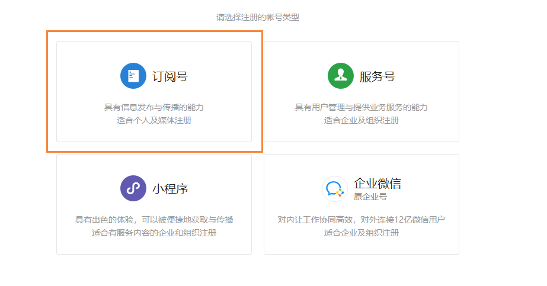
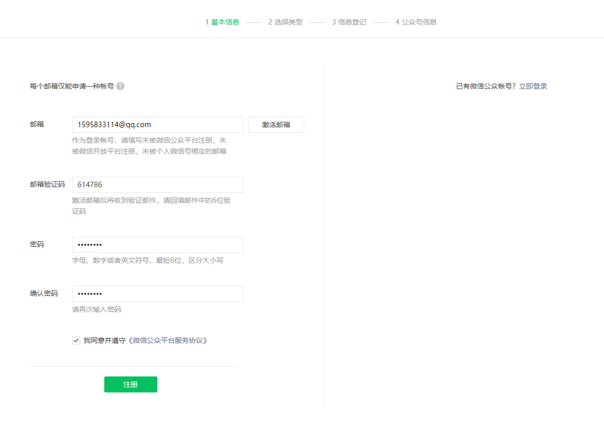
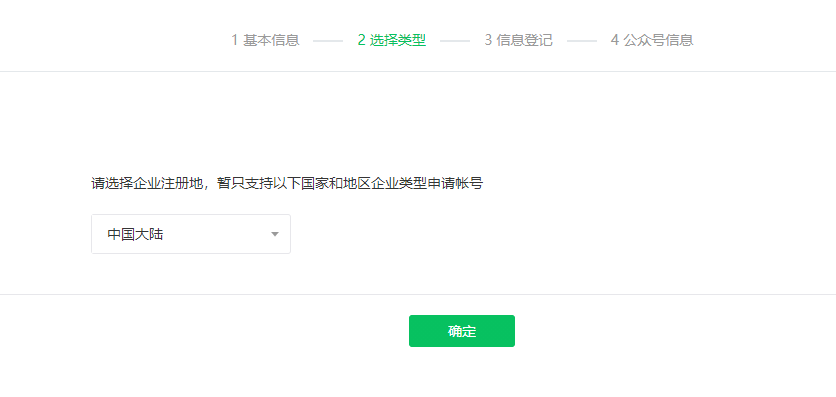
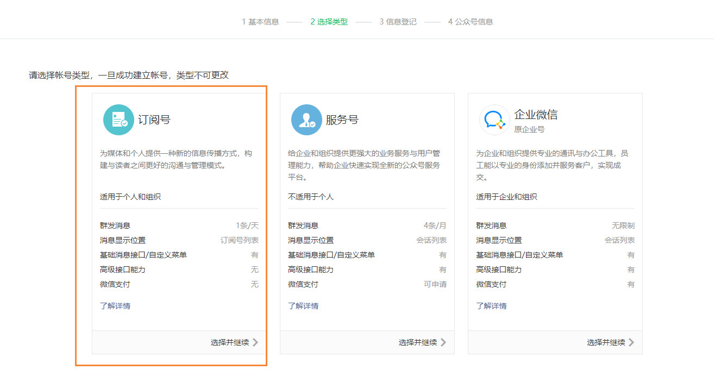
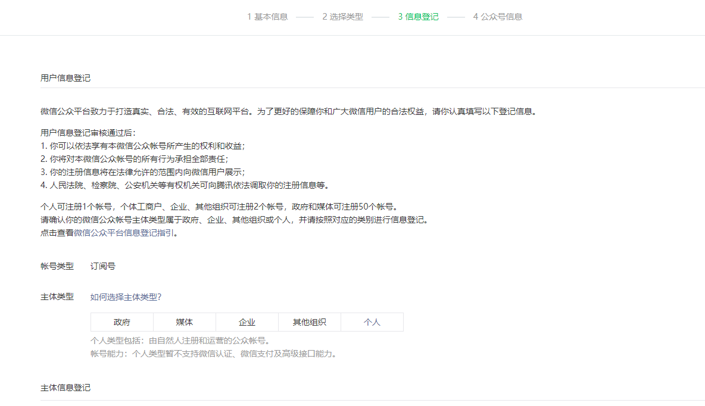
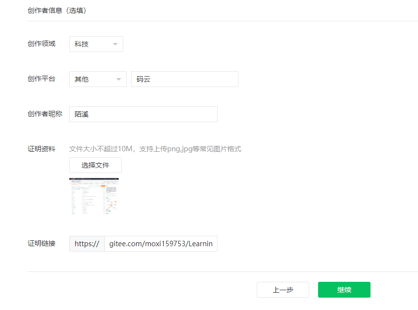
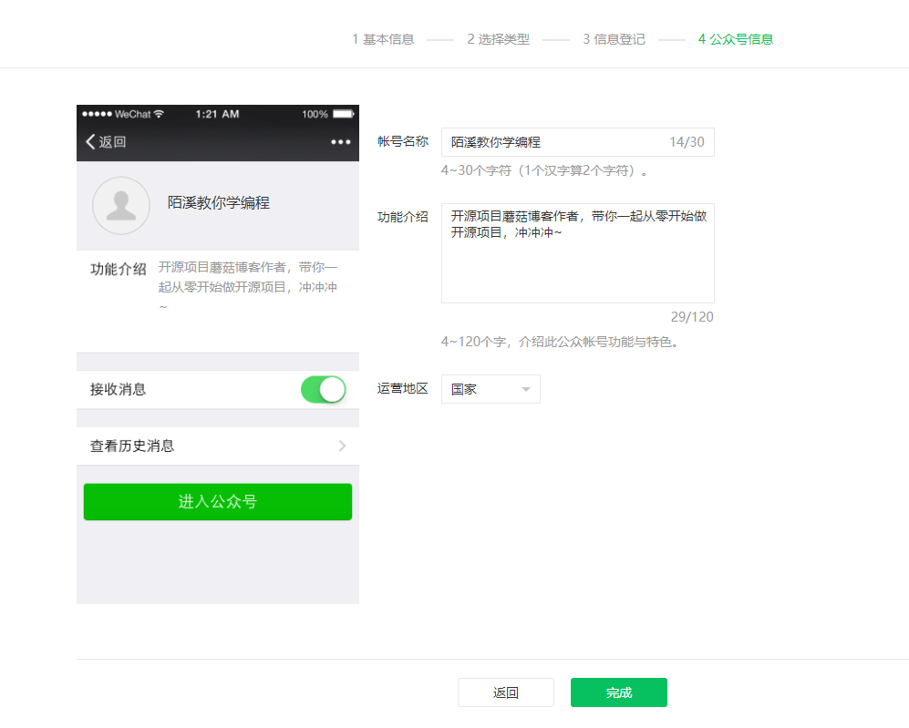
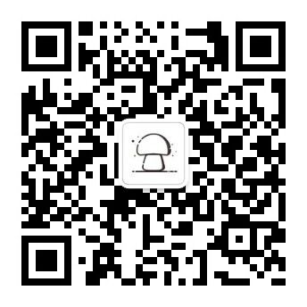

# 如何申请微信公众号

## 前言

这阵子一直有小伙伴问我，陌溪有没有公众号或者微信群呢 。最近这阵子刚好有时间，就想着给蘑菇博客申请一个公众号，

## 开始申请

首先先到微信公众平台：[点我传送](https://mp.weixin.qq.com/)，然后选择服务号

填写基本信息后，开始注册

然后选择地区

然后选择订阅号【订阅号一天只能收到一条消息..，我是今天才知道的】

然后主体类型选择个人

最后下面会要求你填写好多内容，因为我准备做博客类的，所以就填写科技，然后写上我的码云地址

完成后，继续下一步的填写

点击创建，即可创建出我们的第一个公众号了~，欢迎大家关注

