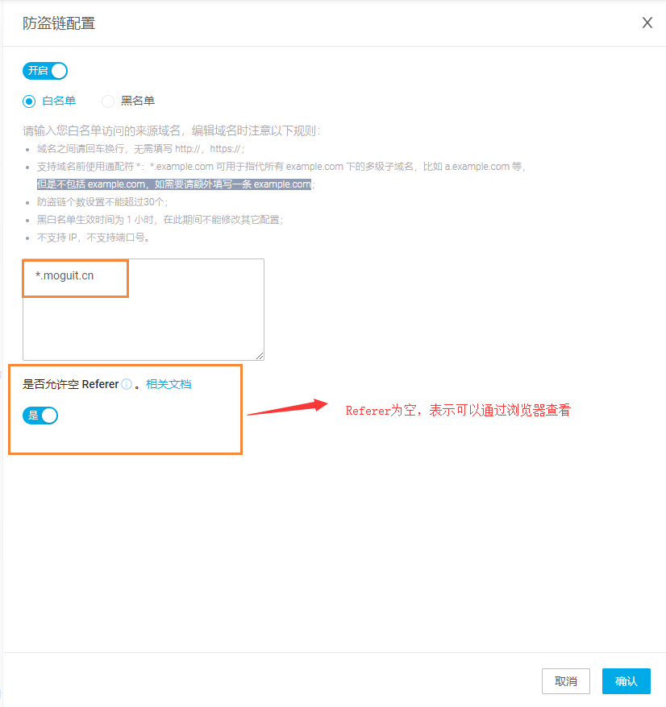

# 蘑菇博客的七牛云配置防盗链

## 前言

我们都知道，七牛云上的流量每个月是非常宝贵的，因为免费的流量只有10G，如果超过了流量就是需要收费的，上次我的就是因为超过了10G的流量限额，而导致欠费，因此我们需要合理的管理我们的流量，首先就是防盗链这块，因为防盗链能够有效的防止别人复制我们的文件或者图片到其它地方，从而消耗我们的流量资源。

## 配置

首先我们需要进入我们的七牛云管理页面，然后点击进入加速域名

如果还没有提前配置好七牛云的加速域名的，可以参考这篇博客：[蘑菇博客配置七牛云存储](http://moguit.cn/#/info?blogUid=735ed389c4ad1efd321fed9ac58e646b)

然后我们找到防盗链，添加我们的网站信息

然后进行修改

修改完成后，我们需要等待一段时间，大概是一两个小时左右，会有邮件发送到邮箱，表示修改成功

这个时候我们就只有在我们的白名单下面的域名才能够访问我们七牛云上的图片资源了

这里支持白名单和黑名单的配置，顾名思义，白名单就是指只有指定域名下的才能访问，黑名单就是那些域名不能访问。

