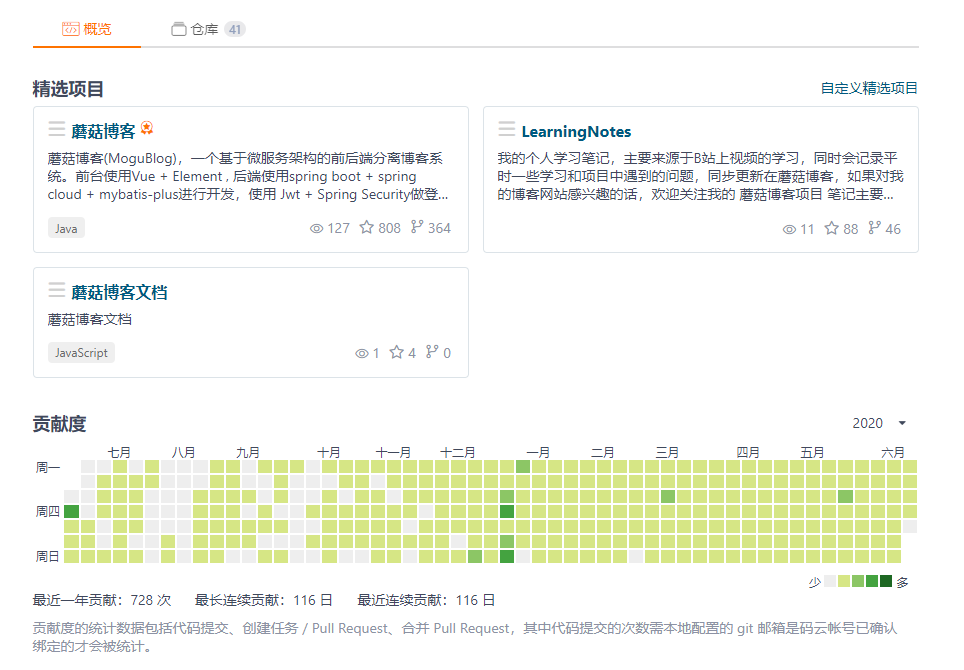
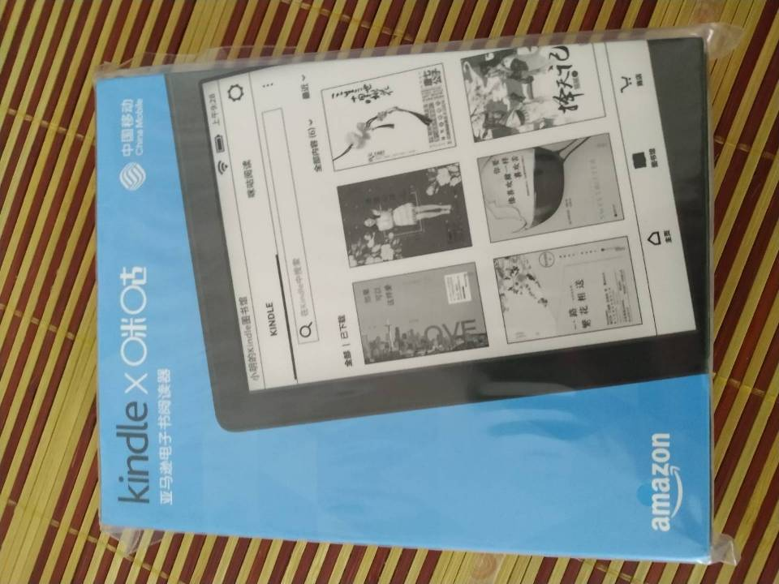
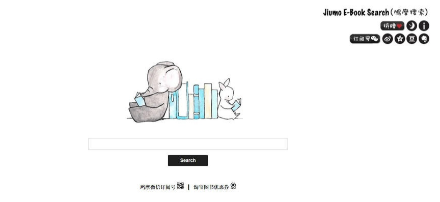
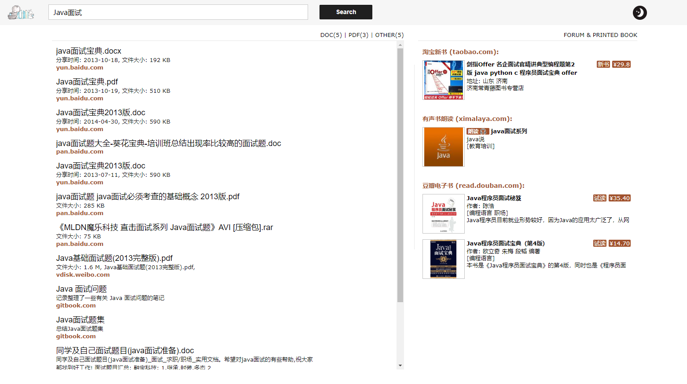
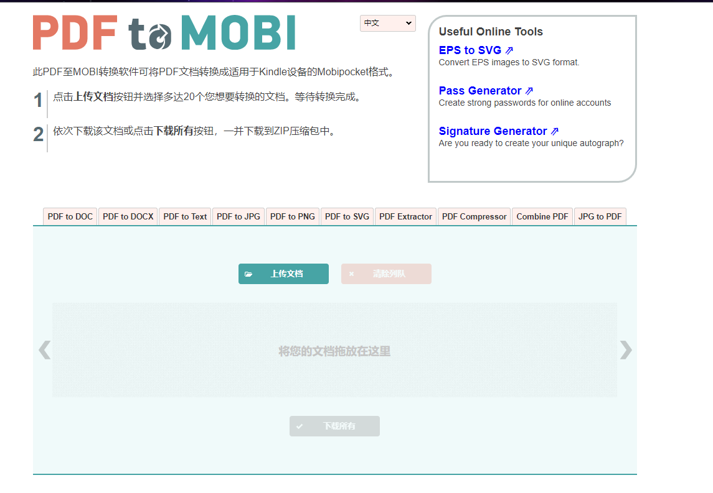
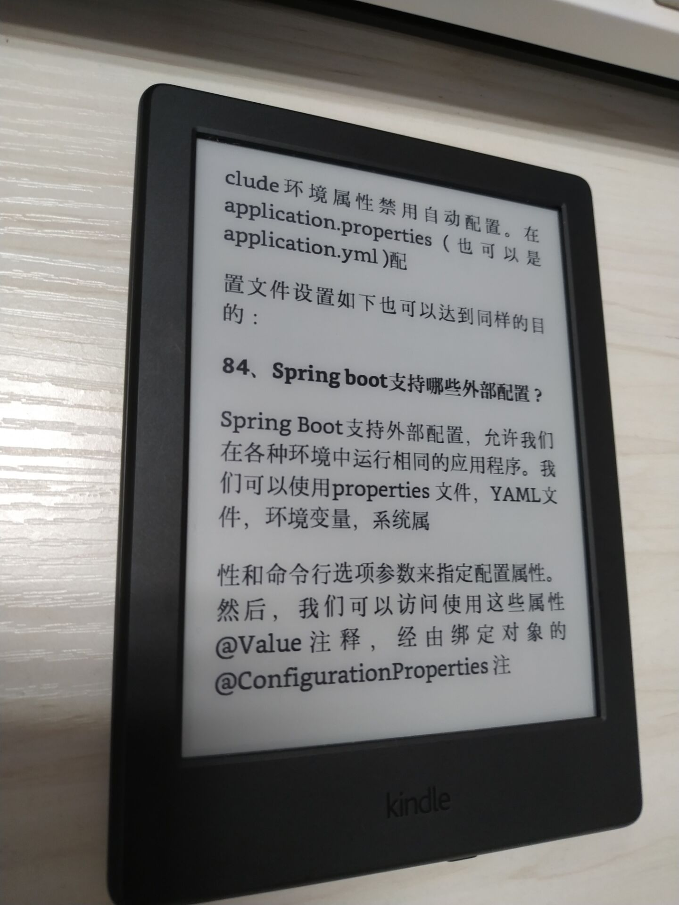

# 将PDF转换为Kindle能识别的MOBI格式

## 前言

前阵子，移动咪咕搞了个活动，就是连续签到100天，白嫖Kindle的活动，想着先买一个用来看看书也是不错的，要是能白嫖就最好了，毕竟在码云上也有连续100多天的搬砖记录了~

说干就干，花了460块，然后就下单了，希望能白嫖成功

因为这阵子一直在准备面试的事情，所以打算把一些面试宝典，看看能不能放到我的kindle上，但是因为PDF放在kindle显示的不好，因此需要转换一下格式，变成MOBI格式。

## 书籍搜索

关于书籍的搜索，我是使用下面几个平台的进行搜索的。

### 鸠摩搜书

首先看看[鸠摩搜书](https://www.jiumodiary.com/)的首页：简单大方，温文尔雅，不失童话色彩。

例如，我需要搜索深入理解Java虚拟机这本书，如果能搜索出MOBI格式的最好了，能够直接导入到Kindle中，否则的话需要进行格式转换，后面我会介绍一下格式转换的网站。

### 书伴

[书伴](https://bookfere.com/)指向的是正版的亚马逊电子书，不过这里面集成了许多实用的小功能，比如提供kindle字典的下载，kindle的常用技巧：格式转换、更换字体、推送、整理电子书、插件等等。

## 格式转换

在我们下载完一些PDF后，我们就需要将其转换成MOBI格式，我是使用的这个 [网站](https://pdf2mobi.com/zh/)

只需要将PDF文档上传，即可转换为MOBI格式，然后导入到我们的Kindle中，实际效果像下面这样，整体来说，这就要求你找到的PDF不是扫描版本的，而是可以选中 的，如果带有目录的话是最好的，因为Kindle可以根据目录来直接跳转。

