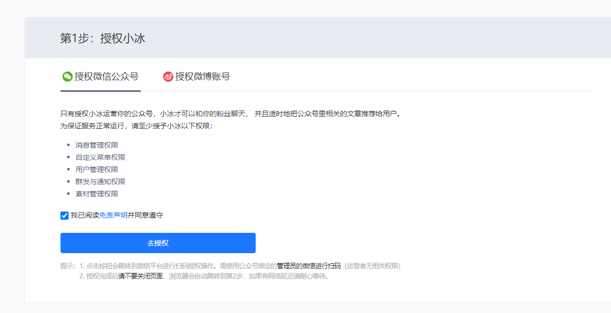
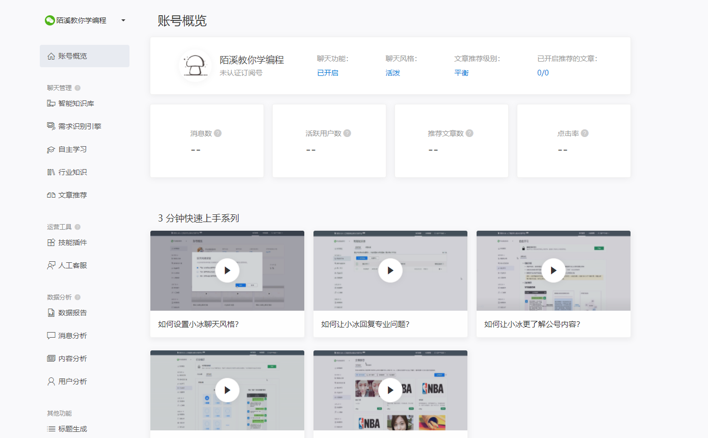

# 微信公众号如何接入微软小冰

前阵子已经申请到了一个微信公众号：陌溪教你学编程，下面准备给公众号接入一个AI机器人，用于回复内容，首先到微软小冰的官网，开始申请

>  地址：https://e.msxiaobing.com/

然后输入手机号，开始注册，注册后，进入运营方式选择

我们选择 自主模式，然后开始给小冰授权即可

授权完成后，选择行业

然后选择聊天风格和文章推荐

完成后，到达首页

里面还有更多的功能等待你的挖掘，下面是接入小冰后的公众号~

