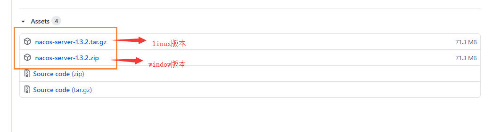
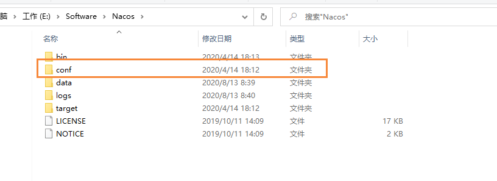
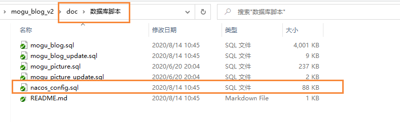
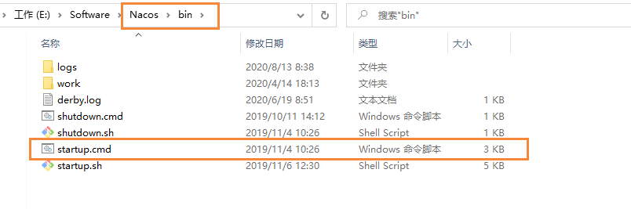
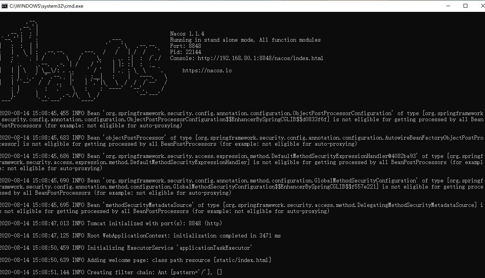
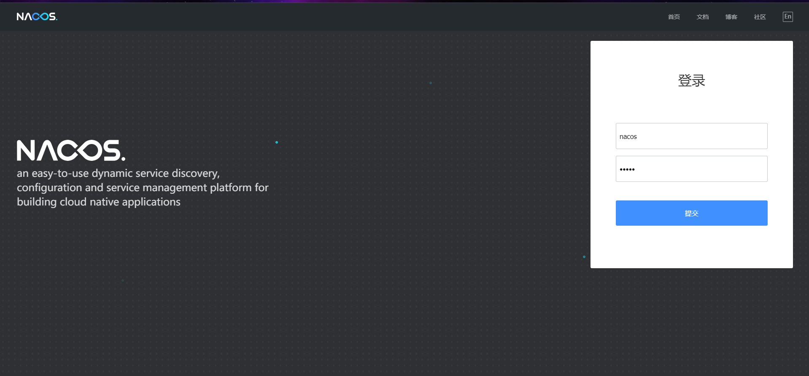
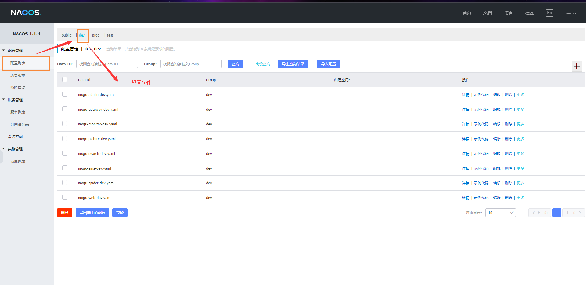
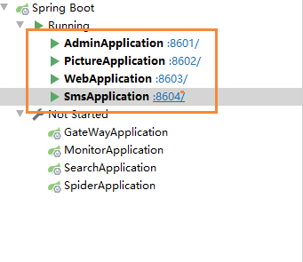

# 蘑菇博客Nacos部署指南

## 前言

蘑菇博客这阵子将部分SpringCloud组件替换成了SpringCloudAlibaba组件，其中包括注册中心由Eureka替换成Nacos、新增了Sentinel作为熔断和限流组件

关于Nacos和Sentinel的使用可以参考下面两篇博客

- [【SpringCloud】使用Nacos实现服务注册发现以及配置中心等功能](http://moguit.cn/#/info?blogUid=e6e619349d31dded928c9265c5a9c672)
- [【SpringCloud】使用Sentinel实现熔断和限流](http://moguit.cn/#/info?blogUid=408e9c889ebf96a66af2adfdc258ba5f)

## 安装Nacos

首先我们到Nacos的 [Github页面](https://github.com/alibaba/nacos/releases)，找到我们需要安装的版本



因为我现在用的是window，所以我下载了windows版本，也就是 nacos-server.zip

> 如果国内环境下载过慢，可以使用 [备用下载地址](https://wws.lanzous.com/i1rAmhrtroj)

下载完成后，我们进行解压缩，然后进入 conf目录，打开 application.properties文件



打开后，我们在文件的末尾添加mysql的配置信息，注意mysql的账号和密码

```bash
# mysql配置
spring.datasource.platform=mysql
db.num=1
db.url.0=jdbc:mysql://127.0.0.1:3306/nacos_config?characterEncoding=utf8&connectTimeout=1000&socketTimeout=3000&autoReconnect=true
db.user=root
db.password=root
```

配置完成后，我们到项目的doc文件夹，找到数据库脚本 nacos_config.sql



然后创建一个数据库 nacos_config，将配置导入到mysql中

> tip：如果导入时出现错误：Error Code: 1071 - Specified key was too long; max key length is 767 bytes
>
> 这个错误一般是mysql5.6版本引起的，只需要进入mysql
>
> ```bash
> # 进入mysql
> mysql -u root -p
> # 使用mysql数据库
> use mysql;
> # 查看innodb_large_prefix状态，并开启 即可解决上述问题
> show variables like '%innodb_large_prefix%';
> set global innodb_large_prefix=on;
> ```

然后我们到nacos目录，双击startup.bat启动



> 注意：如果上述启动出现错误，那么可能是因为集群模式启动出现问题，使用下面命令改成单机模式
>
> ```bash
> startup.cmd -m standalone
> ```

启动成功的页面



项目启动成功后，我们访问 http://localhost:8848/nacos，输入下方的默认密码

> 账号：nacos
>
> 密码：nacos



然后我们点击 配置列表 -> dev，即可查看到我们的配置文件了，如果我们需要修改配置的话，只需要点击编辑



到这里为止，Nacos服务注册中心就已经安装完成了，后续的操作我们可以参考下面的博客进行 

[window环境下配置蘑菇博客环境](http://moguit.cn/#/info?blogUid=082ca226cf2e4103b0ffa6e6c13d7b14)

> 因为我们将Eureka替换成Nacos，所以我们只需要启动服务为
>
> mogu-sms、mogu-picture、mogu-admin、mogu-web



